# 物资仓库管理系统（WMS）产品需求文档

| 属性 | 内容 |
|------|------|
| 文档版本 | V1.5.15 |
| 产品版本 | V1.0.0 |
| 部署区域 | 湖北黄冈武穴 |
| 目标平台 | PC Web + 移动端 H5 |
| 交互原型 | [GitHub Pages](https://liaoliao66.github.io/wms/) · 162 页 · PC/APP 双入口（含库外盘点） |
| 文档状态 | 本期交付版：以侧栏菜单为准；含库外盘点 PC 8 页 + APP 11 页、验收审核、物资验收方案 A；列表/表单见 §17，弹窗见 §17.13 |
| 最后更新 | 2026-07-03 |

---
## 目录

> 点击章节标题可快速跳转。

- [1. 产品概述](#1-产品概述)
  - [1.1 产品定位](#11-产品定位)
  - [1.2 产品目标](#12-产品目标)
  - [1.3 用户角色定义](#13-用户角色定义)
  - [1.4 核心概念](#14-核心概念)
    - [1.4.1 术语对照表（菜单 / 页面 / 数据 / 状态）](#141-术语对照表)
  - [1.5 产品成功指标（V1.0 验收 KPI）](#15-产品成功指标)
  - [1.6 本期范围边界](#16-本期范围边界)
  - [1.7 本期研发交付清单](#17-本期研发交付清单)
- [2. 业务流程](#2-业务流程)
  - [2.0 流程图图例](#20-流程图图例)
  - [2.1 V1.0 核心业务流程（泳道图）](#21-v10-核心业务流程)
  - [2.2 子业务流程 — 采购到入库（泳道图）](#22-子业务流程-采购到入库)
  - [2.3 子业务流程 — 领用到归还（泳道图）](#23-子业务流程-领用到归还)
  - [2.4 子业务流程 — 库场盘点（泳道图）](#24-子业务流程-库场盘点)
  - [2.6 用户交互流程 — 仓库管理员验收入库（泳道图）](#26-用户交互流程-仓库管理员验收入库)
  - [2.7 流程状态机 — 通用审批单（计划/领用/采购申请等）](#27-流程状态机-通用审批单)
  - [2.8 流程状态机 — 物资验收](#28-流程状态机-物资验收)
  - [2.9 流程状态机 — 物资入库 / 出库](#29-流程状态机-物资入库-出库)
  - [2.10 流程状态机 — 物资归还](#210-流程状态机-物资归还)
  - [2.11 流程状态机 — 盘点与差异](#211-流程状态机-盘点与差异)
  - [2.12 系统数据流转时序图 — 采购入库](#212-系统数据流转时序图-采购入库)
  - [2.13 系统数据流转时序图 — 领用出库](#213-系统数据流转时序图-领用出库)
- [3. 功能模块总览](#3-功能模块总览)
  - [3.0 原型入口门户（交互原型 V1.0）](#30-原型入口门户)
  - [3.1 物资台账](#31-物资台账)
    - [3.1.0 物资库存总览（物资台账）](#310-物资库存总览)
    - [3.1.1 仓库台账](#311-仓库台账)
    - [3.1.2 出入库记录](#312-出入库记录)
  - [3.2 我的物资](#32-我的物资)
    - [3.2.1 领取记录](#321-领取记录)
    - [3.2.2 借还记录](#322-借还记录)
    - [3.2.3 归还确认规则 [V1.0]](#323-归还确认规则-v10)
  - [3.3 物资申请](#33-物资申请)
    - [3.3.1 物资计划](#331-物资计划)
    - [3.3.2 领用申请](#332-领用申请)
  - [3.4 采购管理](#34-采购管理)
    - [3.4.1 待采物资](#341-待采物资)
    - [3.4.2 采购申请](#342-采购申请)
    - [3.4.3 物资采购](#343-物资采购)
    - [3.4.4 供应商供货单](#344-供应商供货单)
  - [3.5 物资管理](#35-物资管理)
    - [3.5.1 物资验收](#351-物资验收)
    - [3.5.1a 验收审核](#351a-验收审核)
    - [3.5.2 验收记录](#352-验收记录)
    - [3.5.3 物资入库](#353-物资入库)
    - [3.5.4 物资出库](#354-物资出库)
    - [3.5.5 物资归还](#355-物资归还)
    - [3.5.6 物资退货](#356-物资退货)
    - [3.5.7 物资作废与待报废池 [V1.0]](#357-物资作废与待报废池-v10)
      - [3.5.7.1 待报废池：数据来源与入池规则](#3571-待报废池数据来源与入池规则)
      - [3.5.7.2 作废单来源类型与分支判断](#3572-作废单来源类型与分支判断)
      - [3.5.7.3 作废执行与库存/队列联动](#3573-作废执行与库存队列联动)
    - [3.5.8 物资处置 [V1.0]](#358-物资处置-v10)
      - [3.5.8.1 待处置队列：数据来源与入队规则](#3581-待处置队列数据来源与入队规则)
      - [3.5.8.2 处置方式判定与边界规则](#3582-处置方式判定与边界规则)
    - [3.5.9 作废与处置模块衔接 [V1.0]](#359-作废与处置模块衔接-v10)
  - [3.6 供应商管理](#36-供应商管理)
    - [3.6.1 供应商列表](#361-供应商列表)
    - [3.6.2 供应商评价](#362-供应商评价)
  - [3.7 基础配置](#37-基础配置)
    - [3.7.1 计量单位](#371-计量单位)
    - [3.7.2 分类管理](#372-分类管理)
    - [3.7.3 验收标准](#373-验收标准)
    - [3.7.4 物资清单](#374-物资清单)
    - [3.7.5 仓库配置](#375-仓库配置)
    - [3.7.6 使用地点](#376-使用地点)
    - [3.7.7 评价设置](#377-评价设置)
  - [3.8 库场盘点](#38-库场盘点)
    - [3.8.1 盘点计划](#381-盘点计划)
    - [3.8.2 盘点任务](#382-盘点任务)
    - [3.8.3 盘点执行](#383-盘点执行)
    - [3.8.4 差异处理](#384-差异处理)
    - [3.8.5 库存调整](#385-库存调整)
  - [3.9 库外物资盘点](#39-库外物资盘点)
    - [3.9.1 库外盘点计划](#391-库外盘点计划)
    - [3.9.2 库外盘点任务](#392-库外盘点任务)
    - [3.9.3 库外盘点结果与报告](#393-库外盘点结果与报告)
  - [3.10 移动端专项](#310-移动端专项)
    - [3.10.1 移动盘点（库场盘点 APP）](#3101-移动盘点)
    - [3.10.2 资产确认](#3102-资产确认)
    - [3.10.3 移动端功能清单](#3103-移动端功能清单)
    - [3.10.4 库外盘点 APP](#3104-库外盘点-app)
  - [3.11 工作台](#311-工作台)
  - [3.12 待验物资](#312-待验物资)
  - [3.13 流程配置](#313-流程配置)
  - [3.14 通用交互规范（原型 V1.0 已落地）](#314-通用交互规范)
    - [3.14.1 详情弹窗模式](#3141-详情弹窗模式)
    - [3.14.2 树形导航 + 列表演进](#3142-树形导航-列表演进)
    - [3.14.3 列表操作列可见性](#3143-列表操作列可见性)
    - [3.14.4 弹窗技术约定 [V1.0]](#3144-弹窗技术约定-v10)
  - [3.15 页面规格说明规范](#315-页面规格说明规范)
- [4. 用户交互路径（User Flows）](#4-用户交互路径)
  - [4.1 UF-01 急件采购全链路（泳道图）](#41-uf-01-急件采购全链路)
  - [4.2 UF-02 物资采购（询价）全链路（泳道图）](#42-uf-02-物资采购全链路)
  - [4.3 UF-03 领用出库全链路（泳道图）](#43-uf-03-领用出库全链路)
  - [4.4 UF-04 盘点差异闭环（泳道图）](#44-uf-04-盘点差异闭环)
  - [4.5 UF-05 移动盘点现场作业（泳道图）](#45-uf-05-移动盘点现场作业)
  - [4.6 UF-06 归还作废与库存（泳道图 + 状态分支）](#46-uf-06-归还作废与库存)
- [5. 页面清单与跳转关系](#5-页面清单与跳转关系)
  - [5.1 PC 端页面清单](#51-pc-端页面清单)
  - [5.2 移动端页面清单](#52-移动端页面清单)
  - [5.3 全局导航结构（PC）](#53-全局导航结构)
  - [5.4 PRD ↔ 原型 ↔ 侧栏映射表](#54-prd-原型-侧栏映射表)
- [6. 非功能性需求](#6-非功能性需求)
  - [6.1 性能](#61-性能)
  - [6.2 安全](#62-安全)
  - [6.3 可用性](#63-可用性)
  - [6.4 可靠性](#64-可靠性)
  - [6.5 扩展性](#65-扩展性)
  - [6.6 数据导入导出](#66-数据导入导出)
  - [6.7 身份认证与组织 [V1.0]](#67-身份认证与组织-v10)
  - [6.8 操作审计 [V1.0]](#68-操作审计-v10)
- [7. 系统功能清单](#7-系统功能清单)
- [8. 权限与数据范围矩阵](#8-权限与数据范围矩阵)
  - [8.1 功能权限矩阵（菜单/操作）](#81-功能权限矩阵)
  - [8.2 数据范围规则](#82-数据范围规则)
- [9. 数据模型与字段字典](#9-数据模型与字段字典)
  - [9.1 实体关系（ER 概览）](#91-实体关系)
  - [9.2 库存两层模型 [V1.0]](#92-库存两层模型-v10)
    - [9.2.1 物资汇总（`inventory_summary`）](#921-物资汇总)
    - [9.2.2 货位账本（`inventory_location`）](#922-货位账本)
    - [9.2.3 流水（`stock_transaction`）](#923-流水)
  - [9.3 核心单据链（泳道图）](#93-核心单据链)
  - [9.4 核心字段字典（节选）](#94-核心字段字典)
- [10. 三类物资全链路业务规则](#10-三类物资全链路业务规则)
- [11. 库存管理规则](#11-库存管理规则)
  - [11.1 库存预留（锁定）](#111-库存预留)
    - [11.1.1 领用申请：锁库 / 释放 / 扣减](#1111-领用申请锁库--释放--扣减)
  - [11.2 出库分配策略](#112-出库分配策略)
  - [11.3 入库货位规则](#113-入库货位规则)
  - [11.4 负库存与超发](#114-负库存与超发)
  - [11.5 作废对库存的影响](#115-作废对库存的影响)
  - [11.6 并发控制](#116-并发控制)
  - [11.7 归还确认与库存时点 [V1.0]](#117-归还确认与库存时点-v10)
- [12. 采购路径决策](#12-采购路径决策)
  - [12.1 两条采购入口对照](#121-两条采购入口对照)
  - [12.2 采购路径决策（决策树 + 泳道）](#122-采购路径决策)
  - [12.3 互斥与约束](#123-互斥与约束)
- [13. 盘点策略与差异处理](#13-盘点策略与差异处理)
  - [13.1 盘点范围](#131-盘点范围)
  - [13.2 执行规则](#132-执行规则)
  - [13.3 差异类型与处理方式](#133-差异类型与处理方式)
  - [13.4 调货位 vs 调整库存（决策树）](#134-调货位-vs-调整库存)
- [14. 异常场景与边界规则](#14-异常场景与边界规则)
  - [14.1 验收异常](#141-验收异常)
  - [14.2 入库/出库异常](#142-入库出库异常)
  - [14.3 审批异常](#143-审批异常)
  - [14.4 待办与提醒规则](#144-待办与提醒规则)
- [15. 单据编号规则](#15-单据编号规则)
- [16. 页面-状态-操作矩阵（核心）](#16-页面-状态-操作矩阵)
  - [16.1 物资台账](#161-物资台账)
  - [16.2 我的物资](#162-我的物资)
  - [16.3 物资申请与采购](#163-物资申请与采购)
  - [16.4 物资管理](#164-物资管理)
  - [16.5 基础配置与供应商](#165-基础配置与供应商)
- [17. 页面字段与操作明细](#17-页面字段与操作明细)
  - [17.0 通用约定](#170-通用约定)
    - [17.0.1 跨模块复用字段](#1701-跨模块复用字段)
    - [17.0.2 筛选与搜索参数字段约定](#1702-筛选与搜索参数字段约定)
    - [17.0.3 审批状态统一枚举（各模块引用）](#1703-审批状态统一枚举)
  - [17.1 工作台（pc_home）](#171-工作台)
    - [17.1.1 统计卡片字段](#1711-统计卡片字段)
    - [17.1.2 作业待办（列表区）](#1712-作业待办)
    - [17.1.3 功能权限（操作项）](#1713-功能权限)
  - [17.2 物资台账](#172-物资台账)
    - [17.2.1 物资台账（ledger_material）](#1721-物资台账)
    - [17.2.2 仓库台账（ledger_warehouse）](#1722-仓库台账)
    - [17.2.3 出入库记录（ledger_transaction）](#1723-出入库记录)
  - [17.3 我的物资](#173-我的物资)
    - [17.3.1 领取记录（mine_pending_pickup）](#1731-领取记录)
    - [17.3.2 借还记录（mine_pending_return）](#1732-借还记录)
  - [17.4 物资申请](#174-物资申请)
    - [17.4.1 物资计划列表（apply_plan_list）](#1741-物资计划列表)
    - [17.4.2 物资计划新增/编辑（apply_plan_form）](#1742-物资计划新增编辑)
    - [17.4.3 领用申请列表（apply_requisition_list）](#1743-领用申请列表)
    - [17.4.4 领用申请新增/编辑（apply_requisition_form）](#1744-领用申请新增编辑)
  - [17.5 采购管理](#175-采购管理)
    - [17.5.1 待采物资（purchase_pending_list）](#1751-待采物资)
    - [17.5.2 采购申请（急件）（purchase_request_list）](#1752-采购申请)
    - [17.5.3 采购申请表单（purchase_request_form）](#1753-采购申请表单)
    - [17.5.4 物资采购（purchase_execute_list）](#1754-物资采购)
    - [17.5.5 供应商供货单（purchase_supply_list）](#1755-供应商供货单)
  - [17.6 物资管理](#176-物资管理)
    - [17.6.1 待验物资（warehouse_pending_check）](#1761-待验物资)
    - [17.6.2 物资验收（warehouse_acceptance_list）](#1762-物资验收)
    - [17.6.2a 验收审核（warehouse_acceptance_audit_list）](#1762a-验收审核)
    - [17.6.3 物资入库（warehouse_inbound_list）](#1763-物资入库)
    - [17.6.4 入库表单（warehouse_inbound_form）](#1764-入库表单)
    - [17.6.5 物资出库（warehouse_outbound_list）](#1765-物资出库)
    - [17.6.6 出库表单（warehouse_outbound_*_form）](#1766-出库表单)
    - [17.6.7 物资归还-仓管视角（warehouse_return_list）](#1767-物资归还-仓管视角)
    - [17.6.8 归还表单（warehouse_return_form）](#1768-归还表单)
    - [17.6.9 物资退货（warehouse_refund_list）](#1769-物资退货)
    - [17.6.10 物资作废（warehouse_scrap_list）](#17610-物资作废)
    - [17.6.11 作废表单（warehouse_scrap_form）](#17611-作废表单)
    - [17.6.12 待报废池（warehouse_scrap_pending_pool）](#17612-待报废池)
    - [17.6.13 物资处置（warehouse_disposal_list）](#17613-物资处置)
    - [17.6.14 待处置物资（warehouse_disposal_pending）](#17614-待处置物资)
    - [17.6.15 处置表单（warehouse_disposal_form / `*_sell_form` / `*_discard_form` / `*_stockpile_form`）](#17615-处置表单)
    - [17.6.16 处置执行确认（warehouse_disposal_execute）](#17616-处置执行确认)
  - [17.7 库场盘点](#177-库场盘点)
    - [17.7.1 盘点计划（count_plan_list）](#1771-盘点计划)
    - [17.7.2 盘点计划表单（count_plan_form）](#1772-盘点计划表单)
    - [17.7.3 盘点任务（count_task_list）](#1773-盘点任务)
    - [17.7.4 执行盘点表单（count_execute_form）](#1774-执行盘点表单)
    - [17.7.5 差异处理（count_diff_list）](#1775-差异处理)
    - [17.7.6 库存调整（count_adjust_list）](#1776-库存调整)
    - [17.7.7 库存调整表单（count_adjust_form）](#1777-库存调整表单)
    - [17.7.8 调货位表单（count_relocate_form）](#1778-调货位表单)
  - [17.8 库外盘点](#178-库外盘点)
    - [17.8.1 库外盘点计划列表（outside_count_plan_list）](#1781-库外盘点计划列表)
    - [17.8.2 库外盘点计划表单（outside_count_plan_form）](#1782-库外盘点计划表单)
    - [17.8.3 库外盘点任务（outside_count_task_list）](#1783-库外盘点任务)
    - [17.8.4 库外差异处理（outside_count_diff_list）](#1784-库外差异处理)
    - [17.8.5 库外盘点结果与报告](#1785-库外盘点结果与报告)
  - [17.9 供应商](#179-供应商)
    - [17.9.1 供应商列表（supplier_list）](#1791-供应商列表)
    - [17.9.2 供应商新增/编辑（supplier_form）](#1792-供应商新增编辑)
    - [17.9.3 供应商评价（supplier_eval_list）](#1793-供应商评价)
  - [17.10 基础配置](#1710-基础配置)
    - [17.10.1 仓库配置（config_warehouse）— 货架列表区](#17101-仓库配置-货架列表区)
    - [17.10.2 货架表单（config_shelf_form）](#17102-货架表单)
    - [17.10.3 分类管理（config_category）](#17103-分类管理)
    - [17.10.4 计量单位（config_unit_list）](#17104-计量单位)
    - [17.10.5 物资清单（config_material_catalog）](#17105-物资清单)
    - [17.10.6 物资清单新增/编辑（config_material_form）](#17106-物资清单新增编辑)
    - [17.10.7 验收标准（config_acceptance_standard）](#17107-验收标准)
    - [17.10.8 评价设置（config_eval_weight / config_eval_grade）](#17108-评价设置)
    - [17.10.9 使用地点（config_location_list）](#17109-使用地点)
  - [17.11 流程配置](#1711-流程配置)
    - [17.11.1 流程配置列表（system_workflow）](#17111-流程配置列表)
  - [17.12 移动端](#1712-移动端)
    - [17.12.1 移动盘点首页（app_count_home）](#17121-移动盘点首页)
    - [17.12.2 我的任务（app_count_task_list）](#17122-我的任务)
    - [17.12.3 执行盘点（app_count_execute）](#17123-执行盘点)
    - [17.12.4 扫码盘点（app_count_scan）](#17124-扫码盘点)
    - [17.12.5 账外资产（app_count_offbook）](#17125-账外资产)
    - [17.12.6 个人中心（app_count_profile）](#17126-个人中心)
    - [17.12.7 资产确认（移动 H5）](#17127-资产确认)
  - [17.13 弹窗字段与操作明细](#1713-弹窗字段与操作明细)
    - [17.13.0 弹窗通用约定](#17130-弹窗通用约定)
    - [17.13.1 物资台账弹窗](#17131-物资台账弹窗)
    - [17.13.2 采购管理弹窗](#17132-采购管理弹窗)
    - [17.13.3 我的物资弹窗](#17133-我的物资弹窗)
    - [17.13.4 物资管理弹窗](#17134-物资管理弹窗)
    - [17.13.5 基础配置弹窗](#17135-基础配置弹窗)
    - [17.13.6 供应商弹窗](#17136-供应商弹窗)
    - [17.13.7 库场盘点弹窗](#17137-库场盘点弹窗)
    - [17.13.8 通用选择器弹窗](#17138-通用选择器弹窗)
    - [17.13.10 物资申请新增弹窗](#171310-物资申请新增弹窗)
    - [17.13.9 业务表单弹窗索引](#17139-业务表单弹窗索引)
- [18. 附录](#18-附录)
  - [18.1 原型来源](#181-原型来源)
  - [18.2 后续迭代 backlog](#182-后续迭代-backlog)
  - [18.3 修订记录](#183-修订记录)
  - [18.4 V1.0 验收用例清单](#184-v10-验收用例清单)

---
## 1. 产品概述

### 1.1 产品定位

物资仓库管理系统（WMS）是一套面向企事业单位及工程项目场景的 **一体化物资与仓库管理平台**。系统以物资全生命周期管理为核心，集成 **计划编制、采购执行、验收入库、领用出库、归还退货、库存台账、供应商管理** 等能力，支持 **固定资产、类资产、耗材** 三类物资的差异化管理，并提供 PC 端后台与移动端现场作业双端协同。

### 1.2 产品目标

1. **流程闭环**：实现从物资需求计划到采购、验收、入库、领用、归还/退货的端到端可追溯管理。
2. **库存精准**：按「仓库 → 分区 → 货架」三级结构管理货位，台账实时反映存放位置与库存数量。
3. **采购合规**：支持直采、询价、招标多种采购方式，采购与供货、验收环节自动衔接。
4. **现场高效**：移动端支持资产确认、库场盘点现场作业（扫码盘点、任务执行、账外登记）。
5. **供应商治理**：建立供应商档案与评价体系，支撑采购决策。

### 1.3 用户角色定义

| 角色 | 职责描述 | 主要使用端 |
|------|----------|------------|
| 系统管理员 | 基础配置、流程配置、权限分配、评价规则设置 | PC |
| 仓库管理员 | 验收入库、出库操作、货位管理 | PC / 移动 |
| 采购人员 | 采购申请、物资采购（直采/询价/招标）、待采物资处理 | PC / 移动 |
| 计划编制人 | 物资计划编制与提交审核 | PC |
| 领用人 | 领用申请、查看领取记录与借还记录 | PC |
| 验收人员 | 物资验收、验收记录管理 | PC |
| 审批人 | 各类申请单（计划/领用/采购等）审核 | PC / 移动 |
| 供应商用户 | 查看供货单、完成供货（V1.0 内部代录，不开放外部门户） | PC |

#### V1.0 权限策略（已决策）

Axure 原型页面注释多为「数据权限：无」，**V1.0 以本 PRD 第 8 章《权限与数据范围矩阵》为准实施 RBAC**，不再采用「登录即全量可见」方案。原则如下：

1. **功能权限**：按角色控制菜单与按钮（见第 16 章操作矩阵）。
2. **数据权限**：按「本人单据 + 分管仓库 + 全部」三档控制列表可见范围。
3. **仓库管理员**必须绑定分管仓库，仅可操作分管范围内库存。
4. **领用人**默认仅可见本人发起的申请及衍生的领取/借还记录。
5. **系统管理员**拥有全量数据与配置权限。

详细矩阵见 **第 8 章**。

### 1.4 核心概念

| 概念 | 定义 |
|------|------|
| 固定资产 | 一物一码，入库时生成单个资产编码，1 个资产 1 条台账记录，数量恒为 1 |
| 类资产 | 按物资编码管理；**货位账本**按「编码+货位」多行，**物资汇总视图**按编码一行聚合数量 |
| 耗材 | 消耗型物资，按数量出入库，一般不强制归还 |
| 仓库结构 | 仓库 → 分区 → 货架，左侧树形展示，右侧列表展示物资台账 |
| 一般计划 | 物资计划类型之一，审核通过后作为领用依据；不自动生成待采物资 |
| 急件计划 | 物资计划类型之一，审核通过后按物资拆分为待采物资，驱动急件采购 |
| 待验物资 | 验收**执行队列**页面（侧栏已隐藏）；数据与物资验收同源，仅展示待验收/验收中；审批待办在**流程中心** |
| 货位码 | 标识货架物理位置（`wms://loc/`），在仓库配置生成与下载；**V1.0** 入库须下拉手工指定货位，扫描货位码自动填充延至 **二期** |
| 资产码 | 标识单个固定资产（`wms://asset/`），在入库/仓库台账管理；与货位码不可混用 |
| 领取记录 | 领用申请审核通过后的领取明细视图（原「待领物资」菜单名） |
| 借还记录 | 需归还资产的借出与归还全生命周期视图（原「待还物资」菜单名） |
| 待报废池 | 实物已判定不可再用、但**尚未执行作废核销**的物资队列；账面仍计 `qty`，状态为「待报废」，须经作废单审批执行后才扣减台账 |
| 待处置 | 作废单**已执行**且实物已入**报废存储**后、尚未完成**变卖/丢弃**的**队列**（`disposal_pool`）；须明确存储位置，由「物资处置」模块完成离场。**不是** CZ 处置单状态 |
| 待执行作废 | ZF 作废单 `status=待执行` 的用户可见文案；表示审批已通过、待仓管**执行作废**（扣账并入待处置） |
| 待执行处置 | CZ 处置单 `status=待执行` 的用户可见文案；表示处置单已提交、待仓管**现场执行**变卖/丢弃 |
| 报废存储区 | 仓库内逻辑区域/货位，承接作废执行后的实物；执行作废时**必填存储位置**；与台账「待报废区」（作废前）区分 |

#### 1.4.1 术语对照表（菜单 / 页面 / 数据 / 状态）

| 菜单名（侧栏） | 页面标题 | 原型文件 | 数据实体/视图 | 主要状态枚举 |
|----------------|----------|----------|---------------|--------------|
| 领取记录 | 领取记录 | `mine_pending_pickup.html` | `requisition_pickup_line` | 待领取、已领取 |
| 借还记录 | 借还记录 | `mine_pending_return.html` | `return_tracking` | 待归还、已延期、部分归还、待确认、已归还、已作废 |
| 待采物资 | 待采物资 | `purchase_pending_list.html` | `pending_purchase` | 待申请、已申请 |
| 采购申请 | 采购申请 | `purchase_request_list.html` | `purchase_request`（急件） | 草稿、审核中、审核通过、审核失败 |
| 物资归还 | 物资归还 | `warehouse_return_list.html` | `return_order` | 同借还记录（仓管视角） |
| 物资作废 | 物资作废 | `warehouse_scrap_list.html` | `scrap_order` | 数据：`待执行`/`已执行`；**UI Tab/ Badge：待执行作废** |
| 物资处置 | 物资处置 | `warehouse_disposal_list.html` | `disposal_order` | 数据：`待执行`/`处置中`/`已完成`；**UI Tab/Badge：待执行处置** |
| 物资库存总览 | 物资台账 | `ledger_material.html` | `inventory_summary` | 在库、借出、预警等 |
| 仓库台账 | 仓库台账 | `ledger_warehouse.html` | `inventory_location` | 在库、借出、待报废等 |

**命名约定**：工作台指标、统计口径可使用业务短语（如「待还超期」）；用户可见菜单以本表为准。历史文档中的「待领物资」「待还物资」仅作迁移说明，不再作为菜单文案。

**作废/处置命名约定（V1.5.15）**：
- 数据库与 API 仍使用枚举 `待执行`；列表 Tab、Badge、工作台卡片须区分 **待执行作废**（ZF）与 **待执行处置**（CZ），避免与 **待处置**（`disposal_pool` 队列）混淆。
- **待处置**仅指队列实体 `disposal_pool`，不作为 CZ 单据状态名。

---

### 1.5 产品成功指标（V1.0 验收 KPI）

| 指标 | 目标值 | 统计口径 | 验收方法 |
|------|--------|----------|----------|
| 采购申请 → 入库完成平均周期 | ≤ 15 个工作日 | `purchase_request.approved_at` → 对应入库单最后一笔 `inbound.completed_at`，按单加权平均；不含招标公示等待 | 抽样 ≥30 单，系统报表与手工复核误差 ≤1 天 |
| 领用申请 → 出库完成平均时长 | ≤ 2 个工作日 | `requisition.approved_at` → `outbound.completed_at`，工作日历排除节假日 | 抽样 ≥30 单 |
| 借还超期率 | ≤ 5% | `return_tracking` 中 status=已延期 / (待归还+已延期+部分归还) 且应还日期已过 | 月末报表 |
| 库存事务一致性 | 100% | 任意出库/入库/归还确认后，`inventory_location.qty ≥ 0` 且 `available + locked + borrowed ≤ qty` | 自动化对账脚本每日跑批，异常为 0 |
| 关键操作审计覆盖率 | 100% | 入出库、库存调整、审批通过/驳回、作废执行、**处置执行**、归还确认均写入 `audit_log` | 用例清单逐条断言有审计记录 |

---

### 1.6 本期范围边界

> **范围原则**：以 **PC 侧栏菜单**（`prototype/js/layout.js` → `WMS_NAV`）为准界定本期交付范围；侧栏未挂载的页面（如计划采购申请、消息中心、规划内容）**不纳入本期 PRD**。

**In Scope（本期必做 · 与原型对齐）**

| 域 | 包含能力 |
|----|----------|
| 门户与工作台 | 双端入口、PC 工作台统计卡片与作业待办（含盘点任务） |
| 物资台账 | 物资库存总览、仓库台账、出入库记录、详情弹窗 |
| 我的物资 | 领取记录、借还记录、归还确认 |
| 物资申请 | 物资计划、领用申请 |
| 采购管理 | 待采物资、采购申请、物资采购 |
| 物资管理 | 验收、**验收审核**、入库、出库、归还、退货、作废/待报废池、**物资处置** |
| **库场盘点** | 盘点计划、盘点任务、差异处理、库存调整 |
| **库外盘点** | 库外计划、任务、结果、差异处理、报告；APP 11 页 |
| 供应商管理 | 供应商列表、评价、**供应商供货单** |
| 基础配置 | 单位、分类、验收标准、物资清单、仓库配置、使用地点、评价设置 |
| 流程配置 | 审批模板（串行节点） |
| 移动端 | 资产确认、**库场盘点 APP**（6 页）、**库外盘点 APP**（11 页） |
| 通用规范 | RBAC、详情弹窗、树+列表布局、单据编号、库存两层模型 |

**Out of Scope（原型未覆盖 · 本期不做）**

- 跨组织/跨项目调拨、库间调拨单
- 供应商自助门户与外部账号体系
- 财务固定资产卡片对接、自动记账
- 安全库存自动补货、MRP
- 条码/RFID 硬件 SDK 深度集成（本期支持二维码下载与移动扫码）
- **入库扫描货位码**（`wms://loc/`）自动填充存放位置（二期；V1.0 入库仅下拉选择货位）
- 审批流并行会签、条件分支、加签/转办（原型未实现）

### 1.7 本期研发交付清单

| 模块 | 优先级 | 关键页面/能力 | 字段与操作明细 |
|------|:------:|---------------|----------------|
| 认证与组织 | P0 | 登录、用户/部门、仓库绑定 | §17.0 |
| 工作台 | P0 | 统计卡片（含盘点任务）、作业待办 | §17.1 |
| 物资台账 | P0 | 库存总览、仓库台账、出入库记录 | §17.2 |
| 我的物资 | P0 | 领取记录、借还记录、归还确认 | §17.3 |
| 物资申请 | P0 | 物资计划、领用申请 | §17.4 |
| 采购管理 | P0 | 待采、采购申请、物资采购 | §17.5 |
| 物资管理 | P0 | 验收、验收审核、入出库、归还、退货、作废、**处置** | §17.6 |
| 库场盘点 | P0 | PC 11 页 + APP 6 页 | §17.7 |
| 库外盘点 | P0 | PC 8 页 + APP 11 页 | §17.8 |
| 供应商管理 | P1 | 供应商列表、评价、供货单 | §17.9 |
| 基础配置 | P0 | 单位、分类、清单、仓库、地点、评价 | §17.10 |
| 流程配置 | P1 | 审批模板 | §17.11 |
| 移动端 | P1 | 资产确认、库场/库外移动盘点 | §17.12 |
| **弹窗** | P0 | 详情/确认/选择器/二维码 | **§17.13** |

---

## 2. 业务流程

### 2.0 流程图图例

| 图类型 | 适用场景 | 图形标准 | 本章示例 |
|--------|----------|----------|----------|
| **泳道图** | 跨角色/跨部门协作流程 | 每条泳道 = 一个责任角色；节点自上而下或自左而右；跨泳道箭头表示交接 | §2.1–§2.6、§4、§12.2 |
| **状态机图** | 单据/实体生命周期 | 圆角节点 = 状态；箭头 = 迁移事件；`[*]` = 起止 | §2.7–§2.11、§3.5.6 |
| **时序图** | 前后端/多系统交互 | 生命线 + 消息箭头；`alt/opt` 表示分支 | §2.12–§2.13 |
| **ER 图** | 数据实体关系 | 实体框 + 基数连线 | §9.1 |
| **决策树** | 路径选择/规则分支 | 菱形决策 + 分支汇聚 | §12.2、§13.4 |

> 所有图使用 [Mermaid](https://mermaid.js.org/) 语法，可在 PRD 浏览器阅读页（`pages/prd.html`）与 GitHub 中直接渲染。

### 2.1 V1.0 核心业务流程（泳道图）

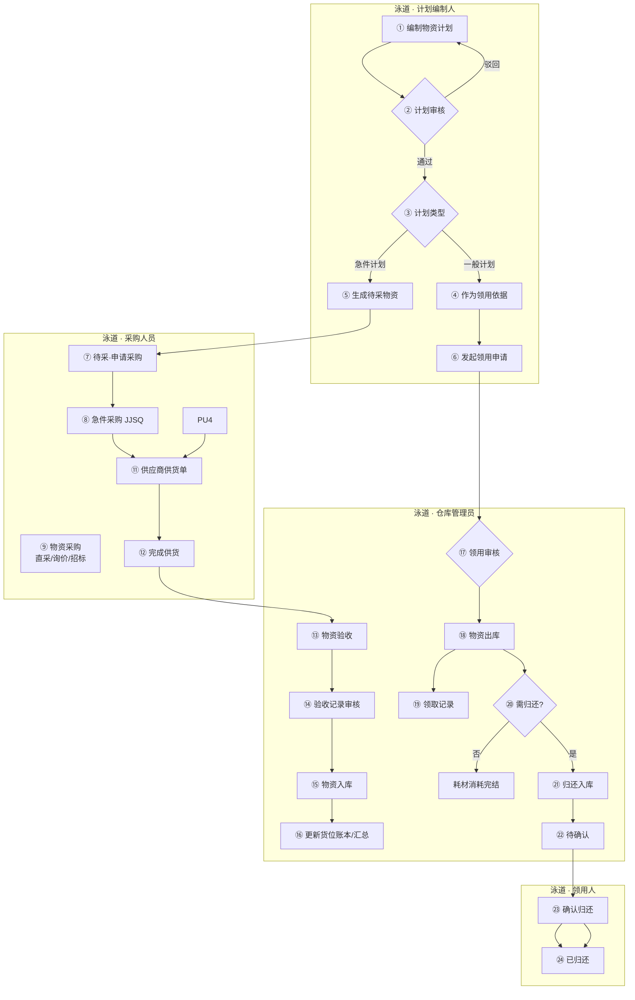

> 库场盘点（计划→任务→执行→差异→调整）已纳入 §2.4、§3.8 本期范围。

### 2.2 子业务流程 — 采购到入库（泳道图）

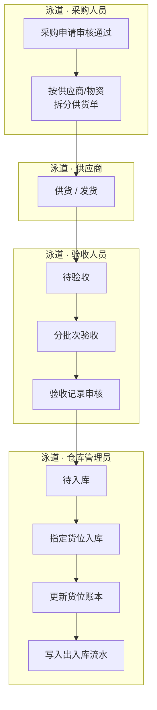

### 2.3 子业务流程 — 领用到归还（泳道图）

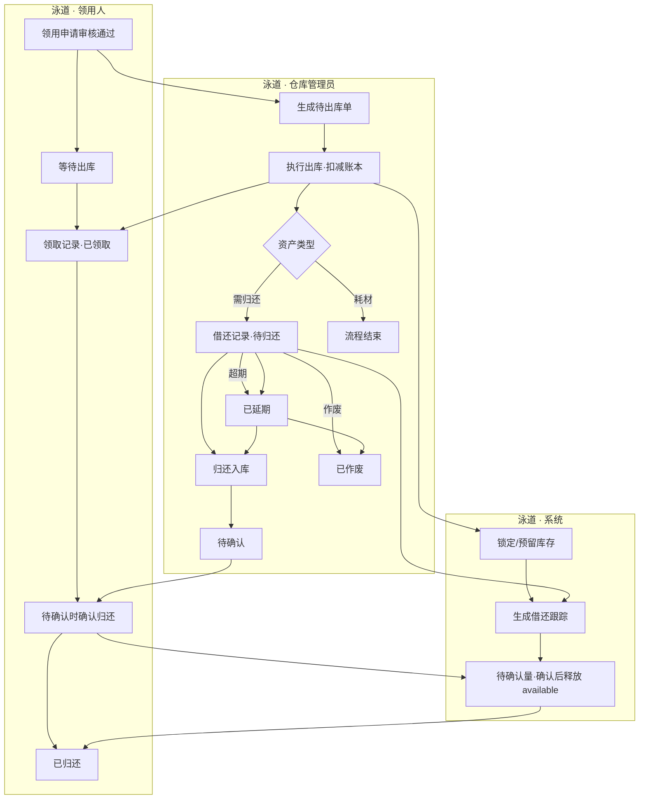

### 2.4 子业务流程 — 库场盘点（泳道图）

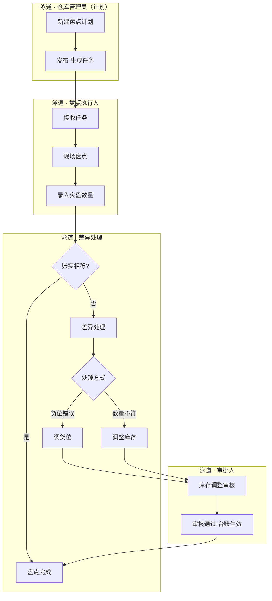

### 2.6 用户交互流程 — 仓库管理员验收入库（泳道图）

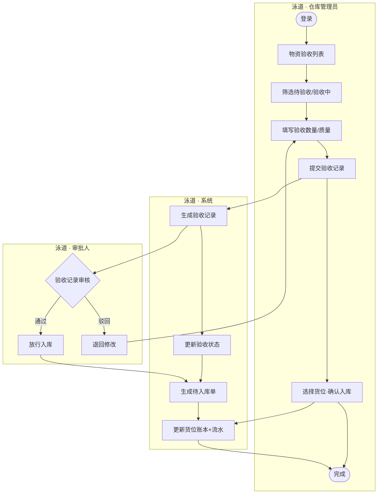

### 2.7 流程状态机 — 通用审批单（计划/领用/采购申请等）

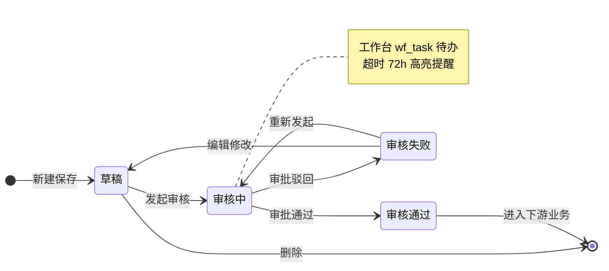

### 2.8 流程状态机 — 物资验收

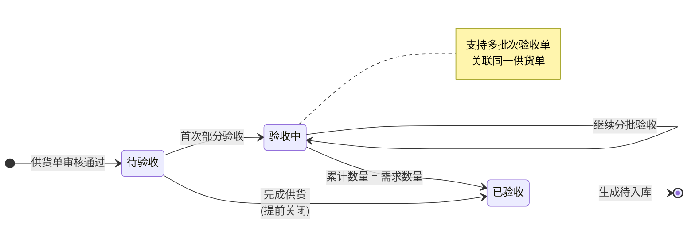

### 2.9 流程状态机 — 物资入库 / 出库

**入库状态机**

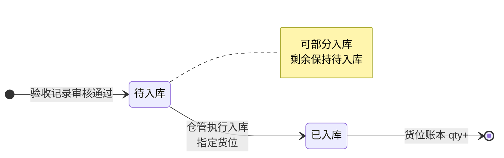

**出库状态机**

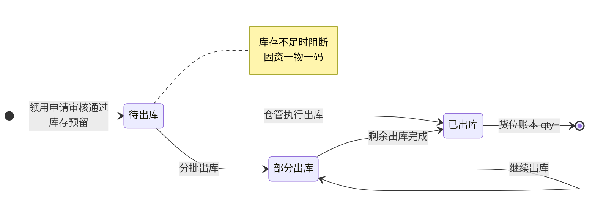

### 2.10 流程状态机 — 物资归还

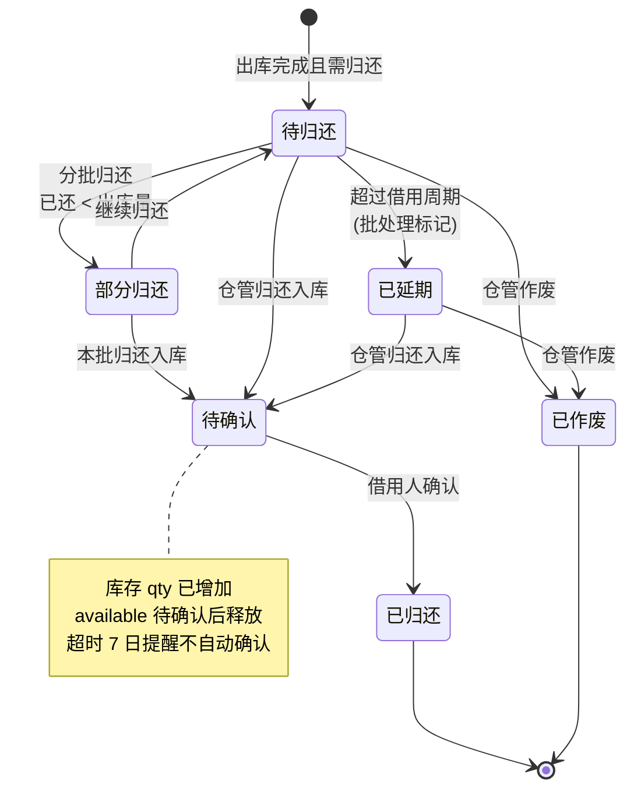

### 2.11 流程状态机 — 盘点与差异

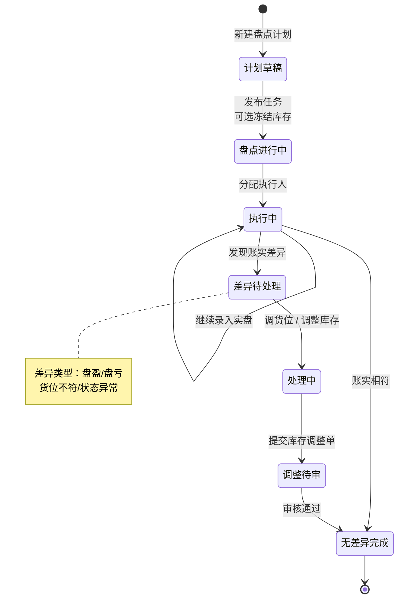

### 2.12 系统数据流转时序图 — 采购入库

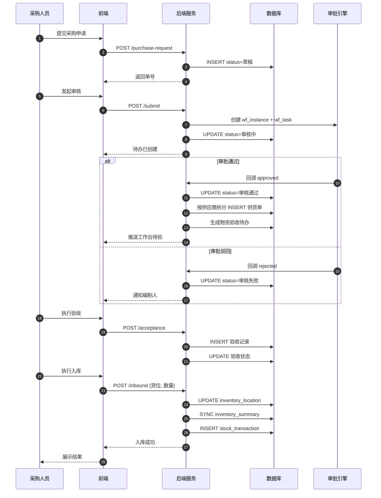

### 2.13 系统数据流转时序图 — 领用出库

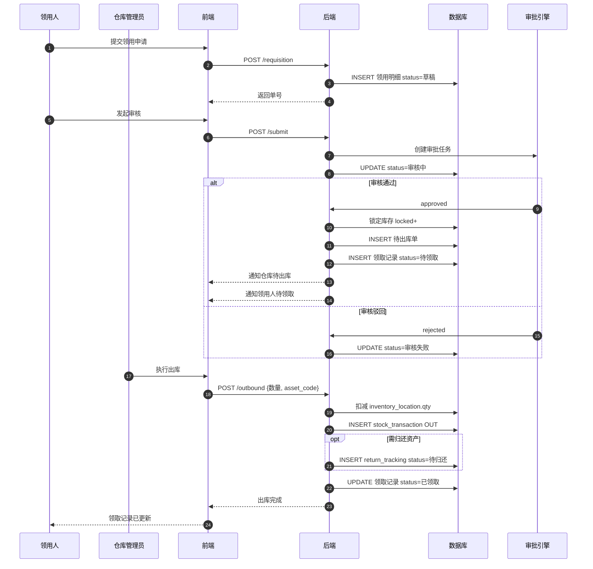

---

## 3. 功能模块总览

### 3.0 原型入口门户（交互原型 V1.0）

**一级概述**：GitHub Pages 部署的双端入口页，用于演示评审时快速切换 PC 后台与移动盘点环境。

| 维度 | 说明 |
|------|------|
| 功能介绍 | 展示产品名称、版本与 PC/APP 双卡片入口；提供页面目录、工作台、APP 任务列表等快捷链接。 |
| 访问地址 | `https://liaoliao66.github.io/wms/`（建议带尾部斜杠，避免子路径下 CSS 解析错误） |
| 前置条件 | 无登录；静态 HTML 原型。 |
| 页面跳转 | PC 卡片 → `pc_home.html`；APP 卡片 → `app_count_home.html`；目录 → `prototype_map.html`（133 页索引）。 |

**PC 端入口说明**：仓库管理后台，含采购、入库出库、台账、基础配置等；侧栏导航 125+ 业务页。

**APP 端入口说明**：iOS 18 风格移动原型；本期包含资产确认、**库场盘点 APP**（首页/扫码/任务/账外/个人中心）。

**快捷链接**：

| 链接 | 目标 | 说明 |
|------|------|------|
| 原型页面目录 | prototype_map.html | 133 页索引 |
| PC 工作台 | pc_home.html | 直达看板 |
| APP 任务列表 | app_count_task_list.html | 跳过 APP 首页 |

---

### 3.1 物资台账

**一级概述**：提供仓库物资库存的全局视图与历史流水查询，是仓储管理的数据中枢。

#### 3.1.0 物资库存总览（物资台账）

| 维度 | 说明 |
|------|------|
| 功能介绍 | 全公司**物资维度**库存总览，按编码汇总在库、可用、借出与预警；左侧分类树 + 右侧列表。 |
| 前置条件 | 用户已登录；存在入库记录。 |
| 数据权限 | 仓库管理员可见分管范围；系统管理员可见全部。 |
| 页面跳转 | 点击统计卡切换列表 Tab；「仓库台账」跳转货位维度视图。 |

**顶部统计卡（3 张）**：

| 卡片 | 说明 | 交互 |
|------|------|------|
| 库存预警 | 低于安全库存的物资种数 | 点击切换「库存预警」Tab |
| 借出中 | 类资产 + 固资借出件数 | 点击切换「固定资产」Tab |
| 待报废 | 待发起作废的物资 | 跳转待报废池 |

**业务规则**：
- 列表 Tab：全部 / 固定资产 / 类资产 / 耗材 / 库存预警
- 左侧分类树点击过滤列表；支持分类搜索
- 搜索：物资编码、资产编码、名称、规格
- 列表字段：在库总量、可用、锁定、借出、分布/位置、状态、最近变动
- 操作：查看（物资库存详情弹窗）、流水（出入库记录）；固定资产额外支持资产详情
- 页内提供「仓库台账」快捷入口切换到货位维度视图

> **页面明细**：列表字段 / 筛选搜索 / 操作权限见 **§17.2.1–§17.2.3**；无独立新增页。

#### 3.1.1 仓库台账

| 维度 | 说明 |
|------|------|
| 功能介绍 | 按**货位维度**展示物资存放位置与库存数量；左侧仓库树（仓库 → 分区 → 货架）驱动右侧列表筛选，支持查看货位详情、跳转物资库存、查看流水。 |
| 前置条件 | 用户已登录；系统中已有仓库配置；物资至少完成过一次入库。 |
| 数据权限 | 仓库管理员可见分管仓库；系统管理员可见全部；普通领用人仅可查看（无编辑）。 |
| 页面跳转 | 左侧树点击节点刷新右侧列表与面包屑；操作列按物资类型差异化展示（见下表）。 |

**左侧目录树**：
- 层级：仓库 → 分区 → 货架（支持展开/折叠；当前上下文节点高亮）
- 点击任意层级节点，右侧列表按该路径过滤
- 底部展示「当前：主仓库 › A区 › A-02 货架」类面包屑

**操作列规则**：

| 物资类型 | 操作 |
|----------|------|
| 固定资产 | 查看（资产详情弹窗）、二维码、下载（资产码 ZIP） |
| 类资产 / 耗材 | 查看（货位库存详情弹窗）、库存（物资库存详情弹窗）、流水（出入库记录列表） |

**货位库存详情弹窗**（`ledger_warehouse_detail`）：
- 顶部横幅：物资编码、货位、在库状态
- 信息区：物资名称、规格、分类、在库/可用/锁定数量、入库与变动时间
- 附加区：公司总量、最近流水摘要
- 快捷链接：物资库存详情、出入库记录
- 仅「关闭」按钮，关闭后回到仓库台账列表

**业务规则**：
- 右侧列表为出入库生成的物资台账，默认按变动时间降序
- 搜索：物资大类、物资子类、物资编码、物资名称
- 筛选：入库时间、变动时间
- 类资产行展示安全库存/上下限（若已配置）

#### 3.1.2 出入库记录

| 维度 | 说明 |
|------|------|
| 功能介绍 | 汇总展示所有物资出入库操作流水，便于审计与追溯。 |
| 前置条件 | 系统中已有出入库操作记录。 |
| 数据权限 | 仓库管理员、系统管理员可查看全部；领用人可查看与本人相关的出库记录。 |
| 页面跳转 | 点击「查看」→ **流水详情弹窗**（`ledger_transaction_detail`），不跳转新页面。 |

**流水详情弹窗**：
- 尺寸：XL；顶部横幅展示流水单号、类型（入库/出库/归还/退货）、货位
- 四列信息网格：物资编码/名称、分类、数量、操作人、关联单号等
- 「附加信息」表格：按需展示领用人、归还状态、供应商、退货原因等扩展字段（无值时整组隐藏）
- 快捷链接：查看来源单据（入库单/出库单等）、物资库存详情或资产详情
- 底部仅「关闭」，关闭后回到出入库记录列表

**业务规则**：按出入库操作时间降序；搜索物资编码、物资名称；筛选操作时间、流水类型。

---

### 3.2 我的物资

**一级概述**：面向领用人的个人物资视图。菜单命名为 **领取记录**、**借还记录**（强调全量历史可查，而非仅「待办」状态）；工作台「待还超期」等指标仍沿用业务口径。

#### 3.2.1 领取记录

| 维度 | 说明 |
|------|------|
| 功能介绍 | 展示当前用户领用申请审核通过后的物资领取明细，含待领取与已领取全状态。 |
| 前置条件 | 领用申请已审核通过。 |
| 数据权限 | 普通用户仅查看本人申请衍生的记录；管理员可查看全部。 |
| 页面跳转 | 「查看」→ 领用记录详情弹窗（`mine_requisition_record`），展示申请头信息与物资明细。 |

**Tab**：全部 / 待领取 / 已领取

**状态**：待领取（审核通过、未出库）→ 已领取（出库完成）

**列表字段**：领用申请单号、物资编码/名称、规格、申请数量、出库单号、出库数量、出库日期等。

#### 3.2.2 借还记录

| 维度 | 说明 |
|------|------|
| 功能介绍 | 展示需归还资产的借出与归还全生命周期，含超期提醒与借用人确认环节。 |
| 前置条件 | 出库完成且物资属性为需归还的资产。 |
| 数据权限 | 普通用户查看本人借出资产；管理员查看全部。 |
| 页面跳转 | 「查看」→ 归还单详情；「归还」→ 归还操作页；「确认」→ 确认归还页（`mine_return_confirm`）。 |

**Tab**：全部 / 待归还 / 已延期 / 待确认 / 已归还

**状态机**（详见 §2.10）：

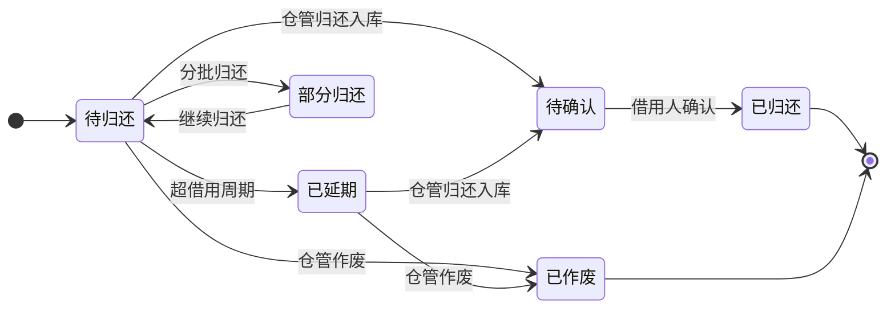

**与物资归还模块关系**：借还记录为领用人视角；仓库管理员在「物资归还」执行入库与作废，领用人在「待确认」状态完成确认后变为已归还。

#### 3.2.3 归还确认规则 [V1.0]

| 规则项 | 说明 |
|--------|------|
| 进入待确认 | 仅**仓库管理员**在「物资归还」完成归还入库操作后，系统生成归还单并将会话状态置为 **待确认** |
| 确认人 | **借用人本人**（`return_tracking.borrower_id`）在「借还记录」点击「确认」 |
| 代确认 | 本期 **不允许**仓管代确认；可配置项留扩展位 |
| 超时 | 待确认超过 **7 个自然日**未操作：系统消息提醒借用人（经工作台待办，非独立消息中心）；**不自动**变更为已归还 |
| 库存恢复时点 | 仓管归还入库时：实物回库，货位账本 `qty` 增加，但类资产/耗材的 `available` 在借用人**确认前**保持锁定或单独记「待确认量」；**确认后** `available` 完全释放。固定资产以 `asset_status` 流转：借出 → 待确认 → 在库 |
| 部分归还 | 类资产支持分批归还；每次归还入库产生一条待确认记录，确认后累计 `returned_qty` |
| 作废 | 仓管在「物资归还」作废：不经过待确认，直接 **已作废**，库存不恢复（见 §11.5） |

---

### 3.3 物资申请

**一级概述**：管理物资需求计划与领用申请，是采购与出库的前置环节。

#### 3.3.1 物资计划

| 维度 | 说明 |
|------|------|
| 功能介绍 | 编制物资需求计划，审核通过后驱动待采物资与领用依据。 |
| 前置条件 | 用户已登录；物资清单主数据已配置。 |
| 数据权限 | 编制人可增删改本人草稿；审批人可审核；管理员全量。 |
| 页面跳转 | 「新增」→ 新增物资计划；「选择物资清单」→ 选择页；审核通过后返回列表。 |

**功能（按状态）**：
- 未发起审核/审核失败：查看、编辑、发起审核、删除
- 审核中：查看、审核
- 审核通过：查看

**计划类型**：
- **一般计划**：审核通过后作为领用依据；**不**生成待采物资
- **急件计划**：审核通过后按物资行拆分生成待采物资（见第 12 章）

**特殊字段**：最早需求日期 = min(物资.需求日期)

#### 3.3.2 领用申请

| 维度 | 说明 |
|------|------|
| 功能介绍 | 发起物资领用请求；**审核通过后锁库预留**，仓库执行出库时**扣减在库数量**；驳回/关闭时**释放预留**。审核通过后自动生成出库待办与领取记录。 |
| 前置条件 | 可选关联已审核通过的物资计划；明细申请数量 ≤ **可用库存**（`available`）。 |
| 数据权限 | 申请人操作本人单据；仓库管理员可查看全部待出库关联单。 |
| 页面跳转 | 「新增」→ 新增页 → 添加物资；提交后回列表；审核通过后可在领取记录、物资出库查看。 |

**搜索**：领用申请单号、计划单号  
**筛选**：申请事由、申请时间、审批状态

**核心库存逻辑（锁库 → 出库扣减 → 释放）**

领用申请**不直接减少在库总量**；采用「先锁后扣、可释放」两阶段模型，与 §9.2 汇总层字段、`inventory_location` 货位层及 §11.1 规则一致。

| 数量口径 | 含义 | 计算/维护 |
|----------|------|-----------|
| 在库总量 `qty` | 账面在库数量 | 货位层 SUM；入库 +、出库 − |
| 可用 `available` | 可被新领用/新出库占用的数量 | `qty − locked − borrowed`（归还待确认场景见 §11.7） |
| 锁定 `locked` | 已审核通过、待出库的预留量 | 审核通过时 +；出库完成时 −；释放时 − |
| 借出 `borrowed` | 已出库未归还量 | 出库完成时 +（需归还物资）；归还确认后 − |

**状态与库存动作**

| 领用申请状态 | 库存动作 | 说明 |
|--------------|----------|------|
| 草稿 / 审核中 | **不锁库** | 仅前端/提交时校验 `申请数量 ≤ available`（软校验，防误填） |
| 审核通过 | **锁库** | `locked += 待出库量`，`available -= 待出库量`；生成待出库单、领取记录（待领取） |
| 审核失败 / 撤回 | **无**（V1.0 审核前未锁） | 若未来支持「审核中预占」，驳回须对称释放 |
| 出库执行（部分） | **扣减 + 减锁** | 本次出库量：`qty −= n`，`locked −= n`；需归还则 `borrowed += n` |
| 出库执行（全部） | **扣减 + 减锁** | 待出库量清零；出库单→已出库；领取记录→已领取 |
| 关闭未出库余量 | **释放锁** | 领用单不再发剩余部分：`locked −= 剩余`，`available += 剩余` |

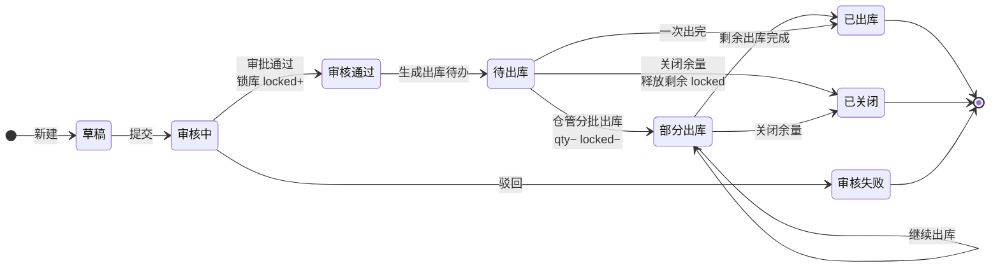

**按物资类型的锁库与扣减**

| 类型 | 锁库粒度 | 扣减时点 | 备注 |
|------|----------|----------|------|
| 固定资产 | 按 `asset_code` 锁定单件（`asset_status`：在库→预留） | 出库确认时 `qty=0`、状态→借出/已出库 | 一物一码；添加物资时仅可选在库且未锁定资产 |
| 类资产 | 按 `material_code` 锁数量（汇总层 + 可选货位 FIFO 预占） | 出库确认时按货位行 `qty−` | 分配策略见 §11.2 |
| 耗材 | 同类资产 | 同类资产 | FIFO 按货位 `inbound_time` |

**校验与阻断规则**

1. **添加物资 / 保存草稿**：展示「可用库存」= 当前 `available`（已含他人锁库占用）；申请数量 > available 时禁止提交并提示。
2. **发起审核**：再次校验每行 `申请数量 ≤ available`；不足则阻断提交。
3. **审核通过（强校验）**：服务端原子执行「校验 + 锁库 + 生成待出库」；任一行锁库失败则**整单审核通过失败**并提示不足物资编码（防止并发超卖）。
4. **执行出库**：`本次出库量 ≤ 该行剩余 locked`；禁止超发（§11.4）。
5. **并发**：同一物资多单竞争时，后通过审核的单在锁库环节失败；用户需改数量或等待前单出库/释放。

**与下游模块关系**

| 模块 | 触发条件 | 库存影响 |
|------|----------|----------|
| 物资出库 | 领用审核通过 | 消费 `locked`，扣减 `qty` |
| 领取记录 | 同左 | 无直接库存变更；展示待领取/已领取 |
| 借还记录 | 出库完成且需归还 | `borrowed` 增加 |
| 物资归还 | 归还入库 + 确认 | `borrowed` 减少，`available` 恢复（§11.7） |

> 完整预留/释放/扣减公式、货位分配与并发控制见 **§11.1、§11.1.1、§11.2、§11.4、§11.6**；领用出库时序见 **§2.13**。

### 3.4 采购管理

**一级概述**：覆盖从待采识别到采购申请执行的全流程，支持直采、询价、招标。**采购两条路径决策见第 12 章。**

#### 3.4.1 待采物资

| 维度 | 说明 |
|------|------|
| 功能介绍 | 急件计划审核通过后形成的待采购物资清单，驱动急件采购申请。 |
| 前置条件 | 关联急件物资计划已审核通过。 |
| 数据权限 | 采购人员、管理员可见。 |
| 页面跳转 | 「查看计划」→ **物资计划详情弹窗**（`purchase_pending_plan_detail`）；「申请」/「批量申请」→ 采购申请-急件申请页（预填物资）。 |

**Tab**：全部 / 待申请 / 已申请

**操作规则**：

| 状态 | 操作 |
|------|------|
| 待申请 | 查看计划（弹窗）、申请（单条）、批量申请（勾选多条） |
| 已申请 | 查看申请（跳转采购申请详情） |

**唯一键**：列表每行由 **计划单号 + 物资编码** 唯一确定；同一计划可有多条待采物资。

**批量申请**：工具栏「批量申请」；仅 **待申请** 行可勾选；支持跨计划合并为一张采购申请。

**物资计划详情弹窗**：
- **基础信息**：计划单号、计划类型、审批状态、计划名称、填报人/部门、申请日期、创建时间、最早需求日、审核通过时间、审批流程、需求说明
- **计划明细表**（与编制表单列对齐，支持多行）：序号、物资编码、名称、规格、大类/子类、单位、在库数量、计划需求数量、计划需要日期
- 根据 URL 参数 `planNo` 动态加载对应计划数据

**状态**：待申请 → 已申请（急件采购申请审核通过）；**已申请不可重复申请**。

#### 3.4.2 采购申请

| 维度 | 说明 |
|------|------|
| 功能介绍 | 管理急件采购申请，审核通过后进入供货与验收环节。 |
| 前置条件 | 来自待采物资或手工新建。 |
| 数据权限 | 采购人员维护；审批人审核。 |
| 页面跳转 | 新增/编辑/申请子页；审核通过后跳转供应商供货单或物资验收。 |

**说明**：列表为急件采购申请，按添加时间降序；编辑时申请单号、采购总额不可改。

#### 3.4.3 物资采购

| 维度 | 说明 |
|------|------|
| 功能介绍 | 询价/招标/直采执行模块，从侧栏「物资采购」进入新建或处理待执行采购单。 |
| 前置条件 | 用户已登录；采购人员角色。 |
| 数据权限 | 采购人员、审批人按流程权限操作。 |
| 页面跳转 | 「采购」→ 询价-采购/招标-采购/直采-采购子页。 |

**子模块**：
- **直采-采购**：指定供应商直接采购
- **询价-采购**：发起询价，状态：待询价 → 已询价
- **招标-采购**：招标流程采购

#### 3.4.4 供应商供货单

| 维度 | 说明 |
|------|------|
| 功能介绍 | 采购单审核通过后按供应商/物资自动拆分，跟踪供货进度。 |
| 前置条件 | 采购申请单或采购单（询价/招标）已审核通过。 |
| 数据权限 | 采购、仓库、管理员可见。 |
| 页面跳转 | 「完成供货」→ 完成供货页；完成后驱动物资验收。 |

**状态**：待供货 → 供货中（部分供货）→ 已供货

---

### 3.5 物资管理

**一级概述**：仓储作业核心模块，连接验收、入库、出库、归还、退货。

#### 3.5.1 物资验收

| 维度 | 说明 |
|------|------|
| 功能介绍 | **验收管理台账**：全量供货单验收状态、进度与记录入口；与「待验物资」执行队列分工（方案 A）。 |
| 前置条件 | 供货单已生成；采购/供货单审核通过。 |
| 数据权限 | 验收人员、仓库管理员操作。 |
| 页面跳转 | 「验收」→ 验收操作页；「完成供货」→ 完成供货页（同供货单模块）。 |

**状态**：待验收 → 验收中 → 已验收

**方案 A（本期）**：
- **物资验收**（侧栏）：管理台账，列全、Tab 含全部/待验收/验收中/已验收；已验收行同时提供「查看」「验收记录」
- **待验物资**（`warehouse_pending_check`）：执行队列，仅待验收/验收中，列精简，操作仅「查看」「验收」；**侧栏不展示**，可由工作台或物资验收进入
- **验收审核**（侧栏）：对每次发起的验收记录进行审核；「查看」打开验收记录详情，「审核」打开审核弹窗（**展示字段与查看一致**，仅额外提供审核结论/意见与提交按钮）
- **批量验收**：本期不做
- **菜单权限**：无 `view` 权限不展示菜单；进入页面亦校验权限

**验收标准**：执行验收页「查看」以弹窗展示当前物资大类对应验收标准（`config_acceptance_standard` 同源）。

#### 3.5.1a 验收审核

| 维度 | 说明 |
|------|------|
| 功能介绍 | 验收记录审核列表；对每次验收提交进行通过/驳回。 |
| 前置条件 | 验收记录已提交、待审核。 |
| 页面跳转 | 「查看」→ 验收记录详情；「审核」→ `warehouse_acceptance_audit_form`（审核弹窗，带 `no`、`back`；字段与查看一致）。 |
| 审批待办 | 个人待办在**流程中心**处理；本页为业务查询与审核入口。 |

#### 3.5.2 验收记录

| 维度 | 说明 |
|------|------|
| 功能介绍 | 每次验收操作的记录明细，1 个供货单可对应多个验收单。 |
| 前置条件 | 已执行至少一次验收操作。 |
| 数据权限 | 验收、仓库、管理员可查看；审批人可审核。 |
| 页面跳转 | 查看详情；审核通过后触发待入库。 |

#### 3.5.3 物资入库

| 维度 | 说明 |
|------|------|
| 功能介绍 | 验收审核通过后执行入库，指定货位并更新台账；支持已有物资不经验收流程的直接补录（例外路径）。 |
| 前置条件 | **验收入库**（主路径）：验收单审核通过；**手动入库**（例外）：物资已在物资清单中维护。 |
| 数据权限 | 仓库管理员操作；可选拆分 `inbound:manual` / `inbound:import` 与验收入库权限。 |
| 入库来源 | **验收入库**（流程1，主路径）：采购→验收→审核通过后自动生成待办；**手动入库**（流程2，例外）：期初库存、历史数据补录，不关联验收单，须强标识与审计。 |
| 页面跳转 | 列表默认筛选「验收入库」待办；验收入库使用行内「入库」；工具栏「手动入库」「导入」为例外路径；完成后回列表。 |

**状态**：待入库 → 已入库（部分入库归入待入库 Tab）

#### 3.5.4 物资出库

| 维度 | 说明 |
|------|------|
| 功能介绍 | 领用申请审核通过后按物资拆分出库，**扣减在库 `qty` 并核销 `locked`**。 |
| 前置条件 | 领用申请审核通过（已锁库）；`本次出库量 ≤ 该行剩余 locked`。 |
| 数据权限 | 仓库管理员操作。 |
| 页面跳转 | 「出库」→ 按类型分固定资产/类资产/耗材出库页。 |

**状态**：待出库 → 已出库

**库存规则**：审核通过后预留库存；出库分配策略见 **第 11 章**。

#### 3.5.5 物资归还

| 维度 | 说明 |
|------|------|
| 功能介绍 | 管理需归还资产的归还、延期、作废；仓管入库后进入「待确认」，借用人确认后完结。 |
| 前置条件 | 出库完成且物资需归还。 |
| 数据权限 | 仓库管理员操作归还/作废；领用人可在借还记录查看并确认。 |
| 页面跳转 | 「归还」→ 归还页；「作废」→ 作废页；借用人「确认」→ 确认归还页。 |

**作废规则**：作废后资产 status=已作废，不恢复库存，写入 scrap 审计（见 11.5）。

#### 3.5.6 物资退货

| 维度 | 说明 |
|------|------|
| 功能介绍 | 向供应商退回物资：含**验收不合格退货**（验收前）与**在库退供应商**（已入库）两类场景；支持分批执行。 |
| 前置条件 | 存在可退的供货/验收/库存记录；退货数量 ≤ 待退数量。 |
| 数据权限 | 仓库管理员执行退货；采购人员可查看；关闭余量须仓管负责人权限（V1.0 简化为仓管）。 |
| 页面跳转 | 列表「新增」→ **发起退货弹窗**（`warehouse_refund_form`）按场景分流；任务行「退货」→ 对应场景执行表单。 |

**与归还/作废边界**：退货退**供应商**并关联 GH/YS/RK；归还为借用人→仓库；作废为内部核销不退供应商。

**触发源**

| 来源 | 场景 | 说明 |
|------|------|------|
| 验收审核通过且处理方式=退货 | 验收前 | 自动生成待退任务 |
| 验收记录/入库列表「发起退货」 | 验收前/在库 | 跳转对应表单 |
| 发起退货弹窗 · 在库退供应商 | 在库 | 按固资/类资产/耗材选任务执行 |

**状态机（执行任务态）**：

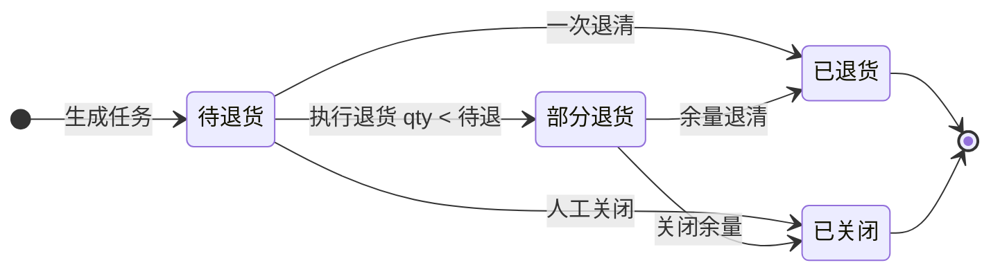

**库存影响**：
- **验收前退货**：不扣货位账本；减少待入库/可入库量；回写供货单已退数量
- **在库退货**：扣减货位账本或资产状态→已退供应商；写入 TH 退货出库流水

**发起退货弹窗（V1.0）**：三步向导 — ① 选场景（待退任务 / 验收前 / 在库）→ ② 在库须再选物资类型 → ③ 展示该场景待退任务表，「去退货」进入执行表单。

**功能（V1.0）**：查看、执行退货（分批）、关闭余量（须原因）

#### 3.5.7 物资作废与待报废池 [V1.0]

| 维度 | 说明 |
|------|------|
| 功能介绍 | 管理不可继续使用物资的报废流程：待报废池汇聚**待报废**物资，经作废申请执行后扣减台账；**在库报废不经池**、直发作废单。执行后实物入**报废存储**（必填位置），进入待处置队列，由 §3.5.8 完成**变卖/丢弃**。 |
| 前置条件 | 物资已标记待报废（归还损坏、库存报废申请等）。 |
| 数据权限 | 仓库管理员发起作废与执行；系统管理员可查看全部。 |
| 页面跳转 | 工作台「待报废」→ 待报废池；「待执行作废」→ 物资作废列表 → 执行作废 → **作废成功页引导至待处置**。 |

**流程**（泳道图）：

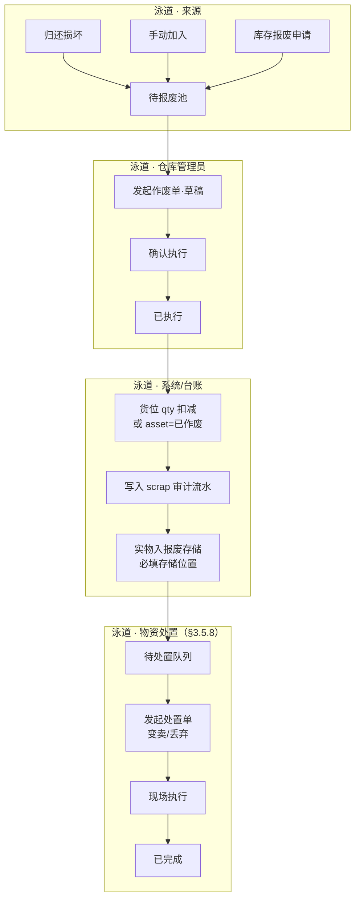

**与归还作废区别**：归还流程中的「作废」针对借出资产未还；本节「物资作废」针对在库或待报废区物资的处置执行。

**状态机**：

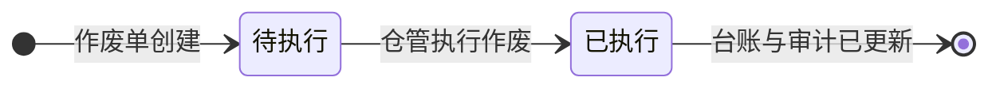

**操作矩阵**：**待执行作废** — 查看、执行；已执行 — 查看（实物若未离场，见**待处置队列**）

##### 3.5.7.1 待报废池：数据来源与入池规则

待报废池（实体 `scrap_pool`）是**作废执行前**的汇聚队列：物资已进入「待报废」业务态，**仍占用账面在库数量**，不可领用/出库，须经作废单（`ZF`）审批并执行后才核销。

**入池数据来源（V1.0）**

| 来源编码 | 业务场景 | 触发模块/操作 | 入池时点 | 台账变化（入池时） | 关联单据 |
|----------|----------|---------------|----------|-------------------|----------|
| `return_damage` | **归还损坏** | 物资归还 · 归还入库 · 实物状态=**损坏** | 归还单提交成功 | 固资 `asset_status`→待报废；类/耗 `inventory_location.status`→待报废；**`qty` 不减**；货位迁至**待报废区** | 归还单 `HK` |
| `in_stock_mark` | **在库标记待报废** | 仓库台账 · 标记待报废（**非**在库直报废） | 仓管确认标记 | 同上 | — |
| `in_stock_expired` | **在库过期/失效** | 仓管巡检或系统批检标记 | 标记确认 | 同上 | — |
| `service_life_due` | **使用年限到期提醒** | 物资清单启用使用年限；到期日 T+0 批任务 | 定时任务 | **仅入池提醒**：自动生成 `scrap_pool` 行；**不**自动生成作废单草稿 | 物资清单 `service_life` |
| `count_abnormal` | **盘点状态异常** | 库场盘点差异处理 · 实物已报废账上有 | 差异处理选择「入待报废池」 | 生成池行 | 盘点任务 |

> **维修**：维修业务不在本系统；归还「需维修」仅作备注，台账按**在库**回库，不产生维修中状态，**不入池**。

**不入待报废池、直接走作废单的路径**

| 场景 | 说明 | 作废单 `source_type` |
|------|------|----------------------|
| **在库报废** | 仓管在「物资作废」新建，来源选「在库报废」，从在库物资选择器添加明细；**强制不经池** | `在库报废` |
| **归还灭失** | 借出未还，仓管在「物资归还」**作废**（丢失/被盗等） | `归还灭失`（系统自动生成 ZF） |
| **待报废转报废** | 自待报废池「发起作废」 | `待报废转报废`（`poolKey` 关联 `scrap_pool`） |
| **盘点异常·直报废** | 差异处理选择「直接在库报废」 | `在库报废`（不经池，与上相同） |

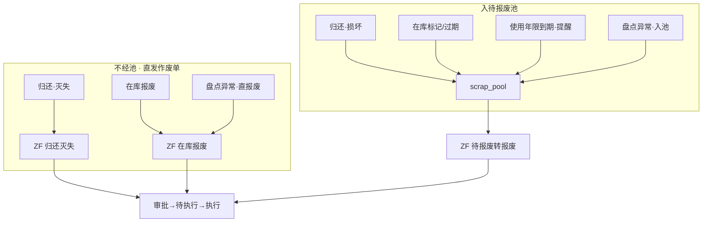

**入池逻辑判断**

| 判断项 | 规则 |
|--------|------|
| 物资状态 | 仅 **在库 / 待报废** 可入池；**借出**须先归还（损坏入池）或走归还灭失；**在库报废**仅通过作废单、不经池 |
| 锁定/预留 | `locked > 0` 或处于领用待出库的物资**禁止**入池与报废 |
| 唯一性 | 固资：同一 `asset_code` 在池内**至多 1 条**有效记录；类/耗：同一 `material_code + location_id` 在池内**至多 1 条** |
| 数量 | 入池 `qty` ≤ 该货位/资产当前可报废量；类/耗支持部分数量入池 |
| 重复入池 | 已在池且未关联「待执行/审核中」作废单的，**拒绝**重复入池 |
| 业务约束 | 入池后：**禁止领用、禁止出库、禁止调拨**；允许查看、发起作废、撤销出池、盘点核销 |

**出池（移除池记录）条件**

| 条件 | 动作 |
|------|------|
| 关联作废单**执行成功** | 删除或归档 `scrap_pool` 行（`status=已核销`） |
| 作废单**审核驳回**且明细来自池 | 池行保持，可重新发起作废 |
| **撤销出池**（可逆） | 仓管**可直接撤销**，**无需审批**；须填写撤销原因并写 `audit_log`；物资状态回**在库**、货位回原区或指定在库货位 |
| **使用年限延长** | 针对 `service_life_due` 来源：在物资清单**增加/延长使用年限**并重算到期日后，系统自动移除对应池行（或仓管手动撤销）；**不发作废单** |

**使用年限到期（`service_life_due`）专项规则**

- 入池目的仅为**提醒**，不锁定报废流程、不预发作废单。
- 物资仍占用账面 `qty`，可继续正常在库业务，直至仓管主动发起「待报废转报废」或「在库报废」。
- **可逆**：撤销出池，或在物资清单调整使用年限（延长）后自动出池。

##### 3.5.7.2 作废单来源类型与分支判断

作废单（`scrap_order`）`source_type` 与入池/归还分支一一对应，决定明细校验与是否关联 `poolKey`。

| `source_type` | 典型入口 | 明细来源 | `source_doc_no` | 审批流 |
|---------------|----------|----------|-----------------|--------|
| `待报废转报废` | 待报废池 · 发起作废 | 池带入只读 | 归还单 `HK` 或入池来源单 | `WF-SCRAP` |
| `在库报废` | 物资作废 · 新增 · 添加在库物资（**不经池**） | 选择器 | 可选 | `WF-SCRAP` |
| `归还灭失` | 物资归还 · **作废**（非归还入库） | 系统自动 | **必填** 领用单 `LY`/出库单 | `WF-SCRAP` |

**与归还模块分支对照**

| 归还操作 | 借还记录终态 | 是否入待报废池 | 作废单 | 库存影响（执行前→执行后） |
|----------|--------------|----------------|--------|---------------------------|
| 归还入库 · **完好** | 待确认→已归还 | 否 | — | 借出→在库；`borrowed↓` `available↑`（确认后） |
| 归还入库 · **需维修** | 待确认→已归还 | 否 | — | 借出→**在库**（维修在外部系统，本系统不记维修中） |
| 归还入库 · **损坏** | 待确认→已归还 | **是** | 须另建 `待报废转报废` | 账上仍 qty；执行作废后 qty↓ |
| **作废**（灭失） | **已作废** | **否** | 自动 `归还灭失` | 不恢复库存；执行后 `borrowed↓`、asset/qty 核销 |

**作废单状态与操作**

| 状态 | 含义 | 允许操作 | 池/台账 |
|------|------|----------|---------|
| 草稿 | 未提交 | 编辑、删除、提交审批 | 池行预占（可选，V1.0 提交时校验池行未被其他待执行单占用） |
| 审核中 | 审批流进行中 | 查看、撤回（编制人） | 池行保持 |
| 审核驳回 | 审批未通过 | 编辑重提 | 池行保持 |
| 待执行 | 审批通过 | 查看、**执行作废** | 池行锁定待核销 |
| 已执行 | 现场执行完成 | 查看 | 池行出池；写入待处置队列 |

**提交/执行校验**

1. 明细 ≥ 1 行；每行 `scrap_qty > 0`。
2. `待报废转报废`：`scrap_qty` = 池行 `qty`（固资恒为 1）；`poolKey` 有效且未被其他待执行单占用。
3. `在库报废`：`scrap_qty ≤` 该行货位可用报废量；**不得**关联 `poolKey`（强制不经池）。
4. `归还灭失`：关联借还记录 status=待归还/已延期；不可与「损坏归还」重复核销同一资产。
5. **执行作废时必填「报废存储位置」**（仓库/分区/货架或逻辑报废存储点）；固资建议扫码核对 `wms://asset/`（不阻断提交）。

##### 3.5.7.3 作废执行与库存/队列联动

作废**执行**在同一事务内完成：

| 步骤 | 固资 | 类资产/耗材 | 队列 |
|------|------|-------------|------|
| 1. 扣减台账 | `inventory_location.qty=0`；`asset_status=已作废` | 货位 `qty -= scrap_qty` | — |
| 2. 汇总刷新 | 刷新 `inventory_summary` | 同上 | — |
| 3. 审计流水 | `stock_transaction` type=`scrap` | 同上 | — |
| 4. **报废存储** | 实物记入执行时指定的**报废存储位置**（必填） | 同上 | — |
| 5. 待处置入队 | 按 `scrap_line` 写入 `disposal_pool`，携带 `storage_location` | 同上 | §3.5.8.1 |
| 6. 出池 | `scrap_pool` 对应行核销（若来自池） | 同上 | — |

> **归还灭失**：无实物回库；执行时仍须指定逻辑**报废存储位置**或「灭失」占位；入待处置队列后通常走**丢弃**处置。

#### 3.5.8 物资处置 [V1.0]

| 维度 | 说明 |
|------|------|
| 功能介绍 | 对已作废并**存入报废存储区**的实物完成离场：**变卖**或**丢弃**；台账核销由 §3.5.7 完成。 |
| 前置条件 | 作废单 status=**已执行**；`disposal_pool` 中已有记录且**存储位置**已明确。 |
| 数据权限 | 仓库管理员发起处置与现场执行；系统管理员可查看全部。 |
| 页面跳转 | 侧栏「物资处置」→ 列表；工具栏「待处置」→ 待处置物资池 → 发起处置；列表「执行」→ 执行处置 → 成功页。 |

**与物资作废区别**：

| 维度 | 物资作废（§3.5.7） | 物资处置（本节） |
|------|-------------------|----------------|
| 目的 | 台账核销、审计留痕 | 实物变卖离场或丢弃 |
| 触发 | 待报废池 / **在库报废（不经池）** | 作废**已执行**后自动入队 |
| 单据 | `ZF` 作废单 | `CZ` 处置单 |
| 库存 | 扣减 qty 或 asset→已作废 | 不再改台账 qty；**变卖**记处置收入 |

**两阶段模型**

1. **报废存储**（§3.5.7 执行时）：实物进入指定存储位置，写入 `disposal_pool`。
2. **处置离场**（本节）：仓管对队列中物资发起 `CZ`，选择 **变卖** 或 **丢弃** 并现场执行。

**处置方式与字段（V1.0 仅两种）**

| 方式 | 适用场景 | 关键字段 |
|------|----------|----------|
| **变卖** | 有残值、转让第三方 | 买方/受让方、变卖金额、收款方式 |
| **丢弃** | 无价值、损毁、灭失留痕 | 丢弃地点、见证人、现场照片（可选） |

**流程**（泳道图）：

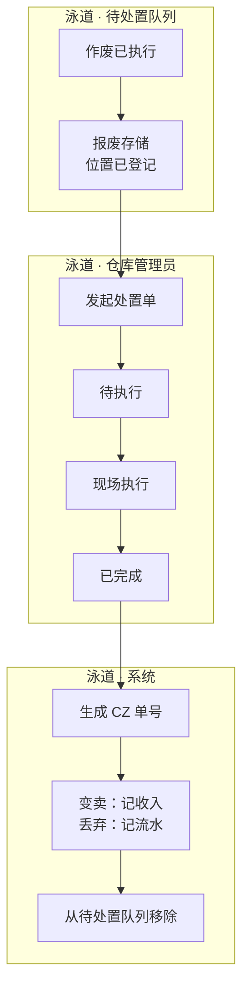

**状态机**：

```mermaid
stateDiagram-v2
    direction LR
    [*] --> 待执行: 提交处置单
    待执行 --> 处置中: 部分现场作业（可选）
    待执行 --> 已完成: 确认执行
    处置中 --> 已完成: 确认执行
    已完成 --> [*]: 队列清除
```

**操作矩阵**：**待执行处置**/处置中 — 查看、执行；已完成 — 查看

##### 3.5.8.1 待处置队列：数据来源与入队规则

待处置队列（实体 `disposal_pool`）记录**已作废、已入库报废存储、尚未变卖/丢弃**的物资；台账 qty 已在 §3.5.7 扣减。

**唯一入队来源（V1.0）**

| 来源 | 触发条件 | 写入规则 |
|------|----------|----------|
| **作废执行** | `scrap_order.status`→**已执行** | 每个 `scrap_line` 生成 1 条记录；**必填** `storage_location`（与执行时一致） |

**入队字段映射**

| `disposal_pool` 字段 | 来源 |
|----------------------|------|
| `pool_key` | `DISP-{scrap_no}-L{line_no}` |
| `scrap_order.no` / `scrap_line_id` | 作废单/明细 |
| `material_code` / `asset_code` / `qty` | 明细 |
| **`storage_location`** | 作废执行时仓管指定的**报废存储位置**（必填） |
| `scrap_executed_at` | 作废执行时间 |
| `status` | **待处置** |

**不入队场景**

| 场景 | 说明 |
|------|------|
| 作废单未执行 | 草稿/审核中/待执行 — 无待处置行 |
| 作废单审核驳回 | 未执行，不入队 |
| 已关联处置单且**执行完成** | 从队列移除（`status=已处置` 或物理删除） |

```mermaid
flowchart LR
    ZF["ZF 已执行"] --> L["scrap_line × N"]
    L --> D1["disposal_pool #1"]
    L --> D2["disposal_pool #2"]
    D1 --> CZ["发起 CZ 处置单"]
    CZ --> EX["执行处置"]
    EX --> OUT["出队 · 已完成"]
```

**出队逻辑判断**

| 条件 | 动作 |
|------|------|
| 处置单**执行完成** | 移除或归档对应 `disposal_pool` 行 |
| 处置单草稿/待执行 | 池行**预占**：同一 `pool_key` 不可被第二张待执行处置单重复引用 |
| 部分处置（V1.0 不支持） | 整行处置；`qty` 须一次处置完毕 |
| 作废执行后长期未处置 | 工作台「待处置」待办提醒；无自动出队 |

##### 3.5.8.2 处置方式判定与边界规则

**方式选择（发起 `CZ` 时必选）**

| 方式 | 适用判定 |
|------|----------|
| **变卖** | 有残值、可转让 |
| **丢弃** | 无价值、须销毁或灭失留痕 |

**逻辑判断**

| 判断项 | 规则 |
|--------|------|
| 存储前置 | 待处置行须已有 **报废存储位置**（作废执行时登记）；发起处置时只读展示 |
| 与作废关系 | 每行**必须**关联已执行 `ZF`；明细编码不可改 |
| 数量 | 处置 qty = 池行 qty（只读） |
| 台账 | 变卖/丢弃执行**不再**变更 `qty` |
| 收入 | 仅**变卖**记金额与收款方式 |

**与退货/归还边界**

| 模块 | 待报废池 | 待处置 |
|------|----------|--------|
| 物资退货 | 否 | 否 |
| 归还损坏 | 是 | 执行后是 |
| 归还灭失 | 否 | 执行后是（通常丢弃） |
| **在库报废** | **否（不经池）** | 执行后是 |
| 盘点异常 | 入池或直报废均保留 | 执行后是 |

#### 3.5.9 作废与处置模块衔接 [V1.0]

> 本节固化评审结论：明确**两模块、三队列、两类待办**的边界与唯一交接点。

**三队列模型**

| 队列 | 实体 | 阶段 | 账上 qty | 出场条件 |
|------|------|------|----------|----------|
| **待报废池** | `scrap_pool` | 作废执行**前** | **仍占用** | ZF 执行成功；或撤销出池/延长年限 |
| **（无队列）** | — | 在库报废/归还灭失直发作废 | 执行前仍占用/借出 | ZF 执行 |
| **待处置** | `disposal_pool` | 作废执行**后**、变卖/丢弃**前** | **已扣减** | CZ 执行完成 |

**唯一交接点**：ZF `status`→**已执行**时，系统在同一事务内：扣账 → 登记报废存储位置 → 写入 `disposal_pool` →（若来自池）核销 `scrap_pool`。

```mermaid
flowchart LR
    SP["待报废池<br/>scrap_pool"] --> ZF["ZF 待执行作废"]
    ZD["在库报废/灭失<br/>直发 ZF"] --> ZF
    ZF --> EX["执行作废"]
    EX --> DP["待处置<br/>disposal_pool"]
    DP --> CZ["CZ 待执行处置"]
    CZ --> DONE["已完成·出队"]
```

**两模块职责（评审确认）**

| 维度 | 物资作废 §3.5.7 | 物资处置 §3.5.8 |
|------|----------------|----------------|
| 回答的问题 | 能不能报废、账怎么销、实物放哪 | 实物怎么变卖离场或丢弃 |
| 主单据 | `ZF` | `CZ` |
| 库存 | **扣减** qty 或 asset→已作废 | **不再改** qty |
| 用户待办 | Tab **待执行作废** | 队列 **待处置** + Tab **待执行处置** |

**易混淆术语对照**

| 用户可见词 | 类型 | 说明 |
|------------|------|------|
| 待报废池 | 队列 | 作废前；qty 未减 |
| 待执行作废 | ZF 单状态（UI 文案） | 待点「执行作废」 |
| **待处置** | 队列 | ZF 已执行后；qty 已减；**不可手工入队** |
| 待执行处置 | CZ 单状态（UI 文案） | 待点「执行处置」 |
| 待报废区 | 货位逻辑区 | 入池后存放；≠ 报废存储区 |

**评审边界（V1.0 确认）**

1. 在库报废、归还灭失**不经**待报废池，但执行后同样入待处置。
2. ZF 未执行前**不得**出现 `disposal_pool` 行；处置模块不可选该物资。
3. 待处置队列**不可撤销**（账已核销）；待报废池可撤销出池（须原因+审计）。
4. 处置方式仅 **变卖 / 丢弃**；存储登记在作废执行阶段完成。
5. 归还「需维修」按在库，不入待报废池。

**页面跳转串联**

| 步骤 | 页面 |
|------|------|
| 1 | 待报废池 / 物资作废列表 |
| 2 | 作废表单 → 审批 → **待执行作废** Tab |
| 3 | 执行作废（必填存储位置）→ 作废成功页 |
| 4 | **待处置物资**队列 → 发起 CZ |
| 5 | 物资处置列表 **待执行处置** Tab → 执行处置 → 出队 |

### 3.6 供应商管理

**一级概述**：维护供应商主数据与绩效评价。

#### 3.6.1 供应商列表

| 维度 | 说明 |
|------|------|
| 功能介绍 | 管理供应商档案，含供货状态。 |
| 前置条件 | 用户具有供应商管理权限。 |
| 数据权限 | 采购、管理员可维护。 |
| 页面跳转 | 「新增」→ 新增供应商；「添加供应商」用于采购场景快速关联。 |

#### 3.6.2 供应商评价

| 维度 | 说明 |
|------|------|
| 功能介绍 | 记录供应商绩效评价，支持审批流。 |
| 前置条件 | 供应商已存在；评价指标与权重已配置。 |
| 数据权限 | 评价人创建；审批人审核。 |
| 页面跳转 | 「新增评价」→ 新增评价页；可「添加供应商」关联。 |

---

### 3.7 基础配置

**一级概述**：系统主数据与规则配置，支撑全业务运行。

#### 3.7.1 计量单位

维护物资计量单位；支持添加计量单位子页。

#### 3.7.2 分类管理

维护物资大类（固定资产/类资产/耗材）与物资子类层级。

**子类继承与特有属性（来自原型）**：

| 属性 | 说明 | 固定资产/类资产 | 耗材 |
|------|------|-----------------|------|
| 计量单位 | 默认继承父级，可改 | ✓ | ✓ |
| 盘点类型 | 多选，默认继承父级 | ✓ | ✓ |
| 是否归还 | 默认继承父级；类资产/固定资产可配置 | ✓ | 默认否 |
| 借用周期（天） | 子级不得大于父级；出库后计算归还 deadline | ✓ | — |
| 安全库存 | 类资产/耗材分类默认值；物资清单可覆盖 | 类资产/耗材必填默认 | 耗材必填默认 |
| 库存下限 | 预警用（V1.0 仅展示，不自动补货）；子级 ≤ 父级 | 类资产/耗材 | 耗材 |
| 库存上限 | 子级 ≤ 父级 | 类资产/耗材 | 耗材 |

**删除约束**：已被物资清单引用的分类不可删除，仅可停用。

#### 3.7.3 验收标准

配置各类物资验收标准规则。

#### 3.7.4 物资清单

维护可采购/可领用的物资目录，分固定资产、类资产与耗材；左侧**分类树**与右侧列表联动筛选。

| 维度 | 说明 |
|------|------|
| 功能介绍 | 物资主数据维护；须绑定分类叶子节点；业务规则默认继承分类并可按物资覆盖。 |
| 前置条件 | 分类管理已配置；用户具有物资清单维护权限。 |
| 数据权限 | 系统管理员、采购人员可维护；其他角色只读（若开放）。 |
| 页面跳转 | 「新增」→ 新增物资表单；「查看」→ 物资详情弹窗；「编辑」→ 编辑表单。 |

**列表交互**：
- 左侧分类树：点击节点过滤右侧列表；支持分类名搜索
- 顶部筛选：启用状态、库存预警（低于下限/缺货）、是否需归还
- 搜索：物资编码、名称、规格型号
- 批量操作：批量停用（V1.0）；导入/导出（P2）

**动态列展示**（按物资类型 Tab 或筛选自动显隐）：

| 列组 | 固定资产 | 类资产 | 耗材 |
|------|:--------:|:------:|:----:|
| 基础信息（编码/名称/规格/分类/状态/单价） | ✓ | ✓ | ✓ |
| 归还 / 借用周期 | ✓ | ✓ | — |
| 是否需要盘点 / 使用年限 | ✓ | ✓ | — |
| 安全库存 / 上下限 / 当前库存 / 预警 | — | ✓ | ✓ |

**新增/编辑校验（类资产、耗材）**：
- **安全库存、库存下限、库存上限**为必填项
- 下限 ≤ 安全库存 ≤ 上限
- 子级物资的上下限不得大于所属分类配置值

**停用规则**：停用后不可被选入新计划/采购/领用；已引用单据不受影响。

#### 3.7.5 仓库配置

维护仓库、分区、货架三级结构；**左侧树导航 + 右侧内容区**，不设「仓库/货架」重复 Tab。

| 维度 | 说明 |
|------|------|
| 功能介绍 | 管理仓库主数据、分区属性与货架货位；生成货位二维码供下载与预览（入库扫码自动选位为二期能力）。 |
| 前置条件 | 系统管理员或具备仓库配置权限。 |
| 数据权限 | 仅管理员可编辑。 |
| 页面跳转 | 树节点「+」→ 新增仓库/分区；列表「新增」→ 新增货架；操作列 → 查看/编辑/二维码/下载。 |

**布局与交互**：
- **左侧树**：仓库 → 分区；支持新增/编辑/删除（有库存引用时阻断删除）
- **右侧内容**（选中分区后）：
  1. 工具栏：已选启用货架数、批量下载货位二维码（ZIP）
  2. 筛选：货架状态、负责人、层数区间
  3. 「+ 新增」货架
  4. **分区详情区**：库区类型、面积、存储容量、负责人
  5. **货架列表**：勾选、编码、名称、层数、承载量、状态、操作（查看/二维码/下载/编辑/删除）
- **不再提供**右侧「仓库 / 货架」标签切换（与左侧树功能重复，已移除）

**货位码与资产码**（页面顶部提示）：
- 货位码（`wms://loc/`）：标识货架物理位置，本模块生成与管理
- 资产码（`wms://asset/`）：标识固定资产个体，在仓库台账管理
- 二者不可混用；停用货架不可生成货位码

**货架操作**：
- 启用货架：可勾选参与批量下载；展示二维码与单张下载
- 停用货架：二维码/下载置灰，不可勾选

#### 3.7.6 使用地点

维护物资使用地点，支撑场外资产定位。

#### 3.7.7 评价设置

- **权重设置**：评价指标及权重
- **评价等级设置**：等级与评分区间对应

| 通用维度 | 说明 |
|----------|------|
| 前置条件 | 系统管理员角色 |
| 数据权限 | 仅管理员可编辑 |
| 页面跳转 | 列表页 ↔ 新增/编辑弹窗或子页 |

---

### 3.8 库场盘点

**一级概述**：支持定期/专项盘点，处理账实差异并调整库存。**盘点范围、冻结、差异分类详见第 13 章。**

**纳入范围规则**：仅 **是否需要盘点=是** 的资产类物资纳入计划；发布任务时快照账存，默认冻结范围内出入库（可配置）。

#### 3.8.1 盘点计划

| 维度 | 说明 |
|------|------|
| 功能介绍 | 创建盘点计划（如日常盘点、年中盘点），作为任务源头。 |
| 前置条件 | 仓库台账有数据；用户有盘点权限。 |
| 数据权限 | 仓库管理员、管理员。 |
| 页面跳转 | 「新增」→ 新增盘点计划页。 |

#### 3.8.2 盘点任务

| 维度 | 说明 |
|------|------|
| 功能介绍 | 由计划分解的具体执行任务，分配执行范围与人员。 |
| 前置条件 | 盘点计划已发布。 |
| 数据权限 | 执行人可见分配任务；管理员全部。 |
| 页面跳转 | 「查看」→ 查看页（展示计划+任务信息）。 |

#### 3.8.3 盘点执行

| 维度 | 说明 |
|------|------|
| 功能介绍 | 现场录入实盘数量，对比系统库存。 |
| 前置条件 | 盘点任务已下发。 |
| 数据权限 | 执行人操作分配任务。 |
| 页面跳转 | 发现差异 → 差异处理。 |

#### 3.8.4 差异处理

| 维度 | 说明 |
|------|------|
| 功能介绍 | 对盘点差异物资进行处置决策。 |
| 前置条件 | 盘点执行存在账实不符记录。 |
| 数据权限 | 仓库管理员。 |
| 页面跳转 | 「调货位」→ 调货位页；「调整库存」→ 调整库存页。 |

#### 3.8.5 库存调整

| 维度 | 说明 |
|------|------|
| 功能介绍 | 差异处理后的库存/货位调整单，需审核后生效。 |
| 前置条件 | 已完成差异处理并提交调整。 |
| 数据权限 | 仓库管理员提交；审批人审核。 |
| 页面跳转 | 审核通过后更新仓库台账。 |

**盘点计划状态**：草稿 → 待盘点 → 盘点中 → 待差异处理 → 已完成 / 已取消

**盘点任务状态**：待盘点 → 盘点中 → 已提交 → 待差异处理 → 已完成

**差异类型**：盘盈、盘亏、货位不符、状态异常（见 13.3）

**PC 端页面（11）**：

| 页面 | 文件 | 说明 |
|------|------|------|
| 盘点计划 | count_plan_list / form / detail | 列表、新增/编辑、详情与发布 |
| 盘点任务 | count_task_list / detail | 任务分解、分配执行人 |
| 盘点执行 | count_execute_form | 现场录入实盘，对比账存 |
| 差异处理 | count_diff_list | 待处理/已处理 Tab |
| 调货位 | count_relocate_form | 货位不符处置 |
| 库存调整 | count_adjust_list / form / detail | 盘盈盘亏调整单与审批 |

---


### 3.9 库外物资盘点

**一级概述**：对**库外**（不在仓库货位内）的 **固定资产、类资产** 开展盘点。PC 创建计划并发布任务；执行人通过 APP/PC 扫码确认资产在场情况；先输出**盘点结果**，确认无误后生成**盘点报告**；盘亏/盘盈/归属变更在**差异处理**中独立推进。

**与库场盘点区别**：

| 维度 | 库场盘点（§3.8） | 库外盘点（本节） |
|------|------------------|------------------|
| 对象 | 在库物资（货位账本） | 库外固定资产/类资产（按资产码） |
| 范围含义 | 仓库/分区/货架 | **应盘哪些物资**（大类/子类/地点/清单） |
| 任务拆分 | 按货架 | **按当前归属人**（执行人） |
| 盘亏处理 | 调货位/调整库存 | **走物资作废（报废）** |
| 盘盈 | 调整库存 | **账外资产审批入账** |
| 产出 | 差异+调整单 | **盘点结果** → **盘点报告**（分步） |

#### 3.9.1 库外盘点计划

| 维度 | 说明 |
|------|------|
| 功能介绍 | 创建库外盘点计划，定义**盘点范围（物资）**、口径日、计划周期；保存草稿或发布。 |
| 盘点范围 | 界定**应盘哪些库外物资**，与执行人无关。支持：全部库外资产、指定物资大类、指定子类、指定使用地点、指定物资清单；可选使用地点作为附加筛选。 |
| 前置条件 | 库外资产台账已有数据；用户有库外盘点权限。 |
| 数据权限 | 盘点管理员、部门负责人、系统管理员。 |
| 页面跳转 | 列表「新增」→ 计划表单；行内「任务/结果/报告」跳转对应模块。 |

**发布规则**：按口径日冻结应盘物资清单 → 按**当前归属人**自动拆分盘点任务 → 执行人 APP/PC 确认。

#### 3.9.2 库外盘点任务

| 维度 | 说明 |
|------|------|
| 功能介绍 | 按执行人拆分的任务列表，展示应盘/已盘/账外/待转派确认进度。 |
| 转派规则 | **部门负责人**可跨部门转派；**普通员工**仅部门内部转派；不支持拒领，仅支持转派确认（接受/拒绝）。 |
| 页面跳转 | 「查看」→ 任务详情（应盘资产清单）。 |

#### 3.9.3 库外盘点结果与报告

| 维度 | 说明 |
|------|------|
| 盘点结果 | 汇总应盘/已盘/盘亏候选/账外；可导出；**确认盘点结果**后方可生成报告。 |
| 盘点报告 | 在结果确认无误后生成并冻结，用于审计归档；与差异处理进度**独立**。 |
| 差异处理 | 盘亏→发起报废；盘盈（账外）→审批入账；归属变更→对方确认/拒绝。 |

**计划状态**：草稿 → 已发布 → 盘点中 → 已出结果 → 已出报告 → 已关闭

**PC 端页面（8）**：

| 页面 | 文件 | 说明 |
|------|------|------|
| 库外盘点计划 | `outside_count_plan_list` / `form` | 列表、新建/编辑（物资范围+任务预览） |
| 库外盘点任务 | `outside_count_task_list` / `detail` | 按执行人任务与应盘清单 |
| 库外盘点结果 | `outside_count_result` | 结果摘要、确认、导出入口 |
| 库外差异处理 | `outside_count_diff_list` | 盘亏/盘盈/归属变更 |
| 库外盘点报告 | `outside_count_report_list` / `detail` | 报告列表与详情冻结 |

**单据编号**：计划 `KWP`、任务 `KWT`、报告 `KWR`（见 §15）。

---

### 3.10 移动端专项

#### 3.10.1 移动盘点（库场盘点 APP）

| 维度 | 说明 |
|------|------|
| 功能介绍 | 现场盘点作业：查看计划与任务、扫码录入、执行盘点、账外资产登记、个人中心。 |
| 设计规范 | iOS 18 风格；iPhone 16 外框（390×844）；灵动岛；状态栏（9:41 + 信号/WiFi/电量）；Home Indicator。 |
| 前置条件 | 用户已分配盘点任务；移动端登录（原型为静态演示）。 |
| 数据权限 | 执行人可见本人任务；仓库管理员可见分管仓库任务。 |

**底部 Tab 导航（3 Tab）**：

| Tab | 页面 | 功能 |
|-----|------|------|
| 首页 | app_count_home | 当前计划 Hero 卡、待办任务列表（可进执行页） |
| 扫码 | app_count_scan | 扫码盘点入口，跳转执行录入 |
| 我的 | app_count_profile | 个人信息、任务入口、账外登记、PC 管理跳转 |

**子页面**：

| 页面 | 文件 | 说明 |
|------|------|------|
| 任务列表 | app_count_task_list | 全部盘点任务，按状态筛选 |
| 盘点执行 | app_count_execute | 按物资/资产录入实盘数量 |
| 账外资产登记 | app_count_offbook | 现场登记账外资产，提交后待审核 |

**个人中心菜单**：我的盘点任务、账外资产登记、差异处理记录（跳转 PC）、PC 端管理。

**交互说明**：
- 首页不提供 2×2 快捷入口网格，任务通过 Hero 卡与待办列表进入
- 任务 Tab 已从底部导航移除，任务列表经首页「全部 >」或个人中心进入
- 弱网场景支持本地暂存后同步（见 6.1）

#### 3.10.2 资产确认

| 维度 | 说明 |
|------|------|
| 功能介绍 | 现场扫码/列表确认资产，支持新增账外资产。 |
| 前置条件 | 移动端登录；可选关联盘点或专项确认任务。 |
| 数据权限 | 现场执行人员。 |
| 页面跳转 | 确认条目 → 详情；提交后同步台账。 |

**账外资产规则（V1.0）**：
- 新增账外资产须填写资产名称、分类、使用地点、数量/编码等必填项
- 提交后生成「资产确认单」，状态为**待审核**
- 审核通过后写入仓库台账（场外或指定仓库），未审核前不计入正式库存
- 账外资产须关联确认人与确认时间，进入操作审计

#### 3.10.3 移动端功能清单

| 能力 | 页面/入口 | 说明 |
|------|-----------|------|
| 资产确认 | 移动 H5 资产确认流 | 扫码 `wms://asset/`、列表勾选、账外登记 |
| 移动盘点 | APP 6 页 | 首页、任务、扫码、执行、账外、个人中心 |
| 登录 | 统一登录页 | 账号密码；Token 8h |


#### 3.10.4 库外盘点 APP

| 维度 | 说明 |
|------|------|
| 功能介绍 | 库外固定资产/类资产现场盘点：任务执行、扫码确认、账外录入、转派/归属确认。 |
| 设计规范 | 与库场盘点 APP 一致：iOS 18、iPhone 16 外框、3 Tab（首页/扫码/我的）。 |
| 前置条件 | 用户已分配库外盘点任务；移动端登录。 |
| 数据权限 | 执行人见本人任务；部门负责人见本部门全量（可跨部门转派）。 |

**页面（11）**：

| 页面 | 文件 | 说明 |
|------|------|------|
| 首页 | `app_outside_count_home` | 当前计划、待确认（转派/归属）、我的任务 |
| 任务列表 | `app_outside_count_task_list` | 全部库外任务 |
| 执行盘点 | `app_outside_count_execute` | 待盘/已盘/账外 Tab；扫码、转派 |
| 扫码盘点 | `app_outside_count_scan` | 扫资产二维码 → 资产确认 |
| 资产确认 | `app_outside_count_asset_confirm` | 修改现场位置、归属变更申请、拍照；在场/未盘到/异常 |
| 转派确认 | `app_outside_count_transfer_list` / `detail` | 接受/拒绝他人转派的盘点任务 |
| 归属变更确认 | `app_outside_count_owner_list` / `detail` | 接受/拒绝归属变更 |
| 账外资产录入 | `app_outside_count_offbook` | 现场登记账外资产 → 提交审批 |
| 个人中心 | `app_outside_count_profile` | 菜单聚合、跳转 PC 差异/计划管理 |

字段明细见 **§17.8**、**§17.12.2**。

---

### 3.11 工作台

**一级概述**：登录后默认首页，聚合待办、预警与关键指标，缩短跨模块跳转路径。

| 维度 | 说明 |
|------|------|
| 功能介绍 | 展示当前用户待办事项、库存/归还预警及快捷入口。 |
| 前置条件 | 用户已登录。 |
| 数据权限 | 待办按角色+数据范围过滤；统计卡片按可见仓库汇总。 |
| 页面跳转 | 待办卡片点击跳转对应业务列表并带筛选条件。 |

**统计卡片（V1.0，1–2 行网格布局）**：

| 卡片 | 数据来源 | 跳转 |
|------|----------|------|
| 待采物资 | 待采 status=待申请 | 待采物资 |
| 待验物资 | 验收 status=待验收/验收中 | 待验物资 |
| 待入库 | 入库 status=待入库 | 物资入库 |
| 待出库 | 出库 status=待出库 | 物资出库 |
| 盘点任务 | 盘点任务 status=待盘点/盘点中 | 盘点任务列表 |
| 供货逾期 | 供货单超过约定交期 | 供应商供货单 |
| 待还超期 | 归还 status=已延期 | 借还记录 |
| 待报废 | 待报废池 | 待报废池 |
| 待执行作废 | 作废单 status=待执行 | 物资作废执行 |
| 待处置 | 待处置队列项数 | 待处置物资池 / 物资处置 |

**作业待办列表**：聚合待采、验收、入库、出库、供货逾期、作废、待报废、**待处置**、归还待确认、**盘点任务**等执行队列，每项直达对应操作页。

**库存概览侧栏**：在库物资种类、本月出入库笔数、库存下限预警；快捷入口至物资台账与出入库记录。

**导航**：侧栏「工作台」指向 `pc_home.html`；各业务页底部提供「返回原型入口」链回门户首页。

---

### 3.12 待验物资

**一级概述**：验收**执行队列**（方案 A）；与「物资验收」数据同源，列与操作精简，**侧栏已隐藏**。

| 维度 | 说明 |
|------|------|
| 功能介绍 | 汇总待验收、验收中的供货/验收单据，支持快速进入验收操作。 |
| 前置条件 | 供货单已生成且采购/供货审核通过。 |
| 数据权限 | 验收人员、仓库管理员可见；按仓库/供应商数据范围过滤（若配置）。 |
| 页面跳转 | 「验收」→ 执行验收弹窗；无侧栏菜单入口（原型已隐藏）。 |

**与物资验收关系（方案 A）**：
- 数据同源，**不单独维护业务状态**
- 待验物资 = 物资验收的「待验收 + 验收中」子集 + 精简列/操作
- 物资验收 = 全量管理台账
- 验收审批待办在**流程中心**；验收审核菜单为业务审核列表

---

### 3.13 流程配置

**一级概述**：配置各类单据的审批流程模板，与通用状态机（2.7）配合使用。

| 维度 | 说明 |
|------|------|
| 功能介绍 | 管理员配置计划/领用/采购/验收记录/库存调整等单据的审批链。 |
| 前置条件 | 系统管理员登录；组织架构与审批人已维护。 |
| 数据权限 | 仅系统管理员可编辑；普通用户只读不可见配置页。 |
| 页面跳转 | 列表 → 新增/编辑流程模板 → 保存后对新单据生效（已进行中单据不走新模板）。 |

**V1.0 支持的流程类型**：

| 流程编码 | 单据类型 | 默认审批链（V1.0 预置） |
|----------|----------|------------------------|
| WF-PLAN | 物资计划 | 编制人 → 部门负责人 → 物资管理部门 |
| WF-REQUISITION | 领用申请 | 申请人 → 部门负责人 → 仓库管理员 |
| WF-PURCHASE-URGENT | 急件采购申请 | 采购员 → 采购负责人 → 分管领导 |
| WF-PROCURE | 物资采购（询价/招标/直采） | 采购员 → 采购负责人 |
| WF-ACCEPT-REC | 验收记录 | 验收员 → 仓库管理员 |
| WF-STOCK-ADJ | 库存调整 | 仓库管理员 → 物资管理部门 |

**配置项**：审批节点（串行）、节点审批人（指定角色/指定人员）、是否允许撤回（发起人，审核中且下一节点未处理时）、超时提醒（72h 未处理发消息）。

**本期不支持**：并行会签、条件分支（按金额路由）、加签/转办（原型未实现）。

**V1.0 技术约束**：
- 审批引擎：自研轻量串行工作流（表：`wf_template`、`wf_instance`、`wf_task`）
- 模板变更仅对新单生效；运行中实例按创建时模板版本执行
- 审批人解析：节点配置为「角色」时，按发起人部门 + 角色匹配；「指定人员」时固定 user_id
- 驳回：状态回「审核失败」，可编辑字段与新建时一致（单号、总额等系统字段仍不可改）
- 待办数据源：与工作台作业待办 **同一 `wf_task` 表**，V1.0 不单独建设消息中心

---

### 3.14 通用交互规范（原型 V1.0 已落地）

#### 3.14.1 详情弹窗模式

以下场景统一采用 **模态弹窗（Modal）** 展示详情，避免整页跳转打断列表上下文：

| 场景 | 入口 | 弹窗页面 | 关闭后返回 |
|------|------|----------|------------|
| 出入库流水详情 | 出入库记录 · 查看 | `ledger_transaction_detail` | 出入库记录列表 |
| 货位库存详情 | 仓库台账 · 查看（类资产/耗材） | `ledger_warehouse_detail` | 仓库台账列表 |
| 物资库存详情 | 物资台账/仓库台账 · 查看 | `ledger_material_detail` | 来源列表 |
| 物资计划详情 | 待采物资 · 查看计划 | `purchase_pending_plan_detail` | 待采物资列表 |
| 领用记录详情 | 领取记录 · 查看 | `mine_requisition_record` | 领取记录列表 |

> 全量弹窗字段清单见 **§17.13**；业务表单弹窗见 **§17.13.9** 索引。

**弹窗通用规范**：
- 尺寸：业务详情默认 XL；简单确认类 MD/LG
- 顶栏：标题 + 关闭（×），Esc / 点击遮罩关闭并回到 `back` 参数指定列表
- 内容：顶部摘要横幅 → 信息网格 → 明细表格（如有）→ 文本快捷链接
- 底部：仅「关闭」或「取消 + 确定」，不在弹窗内嵌套二级整页导航

#### 3.14.2 树形导航 + 列表演进

物资台账、物资清单、仓库配置、仓库台账均采用 **左侧树 / 右侧列表** 布局：
- 树节点点击即过滤列表，无需额外 Tab 切换同级维度
- 当前选中路径以面包屑或高亮节点反馈
- 仓库配置已移除右侧「仓库/货架」重复 Tab，分区切换仅依赖左侧树

#### 3.14.3 列表操作列可见性

- 操作列使用 `sticky` 固定右侧，宽表可横向滚动
- 停用/无权限状态下，对应操作展示为置灰文案而非隐藏占位，避免列宽跳动
- 按行状态动态裁剪操作（如待采「已申请」仅保留查看申请）

#### 3.14.4 弹窗技术约定 [V1.0]

| 项 | 约定 |
|----|------|
| 路由 | 弹窗页使用独立 HTML（如 `ledger_transaction_detail.html?no=…&back=…`），`layout.js` 解析 query 后 `initModal` 渲染 |
| 必填参数 | `no` / `planNo` / `code`+`location` / `returnKey` 等业务主键 + `back` 返回列表 URL |
| 深链刷新 | 支持；刷新后弹窗根据 query 重新拉取详情 |
| 权限 | 弹窗内操作按钮与列表页共用同一权限码；无权限时按钮置灰 |
| 接口 | 建议 `GET /api/v1/{resource}/{id}` 返回详情 DTO，与列表字段复用枚举字典 |

---

### 3.15 页面规格说明规范

各业务页面除上文功能描述外，**列表字段、筛选搜索、操作权限、新增/编辑字段** 统一在 **§17 页面字段与操作明细** 中维护。表格列含义如下：

**列表字段清单**

| 列名 | 说明 |
|------|------|
| 字段名 | 列表列头显示名称 |
| 含义 | 业务含义 |
| 数据来源 | 主表/关联表/聚合视图 |
| 产生规则 | 计算、默认值、状态联动 |
| 列表展示 | 是否默认列、条件显隐 |

**筛选与搜索**：单独表格列出 Tab、下拉筛选、日期区间、关键字搜索及对应后端参数字段。

**功能权限（操作项）**：列出页面全部按钮/链接；标注权限码、可见角色、按状态裁剪规则（与 §16 操作矩阵一致）。

**新增/编辑字段清单**

| 列名 | 说明 |
|------|------|
| 字段名 | 表单 label |
| 含义 | 业务含义 |
| 数据来源 | 手工录入 / 主数据选择 / 上游单据带入 |
| 必填 | 是/否/条件必填 |
| 校验规则 | 格式、范围、跨字段校验 |
| 提交逻辑 | 保存草稿 vs 提交审核时的差异 |

**弹窗字段清单**（§17.13）：列表页触发的模态弹窗，含只读详情、操作提交、选择器三类；字段表增加「必填」「校验/提交逻辑」列；只读弹窗标注「无提交」。

> 研发、测试以 §17 为页面级验收基线；§3.x 保留流程与规则，§17 保留字段级明细。业务表单弹窗（入库/出库/验收等）字段见 §17.6 等对应小节，§17.13 补充详情类弹窗与跨模块选择器。

---

## 4. 用户交互路径（User Flows）

> 以下各链路均以 **泳道图** 展示跨角色协作；与 §2 全局流程、§16 操作矩阵对应。

### 4.1 UF-01 急件采购全链路（泳道图）

```mermaid
flowchart TB
    subgraph uf1_plan["泳道 · 计划编制人"]
        A1["物资计划编制"] --> A2["审核通过"]
    end
    subgraph uf1_buy["泳道 · 采购人员"]
        B1["待采·申请"] --> B2["采购申请 JJSQ"] --> B3["审核通过"]
    end
    subgraph uf1_sup["泳道 · 供应商/供货"]
        C1["供货单"] --> C2["完成供货"]
    end
    subgraph uf1_wh["泳道 · 仓库"]
        D1["物资验收"] --> D2["验收记录审核"] --> D3["入库"] --> D4["货位台账"]
    end
    A2 --> B1
    B3 --> C1
    C2 --> D1
    D3 --> D4
```


### 4.2 UF-02 物资采购（询价）全链路（泳道图）

```mermaid
flowchart TB
    subgraph uf2_buy["泳道 · 采购人员"]
        P1["侧栏·物资采购"] --> P2["新建·询价-采购"]
        P2 --> P3["填写询价信息"] --> P4["发起审核"] --> P5["审核通过"]
    end
    subgraph uf2_chain["泳道 · 供货与仓储"]
        Q1["供货单"] --> Q2["验收"] --> Q3["入库"] --> Q4["台账"]
    end
    P5 --> Q1
    Q3 --> Q4
```

### 4.3 UF-03 领用出库全链路（泳道图）

```mermaid
flowchart TB
    subgraph uf3_user["泳道 · 领用人"]
        U1["领用申请"] --> U2["审核通过"] --> U3["领取记录·待领取"] --> U4["已领取"]
    end
    subgraph uf3_wh["泳道 · 仓库管理员"]
        W1["待出库"] --> W2["出库操作"] --> W3["物资归还"]
    end
    subgraph uf3_ret["泳道 · 借还（可选）"]
        R1["借还记录"] --> R2["待确认→已归还"]
    end
    U2 --> W1
    W2 --> U3
    W2 --> U4
    W3 --> R1
    R1 --> R2
```

### 4.4 UF-04 盘点差异闭环（泳道图）

```mermaid
flowchart TB
    subgraph uf4_plan["泳道 · 计划"]
        CP1["盘点计划"] --> CP2["盘点任务"]
    end
    subgraph uf4_exec["泳道 · 执行"]
        CE1["盘点执行"] --> CE2["差异处理"]
    end
    subgraph uf4_adj["泳道 · 调整"]
        CA1["调货位/调整库存"] --> CA2["库存调整审核"] --> CA3["台账更新"]
    end
    CP2 --> CE1
    CE2 --> CA1
    CA2 --> CA3
```

### 4.5 UF-05 移动盘点现场作业（泳道图）

```mermaid
flowchart TB
    subgraph uf5_app["泳道 · 移动 APP"]
        M1["首页·当前计划"] --> M2["任务列表/扫码"]
        M2 --> M3["录入实盘·提交"]
    end
    subgraph uf5_pc["泳道 · PC 后台"]
        P1["差异处理"] --> P2["调货位/调整库存"]
    end
    subgraph uf5_off["泳道 · 账外资产"]
        O1["账外登记"] --> O2["审核"] --> O3["入账"]
    end
    M3 -->|"有差异"| P1
    M2 --> O1
    P2 --> P3["台账更新"]
    O3 --> P3
```

### 4.6 UF-06 归还作废与库存（泳道图 + 状态分支）

```mermaid
flowchart TB
    subgraph uf8_out["泳道 · 出库后"]
        O1["出库·需归还"] --> O2["待归还"]
    end
    subgraph uf8_branch["泳道 · 分支处置"]
        direction TB
        B1{"处置方式"}
        B1 -->|"正常归还"| B2["归还入库→待确认→已归还"]
        B1 -->|"超期"| B3["已延期"]
        B1 -->|"作废"| B4["已作废·不恢复库存"]
        B3 --> B4
        B3 --> B2
    end
    subgraph uf8_ledger["泳道 · 库存影响"]
        L1["已归还：恢复 available"] 
        L2["已作废：scrap 审计"]
    end
    O2 --> B1
    B2 --> L1
    B4 --> L2
```

---

## 5. 页面清单与跳转关系

### 5.1 PC 端页面清单

| 模块 | 页面名称 | 类型 | 跳转关系 |
|------|----------|------|----------|
| 原型入口 | 双入口门户 | 首页 | → PC 工作台 / APP 首页 / 页面目录 |
| 工作台 | PC 工作台 | 首页 | → 统计卡片 / 作业待办 / 库存概览 |
| 物资台账 | 物资库存总览 | 列表 | → 详情弹窗 / 仓库台账 |
| 物资台账 | 仓库台账 | 列表 | → 货位详情弹窗 / 资产详情 / 流水 |
| 物资台账 | 出入库记录 | 列表 | → 流水详情弹窗 |
| 我的物资 | 领取记录 | 列表 | → 领用记录详情弹窗 |
| 我的物资 | 借还记录 | 列表 | → 归还详情 / 确认归还 |
| 物资申请 | 物资计划 | 列表 | → 新增物资计划 → 选择物资清单 |
| 物资申请 | 领用申请 | 列表 | → 新增 → 添加物资 |
| 采购管理 | 待采物资 | 列表 | → 查看计划（弹窗）/ 申请 |
| 采购管理 | 采购申请（急件 JJSQ） | 列表 | → 申请/选择 |
| 采购管理 | 物资采购 | 列表 | → 直采/询价/招标采购 |
| 采购管理 | 供应商供货单 | 列表 | → 完成供货 |
| 物资管理 | 物资验收 | 列表 | → 验收/完成供货 |
| 物资管理 | 待验物资 | 列表 | → 物资验收 |
| 物资管理 | 验收记录 | 子页 | → 查看（无独立侧栏） |
| 物资管理 | 物资入库/出库/归还/退货 | 列表 | → 对应表单 |
| 物资管理 | 物资作废 / 待报废池 / **物资处置** | 列表 | → 执行作废 / **发起处置 → 执行处置** |
| 供应商 | 供应商列表/评价 | 列表 | → 表单 |
| 基础配置 | 计量单位/分类/验收标准/物资清单/仓库配置/使用地点/评价设置 | 列表+表单 | 各新增子页 |
| 库场盘点 | 盘点全模块 | 列表+表单 | §17.7 |
| 系统 | 流程配置 | 配置 | 审批流模板 |
| 原型 | 页面目录 | 索引 | prototype_map（133 页） |

### 5.2 移动端页面清单

| 页面 | 文件 | 本期 | 说明 |
|------|------|:----:|------|
| 资产确认 | 移动 H5 | ✓ | 扫码/列表确认、账外登记 |
| 盘点首页 | app_count_home | ✓ | 库场盘点：当前计划、待办任务 |
| 任务列表 | app_count_task_list | ✓ | 库场盘点任务 |
| 盘点执行 | app_count_execute | ✓ | 库场盘点执行 |
| 扫码盘点 | app_count_scan | ✓ | 库场扫码入口 |
| 账外资产登记 | app_count_offbook | ✓ | 库场账外登记 |
| 个人中心 | app_count_profile | ✓ | 库场任务入口、PC 跳转 |
| 库外盘点首页 | app_outside_count_home | ✓ | 库外计划、待确认、任务 |
| 库外任务/执行/扫码/确认 | app_outside_count_* | ✓ | 库外盘点全流程（共 11 页） |

### 5.3 全局导航结构（PC）

```
原型入口（index.html）
├── PC 工作台（pc_home.html）
├── 物资台账（物资库存总览、仓库台账、出入库记录）
├── 我的物资（领取记录、借还记录）
├── 物资申请（物资计划、领用申请）
├── 采购管理（待采物资、采购申请、物资采购）
├── 物资管理（物资验收、**验收审核**、入库、出库、归还、退货、作废、**物资处置**）
├── 库场盘点
├── **库外盘点**（计划、任务、差异处理、报告）
├── 供应商管理（供应商列表、评价、**供应商供货单**）
├── 基础配置（含仓库配置、物资清单）
├── 流程配置
├── 库场盘点
```

### 5.4 PRD ↔ 原型 ↔ 侧栏映射表

| 模块 | PRD 章节 | 侧栏菜单 | 原型文件 | V1.0 |
|------|----------|----------|----------|:----:|
| 工作台 | §3.11 | 工作台 | `pc_home.html` | ✓ |
| 物资库存总览 | §3.1.0 | 物资台账 | `ledger_material.html` | ✓ |
| 仓库台账 | §3.1.1 | 仓库台账 | `ledger_warehouse.html` | ✓ |
| 出入库记录 | §3.1.2 | 出入库记录 | `ledger_transaction.html` | ✓ |
| 领取记录 | §3.2.1 | 领取记录 | `mine_pending_pickup.html` | ✓ |
| 借还记录 | §3.2.2 | 借还记录 | `mine_pending_return.html` | ✓ |
| 物资计划 | §3.3.1 | 物资计划 | `apply_plan_list.html` | ✓ |
| 领用申请 | §3.3.2 | 领用申请 | `apply_requisition_list.html` | ✓ |
| 待采物资 | §3.4.1 | 待采物资 | `purchase_pending_list.html` | ✓ |
| 采购申请 | §3.4.2 | 采购申请 | `purchase_request_list.html` | ✓ |
| 物资采购 | §3.4.3 | 物资采购 | `purchase_execute_list.html` | ✓ |
| 物资验收 | §3.5.1 | 物资验收 | `warehouse_acceptance_list.html` | ✓ |
| 验收审核 | §3.5.1a | 验收审核 | `warehouse_acceptance_audit_list.html` | ✓ |
| 待验物资 | §3.12 | **无（侧栏隐藏）** | `warehouse_pending_check.html` | ✓ 执行队列 |
| 供货单 | §3.6 | 供应商供货单 | `purchase_supply_list.html` | ✓ |
| 验收记录 | §3.5.2 | **无** | `warehouse_acceptance_record.html` | ✓ 子页 |
| 入库/出库/归还/退货 | §3.5.3–6 | 对应菜单 | `warehouse_*_list.html` | ✓ |
| 物资作废 | §3.5.7 | 物资作废 | `warehouse_scrap_list.html` | ✓ |
| 待报废池 | §3.5.7 | **无** | `warehouse_scrap_pending_pool.html` | ✓ |
| 物资处置 | §3.5.8 | 物资处置 | `warehouse_disposal_list.html` | ✓ |
| 待处置物资 | §3.5.8 | **无** | `warehouse_disposal_pending.html` | ✓ |
| 供应商/评价 | §3.6 | 供应商列表/评价 | `supplier_*.html` | ✓ |
| 基础配置 | §3.7 | 配置类菜单 | `config_*.html` | ✓ |
| 库场盘点 | §3.8 | 库场盘点 | `count_*.html` / `app_count_*` | ✓ |
| 库外盘点 | §3.9 | 库外盘点 | `outside_count_*.html` / `app_outside_count_*` | ✓ |
| 流程配置 | §3.13 | 流程配置 | `system_workflow.html` | ✓ |

---

## 6. 非功能性需求

### 6.1 性能

| 指标 | 要求 |
|------|------|
| 列表页首屏加载 | ≤ 2s（1000 条以内数据） |
| 搜索/筛选响应 | ≤ 1s |
| 并发用户 | 支持 200 在线用户（项目级部署） |
| 移动端弱网 | 盘点/确认支持本地暂存，网络恢复后同步 |
| 扫码响应 | 资产确认/盘点扫码入库 ≤ 500ms（局域网） |
| 库存事务 | 出入库/调整强一致，台账列表查询可最终一致（≤ 3s） |

### 6.2 安全

- 全站 HTTPS 传输
- 登录态 Token 过期时间 8 小时，支持续期
- 操作审计：出入库、库存调整、审批、作废、账外资产确认等关键操作留痕
- 审计日志保留 ≥ 3 年
- 敏感字段（供应商联系方式等）按角色脱敏展示

### 6.3 可用性

- PC 端兼容 Chrome 90+、Edge 90+
- 移动端适配 iOS 14+、Android 10+ 浏览器
- 表单必填项明确标识（红色 *）
- 删除操作统一磁吸弹窗二次确认

### 6.4 可靠性

- 核心业务（入库、出库、库存调整）需事务保证，防止超卖
- 每日凌晨自动备份数据库
- 审批流异常支持管理员重试/撤回

### 6.5 扩展性

- 物资分类、审批流程、评价指标支持配置化扩展
- 预留与 ERP/财务系统对接 API（V1.0 可不实现）

### 6.6 数据导入导出

- 仓库台账、出入库记录支持 Excel 导出
- 物资清单、供应商列表支持 Excel 模板导入（V1.0 可选实现，优先级 P2）
- 二维码批量下载（仓库台账勾选后打包 ZIP）

### 6.7 身份认证与组织 [V1.0]

| 项 | 要求 |
|----|------|
| 登录 | 账号 + 密码；HTTPS；失败 5 次锁定 15 分钟 |
| 会话 | JWT/Session Token，有效期 8h，活动续期 |
| 组织 | 部门树（至少 2 级：公司 → 部门）；用户归属单部门 |
| 仓库绑定 | 仓库管理员、验收人员（可选）绑定 `warehouse_ids[]` |
| 初始化 | 系统预置 admin、默认主仓库、预置审批流模板（§3.13） |
| 与审批 | 部门负责人 = 用户表中 `dept.leader_id`；未配置时审批节点跳过或转管理员（可配置） |

### 6.8 操作审计 [V1.0]

| 字段 | 说明 |
|------|------|
| audit_id | 主键 |
| action | 枚举：INBOUND, OUTBOUND, RETURN_CONFIRM, SCRAP, **DISPOSAL**, APPROVE, REJECT, … |
| biz_type / biz_id | 关联单据 |
| operator_id | 操作人 |
| operated_at | 时间戳 |
| before_json / after_json | 关键字段快照（可选） |
| ip | 客户端 IP |

保留 ≥3 年；支持按单据号、操作人、时间范围查询导出。

---

## 7. 系统功能清单

| 一级模块 | 二级功能 | 功能概述 |
|----------|----------|----------|
| 物资台账 | 物资库存总览 | 分类树 + 库存列表，统计卡（预警/借出/待报废） |
| 物资台账 | 仓库台账 | 树形货位 + 库存列表，二维码下载 |
| 物资台账 | 出入库记录 | 出入库流水查询与详情 |
| 我的物资 | 领取记录 | 领用领取全状态跟踪（待领取/已领取） |
| 我的物资 | 借还记录 | 借出归还全生命周期（含待确认） |
| 物资申请 | 物资计划 | 需求计划编制与审批 |
| 物资申请 | 领用申请 | 领用申请与审批 |
| 采购管理 | 待采物资 | 急件待采购清单 |
| 采购管理 | 采购申请 | 急件采购申请（JJSQ） |
| 采购管理 | 物资采购 | 直采/询价/招标执行 |
| 采购管理 | 供应商供货单 | 供货进度管理 |
| 物资管理 | 物资作废 | 待报废池与作废执行 |
| 物资管理 | **物资处置** | **待处置队列；变卖/丢弃与现场执行** |
| 物资管理 | 物资验收 | 分批验收 |
| 物资管理 | 验收记录 | 验收明细与审核 |
| 物资管理 | 物资入库 | 货位入库 |
| 物资管理 | 物资出库 | 分类出库 |
| 物资管理 | 物资归还 | 归还/作废 |
| 物资管理 | 物资退货 | 退货登记 |
| 供应商管理 | 供应商列表 | 供应商档案 |
| 供应商管理 | 供应商评价 | 绩效评价 |
| 基础配置 | 计量单位 | 单位主数据 |
| 基础配置 | 分类管理 | 大类/子类 |
| 基础配置 | 验收标准 | 验收规则 |
| 基础配置 | 物资清单 | 物资目录 |
| 基础配置 | 仓库配置 | 仓库/分区/货架 |
| 基础配置 | 使用地点 | 场外地点 |
| 基础配置 | 评价设置 | 权重/等级 |
| 库场盘点 | 盘点计划 | 计划管理 |
| 库场盘点 | 盘点任务 | 任务分解 |
| 库场盘点 | 盘点执行 | 现场盘点 |
| 库场盘点 | 差异处理 | 差异处置 |
| 库场盘点 | 调货位 | 货位变更 |
| 库场盘点 | 库存调整 | 调整审核 |
| 原型入口 | 双端门户 | PC/APP 切换 |
| 工作台 | PC 工作台 | 统计卡片 + 作业待办 |
| 物资管理 | 待验物资 | 验收待办视图 |
| 系统 | 流程配置 | 审批流模板 |
| 移动端 | 移动盘点 | 扫码/执行/账外/个人中心 |
| 移动端 | 资产确认 | 现场资产核对 |

---

## 8. 权限与数据范围矩阵

### 8.1 功能权限矩阵（菜单/操作）

| 功能模块 | 系统管理员 | 仓库管理员 | 采购人员 | 计划编制人 | 领用人 | 验收人员 | 审批人 |
|----------|:----------:|:----------:|:--------:|:----------:|:------:|:--------:|:------:|
| 工作台 | ✓ | ✓ | ✓ | ✓ | ✓ | ✓ | ✓ |
| 仓库台账-查看 | ✓ | ✓ | ✓ | ✓ | ✓ | ✓ | ✓ |
| 仓库台账-二维码 | ✓ | ✓ | — | — | — | — | — |
| 出入库记录 | ✓ | ✓ | — | — | 本人相关 | ✓ | — |
| 领取记录/借还记录 | ✓ | ✓ | — | — | ✓ | — | — |
| 物资计划-编制 | ✓ | — | — | ✓ | — | — | — |
| 物资计划-审核 | ✓ | — | — | — | — | — | ✓ |
| 领用申请-编制 | ✓ | — | — | — | ✓ | — | — |
| 领用申请-审核 | ✓ | ✓ | — | — | — | — | ✓ |
| 待采/采购申请 | ✓ | — | ✓ | — | — | — | ✓ |
| 物资采购/供货单 | ✓ | ✓ | ✓ | — | — | — | ✓ |
| 待验/验收/入库 | ✓ | ✓ | — | — | — | ✓ | ✓ |
| 出库/归还/退货 | ✓ | ✓ | — | — | — | — | — |
| 供应商管理 | ✓ | — | ✓ | — | — | — | — |
| 基础配置/流程配置 | ✓ | — | — | — | — | — | — |
| 盘点全模块 | ✓ | ✓ | — | — | — | — | ✓ |
| 物资作废/待报废 | ✓ | ✓ | — | — | — | — | — |
| **物资处置** | ✓ | ✓ | — | — | — | — | — |
| 资产确认(移动) | ✓ | ✓ | — | — | — | ✓ | — |

> ✓=可用，—=不可用，「本人相关」=仅关联本人的出库流水。

### 8.2 数据范围规则

| 角色 | 列表数据范围 | 说明 |
|------|--------------|------|
| 系统管理员 | 全部 | 含所有仓库、所有单据 |
| 仓库管理员 | 分管仓库 | 用户档案绑定 warehouse_ids；台账/入出库/盘点仅限这些仓库 |
| 采购人员 | 全部采购域单据 | 采购/供货/待采；不含他人领用单 |
| 计划编制人 | 本人计划 | plan.created_by = 当前用户 |
| 领用人 | 本人申请及衍生 | requisition.created_by = 当前用户 |
| 验收人员 | 全部验收单 | 本期不按仓库限制 |
| 审批人 | 待办+已办 | 审批任务分配到的单据 |

---

## 9. 数据模型与字段字典

### 9.1 实体关系（ER 概览）

> 库存采用 **汇总层 + 货位层** 双表（见 §9.2）；下图按业务域分组。

```mermaid
erDiagram
    MATERIAL_CATALOG ||--o{ INVENTORY_SUMMARY : "汇总视图"
    MATERIAL_CATALOG ||--o{ INVENTORY_LOCATION : "货位账本"
    WAREHOUSE ||--o{ ZONE : contains
    ZONE ||--o{ SHELF : contains
    SHELF ||--o{ INVENTORY_LOCATION : stores

    MATERIAL_PLAN ||--o{ PLAN_LINE : contains
    MATERIAL_PLAN ||--o{ PENDING_PURCHASE : "急件计划生成"

    PURCHASE_REQUEST ||--o{ SUPPLY_ORDER : generates
    PLAN_PROCURE_REQUEST ||--o{ PROCURE_ORDER : generates
    SUPPLY_ORDER ||--o{ ACCEPTANCE_ORDER : accepts
    ACCEPTANCE_ORDER ||--o{ INBOUND_ORDER : inbound

    REQUISITION ||--o{ OUTBOUND_ORDER : outbound
    OUTBOUND_ORDER ||--o{ RETURN_TRACKING : may_return
    RETURN_TRACKING ||--o{ RETURN_ORDER : confirms

    INVENTORY_LOCATION ||--o{ STOCK_TRANSACTION : logs
    INVENTORY_SUMMARY }o--o{ INVENTORY_LOCATION : "聚合同步"

    SCRAP_POOL ||--o{ SCRAP_ORDER : disposes
    SCRAP_ORDER ||--o{ SCRAP_LINE : contains
    SCRAP_ORDER ||--o{ STOCK_TRANSACTION : scrap_log
    SCRAP_ORDER ||--o{ DISPOSAL_POOL : generates_on_execute
    DISPOSAL_POOL ||--o{ DISPOSAL_ORDER : disposed_by

    COUNT_PLAN ||--o{ COUNT_TASK : splits
    COUNT_TASK ||--o{ COUNT_RESULT : produces
    COUNT_RESULT ||--o{ STOCK_ADJUSTMENT : adjusts

    MATERIAL_CATALOG {
        string material_code PK
        string material_type "fixed|quasi|consumable"
        boolean need_return
        int borrow_days
    }
    INVENTORY_SUMMARY {
        string summary_id PK
        string material_code
        string asset_code "固资"
        decimal qty_total
        decimal available
        decimal borrowed
    }
    INVENTORY_LOCATION {
        string location_id PK
        string material_code
        string asset_code "固资必填"
        string shelf_id FK
        decimal qty
        decimal available
        decimal locked
        string status
    }
    STOCK_TRANSACTION {
        string txn_id PK
        string txn_type "in|out|return|scrap|adjust"
        decimal qty
        datetime operated_at
    }
```

### 9.2 库存两层模型 [V1.0]

系统采用 **汇总层 + 货位层** 双账本，禁止混为一张表硬凑。

#### 9.2.1 物资汇总（`inventory_summary`）

| 用途 | 页面 |
|------|------|
| 全公司按物资编码聚合：在库总量、可用、锁定、借出 | 物资库存总览 `ledger_material` |

| 物资类型 | 粒度 | 唯一键 |
|----------|------|--------|
| 固定资产 | 按 `asset_code` 一行（qty 恒为 1） | `asset_code` |
| 类资产 / 耗材 | 按 `material_code` 一行 | `material_code` |

汇总行由货位层 **异步或事务内同步** 聚合（V1.0 建议同事务更新以保证 KPI 一致性）。

**两层模型关系图**：

```mermaid
flowchart LR
    subgraph layer_loc["货位层 inventory_location"]
        L1["编码+货位 多行"]
        L2["固定资产 1 资产 1 行"]
    end

    subgraph layer_sum["汇总层 inventory_summary"]
        S1["按 material_code 聚合"]
        S2["固资按 asset_code 一行"]
    end

    subgraph pages["页面对应"]
        P1["仓库台账"]
        P2["物资库存总览"]
    end

    L1 -->|"SUM qty/available"| S1
    L2 --> S2
    L1 --> P1
    S1 --> P2
    S2 --> P2
```

#### 9.2.2 货位账本（`inventory_location`）

| 用途 | 页面 |
|------|------|
| 仓库 → 分区 → 货架上的数量与状态 | 仓库台账 `ledger_warehouse` |

| 物资类型 | 粒度 | 唯一键 |
|----------|------|--------|
| 固定资产 | 1 资产 1 行，qty=1 | `asset_code` |
| 类资产 / 耗材 | 同编码同货位合并数量 | `material_code + warehouse_id + zone_id + shelf_id` |

**字段要点**：`qty`、`available`、`locked`、`borrowed`、`status`（在库/借出/待报废等）、`asset_code`（固定资产必填）。

#### 9.2.3 流水（`stock_transaction`）

所有入出库、归还、退货、作废、调整均写入流水；列表页「出入库记录」与此表对应，类型含入库/出库/归还/退货/调整/作废。

**V1.0 说明**：耗材暂不启用独立批次表；FIFO 在出库时按 `inventory_location.inbound_time` 排序扣减。

### 9.3 核心单据链（泳道图）

```mermaid
flowchart TB
    subgraph doc_purchase["泳道 · 采购入库链"]
        direction LR
        D1["物资计划 JH/JJJH"] --> D2["待采物资"]
        D2 --> D3["采购申请 JJSQ"]
        D4["物资采购 MC"]
        D3 --> D6["供货单 GH"]
        D5 --> D6
        D6 --> D7["验收单 YS"] --> D8["入库单 RK"] --> D9["货位账本 + 物资汇总"]
    end

    subgraph doc_requisition["泳道 · 领用归还链"]
        direction LR
        R1["领用申请 LY"] --> R2["出库单 CK"] --> R3["台账扣减"]
        R3 --> R4["归还单 HK"]
        R4 --> R5["台账恢复/待确认"]
    end
```

### 9.4 核心字段字典（节选）

| 实体 | 字段 | 类型 | 必填 | 说明 |
|------|------|------|:----:|------|
| 物资计划 | plan_no | string | ✓ | 见 §15；一般 `JH`、急件 `JJJH` |
| 物资计划 | plan_type | enum | ✓ | 一般计划 / 急件计划 |
| 物资计划 | status | enum | ✓ | 草稿/审核中/审核通过/审核失败 |
| 采购申请 | request_no | string | ✓ | 急件 `JJSQ` |
| 采购申请 | total_amount | decimal | ✓ | 采购总额，编辑时不可改 |
| 领用申请 | requisition_no | string | ✓ | 领用申请单号 |
| 货位账本 | asset_code | string | 条件 | 固定资产必填，全局唯一 |
| 货位账本 | qty | decimal | ✓ | 固定资产恒为 1 |
| 出库单 | outbound_no | string | ✓ | 出库单号 |
| 归还跟踪 | due_date | date | 条件 | = 出库日 + 借用周期 |
| 归还跟踪 | status | enum | ✓ | 待归还/已延期/部分归还/待确认/已归还/已作废 |
| 盘点计划 | freeze_stock | boolean | ✓ | 是否冻结范围内出入库 |

---

## 10. 三类物资全链路业务规则

| 环节 | 固定资产 | 类资产 | 耗材 |
|------|----------|--------|------|
| 物资计划 | 可计划，按件数 | 可计划，按数量 | 可计划，按数量 |
| 急件→待采 | 急件计划审核后进入 | 同左 | 同左 |
| 验收入库 | 每件生成唯一 asset_code，打印二维码 | 按数量入库，物资编码标识 | 按数量入库 |
| 台账 | 1 资产 1 行（货位层） | 货位层多行按编码+货位；汇总层 1 编码 1 行 | 数量型 |
| 领用出库 | 必须指定 asset_code 出库 | 指定数量，可选具体货位 | 指定数量，FIFO 扣减 |
| 是否归还 | 分类配置「归还=是」则强制 | 同左 | 默认否，不生成归还 |
| 借用周期 | 分类/子类配置（天） | 同左 | — |
| 盘点 | 按 asset_code 逐件盘 | 按编码+货位盘数量 | 按编码+货位盘数量 |
| 退货 | 按 asset_code 退 | 按数量退 | 按数量退 |
| 场外视图 | 出现在场内/场外 | 同左 | 仅场内，不出现在场外列表 |

**「需归还」判定优先级**：物资子类「是否归还」配置 > 物资清单实例覆盖（若允许）> 领用时不可改。

---

## 11. 库存管理规则

### 11.1 库存预留（锁定）

| 时机 | 规则 |
|------|------|
| 领用申请审核通过 | 按申请明细**预留**库存（`available → locked`，见 §11.1.1） |
| 出库完成 | 预留转为实际扣减（`locked −= 出库量`，`qty −= 出库量`） |
| 申请驳回/撤回 | V1.0 审核前不锁库，无需释放；关闭出库余量时释放剩余 `locked` |
| 采购验收入库 | 不预留，直接增加 `qty` 与 `available` |

**校验**：`available = qty − locked − borrowed`（归还待确认见 §11.7）；锁库/出库时 `available` 或 `locked` 须满足操作数量，否则阻断并提示。

#### 11.1.1 领用申请：锁库 / 释放 / 扣减

> 业务入口见 **§3.3.2**；本小节定义服务端原子操作与数据落库要求。

**预留记录（建议实体 `inventory_reservation`）**

| 字段 | 含义 |
|------|------|
| `source_type` | `requisition` |
| `source_no` | 领用单号 LY |
| `source_line_id` | 领用明细行 ID |
| `material_code` / `asset_code` | 物资或资产编码 |
| `qty` | 预留数量（固资恒为 1） |
| `status` | 有效 / 已扣减 / 已释放 |
| `locked_at` | 审核通过时间 |

同一 `source_line_id` 仅允许一条有效预留；出库按行核销预留。

**三步操作定义**

| 操作 | 触发 | 汇总层 | 货位层 | 流水 |
|------|------|--------|--------|------|
| **锁库** | 领用审核通过 | `locked += n`，`available -= n` | 固资：资产状态→预留；类耗：可选写货位 `locked` | 不写 qty 流水 |
| **扣减** | 出库确认 | `qty -= n`，`locked -= n`；需归还则 `borrowed += n` | 按 §11.2 扣减货位行 | `stock_transaction` type=OUT |
| **释放** | 驳回余量/关闭出库单 | `locked -= n`，`available += n` | 固资：预留→在库；类耗：货位 `locked` 回退 | 不写 qty 流水 |

**部分出库时的数量关系**

```
申请数量 = 已出库数量 + 剩余 locked（待出库）+ 已释放数量
```

- 每次出库：`扣减量 ≤ min(本次填写的出库量, 该行剩余 locked)`
- 关闭余量：对 `剩余 locked` 执行释放，`available` 立即回升

**审核通过锁库失败处理**

- 事务回滚，领用单保持「审核中」或标记「锁库失败」待人工处理（V1.0 推荐：保持审核中并通知审批人/仓管，不写入「已通过」）
- 返回不足明细：`物资编码、申请量、当前 available、缺口`

**与 KPI 一致性**

满足 §1.5：`available + locked + borrowed ≤ qty`；任意锁库/扣减/释放后同事务刷新 `inventory_summary` 与触发物资库存总览预警重算。

### 11.2 出库分配策略

| 类型 | 策略 |
|------|------|
| 固定资产 | 人工选择 asset_code；仅 status=在库 的可选 |
| 类资产 | 默认指定货位；未指定则按**最早入库时间 FIFO**在同一仓库内分配 |
| 耗材 | FIFO 按货位维度扣减；允许单出库单拆多个货位行 |

### 11.3 入库货位规则

- **V1.0**：入库货位通过下拉选择仓库/分区/货架/层；**不提供**扫描货位码（`wms://loc/`）自动填充首行货位（二期实现）
- 入库时必须选择 仓库/分区/货架
- 固定资产：每个 asset_code 独立一行，货位不可与另一在库资产冲突（同一 asset 仅一处）
- 类资产/耗材：同编码同货位可累加 qty

### 11.4 负库存与超发

- **固定资产/类资产**：禁止负库存
- **耗材**：V1.0 禁止负库存；出库数量不得大于可用+预留
- **部分出库**：允许，出库单 status=部分出库，剩余继续待出库
- **超发**：禁止；需修改领用申请并重新审批

### 11.5 作废对库存的影响

| 场景 | 库存影响 | 待报废池 | 待处置 |
|------|----------|----------|--------|
| 归还损坏入池 | **不减 qty**；status→待报废 | **入池** | 否（执行作废后入队） |
| 归还灭失作废 | 不恢复库存；执行后核销 `borrowed`/asset | 否 | 执行后**入队** |
| 在库/待报废作废执行 | 扣减货位 qty 或 asset→已作废；实物转报废暂存区 | 出池 | **入队**（§3.5.8.1） |
| 物资处置-变卖 | 台账不再变动；记变卖收入与 disposal 审计 | — | **出队** |
| 物资处置-丢弃 | 台账不再变动；记 disposal 审计 | — | **出队** |
| 盘亏调整 | 调整库存减少 qty，需审批（非作废池路径） | 否 | 否 |
| 退货已确认 | 扣减 qty，写入退货出库流水 | 否 | 否 |

**阶段对照**（实物在库路径）

```
在库 qty ──(标记损坏/过期/年限提醒等)──► 待报废池（仍计 qty，可撤销）
         ──(在库报废·不经池)──► ZF 直批 ──(执行+存储位置)──► disposal_pool
         ──(ZF 执行)──► qty 扣减 + 报废存储
         ──(CZ 变卖/丢弃)──► 实物离场，disposal_pool 出队
```

> 入池/出池、来源分支与校验见 **§3.5.7.1–§3.5.7.3、§3.5.8.1–§3.5.8.2**。

### 11.6 并发控制

- 出库/入库/调整对同一 ledger_id 或 asset_code 使用**乐观锁**（version 字段）
- 冲突时提示「库存已被其他人操作，请刷新后重试」

### 11.7 归还确认与库存时点 [V1.0]

与 §3.2.3 一致：仓管归还入库 → 货位 `qty` 增加；借用人确认前，类资产/耗材的 `available` 不完全释放（可用 `pending_confirm_qty` 字段或等价锁定）；确认后 `available` 恢复正常。固定资产 `asset_status`：借出 → 待确认 → 在库。

### 11.8 退货扣减规则 [V1.0]

| 场景 | 可退上限 | 扣减方式 |
|------|----------|----------|
| 验收前 | 不合格数量 − 已退数量 | 不扣货位；减少待入库量 |
| 在库·固资 | 在库且未锁定资产数 | 按 `asset_code`；状态→已退供应商 |
| 在库·类资产 | 可用库存 | 指定货位多行，合计=本次数量 |
| 在库·耗材 | 可用库存 | 填总数；FIFO 按货位自动扣减 |

分批退货时：`已退数量` 累加，`待退数量` 递减；状态为部分退货直至待退=0 变已退货。

---

## 12. 采购路径决策

### 12.1 两条采购入口对照

| 路径 | 触发条件 | 入口页面 | 下游 |
|------|----------|----------|------|
| **A. 急件采购** | 物资计划 plan_type=**急件计划** 且审核通过 | 待采物资 → 采购申请 | 审核通过后 → 供货单 → 验收（**不经过**物资采购模块） |
| **B. 物资采购** | 计划性/批量采购（非急件待采路径） | 侧栏「物资采购」→ 新建（直采/询价/招标） | 审核通过 → 供货单 → 验收 → 入库 |

### 12.2 采购路径决策（决策树 + 泳道）

```mermaid
flowchart TB
    Start(["需要采购"]) --> Q1{"是否已有<br/>急件物资计划?"}

    Q1 -->|"是 · 路径 A"| LaneA["泳道 · 急件采购"]
    LaneA --> A1["待采物资"] --> A2["采购申请 JJSQ"] --> A3["供货单 → 验收 → 入库"]

    Q1 -->|"否"| Q2{"是否计划性<br/>批量采购?"}

    Q2 -->|"是 · 路径 B"| LaneB["泳道 · 物资采购"]
    LaneB --> B1["侧栏物资采购"] --> B2{"采购方式"}
    B2 --> B3["直采"]
    B2 --> B4["询价"]
    B2 --> B5["招标"]
    B3 & B4 & B5 --> B6["采购单审核 MC"] --> B7["供货单 → 验收 → 入库"]

    Q2 -->|"否"| LaneC["泳道 · 补充路径"]
    LaneC --> C1["新建急件计划"]
    C1 --> Q1
```

### 12.3 互斥与约束

- 一般计划审核通过：**仅**作为领用依据，不生成待采物资
- 急件计划审核通过：自动生成待采物资，**不可**重复手工添加同一 plan_line
- 急件采购申请（JJSQ）在申请时选定采购方式；物资采购执行单在新建时选定方式

---

## 13. 盘点策略与差异处理

> 本章规则适用于库场盘点模块；分类/物资「是否需要盘点」配置驱动盘点范围。

### 13.1 盘点范围

| 配置项 | 选项 |
|--------|------|
| 范围 | 全库 / 指定仓库 / 指定分区 / 指定货架 / 指定物资大类 |
| 方式 | 明盘（显示系统库存）/ 盲盘（V1.0 可选，默认明盘） |
| 冻结 | 默认**冻结**范围内出入库；冻结期间相关入库/出库按钮 disabled |

### 13.2 执行规则

- 固定资产：按 asset_code 逐项扫码或勾选确认
- 类资产/耗材：按货位录入实盘数量
- 移动端离线：本地缓存盘点结果，同步时以**服务端完成时间戳优先**；冲突项标记待人工复核

### 13.3 差异类型与处理方式

| 差异类型 | 定义 | 处理方式 |
|----------|------|----------|
| 盘盈 | 实盘 > 账存 | **调整库存** 增加 qty，需审批 |
| 盘亏 | 实盘 < 账存 | **调整库存** 减少 qty，需审批 |
| 货位不符 | 数量对但货位错 | **调货位**，总量不变，无需数量审批 |
| 资产状态异常 | 账上有但实物报废 | 调整库存 + 可选作废流程 |

### 13.4 调货位 vs 调整库存（决策树）

```mermaid
flowchart TD
    Start(["盘点差异处理"]) --> Q1{"差异类型?"}

    Q1 -->|"货位不符<br/>数量一致"| A["调货位"]
    A --> A1["生成货位变更单"]
    A1 --> A2["自动生效或轻量审核"]
    A2 --> End1(["货位更新·总量不变"])

    Q1 -->|"盘盈 / 盘亏<br/>数量不符"| B["调整库存"]
    B --> B1["生成库存调整单 TZ"]
    B1 --> B2["必须审批后生效"]
    B2 --> End2(["qty 增减·写入流水"])

    Q1 -->|"资产状态异常"| C["调整库存 + 可选作废"]
    C --> B1
```

---

## 14. 异常场景与边界规则

### 14.1 验收异常

| 场景 | 处理 |
|------|------|
| 分批验收，累计 < 需求 | 保持验收中；可继续验收 |
| 累计 = 需求 | 自动变已验收，生成对应待入库 |
| 供应商提前结束供货（完成供货） | 未验收部分不再等待，按已供货数量关闭验收 |
| 验收不合格 | 合格数量入库；不合格走退货或减少待入库 |
| 验收标准校验 | 提交验收时读取 3.7.3 配置，不符合则警告或阻断（管理员可配置强度） |

### 14.2 入库/出库异常

| 场景 | 处理 |
|------|------|
| 验收 100，仅入库 60 | 允许部分入库；剩余保持待入库 |
| 领用 10，库存仅 8 | 审核通过后预留失败，提示仓库；出库时阻断 |
| 同一 asset 重复出库 | 第二次出库阻断，asset status=已出库 |

### 14.3 审批异常

- 发起人撤回：下一节点未处理时可撤回，状态回草稿
- 审批流配置变更：仅对新单生效
- 超时 72h：工作台待办高亮提醒，不自动通过

### 14.4 待办与提醒规则

> 工作台承载可执行待办；V1.0 不单独建设消息中心，通知经工作台待办与站内提醒呈现。

| 事件类型 | 触发 | 呈现 |
|----------|------|------|
| 待审批 | 单据提交到当前用户 | 工作台作业待办 |
| 待入库/出库 | 上一环节完成 | 工作台统计卡片 + 待办 |
| 借还超期 | 每日批处理，`due_date < today` 且未归还 | 工作台卡片 → 借还记录 |
| 归还待确认 | 仓管归还入库 | 借还记录 Tab + 工作台待办（借用人） |
| 归还待确认超时 | 7 日未确认 | 工作台提醒（不自动确认） |
| 库存下限预警 | 耗材/类资产 `available < min_stock` | 物资清单预警列、工作台可选 |
| 审批超时 | 72h 未处理 | 工作台待办高亮 |
| 盘点任务 | 任务下发 | 工作台卡片 → 盘点任务 |

---

## 15. 单据编号规则

| 单据 | 前缀 | 格式示例 | 重置 | 范围 |
|------|------|----------|------|------|
| 物资计划（一般） | JH | JH202606090001 | 按日 | [V1.0] |
| 物资计划（急件） | JJJH | JJJH202606080001 | 按日 | [V1.0] |
| 领用申请 | LY | LY202606090001 | 按日 | [V1.0] |
| 急件采购申请 | JJSQ | JJSQ202606050001 | 按日 | [V1.0] |
| 通用采购申请 | CG | CG202606090001 | 按日 | 保留，手工新建场景 |
| 物资采购单 | MC | MC202606090001 | 按日 | [V1.0] |
| 供货单 | GH | GH202606090001 | 按日 | [V1.0] |
| 验收单 | YS | YS202606090001 | 按日 | [V1.0] |
| 入库单 | RK | RK202606090001 | 按日 | [V1.0] |
| 出库单 | CK | CK202606090001 | 按日 | [V1.0] |
| 归还单 | HK | HK202606090001 | 按日 | [V1.0] |
| 退货单 | TH | TH202606090001 | 按日 | [V1.0] |
| 盘点计划 | PD | PD202606090001 | 按日 | 本期 |
| 库存调整 | TZ | TZ202606090001 | 按日 | 本期 |
| 作废单 | ZF | ZF202606090001 | 按日 | [V1.0] |
| 处置单 | CZ | CZ202606100001 | 按日 | [V1.0] |
| 固定资产编码 | ZC | ZC202606090012 | 按日 | [V1.0] |

**规则**：单号全局唯一；并发通过 DB 序列或 Redis INCR 生成；禁止手工修改。

---

## 16. 页面-状态-操作矩阵（核心）

> 研发按本矩阵实现按钮可见性与路由；弹窗类操作标注 **[弹窗]**。权限不足时按钮置灰（见 §8.1）。

### 16.1 物资台账

| 页面 | 状态/条件 | 可用操作 | 目标 |
|------|-----------|----------|------|
| 物资库存总览 | 任意行 | 查看 **[弹窗]**、流水 | `ledger_material_detail` / 出入库记录 |
| 物资库存总览 | 固定资产行 | 资产详情 | `ledger_asset_detail` |
| 物资库存总览 | 统计卡-待报废 | 跳转 | 待报废池 |
| 仓库台账 | 固定资产行 | 查看、二维码、下载 | 资产详情弹窗 / 二维码页 |
| 仓库台账 | 类资产/耗材行 | 查看、库存、流水 | 货位详情弹窗 / 物资库存弹窗 / 出入库记录 |
| 出入库记录 | 任意行 | 查看 **[弹窗]** | `ledger_transaction_detail` |

### 16.2 我的物资

| 页面 | 状态 | 可用操作 | 目标 |
|------|------|----------|------|
| 领取记录 | 待领取 | 查看 **[弹窗]** | `mine_requisition_record` |
| 领取记录 | 已领取 | 查看 **[弹窗]** | `mine_requisition_record` |
| 借还记录 | 待归还/已延期 | 查看 | 归还单详情 |
| 借还记录 | 待确认 | 查看、确认 | `mine_return_confirm` |
| 借还记录 | 部分归还 | 查看 | 归还单详情 |
| 借还记录 | 已归还/已作废 | 查看 | 归还单详情 |

### 16.3 物资申请与采购

| 页面 | 状态 | 可用操作 | 目标 |
|------|------|----------|------|
| 物资计划 | 草稿/审核失败 | 查看、编辑、发起审核、删除 | 新增物资计划 |
| 物资计划 | 审核中 | 查看、审核 | 审核弹窗 |
| 物资计划 | 审核通过 | 查看 | — |
| 领用申请 | 草稿/审核失败 | 查看、编辑、发起审核、删除 | 新增领用申请 |
| 领用申请 | 审核中 | 查看、审核 | 审核弹窗 |
| 领用申请 | 审核通过 | 查看 | — |
| 待采物资 | 待申请 | 查看计划 **[弹窗]**、申请、批量申请 | `purchase_pending_plan_detail` / 采购申请 |
| 待采物资 | 已申请 | 查看申请 | 采购申请详情 |
| 采购申请（急件） | 草稿/审核失败 | 查看、编辑、发起审核、删除 | 申请页 |
| 采购申请（急件） | 审核中 | 查看、审核 | 审核弹窗 |
| 采购申请（急件） | 审核通过 | 查看 | 供货单 |
| 物资采购 | 待执行 | 查看、直采/询价/招标 | 对应采购页 |
| 物资采购 | 审核中/已完成 | 查看 | — |
| 供应商供货单 | 待供货 | 查看、完成供货 | 完成供货页 |
| 供应商供货单 | 已供货 | 查看 | — |

### 16.4 物资管理

| 页面 | 状态 | 可用操作 | 目标 |
|------|------|----------|------|
| 待验物资 | 待验收 | 查看、验收 | 物资验收 |
| 物资验收 | 待验收/验收中 | 查看、验收、完成供货 | 验收页 |
| 物资验收 | 已验收 | 查看 | — |
| 验收审核 | 待审核/审核中 | 查看、审核 | 记录详情 / 审核弹窗 |
| 验收审核 | 已通过 | 查看 | 记录详情 |
| 验收记录 | 待审核 | 查看、审核 | 审核弹窗 |
| 验收记录 | 已通过 | 查看 | — |
| 物资入库 | 待入库/部分入库 | 查看、入库 | 按来源进入入库页 |
| 物资入库 | 列表工具栏 | 手动入库、导入 | 验收入库使用行内「入库」 |
| 物资入库 | 已入库 | 查看 | — |
| 物资出库 | 待出库 | 查看、出库 | 分类出库页 |
| 物资出库 | 已出库/部分出库 | 查看 | — |
| 物资归还（仓管） | 待归还/已延期 | 查看、归还、作废 | 归还/作废页 |
| 物资归还（仓管） | 待确认 | 查看 | —（确认仅借用人） |
| 物资归还（仓管） | 已归还/已作废 | 查看 | — |
| 物资退货 | 待退货/部分退货 | 查看、退货 | 场景执行表单 |
| 物资退货 | 已退货/已关闭 | 查看 | — |
| 待报废池 | 待处置 | 查看、发起作废 | 物资作废新增 |
| 物资作废 | **待执行作废** | 查看、执行 | 执行作废页 |
| 物资作废 | 已执行 | 查看 | 待处置队列（若实物未处置） |
| **待处置物资** | 待处置 | 查看、发起处置 | 处置表单（`warehouse_disposal_*_form`） |
| **物资处置** | **待执行处置**/处置中 | 查看、执行 | 执行处置页 |
| **物资处置** | 已完成 | 查看 | — |
| 库存调整 | 待审核 | 查看、审核 | — |
| 库存调整 | 已通过 | 查看 | — |

### 16.5 基础配置与供应商

| 页面 | 状态/条件 | 可用操作 | 目标 |
|------|-----------|----------|------|
| 物资清单 | 启用 | 查看 **[弹窗]**、编辑、停用 | 编辑表单 |
| 物资清单 | 停用 | 查看、启用 | — |
| 物资清单 | 批量选中 | 批量停用 | — |
| 仓库配置-树 | 仓库/分区节点 | 新增、编辑、删除 | 表单（有库存引用时阻断删除） |
| 仓库配置-货架 | 启用 | 查看、编辑、二维码、下载、删除、停用 | 货架表单 / 货位码 |
| 仓库配置-货架 | 停用 | 查看、编辑、启用 | 二维码/下载置灰 |
| 仓库配置-工具栏 | 已选启用货架 | 批量下载货位码 ZIP | — |
| 分类管理 | 未引用 | 新增、编辑、删除、停用 | 表单 |
| 分类管理 | 已引用 | 编辑、停用 | 不可删除 |
| 供应商列表 | 任意 | 查看、编辑、新增 | 供应商表单 |
| 供应商评价 | 草稿/审核失败 | 查看、编辑、发起审核、删除 | 评价表单 |
| 供应商评价 | 审核中 | 查看、审核 | — |
| 供应商评价 | 审核通过 | 查看 | — |
| 流程配置 | 模板 | 查看、编辑、启用/停用 | 流程模板页 |

---

## 17. 页面字段与操作明细

> 本章为 **页面级验收基线**，字段名与原型 `prototype/scripts/generate-pages.mjs` 中 `columns` / `searchPlaceholder` / `filters` 保持一致。权限码命名规则：`wms:{模块}:{资源}:{操作}`；可见角色与 §8.1 功能权限矩阵、§16 操作矩阵对齐。

### 17.0 通用约定

#### 17.0.1 跨模块复用字段

| 字段名 | 含义 | 数据来源 | 产生/计算规则 | 列表展示 |
|--------|------|----------|---------------|----------|
| 审批状态 | 单据在审批流中的状态 | 主表 `status` / `approval_status` | 枚举：**草稿**、**审核中**、**审核通过**（Tab 常映射为「已通过」）、**审核失败/已驳回**；提交审核后进入审核中；末节点通过后为审核通过 | Badge 色标；多数列表为 Tab 筛选列 |
| 业务状态 | 与审批解耦的执行态 | 主表 `biz_status` | 各模块独立枚举（如待入库/已入库、待归还/已归还） | Badge；常与 Tab 联动 |
| 创建时间 | 单据创建时间 | 主表 `created_at` | 系统写入；列表默认降序 | 日期时间 |
| 序号 | 行号 | 前端分页计算 | `(page-1)*size + index + 1` | 左固定列 |

#### 17.0.2 筛选与搜索参数字段约定

| 类型 | 后端参数 | 说明 |
|------|----------|------|
| Tab | `tab` | 值与 Tab 文案一致；部分列表 `tabMap` 映射（如「审核通过」→「已通过」） |
| 下拉 | `filters.{key}` | key 与 `generate-pages.mjs` 中 `filters[].key` 一致 |
| 关键字 | `keyword` | 对 `searchPlaceholder` 所列字段 OR 模糊匹配 |
| 日期 | `filters.{key}` 或 `dateFrom`/`dateTo` | 近7天/近30天等快捷项转日期区间 |

#### 17.0.3 审批状态统一枚举（各模块引用）

| 模块 | 字段名 | 枚举值 |
|------|--------|--------|
| 物资计划 / 领用申请 / 采购申请 / 物资采购 / 供应商评价 / 物资作废 / 库存调整 | 审批状态 | 草稿、审核中、审核通过、审核失败（评价/调整含已驳回） |
| 物资采购（执行） | 审批状态 | 待提交、审核中、已审核 |
| 验收记录 | 业务状态 | 待审核、审核通过、审核中 |
| 差异处理（调整单） | 审核状态 | 草稿、审核中、已通过、已驳回 |

---

### 17.1 工作台（pc_home）

**页面说明**：PC 登录默认页；统计卡片聚合各模块待办数量，作业待办为可执行队列（非完整列表）。原型：`pc_home.html`。

#### 17.1.1 统计卡片字段

| 字段名 | 含义 | 数据来源 | 产生/计算规则 | 列表展示 |
|--------|------|----------|---------------|----------|
| 待采物资 | 待申请采购的急件待采行数 | `pending_purchase` | `status=待申请` 计数 | 卡片数字；跳转 `purchase_pending_list?tab=待申请` |
| 待验物资 | 待验收+验收中供货行数 | `acceptance_order` | 与 `warehouse_pending_check` 同源 | 卡片；跳转待验列表 |
| 待入库 | 待入库验收行数 | `inbound_pending` | 验收记录已通过且 `pending_qty>0` | 卡片；跳转入库 Tab=待入库 |
| 待出库 | 待出库领用行数 | `outbound_pending` | 领用审核通过且未出完 | 卡片；跳转出库 Tab=待出库 |
| 盘点任务 | 当前用户待执行/进行中任务数 | `count_task` | `executor=当前用户` 且状态∈{待盘点,盘点中} | 卡片；跳转 `count_task_list` |
| 供货逾期 | 约定交期已过且未完成的供货单数 | `supply_order` | `due_date<today` 且状态≠已供货 | 卡片；跳转供货单 Tab=待供货 |
| 待还超期 | 借还超期行数 | `return_tracking` | `status=已延期` | 卡片；跳转借还记录 |
| 待报废 | 待报废池物资项数 | `scrap_pool` | 池内待处置计数 | 卡片；跳转待报废池 |
| 待执行作废 | 作废单待执行数 | `scrap_order` | `status=待执行` | 卡片；跳转作废列表 |
| 待处置 | 待处置队列项数 | `disposal_pool` | 作废已执行且未处置 | 卡片；跳转待处置池 |

#### 17.1.2 作业待办（列表区）

| 字段名 | 含义 | 数据来源 | 产生/计算规则 | 列表展示 |
|--------|------|----------|---------------|----------|
| 待办类型 | 业务分类标签 | 聚合规则 | 待采/验收/入库/出库/供货/作废/待报废/**待处置**/盘点 | 左侧彩色 Tag |
| 待办摘要 | 可读描述 | 关联单号+物资 | 模板拼接 | 主文案 |
| 操作链接 | 快捷执行 | — | 深链至对应表单/列表 | 右侧链接 |

**筛选与搜索**：无 Tab/下拉；待办按优先级与时间排序，上限可配置（原型展示 8 条）。

| 类型 | 控件 | 对应参数字段 | 说明 |
|------|------|--------------|------|
| — | — | — | 工作台不提供关键字搜索 |

#### 17.1.3 功能权限（操作项）

| 操作项 | 权限码 | 可见角色 | 可见条件(状态) | 目标 |
|--------|--------|----------|----------------|------|
| 查看统计卡片 | `wms:dashboard:view` | 全部登录角色 | 始终 | 各模块列表（带 query 预选 Tab） |
| 作业待办-执行 | 与各业务操作码相同 | 对应业务角色 | 有待办项 | 各业务表单/列表 |
| 快捷入口 | `wms:dashboard:shortcut` | 按目标页权限 | 有菜单权限 | 各新建/列表页 |
| 库存概览-跳转台账 | `wms:ledger:material:view` | 全部 | 始终 | `ledger_material.html` / `ledger_warehouse.html` |

---

### 17.2 物资台账

#### 17.2.1 物资台账（ledger_material）

**列表字段清单**

| 字段名 | 含义 | 数据来源 | 产生/计算规则 | 列表展示 |
|--------|------|----------|---------------|----------|
| 编码 | 物资编码或资产编码 | `inventory_summary.material_code` / 固定资产 `asset_code` | 汇总视图按编码；固定资产 Tab 展示资产编码 | 默认列；可跳转详情 |
| 物资名称 | 物资名称 | `material_catalog.name` | 关联主数据 | 默认列 |
| 规格型号 | 规格 | `material_catalog.spec` | — | 默认列 |
| 类型 | 固定资产/类资产/耗材 | `material_catalog.type` | 枚举映射 Badge | Tab 筛选（全部/固定资产/类资产/耗材/库存预警） |
| 在库总量 | 账面总量 | `inventory_summary.qty` | SUM(货位层) | 默认列 |
| 可用 | 可领用/可出库数量 | `inventory_summary.available` | `qty - locked - borrowed`（规则见 §11） | 默认列 |
| 锁定 | 预留数量 | `inventory_summary.locked` | 审批中领用等锁定 | 默认列 |
| 借出 | 借出未还数量 | `inventory_summary.borrowed` | 归还跟踪汇总 | 默认列 |
| 分布/位置 | 存放分布摘要 | `inventory_location` 聚合 | 多仓时用「、」连接；固定资产显示主要货位/场外地点 | 默认列 |
| 状态 | 库存健康态 | 计算字段 | 正常/预警/缺货/借出/待报废等 | Badge；库存预警 Tab 筛选 |
| 最近变动 | 最后一笔流水时间 | `stock_transaction` | MAX(`operated_at`) | 默认列 |

**筛选与搜索**

| 类型 | 控件 | 对应参数字段 | 说明 |
|------|------|--------------|------|
| Tab | 全部/固定资产/类资产/耗材/库存预警 | `tab` | 类型或预警维度 |
| 分类树 | 左侧树 | `categoryPath` | 按分类叶子过滤 |
| 关键字 | 搜索框 | `keyword` | 物资编码、资产编码、名称、规格… |
| 次要 | 跳转仓库台账 | — | 工具栏链接 |

**功能权限（操作项）**

| 操作项 | 权限码 | 可见角色 | 可见条件(状态) | 目标 |
|--------|--------|----------|----------------|------|
| 查看 | `wms:ledger:material:view` | 全部 | 任意行 | `ledger_material_detail` **[弹窗]** |
| 流水 | `wms:ledger:transaction:view` | 管理员/仓管/相关人 | 任意行 | `ledger_transaction.html` |
| 资产详情 | `wms:ledger:asset:view` | 全部 | 固定资产行 | `ledger_asset_detail` |
| 待报废池 | `wms:warehouse:scrap:view` | 管理员/仓管 | 有待报废数量 | `warehouse_scrap_pending_pool` |

#### 17.2.2 仓库台账（ledger_warehouse）

**列表字段清单**

| 字段名 | 含义 | 数据来源 | 产生/计算规则 | 列表展示 |
|--------|------|----------|---------------|----------|
| 资产/物资编码 | 固定资产为资产编码，其他为物资编码 | `inventory_location` | 固资一物一码 | 默认列 |
| 物资名称 | 名称 | `material_catalog` | — | 默认列 |
| 大类 | 物资大类 | 分类 | 固定资产/类资产/耗材 Badge | 下拉筛选 |
| 数量 | 货位数量 | `inventory_location.qty` | 固资恒为 1 | 默认列 |
| 货位 | 仓库/分区/货架 | `warehouse` 结构 | 路径拼接 | 默认列；树节点过滤 |
| 状态 | 在库/借出/待报废等 | `inventory_location.status` | 业务状态机 | Badge |
| 变动时间 | 最近库存变动 | `stock_transaction` | — | 默认列 |

**筛选与搜索**

| 类型 | 控件 | 对应参数字段 | 说明 |
|------|------|--------------|------|
| 仓库树 | 左侧树 | `warehouseId`/`zoneId`/`shelfId` | 选中节点过滤右侧列表 |
| 下拉 | 全部大类/固定资产/类资产/耗材 | `materialType` | 物资类型 |
| 关键字 | 搜索框 | `keyword` | 资产编码、物资编码、名称… |
| 批量 | 勾选固定资产 | `assetCodes[]` | 批量下载资产二维码 |

**功能权限（操作项）**

| 操作项 | 权限码 | 可见角色 | 可见条件(状态) | 目标 |
|--------|--------|----------|----------------|------|
| 查看 | `wms:ledger:warehouse:view` | 全部 | 任意行 | 货位详情 **[弹窗]** |
| 二维码/下载 | `wms:ledger:warehouse:qrcode` | 管理员/仓管 | 固定资产行；在库 | 资产二维码页/PNG |
| 库存/流水 | `wms:ledger:material:view` | 全部 | 类资产/耗材行 | 物资库存弹窗/流水 |
| 批量下载资产码 | `wms:ledger:warehouse:qrcode` | 管理员/仓管 | 已选启用固资 | ZIP |

#### 17.2.3 出入库记录（ledger_transaction）

**列表字段清单**

| 字段名 | 含义 | 数据来源 | 产生/计算规则 | 列表展示 |
|--------|------|----------|---------------|----------|
| 单号 | 流水单号 | `stock_transaction.no` | RK/CK/HK/TH 等前缀 | 默认列 |
| 类型 | 入库/出库/归还/退货 | `stock_transaction.type` | 枚举 Badge | Tab 筛选 |
| 物资编码 | 物资编码 | 关联物资 | — | 默认列 |
| 物资名称 | 名称 | 关联物资 | — | 默认列 |
| 数量 | 变动数量 | `stock_transaction.qty` | 带单位 | 默认列 |
| 仓库 | 仓库/货位路径 | 货位 | 拼接 | 默认列 |
| 操作时间 | 发生时间 | `operated_at` | 降序默认 | 默认列 |
| 操作人 | 操作者 | `operator` | — | 默认列 |

**筛选与搜索**

| 类型 | 控件 | 对应参数字段 | 说明 |
|------|------|--------------|------|
| Tab | 全部/入库/出库/归还/退货 | `tab` | 按类型 |
| 下拉 | 操作时间：全部/近7天/近30天 | `filters.time` | 日期快捷 |
| 关键字 | 搜索框 | `keyword` | 单号、物资编码、物资名称 |
| 工具 | 导出 Excel | — | 需 `wms:ledger:transaction:export` |

**功能权限（操作项）**

| 操作项 | 权限码 | 可见角色 | 可见条件(状态) | 目标 |
|--------|--------|----------|----------------|------|
| 查看 | `wms:ledger:transaction:view` | 管理员/仓管/验收/本人相关 | 任意行 | `ledger_transaction_detail` **[弹窗]** |
| 导出 | `wms:ledger:transaction:export` | 管理员/仓管 | — | 文件下载 |

---

### 17.3 我的物资

#### 17.3.1 领取记录（mine_pending_pickup）

**列表字段清单**

| 字段名 | 含义 | 数据来源 | 产生/计算规则 | 列表展示 |
|--------|------|----------|---------------|----------|
| 序号 | 行号 | 前端 | 分页序号 | 默认列 |
| 领用申请单号 | 领用单号 | `requisition.no` | LY 前缀 | 默认列 |
| 物资编码 | 物资编码 | 明细行 | — | 默认列 |
| 物资名称 | 名称 | 主数据 | — | 默认列 |
| 规格型号 | 规格 | 主数据 | — | 默认列 |
| 计量单位 | 单位 | 主数据 | — | 默认列 |
| 物资大类 | 大类 | 分类 | — | 默认列 |
| 物资子类 | 子类 | 分类 | — | 默认列 |
| 申请数量 | 申请数 | `requisition_line.qty` | — | 默认列 |
| 出库单号 | 出库单 | `outbound.no` | 未出库为空 | 默认列 |
| 出库数量 | 已出库数 | `outbound_line.qty` | — | 默认列 |
| 出库日期 | 出库完成日 | `outbound.completed_at` | — | 默认列 |

**筛选与搜索**

| 类型 | 控件 | 对应参数字段 | 说明 |
|------|------|--------------|------|
| Tab | 全部/待领取/已领取 | `tab` | 待领取：无出库单；已领取：已出库 |
| 关键字 | 搜索框 | `keyword` | 领用申请单号、物资编码、物资名称、出库单号 |

**功能权限（操作项）**

| 操作项 | 权限码 | 可见角色 | 可见条件(状态) | 目标 |
|--------|--------|----------|----------------|------|
| 查看 | `wms:mine:pickup:view` | 领用人/仓管/管理员 | 全部 Tab | `mine_requisition_record` **[弹窗]** |

#### 17.3.2 借还记录（mine_pending_return）

**列表字段清单**

| 字段名 | 含义 | 数据来源 | 产生/计算规则 | 列表展示 |
|--------|------|----------|---------------|----------|
| 序号 | 行号 | 前端 | — | 默认列 |
| 领用单号 | 领用单 | `return_tracking.requisition_no` | — | 默认列 |
| 资产编码 | 固资编码 | `asset_code` | 类资产可为 — | 默认列 |
| 物资名称 | 名称 | 主数据 | — | 默认列 |
| 规格型号 | 规格 | — | — | 默认列 |
| 计量单位 | 单位 | — | — | 默认列 |
| 物资大类 | 大类 | — | — | 默认列 |
| 借用人 | 借用人 | `borrower` | 我的物资视角为当前用户 | 默认列 |
| 状态 | 归还状态 | `return_tracking.status` | 待归还/已延期/部分归还/待确认/已归还/已作废 | Tab 列（col 9） |
| 出库单号 | 出库单 | `outbound_no` | — | 默认列 |
| 出库日期 | 出库日 | — | — | 默认列 |
| 出库数量 | 借出数量 | — | — | 默认列 |
| 应还日期 | 应还日 | `due_date` | 按借用周期计算 | 默认列 |
| 待还数量 | 未还数量 | `pending_return_qty` | `outbound - returned` | 默认列 |

**筛选与搜索**

| 类型 | 控件 | 对应参数字段 | 说明 |
|------|------|--------------|------|
| Tab | 全部/待归还/已延期/待确认/已归还 | `tab` | 「部分归还」映射待归还 |
| 关键字 | 搜索框 | `keyword` | 领用单号、资产编码、物资名称、出库单号 |

**功能权限（操作项）**

| 操作项 | 权限码 | 可见角色 | 可见条件(状态) | 目标 |
|--------|--------|----------|----------------|------|
| 查看 | `wms:mine:return:view` | 领用人/仓管/管理员 | 全部 | 归还单详情 |
| 确认归还 | `wms:mine:return:confirm` | 领用人 | 待确认 | `mine_return_confirm` |

---

### 17.4 物资申请

#### 17.4.1 物资计划列表（apply_plan_list）

**列表字段清单**

| 字段名 | 含义 | 数据来源 | 产生/计算规则 | 列表展示 |
|--------|------|----------|---------------|----------|
| 计划单号 | 计划编号 | `material_plan.no` | 一般 JH / 急件 JJJH | 默认列 |
| 计划名称 | 名称 | `material_plan.name` | — | 默认列 |
| 计划类型 | 一般/急件 | `plan_type` | Badge | 下拉筛选 col 2 |
| 最早需求日 | 明细最早需求日 | `plan_line` MIN | — | 默认列 |
| 审批状态 | 审批态 | `status` | 见 §17.0.3 | Tab col 4 |
| 创建时间 | 创建时间 | `created_at` | — | 默认列 |

**筛选与搜索**

| 类型 | 控件 | 对应参数字段 | 说明 |
|------|------|--------------|------|
| Tab | 全部/草稿/审核中/已通过 | `tab` | 审核通过→已通过 |
| 下拉 | 计划类型 | `filters.planType` | 全部/一般计划/急件计划 |
| 关键字 | 搜索框 | `keyword` | 计划单号、计划名称 |

**功能权限（操作项）**

| 操作项 | 权限码 | 可见角色 | 可见条件(状态) | 目标 |
|--------|--------|----------|----------------|------|
| 新增 | `wms:apply:plan:create` | 计划编制人/管理员 | — | `apply_plan_form.html` |
| 查看 | `wms:apply:plan:view` | 编制人/审批人/管理员 | 全部 | 计划详情/表单 |
| 编辑 | `wms:apply:plan:edit` | 编制人 | 草稿/审核失败 | `apply_plan_form.html` |
| 发起审核 | `wms:apply:plan:submit` | 编制人 | 草稿/审核失败 | 提交 API |
| 审核 | `wms:apply:plan:audit` | 审批人 | 审核中 | 审核弹窗 |
| 删除 | `wms:apply:plan:delete` | 编制人 | 草稿/审核失败 | 删除确认 |

#### 17.4.2 物资计划新增/编辑（apply_plan_form）

> 弹窗完整说明（URL 参数、明细子表、选择器、按钮提交）见 **§17.13.10.1–§17.13.10.2**。

**表单字段清单**

| 字段名 | 含义 | 数据来源 | 必填 | 校验规则 | 提交逻辑 |
|--------|------|----------|------|----------|----------|
| 计划名称 | 计划标题 | 手工 | 是 | 1–100 字 | 草稿/提交均保存 |
| 计划单号 | 编号 | 系统 | 否 | 只读 JH/JJJH | 保存时生成 |
| 计划类型 | 一般/急件 | 选择 | 是 | 枚举 | 急件审核通过生成待采 |
| 需求说明 | 备注 | 手工 | 否 | ≤500 字 | 可选 |
| 计划明细-物资编码 | 明细行 | 物资清单选择 | 是 | ≥1 行；不可重复 | 提交校验 |
| 计划明细-物资名称 | 名称 | 主数据 | — | 只读 | — |
| 计划明细-物资大类 | 大类 | 主数据 | — | 只读 | — |
| 计划明细-物资子类 | 子类 | 主数据 | — | 只读 | — |
| 计划明细-在库数量 | 库存快照 | `inventory_summary` | — | 只读 | — |
| 计划明细-计划需求数量 | 需求数量 | 手工 | 是 | 整数 >0；默认 1 | 提交校验 |
| 计划明细-计划需要日期 | 需求日 | 手工 | 是 | ≥今天；默认今日 | 提交校验 |

#### 17.4.3 领用申请列表（apply_requisition_list）

**列表字段清单**

| 字段名 | 含义 | 数据来源 | 产生/计算规则 | 列表展示 |
|--------|------|----------|---------------|----------|
| 领用单号 | 单号 | `requisition.no` | LY 前缀 | 默认列 |
| 计划单号 | 关联计划 | `plan_no` | 可不关联（—） | 默认列 |
| 申请事由 | 事由 | `reason` | 字典 | 默认列 |
| 申请时间 | 创建时间 | `created_at` | — | 默认列 |
| 审批状态 | 审批态 | `status` | 见 §17.0.3 | Tab col 4 |

**筛选与搜索**

| 类型 | 控件 | 对应参数字段 | 说明 |
|------|------|--------------|------|
| Tab | 全部/草稿/审核中/已通过 | `tab` | — |
| 关键字 | 搜索框 | `keyword` | 领用单号、计划单号、申请事由 |

**功能权限（操作项）**

| 操作项 | 权限码 | 可见角色 | 可见条件(状态) | 目标 |
|--------|--------|----------|----------------|------|
| 新增 | `wms:apply:requisition:create` | 领用人/管理员 | — | `apply_requisition_form.html` |
| 查看/编辑/提交/审核/删除 | `wms:apply:requisition:*` | 同 §16.3 | 状态裁剪同计划 | 领用表单/审核弹窗 |

#### 17.4.4 领用申请新增/编辑（apply_requisition_form）

> 弹窗完整说明见 **§17.13.10.3–§17.13.10.4**。

**表单字段清单**

| 字段名 | 含义 | 数据来源 | 必填 | 校验规则 | 提交逻辑 |
|--------|------|----------|------|----------|----------|
| 申请单号 | 单号 | 系统 | 是 | 只读 | 保存生成 LY |
| 申请事由 | 事由 | 字典 | 是 | 枚举 | 提交必填 |
| 申请名称 | 标题 | 手工 | 是 | 1–100 字 | 提交必填 |
| 关联计划单号 | 计划 | 选择/不关联 | 否 | 须审核通过 | 关联校验余量 |
| 领用明细 | 物资行 | 添加物资 | 是 | ≥1 行；每行申请数量 ≤ **可用库存** `available` | 提交前软校验；**审核通过时锁库**（§3.3.2、§11.1.1） |
| 说明 | 备注 | 手工 | 否 | ≤500 字 | — |
| 凭证 | 附件 | 上传 | 否 | 格式限制 | — |
| 申请人 | 申请人 | 组织 | 是 | — | 默认当前用户 |
| 申请部门 | 部门 | 组织 | 是 | — | 默认主部门 |

---

### 17.5 采购管理

#### 17.5.1 待采物资（purchase_pending_list）

**列表字段清单**

| 字段名 | 含义 | 数据来源 | 产生/计算规则 | 列表展示 |
|--------|------|----------|---------------|----------|
| 序号 | 行号 | 前端 | — | 默认列 |
| 勾选 | 批量选择 | 前端 | 仅待申请行；唯一键 plan_no+物资编码 | 复选框列 |
| 计划单号 | 来源急件计划 | `pending_purchase.plan_no` | JJJH | 默认列 |
| 计划名称 | 计划名 | 计划主表 | — | 默认列 |
| 计划类型 | 急件计划 | `plan_type` | 仅急件产生待采 | 下拉 col 3 |
| 物资编码 | 物资编码 | 明细 | — | 默认列 |
| 物资名称 | 名称 | 主数据 | — | 默认列 |
| 状态 | 待申请/已申请 | `pending_purchase.status` | Tab 筛选 col 6 | Badge |
| 规格型号 | 规格 | — | — | 默认列 |
| 物资大类 | 大类 | 分类 | — | 默认列 |
| 物资子类 | 子类 | 分类 | — | 默认列 |
| 填报人 | 计划创建人 | `created_by` | — | 默认列 |
| 填报部门 | 部门 | 组织 | — | 默认列 |
| 申请日期 | 计划日期 | — | — | 默认列 |
| 计量单位 | 单位 | — | — | 默认列 |
| 计划需求数量 | 计划数量 | `plan_line.qty` | — | 默认列 |
| 申请数量 | 已申请数量 | 采购申请明细 | 未申请为 — | 默认列 |
| 采购申请单号 | JJSQ 单号 | `purchase_request.no` | 已申请显示链接 | 默认列 |
| 采购数量 | 已采购数量 | — | — | 默认列 |
| 采购方式 | 方式 | — | — | 默认列 |
| 采购日期 | 采购日 | — | — | 默认列 |

**筛选与搜索**

| 类型 | 控件 | 对应参数字段 | 说明 |
|------|------|--------------|------|
| Tab | 全部/待申请/已申请 | `tab` | — |
| 下拉 | 计划类型 | `filters.planType` | 全部/一般计划/急件计划 |
| 关键字 | 搜索框 | `keyword` | 计划单号、物资编码、物资名称 |

**功能权限（操作项）**

| 操作项 | 权限码 | 可见角色 | 可见条件(状态) | 目标 |
|--------|--------|----------|----------------|------|
| 查看计划 | `wms:purchase:pending:view` | 采购/审批/管理员 | 全部 | `purchase_pending_plan_detail` **[弹窗]** |
| 申请 | `wms:purchase:request:create` | 采购人员 | 待申请 | `purchase_pending_apply.html`（单条 `planNo`+`code`） |
| 批量申请 | `wms:purchase:request:create` | 采购人员 | 待申请且已勾选≥1 | `purchase_pending_apply.html?batch=1&keys=计划单号\|编码,...` |
| 查看申请 | `wms:purchase:request:view` | 采购/审批 | 已申请 | 采购申请详情 |

#### 17.5.2 采购申请（急件）（purchase_request_list）

**列表字段清单**

| 字段名 | 含义 | 数据来源 | 产生/计算规则 | 列表展示 |
|--------|------|----------|---------------|----------|
| 序号 | 行号 | 前端 | — | 默认列 |
| 申请单号 | JJSQ 单号 | `purchase_request.no` | — | 默认列 |
| 采购类型 | 急件采购 | 固定 | — | 下拉 col 2 |
| 来源计划单号 | 计划 | `source_plan_no` | — | 默认列 |
| 来源待采 | 待采摘要 | 待采行 | 编码+名称 | 默认列 |
| 采购总额（元） | 总额 | 明细合计 | SUM(qty×单价) | 默认列 |
| 申请日期 | 日期 | `created_at` | — | 默认列 |
| 业务状态 | 执行态 | `biz_status` | 待提交/审核中/审核通过 | Tab col 7 |
| 提交人 | 提交人 | `submitter` | — | 默认列 |
| 提交部门 | 部门 | — | — | 默认列 |

**筛选与搜索**

| 类型 | 控件 | 对应参数字段 | 说明 |
|------|------|--------------|------|
| Tab | 全部/待提交/审核中/已通过 | `tab` | — |
| 下拉 | 采购类型 | `filters.purchaseType` | 全部/急件采购 |
| 关键字 | 搜索框 | `keyword` | 申请单号、来源计划、提交人 |

**功能权限（操作项）**

| 操作项 | 权限码 | 可见角色 | 可见条件(状态) | 目标 |
|--------|--------|----------|----------------|------|
| 新增 | `wms:purchase:request:create` | 采购 | — | `purchase_request_form.html` |
| 查看/编辑/提交/审核 | `wms:purchase:request:*` | 采购/审批 | 见 §16.3 | 申请表单 |
| 供货单 | `wms:purchase:supply:view` | 采购/仓管 | 审核通过 | `purchase_supply_list.html` |

#### 17.5.3 采购申请表单（purchase_request_form）

**表单字段清单**

| 字段名 | 含义 | 数据来源 | 必填 | 校验规则 | 提交逻辑 |
|--------|------|----------|------|----------|----------|
| 申请单号 | JJSQ | 系统 | 否 | 只读 | 保存生成 |
| 采购类型 | 急件采购 | 系统/待采带入 | 是 | 固定急件 | — |
| 采购总额（元） | 合计 | 明细计算 | 否 | 只读 | 自动汇总 |
| 来源计划单号 | 计划 | 待采带入 | 条件 | 从待采必填 | — |
| 来源待采物资 | 待采行 | 待采带入 | 条件 | — | — |
| 提交人 | 提交人 | 组织 | 是 | — | 提交必填 |
| 提交部门 | 部门 | 组织 | 是 | — | 提交必填 |
| 备注 | 说明 | 手工 | 否 | — | — |
| 附件 | 文件 | 上传 | 否 | ≤500MB | — |
| 采购明细 | 物资表 | 选择/待采 | 是 | ≥1 行；数量≤待采余量 | 提交校验 |
| 推荐供应商 | 供应商 | 系统推荐 | 是 | ≥1 | 审核通过拆分供货单 |
| 采购方式 | 直采/询价/招标 | 单选 | 是 | 枚举 | 提交必填 |

#### 17.5.4 物资采购（purchase_execute_list）

**列表字段清单**

| 字段名 | 含义 | 数据来源 | 产生/计算规则 | 列表展示 |
|--------|------|----------|---------------|----------|
| 序号 | 行号 | 前端 | — | 默认列 |
| 申请单号 | 来源申请 | `procure_order.source_no` | — | 默认列 |
| 参考总额（元） | 参考额 | 申请 | — | 默认列 |
| 采购方式 | 方式 | — | 招标/询价/直采 | 下拉 col 3 |
| 采购单号 | 执行单号 | `procure_order.no` | — | 默认列 |
| 发起日期 | 发起日 | — | — | 默认列 |
| 截止日期 | 截止日 | — | — | 默认列 |
| 采购总价（元） | 成交价 | 报价汇总 | — | 默认列 |
| 状态 | 待询价/已询价 | `biz_status` | Tab col 8 | Badge |
| 审批状态 | 审批态 | `approval_status` | 待提交/审核中/已审核 | Badge |
| 审批人 | 当前审批人 | 流程 | — | 默认列 |
| 审批节点 | 节点名 | 流程 | — | 默认列 |
| 审核时间 | 审批完成时间 | — | — | 默认列 |

**筛选与搜索**

| 类型 | 控件 | 对应参数字段 | 说明 |
|------|------|--------------|------|
| Tab | 全部/待采购/已采购 | `tab` | 待询价→待采购 |
| 下拉 | 采购方式 | `filters.method` | 全部/招标/询价/直采 |
| 关键字 | 搜索框 | `keyword` | 申请单号、采购单号 |

**功能权限（操作项）**

| 操作项 | 权限码 | 可见角色 | 可见条件(状态) | 目标 |
|--------|--------|----------|----------------|------|
| 采购 | `wms:purchase:execute:edit` | 采购 | 待采购 | 直采/询价/招标执行页 |
| 发起审核 | `wms:purchase:execute:submit` | 采购 | 已填报价 | 提交审批 |
| 审核 | `wms:purchase:execute:audit` | 审批人 | 审核中 | 审核页 |
| 查看 | `wms:purchase:execute:view` | 采购/审批 | 全部 | 执行表单 view 模式 |

#### 17.5.5 供应商供货单（purchase_supply_list）

> 侧栏菜单归属 **供应商管理**（非采购管理）；面包屑：供应商管理 / 供应商供货单。


**列表字段清单**

| 字段名 | 含义 | 数据来源 | 产生/计算规则 | 列表展示 |
|--------|------|----------|---------------|----------|
| 供货单号 | GH 单号 | `supply_order.no` | 审核通过采购申请拆分 | 默认列 |
| 采购申请单号 | 来源申请 | `source_request_no` | — | 默认列 |
| 供应商 | 供应商名 | `supplier.name` | — | 默认列 |
| 物资名称 | 摘要 | 明细 | 可多物资摘要 | 默认列 |
| 需求/已供 | 进度 | 明细 | `supplied/required` | 默认列 |
| 约定交期 | 交期 | `due_date` | 逾期 Badge | 默认列 |
| 状态 | 待供货/供货中/已供货 | `status` | Tab col 6 | Badge |

**筛选与搜索**

| 类型 | 控件 | 对应参数字段 | 说明 |
|------|------|--------------|------|
| Tab | 全部/待供货/供货中/已供货 | `tab` | — |
| 关键字 | 搜索框 | `keyword` | 供货单号、供应商名称、物资名称、采购申请单号 |

**功能权限（操作项）**

| 操作项 | 权限码 | 可见角色 | 可见条件(状态) | 目标 |
|--------|--------|----------|----------------|------|
| 查看 | `wms:purchase:supply:view` | 采购/仓管/验收 | 全部 | 供货详情 |
| 完成供货 | `wms:purchase:supply:complete` | 采购/供应商代录 | 待供货/供货中 | `purchase_supply_complete.html` |

---

### 17.6 物资管理

#### 17.6.1 待验物资（warehouse_pending_check）

与 **物资验收**「待验收+验收中」**同源**；**执行队列**（方案 A）：列精简，侧栏不展示。

**列表字段清单**

| 字段名 | 含义 | 数据来源 | 产生/计算规则 | 列表展示 |
|--------|------|----------|---------------|----------|
| 序号 | 行号 | 前端 | — | 默认列 |
| 物资供货单号 | 供货单 | `supply_order.no` | — | 默认列 |
| 供应商名称 | 供应商 | `supplier` | — | 默认列 |
| 物资名称 | 名称 | — | — | 默认列 |
| 规格型号 | 规格 | — | — | 默认列 |
| 计量单位 | 单位 | — | — | 默认列 |
| 待验数量 | 待验 | 计算 | — | 默认列 |
| 验收进度 | 进度 | 计算 | — | 默认列 |
| 验收状态 | 状态 | `acceptance_status` | col 8 | Badge |

**筛选与搜索**

| 类型 | 控件 | 对应参数字段 | 说明 |
|------|------|--------------|------|
| 下拉 | 验收状态 | `filters.status` | 全部/待验收/验收中 |
| 关键字 | 搜索框 | `keyword` | 物资供货单号、供应商名称、物资名称 |

**功能权限（操作项）**

| 操作项 | 权限码 | 可见角色 | 可见条件(状态) | 目标 |
|--------|--------|----------|----------------|------|
| 查看/验收 | `wms:warehouse:acceptance:*` | 验收/仓管 | 待验收/验收中 | 验收表单 |

#### 17.6.2 物资验收（warehouse_acceptance_list）

**管理台账**；Tab：**全部/待验收/验收中/已验收**。

| 操作项 | 权限码 | 可见角色 | 可见条件(状态) | 目标 |
|--------|--------|----------|----------------|------|
| 查看 | `wms:warehouse:acceptance:view` | 验收/仓管 | 全部 | 供货详情 |
| 验收 | `wms:warehouse:acceptance:create` | 验收人员 | 待验收/验收中 | `warehouse_acceptance_form.html` |
| 验收记录 | `wms:warehouse:acceptance:view` | 验收/仓管 | **已验收** | `warehouse_acceptance_record.html` |

**执行验收弹窗**：验收标准「查看」→ 大类标准弹窗；供应商直采报价见 §17.5.4（是否中选唯一、供应商可搜索且不重复）。

#### 17.6.2a 验收审核（warehouse_acceptance_audit_list）

**列表字段**：验收记录号、供货单号、批次、验收日期、验收人、合格/不合格数、状态。

| 操作项 | 权限码 | 可见条件 | 目标 |
|--------|--------|----------|------|
| 查看 | `wms:warehouse:acceptance:audit` | 全部 | `warehouse_acceptance_record_detail.html?back=warehouse_acceptance_audit_list` |
| 审核 | `wms:warehouse:acceptance:audit` | 待审核/审核中 | `warehouse_acceptance_audit_form.html?back=warehouse_acceptance_audit_list` |

#### 17.6.3 物资入库（warehouse_inbound_list）

**列表字段清单**

| 字段名 | 含义 | 数据来源 | 产生/计算规则 | 列表展示 |
|--------|------|----------|---------------|----------|
| 入库来源 | 验收入库/手动入库 | `inbound.source` | 验收流转=验收入库；手工/导入=手动入库 | Badge，默认列 |
| 验收单号 | 验收记录号 | `acceptance_record.no` | 手动入库为 — | 默认列 |
| 物资供货单号 | 供货单 | — | — | 默认列 |
| 供应商名称 | 供应商 | — | — | 默认列 |
| 物资编码 | 编码 | — | — | 默认列 |
| 物资名称 | 名称 | — | — | 默认列 |
| 规格型号 | 规格 | — | — | 默认列 |
| 物资大类 | 大类 | — | — | 默认列 |
| 合格数量 | 可入库合格数 | 验收 | — | 默认列 |
| 已入库数量 | 已入 | 入库单 SUM | — | 默认列 |
| 待入库数量 | 待入 | `qualified - inbound` | — | 默认列 |
| 验收记录状态 | 验收审批 | 验收记录 | 审核通过 | Badge |
| 入库单号 | RK 单号 | `inbound.no` | 已入库显示 | 默认列 |
| 入库状态 | 待入库/部分/已入库 | `inbound_status` | Tab col 12 | Badge |

**筛选与搜索**

| 类型 | 控件 | 对应参数字段 | 说明 |
|------|------|--------------|------|
| Tab | 待入库/已入库 | `tab` | 部分入库归入待入库 |
| 下拉 | 入库来源 | `filters.inboundSource` | 全部/验收入库/手动入库；**默认验收入库** |
| 下拉 | 入库日期 | `filters.inboundDate` | 全部/近7天/近30天 |
| 关键字 | 搜索框 | `keyword` | 验收单号、入库单号、物资编码、物资名称 |
| 工具栏 | 手动入库 | — | `warehouse_inbound_manual_select`（第1步选物资）→ 入库表单（第2步填数量与货位） |
| 工具栏 | 导入 | — | `warehouse_inbound_import`：批量手动入库（Excel，≤500 行/次） |
| 行操作 | 入库 | — | 验收入库/手动入库待办行直接进入对应入库表单（V1.0 不提供列表「验收入库」批量选择入口） |

**功能权限（操作项）**

| 操作项 | 权限码 | 可见角色 | 可见条件(状态) | 目标 |
|--------|--------|----------|----------------|------|
| 手动入库 | `wms:warehouse:inbound:create` 或 `inbound:manual` | 仓管 | 全部 | `warehouse_inbound_manual_select` |
| 导入 | `wms:warehouse:inbound:import` | 仓管 | 全部 | `warehouse_inbound_import`（手动入库） |
| 入库 | `wms:warehouse:inbound:create` | 仓管 | 待入库/部分入库 | 按来源进入对应入库表单（验收入库主路径） |
| 查看 | `wms:warehouse:inbound:view` | 仓管/验收 | 已入库 | 入库表单 view |

#### 17.6.4 入库表单（warehouse_inbound_form）

**表单字段清单**

| 字段名 | 含义 | 数据来源 | 必填 | 校验规则 | 提交逻辑 |
|--------|------|----------|------|----------|----------|
| 供货单/供应商信息 | 只读区 | 验收带入 | — | — | 仅验收入库展示 |
| 验收单/合格数量 | 只读区 | 验收带入 | — | — | 仅验收入库展示 |
| 供应商信息（手动） | 名称/状态/联系人/电话 | 从供应商档案选择 | 名称必填 | — | 仅手动入库；选供应商后自动带出状态/联系人/电话 |
| 物资信息 | 只读区 | 第 1 步所选物资 | — | — | 仅手动入库展示 |
| 入库来源 | 验收入库/手动入库 | 系统 | 否 | 只读 | 表单顶部 Badge |
| 入库单号 | RK | 系统 | 否 | 只读 | 提交生成 |
| 入库日期 | 日期 | 手工 | 是 | ≤今天 | 提交必填 |
| 入库货位 | 仓库/货架/层 | 下拉选择 | 是 | 固资每行 qty=1 | 提交扣增台账 |
| 入库说明 | 备注 | 手工 | 否 | ≤500 字 | — |
| 入库照片 | 图片 | 上传 | 否 | — | — |
| 入库人员 | 操作人 | 组织 | 是 | 仓管角色 | 提交必填 |
| 入库部门 | 部门 | 组织 | 是 | — | 提交必填 |

**存放位置子表（V1.0）**

| 列/能力 | 含义 | 交互 | 备注 |
|---------|------|------|------|
| 仓库/货架/架层 | 货位 | 下拉选择 | 必填；支持多行 |
| 数量 | 本行入库数 | 数字输入 | 固资每行固定 1 |
| 扫描货位码 | 扫码自动填充首行 | **不提供** | 二期：`wms://loc/{code}` 解析后回填仓库/货架 |

> **V1.0 范围**：固定资产/类资产/耗材入库表单均**不展示**「扫描货位码」操作区；货位码仍在仓库配置中生成与下载。

#### 17.6.5 物资出库（warehouse_outbound_list）

**列表字段清单**

| 字段名 | 含义 | 数据来源 | 产生/计算规则 | 列表展示 |
|--------|------|----------|---------------|----------|
| 领用单号 | LY | `requisition.no` | — | 默认列 |
| 物资编码 | 编码 | 明细 | — | 默认列 |
| 物资名称 | 名称 | — | — | 默认列 |
| 规格型号 | 规格 | — | — | 默认列 |
| 物资大类 | 大类 | — | — | 默认列 |
| 申请数量 | 申请 | 明细 | — | 默认列 |
| 已出库数量 | 已出 | 出库 SUM | — | 默认列 |
| 待出库数量 | 待出 | 差额 | — | 默认列 |
| 申请人 | 申请人 | — | — | 默认列 |
| 申请部门 | 部门 | — | — | 默认列 |
| 出库单号 | CK | `outbound.no` | — | 默认列 |
| 出库状态 | 待出库/部分/已出库 | `status` | Tab col 11 | Badge |

**筛选与搜索**

| 类型 | 控件 | 对应参数字段 | 说明 |
|------|------|--------------|------|
| Tab | 待出库/已出库 | `tab` | — |
| 下拉 | 出库日期 | `filters.outboundDate` | 全部/近7天/近30天 |
| 关键字 | 搜索框 | `keyword` | 领用单号、出库单号、物资编码、物资名称、申请人 |

**功能权限（操作项）**

| 操作项 | 权限码 | 可见角色 | 可见条件(状态) | 目标 |
|--------|--------|----------|----------------|------|
| 出库 | `wms:warehouse:outbound:create` | 仓管 | 待出库/部分出库 | 固资/类资产/耗材出库表单 |
| 查看 | `wms:warehouse:outbound:view` | 仓管 | 全部 | 出库表单 view |

#### 17.6.6 出库表单（warehouse_outbound_*_form）

**表单字段清单**

| 字段名 | 含义 | 数据来源 | 必填 | 校验规则 | 提交逻辑 |
|--------|------|----------|------|----------|----------|
| 领用信息区 | 单号/事由/申请人 | 领用带入 | — | 只读 | — |
| 物资信息区 | 编码/数量/归还要求 | 明细带入 | — | 只读 | — |
| 出库单号 | CK | 系统 | 否 | 只读 | 提交生成 |
| 出库日期 | 日期 | 手工 | 是 | — | 提交 |
| 领用人/部门 | 领用人 | 领用带入 | 是 | — | 提交 |
| 出库货位 | 仓库/货架/层/数量 | 选择 | 是 | 固资须选资产；数量≤可用 | 提交扣库存 |
| 出库说明 | 备注 | 手工 | 否 | — | — |
| 出库人员/部门 | 操作人 | 组织 | 是 | 仓管 | 提交 |

#### 17.6.7 物资归还-仓管视角（warehouse_return_list）

**列表字段清单**

| 字段名 | 含义 | 数据来源 | 产生/计算规则 | 列表展示 |
|--------|------|----------|---------------|----------|
| 领用单号 | LY | — | — | 默认列 |
| 出库单号 | CK | — | — | 默认列 |
| 资产编码 | 固资 | — | — | 默认列 |
| 物资编码 | 编码 | — | — | 默认列 |
| 物资名称 | 名称 | — | — | 默认列 |
| 规格型号 | 规格 | — | — | 默认列 |
| 物资大类 | 大类 | — | — | 默认列 |
| 借用人 | 借用人 | — | — | 默认列 |
| 借用人部门 | 部门 | — | — | 默认列 |
| 出库数量 | 借出 | — | — | 默认列 |
| 已还数量 | 已还 | — | — | 默认列 |
| 待还数量 | 待还 | — | — | 默认列 |
| 应还日期 | 应还 | — | — | 默认列 |
| 归还状态 | 状态 | `return_tracking.status` | Tab col 13 | Badge |

**筛选与搜索**

| 类型 | 控件 | 对应参数字段 | 说明 |
|------|------|--------------|------|
| Tab | 全部/待归还/已延期/待确认/已归还/已作废 | `tab` | — |
| 下拉 | 应还日期 | `filters.dueDate` | 全部/近7天/已超期 |
| 关键字 | 搜索框 | `keyword` | 领用单号、出库单号、资产编码、物资名称、借用人 |

**功能权限（操作项）**

| 操作项 | 权限码 | 可见角色 | 可见条件(状态) | 目标 |
|--------|--------|----------|----------------|------|
| 归还 | `wms:warehouse:return:create` | 仓管 | 待归还/已延期/部分归还 | 归还表单 |
| 作废 | `wms:warehouse:return:scrap` | 仓管 | 待归还/已延期 | 归还作废页 |
| 查看 | `wms:warehouse:return:view` | 仓管/领用人 | 全部 | 归还详情 |

#### 17.6.8 归还表单（warehouse_return_form）

**表单字段清单**

| 字段名 | 含义 | 数据来源 | 必填 | 校验规则 | 提交逻辑 |
|--------|------|----------|------|----------|----------|
| 借还信息区 | 领用/出库/借用人 | 跟踪带入 | — | 只读 | — |
| 归还单号 | HK | 系统 | 否 | 只读 | 提交生成 |
| 归还日期 | 日期 | 手工 | 是 | — | 提交 |
| 归还数量 | 数量 | 手工 | 是 | ≤待还；固资=1 | 提交 |
| 归还货位 | 入库货位 | 选择 | 是 | — | 提交→待确认 |
| 归还状态 | 完好/损坏 | 选择 | 是 | 损坏→待报废池 | 提交 |
| 归还说明 | 备注 | 手工 | 否 | — | — |
| 归还人员/部门 | 操作人 | 组织 | 是 | 仓管 | 提交 |

#### 17.6.9 物资退货（warehouse_refund_list）

**列表字段清单**

| 字段名 | 含义 | 数据来源 | 产生/计算规则 | 列表展示 |
|--------|------|----------|---------------|----------|
| 退货单号 | TH | `refund_order.no` | — | 默认列 |
| 退货场景 | 验收前/在库 | `scene` | Badge | 默认列 |
| 供货单号 | GH | — | — | 默认列 |
| 验收单号 | 验收 | — | — | 默认列 |
| 入库单号 | RK | 在库退货 | — | 默认列 |
| 供应商 | 供应商 | — | — | 默认列 |
| 物资编码 | 编码 | — | — | 默认列 |
| 物资名称 | 名称 | — | — | 默认列 |
| 规格型号 | 规格 | — | — | 默认列 |
| 物资大类 | 大类 | — | — | 默认列 |
| 待退数量 | 待退 | — | — | 默认列 |
| 已退数量 | 已退 | — | — | 默认列 |
| 退货状态 | 待退货/部分/已退货/已关闭 | `status` | Tab | Badge |
| 创建时间 | 时间 | — | — | 默认列 |

**筛选与搜索**

| 类型 | 控件 | 对应参数字段 | 说明 |
|------|------|--------------|------|
| Tab | 待退货/部分退货/已退货/已关闭 | `tab` | — |
| 下拉 | 退货场景/供应商/创建时间 | `filters.*` | 见原型 |
| 关键字 | 搜索框 | `keyword` | 退货单号、供货单号、验收单号、入库单号、物资名称、供应商 |

**功能权限（操作项）**

| 操作项 | 权限码 | 可见角色 | 可见条件(状态) | 目标 |
|--------|--------|----------|----------------|------|
| 新增 | `wms:warehouse:refund:create` | 仓管 | — | **发起退货弹窗** `warehouse_refund_form` |
| 退货/查看 | `wms:warehouse:refund:*` | 仓管 | 待退货/部分退货 | 场景执行表单 |
| 关闭 | `wms:warehouse:refund:close` | 仓管负责人 | 待退货/部分退货 | 填写关闭原因 |

**发起退货弹窗（`warehouse_refund_form`）**

| 步骤 | 内容 | 下一步 |
|------|------|--------|
| 1 · 选场景 | 从待退任务 / 验收不合格退货 / 在库退供应商 | 2 或任务表 |
| 2 · 在库选类型 | 固定资产 / 类资产 / 耗材（仅「在库」场景） | 3 |
| 3 · 任务列表 | 过滤后的待退任务；列：场景、类型、供货单、验收/入库单、物资、待退数量、状态 | 点击「去退货」→ 执行表单 |

**执行表单（按场景）**

| 页面 | 场景 | 关键差异 |
|------|------|----------|
| `warehouse_refund_pre_form` | 验收前 | 按数量退；不选货位/资产码 |
| `warehouse_refund_fixed_form` | 在库·固资 | 必选在库资产编码（列表选择） |
| `warehouse_refund_like_form` | 在库·类资产 | 扣减货位多行 |
| `warehouse_refund_consumable_form` | 在库·耗材 | 填数量；FIFO 自动扣减 |

**执行表单公共字段**：来源信息（只读）、物资信息（只读）、退货单号 TH、退货日期、退货原因、退货说明/照片、经办人/部门。

#### 17.6.10 物资作废（warehouse_scrap_list）

**列表字段清单**

| 字段名 | 含义 | 数据来源 | 产生/计算规则 | 列表展示 |
|--------|------|----------|---------------|----------|
| 作废单号 | ZF | `scrap_order.no` | — | 默认列 |
| 来源类型 | 在库/归还灭失/待报废转报废等 | `source_type` | 下拉 col 1 | Badge |
| 关联单号 | 来源单 | — | — | 默认列 |
| 物资摘要 | 摘要 | 明细 | — | 默认列 |
| 合计数量 | 数量 | SUM | — | 默认列 |
| 申请人 | 申请人 | — | — | 默认列 |
| 申请部门 | 部门 | — | — | 默认列 |
| 状态 | 草稿/审核中/待执行/已执行 | `status` | Tab col 7；**待执行 Tab 展示为「待执行作废」** | Badge |
| 申请时间 | 时间 | — | — | 默认列 |

**筛选与搜索**

| 类型 | 控件 | 对应参数字段 | 说明 |
|------|------|--------------|------|
| Tab | 全部/草稿/审核中/**待执行作废**/已执行 | `tab` | 数据值仍为 `待执行`；URL `?tab=待执行作废` |
| 下拉 | 来源类型 | `filters.source` | 全部/在库报废/归还灭失/待报废转报废 |
| 关键字 | 搜索框 | `keyword` | 作废单号、关联单号、物资名称、申请人 |

**功能权限（操作项）**

| 操作项 | 权限码 | 可见角色 | 可见条件(状态) | 目标 |
|--------|--------|----------|----------------|------|
| 新增 | `wms:warehouse:scrap:create` | 仓管 | — | `warehouse_scrap_form.html` |
| 待报废池 | `wms:warehouse:scrap:pool` | 仓管 | — | `warehouse_scrap_pending_pool.html` |
| 待处置 | `wms:warehouse:disposal:pool` | 仓管 | — | `warehouse_disposal_pending.html` |
| 执行 | `wms:warehouse:scrap:execute` | 仓管 | **待执行作废**（数据 `待执行`） | `warehouse_scrap_execute.html` |
| 编辑/提交/审核 | `wms:warehouse:scrap:*` | 仓管/审批 | 草稿/审核中 | 作废表单 |

#### 17.6.11 作废表单（warehouse_scrap_form）

**表单字段清单**

| 字段名 | 含义 | 数据来源 | 必填 | 校验规则 | 提交逻辑 |
|--------|------|----------|------|----------|----------|
| 作废单号 | ZF | 系统 | 否 | 只读 | 保存生成 |
| 来源类型 | 来源 | 选择/池带入 | 是 | 枚举 | — |
| 关联单号 | 来源单 | 系统 | 条件 | 归还灭失必填 | — |
| 作废明细 | 物资行 | 添加/池带入 | 是 | ≥1；在库/待报废 | 提交审批 |
| 作废原因 | 原因 | 手工 | 是 | — | 提交 |
| 申请人/部门 | 申请人 | 组织 | 是 | — | 提交 |
| 说明/附件 | 备注 | 手工 | 否 | — | — |

#### 17.6.12 待报废池（warehouse_scrap_pending_pool）

> 数据来源、入池/出池规则与分支判断见 **§3.5.7.1、§3.5.7.2**。

**页面说明**：展示 `scrap_pool` 有效记录（**阶段一队列**）。归还损坏、在库标记、过期、**使用年限到期提醒**等来源汇聚于此；**在库报废不经本池**。执行作废后物资进入**待处置队列**（§3.5.9）。支持**撤销出池**（无需审批）及使用年限延长后自动出池。

**列表字段清单**

| 字段名 | 含义 | 数据来源 | 产生/计算规则 | 列表展示 |
|--------|------|----------|---------------|----------|
| 资产状态 | 待报废 | `scrap_pool.status` | 固定 Badge | 默认列 |
| 来源 | 来源类型 | `source_type` | 见 §3.5.7.1 入池来源表 | 默认列 |
| 资产编码 | 固资编码 | `asset_code` | — | 默认列 |
| 物资编码 | 编码 | `material_code` | — | 默认列 |
| 物资名称 | 名称 | — | — | 默认列 |
| 规格型号 | 规格 | — | — | 默认列 |
| 物资大类 | 大类 | — | — | 默认列 |
| 存放位置 | 货位/地点 | — | — | 默认列 |
| 数量 | 数量 | `qty` | 带单位 | 默认列 |
| 来源单号 | 来源单据 | — | — | 默认列 |
| 入池日期 | 入池时间 | `pooled_at` | — | 默认列 |

**筛选与搜索**

| 类型 | 控件 | 对应参数字段 | 说明 |
|------|------|--------------|------|
| 关键字 | 搜索框 | `keyword` | 资产编码、物资编码、名称、来源单号 |

**功能权限（操作项）**

| 操作项 | 权限码 | 可见角色 | 可见条件(状态) | 目标 |
|--------|--------|----------|----------------|------|
| 发起作废 | `wms:warehouse:scrap:create` | 仓管 | 池内待报废且未被待执行 ZF 占用 | `warehouse_scrap_form.html?poolKey=` |
| 撤销出池 | `wms:warehouse:scrap:pool` | 仓管 | 池内有效行 | 确认弹窗；须填原因；写 audit_log |

#### 17.6.13 物资处置（warehouse_disposal_list）

**列表字段清单**

| 字段名 | 含义 | 数据来源 | 产生/计算规则 | 列表展示 |
|--------|------|----------|---------------|----------|
| 处置单号 | CZ | `disposal_order.no` | — | 默认列 |
| 处置方式 | 变卖/丢弃 | `method` | 下拉 col 1 | Badge |
| 来源作废单 | ZF 单号 | `scrap_order.no` | 关联已执行作废单 | 默认列 |
| 物资摘要 | 摘要 | 明细 | — | 默认列 |
| 数量 | 处置数量 | SUM | 带单位 | 默认列 |
| 变卖金额 | 金额 | `amount` | 非变卖显示 — | 默认列 |
| 经办人 | 经办人 | — | — | 默认列 |
| 状态 | 待执行/处置中/已完成 | `status` | Tab col 7；**待执行 Tab 展示为「待执行处置」** | Badge |
| 申请日期 | 申请时间 | `apply_date` | — | 默认列 |

**筛选与搜索**

| 类型 | 控件 | 对应参数字段 | 说明 |
|------|------|--------------|------|
| Tab | 全部/**待执行处置**/处置中/已完成 | `tab` | 数据值仍为 `待执行`；URL `?tab=待执行处置` |
| 下拉 | 处置方式 | `filters.method` | 全部/变卖/丢弃 |
| 关键字 | 搜索框 | `keyword` | 处置单号、作废单号、物资名称、经办人 |

**功能权限（操作项）**

| 操作项 | 权限码 | 可见角色 | 可见条件(状态) | 目标 |
|--------|--------|----------|----------------|------|
| 新增 | `wms:warehouse:disposal:create` | 仓管 | — | `warehouse_disposal_form.html` |
| 待处置 | `wms:warehouse:disposal:pool` | 仓管 | 队列有待处置项 | `warehouse_disposal_pending.html` |
| 执行 | `wms:warehouse:disposal:execute` | 仓管 | **待执行处置**/处置中（数据 `待执行`） | `warehouse_disposal_execute.html` |
| 查看 | `wms:warehouse:disposal:view` | 仓管/管理员 | 全部 | `warehouse_disposal_*_form?mode=view` |

#### 17.6.14 待处置物资（warehouse_disposal_pending）

> 数据来源与入队/出队规则见 **§3.5.8.1**；仅作废**已执行**后由系统写入，不支持手工入队。

**页面说明**：展示 `disposal_pool`（**阶段二队列**）；台账已在作废执行时扣减，本页仅驱动 `CZ` 处置单。仅作废**已执行**后由系统写入，**不支持手工入队**（§3.5.8.1、§3.5.9）。

**列表字段清单**

| 字段名 | 含义 | 数据来源 | 产生/计算规则 | 列表展示 |
|--------|------|----------|---------------|----------|
| 状态 | 待处置 | `disposal_pool.status` | 固定 Badge | 默认列 |
| 来源作废单 | ZF 单号 | `scrap_order.no` | 作废已执行后写入 | 默认列 |
| 资产编码 | 固资编码 | `asset_code` | 耗材为 — | 默认列 |
| 物资编码 | 编码 | `material_code` | — | 默认列 |
| 物资名称 | 名称 | — | — | 默认列 |
| 规格型号 | 规格 | — | — | 默认列 |
| 物资大类 | 大类 | — | — | 默认列 |
| 存放位置 | 报废存储位置 | `storage_location` | 作废执行时登记 | 默认列 |
| 数量 | 数量 | `qty` | 带单位 | 默认列 |
| 作废日期 | 作废执行日 | `scrap_executed_at` | — | 默认列 |

**筛选与搜索**

| 类型 | 控件 | 对应参数字段 | 说明 |
|------|------|--------------|------|
| 关键字 | 搜索框 | `keyword` | 作废单号、资产编码、物资编码、名称 |

**功能权限（操作项）**

| 操作项 | 权限码 | 可见角色 | 可见条件(状态) | 目标 |
|--------|--------|----------|----------------|------|
| 发起处置 | `wms:warehouse:disposal:create` | 仓管 | 池内待处置且未被待执行 CZ 占用 | `warehouse_disposal_form.html?poolKey=` |

#### 17.6.15 处置表单（warehouse_disposal_form / `*_sell_form` / `*_discard_form`）

**表单字段清单**

| 字段名 | 含义 | 数据来源 | 必填 | 校验规则 | 提交逻辑 |
|--------|------|----------|------|----------|----------|
| 处置单号 | CZ | 系统 | 否 | 只读 | 保存生成 |
| 处置方式 | 变卖/丢弃 | 选择/池带入 | 是 | 枚举 | 决定下方字段区 |
| 来源作废单 | ZF | 系统/池 | 是 | 只读 | — |
| 买方/受让方 | 变卖 | 手工 | 变卖必填 | 非空 | 提交 |
| 变卖金额 | 变卖 | 手工 | 变卖必填 | >0 | 提交 |
| 收款方式 | 变卖 | 下拉 | 变卖必填 | 银行转账/现金/抵账 | 提交 |
| 丢弃地点 | 丢弃 | 手工 | 丢弃必填 | 非空 | 提交 |
| 见证人 | 丢弃 | 手工 | 丢弃必填 | ≥1 人 | 提交 |
| 现场照片 | 丢弃 | 上传 | 否 | 图片格式 | — |
| 报废存储位置 | 只读 | `disposal_pool.storage_location` | — | 作废执行时已登记 | — |
| 处置物资明细 | 行 | 池带入/只读 | 是 | ≥1 | 提交 |
| 说明 | 备注 | 手工 | 否 | ≤500 字 | — |
| 经办人/部门 | 组织 | 下拉 | 是 | — | 提交 |

**入口说明**：

| 页面 | 说明 |
|------|------|
| `warehouse_disposal_form.html` | 新建处置单；可切换至变卖/丢弃子页 |
| `warehouse_disposal_sell_form.html` | 变卖方式预设 |
| `warehouse_disposal_discard_form.html` | 丢弃方式预设 |
| `?poolKey=` | 从待处置发起，物资明细与作废单只读 |
| `?disposalKey=&mode=view` | 查看已提交处置单 |

#### 17.6.16 处置执行确认（warehouse_disposal_execute）

**页面说明**：提交处置单后现场核对并确认执行。尺寸 lg。参数：`disposalKey`、`back`。

| 字段名 | 含义 | 数据来源 | 必填 | 校验/提交逻辑 |
|--------|------|----------|------|---------------|
| 处置单号/方式/来源作废单/经办人 | 处置头 | `disposal_order` | — | 只读 |
| 方式扩展信息 | 买方/变卖金额/丢弃地点/报废存储位置等 | 按 `method` | — | 只读展示 |
| 处置明细表 | 物资/数量 | `disposal_line` | — | 只读 |

**提交逻辑**：状态→已完成；从 `disposal_pool` 移除；**变卖**写入收入记录；写 `txn_type=disposal` 审计与 `audit_log`。

| 操作项 | 权限码 | 可见条件 |
|--------|--------|----------|
| 确认执行处置 | `wms:warehouse:disposal:execute` | 待执行/处置中 |
| 取消 | — | 始终 |

---

### 17.7 库场盘点

#### 17.7.1 盘点计划（count_plan_list）

**列表字段清单**

| 字段名 | 含义 | 数据来源 | 产生/计算规则 | 列表展示 |
|--------|------|----------|---------------|----------|
| 盘点编号 | PD | `count_plan.no` | — | 默认列 |
| 盘点名称 | 名称 | `name` | — | 默认列 |
| 盘点类型 | 日常/专项 | `type` | 下拉 col 2 | 默认列 |
| 盘点方法 | 明盘/盲盘 | `method` | 下拉 col 3 | 默认列 |
| 开始时间 | 计划开始 | `start_at` | — | 默认列 |
| 结束时间 | 计划结束 | `end_at` | — | 默认列 |
| 盘点范围 | 范围摘要 | 仓库/分区/货架 | — | 默认列 |
| 盘点状态 | 草稿/待盘点/盘点中/待差异处理/已完成 | `status` | Tab col 7 | Badge |
| 负责人 | 负责人 | `owner` | — | 默认列 |
| 创建时间 | 创建 | `created_at` | — | 默认列 |

**筛选与搜索**

| 类型 | 控件 | 对应参数字段 | 说明 |
|------|------|--------------|------|
| Tab | 全部/草稿/待盘点/盘点中/待差异处理/已完成 | `tab` | — |
| 下拉 | 盘点类型/盘点方法 | `filters.type` / `filters.method` | — |
| 关键字 | 搜索框 | `keyword` | 盘点编号、名称、负责人 |

**功能权限（操作项）**

| 操作项 | 权限码 | 可见角色 | 可见条件(状态) | 目标 |
|--------|--------|----------|----------------|------|
| 新增 | `wms:count:plan:create` | 仓管/管理员 | — | `count_plan_form.html` |
| 查看 | `wms:count:plan:view` | 仓管/审批 | 全部 | `count_plan_detail.html` |
| 编辑/删除 | `wms:count:plan:edit` | 仓管 | 草稿 | 计划表单 |
| 发布 | `wms:count:plan:publish` | 仓管 | 草稿 | 生成任务+快照 |
| 任务/差异 | `wms:count:task:view` | 仓管 | 盘点中/待差异处理 | 任务/差异列表 |

#### 17.7.2 盘点计划表单（count_plan_form）

**表单字段清单**

| 字段名 | 含义 | 数据来源 | 必填 | 校验规则 | 提交逻辑 |
|--------|------|----------|------|----------|----------|
| 盘点编号 | PD | 系统 | 否 | 只读 | 保存生成 |
| 盘点名称 | 名称 | 手工 | 是 | 1–100 字 | 发布必填 |
| 盘点类型 | 日常/专项 | 选择 | 是 | 枚举 | 发布 |
| 盘点方法 | 明盘/盲盘 | 选择 | 是 | 枚举 | 发布 |
| 场内外范围 | 场内/场外/全部 | 选择 | 是 | 枚举 | 发布 |
| 盘点范围 | 全库/指定仓库等 | 选择 | 是 | 联动仓库/分区/货架 | 发布 |
| 仓库/分区 | 范围明细 | 选择 | 条件 | 指定范围必填 | 发布 |
| 开始/结束时间 | 计划窗口 | 手工 | 是 | 结束≥开始 | 发布 |
| 盘点负责人 | 负责人 | 组织 | 是 | 仓管 | 发布 |
| 冻结出入库 | 开关 | 手工 | 否 | 默认勾选 | 发布时冻结 |
| 备注 | 说明 | 手工 | 否 | — | 保存草稿可选 |

#### 17.7.3 盘点任务（count_task_list）

**列表字段清单**

| 字段名 | 含义 | 数据来源 | 产生/计算规则 | 列表展示 |
|--------|------|----------|---------------|----------|
| 任务编号 | RW | `count_task.no` | 计划发布按货架拆分 | 默认列 |
| 计划编号 | PD | `plan_no` | — | 默认列 |
| 计划名称 | 名称 | 计划 | — | 默认列 |
| 盘点货架 | 货架 | `shelf_code` | — | 默认列 |
| 执行人 | 执行人 | `executor` | 数据范围：本人任务 | 默认列 |
| 盘点类型 | 类型 | 继承计划 | 下拉 col 5 | 默认列 |
| 盘点方法 | 方法 | 继承计划 | — | 默认列 |
| 进度 | 已盘/应盘 | 明细计数 | `done/total` | 默认列 |
| 任务状态 | 状态 | `status` | Tab col 8 | Badge |

**筛选与搜索**

| 类型 | 控件 | 对应参数字段 | 说明 |
|------|------|--------------|------|
| Tab | 全部/待盘点/盘点中/待差异处理/已完成 | `tab` | — |
| 下拉 | 盘点类型 | `filters.type` | 全部/日常盘点/专项盘点 |
| 关键字 | 搜索框 | `keyword` | 任务编号、计划名称、货架、执行人 |

**功能权限（操作项）**

| 操作项 | 权限码 | 可见角色 | 可见条件(状态) | 目标 |
|--------|--------|----------|----------------|------|
| 查看 | `wms:count:task:view` | 仓管/执行人 | 全部 | `count_task_detail.html` |
| 执行 | `wms:count:task:execute` | 执行人/仓管 | 待盘点/盘点中 | `count_execute_form.html` |

#### 17.7.4 执行盘点表单（count_execute_form）

**表单字段清单**

| 字段名 | 含义 | 数据来源 | 必填 | 校验规则 | 提交逻辑 |
|--------|------|----------|------|----------|----------|
| 任务/计划信息 | 只读区 | 任务带入 | — | — | — |
| 货位 | 货位 | 明细 | — | 只读 | — |
| 物资编码/名称/规格/单位 | 物资 | 快照 | — | 只读 | — |
| 资产编码 | 固资 | 快照 | 条件 | 固资必填 | — |
| 系统库存 | 账存快照 | 发布快照 | — | 明盘展示 | — |
| 实际库存 | 实盘 | 手工/扫码 | 是 | 类资产数量；固资确认 | 保存进度/提交 |
| 盘点结果 | 正常/盘盈/盘亏等 | 计算 | — | 自动判定 | 提交生成差异 |

#### 17.7.5 差异处理（count_diff_list）

**列表字段清单**

| 字段名 | 含义 | 数据来源 | 产生/计算规则 | 列表展示 |
|--------|------|----------|---------------|----------|
| 库场 | 仓库 | `warehouse` | — | 默认列 |
| 货架 | 货位 | `shelf` | — | 默认列 |
| 物资编号 | 编码 | `material_code` | — | 默认列 |
| 物资名称 | 名称 | — | — | 默认列 |
| 规格 | 规格 | — | — | 默认列 |
| 单位 | 单位 | — | — | 默认列 |
| 物资大类 | 大类 | — | — | 默认列 |
| 物资小类 | 子类 | — | — | 默认列 |
| 系统库存 | 账存 | 快照 | — | 默认列 |
| 实际库存 | 实盘 | 执行录入 | — | 默认列 |
| 差异数量 | 差额 | `actual - system` | — | 默认列 |
| 差异率 | 比率 | 计算 | — | 默认列 |
| 差异类型 | 盘盈/盘亏/货位不符/状态异常 | 规则 | col 12 | Badge |
| 处理状态 | 待处理/已处理 | `handle_status` | col 13 | Badge |
| 处理人 | 处理人 | — | — | 默认列 |
| 处理时间 | 时间 | — | — | 默认列 |

**筛选与搜索**

| 类型 | 控件 | 对应参数字段 | 说明 |
|------|------|--------------|------|
| 下拉 | 处理状态/差异类型 | `filters.status` / `filters.diff` | — |
| 关键字 | 搜索框 | `keyword` | 物资编码、名称、货架 |

**功能权限（操作项）**

| 操作项 | 权限码 | 可见角色 | 可见条件(状态) | 目标 |
|--------|--------|----------|----------------|------|
| 调整库存 | `wms:count:adjust:create` | 仓管 | 数量差异待处理 | `count_adjust_form.html` |
| 调货位 | `wms:count:relocate:create` | 仓管 | 货位不符 | `count_relocate_form.html` |
| 关联报废 | `wms:warehouse:scrap:create` | 仓管 | 状态异常 | 作废表单 |

#### 17.7.6 库存调整（count_adjust_list）

**列表字段清单**

| 字段名 | 含义 | 数据来源 | 产生/计算规则 | 列表展示 |
|--------|------|----------|---------------|----------|
| 处理编号 | TZ | `stock_adjustment.no` | — | 默认列 |
| 差异原因 | 原因 | 差异带入 | — | 默认列 |
| 盘点编号 | PD | `plan_no` | — | 默认列 |
| 盘点名称 | 名称 | 计划 | — | 默认列 |
| 审核状态 | 审批态 | `status` | Tab col 5 | Badge |
| 审批人 | 审批人 | 流程 | — | 默认列 |
| 审核时间 | 时间 | — | — | 默认列 |
| 创建人 | 创建人 | — | — | 默认列 |
| 创建时间 | 时间 | — | — | 默认列 |

**筛选与搜索**

| 类型 | 控件 | 对应参数字段 | 说明 |
|------|------|--------------|------|
| Tab | 全部/审核中/已通过/已驳回 | `tab` | — |
| 关键字 | 搜索框 | `keyword` | 处理编号、盘点编号、差异原因 |

**功能权限（操作项）**

| 操作项 | 权限码 | 可见角色 | 可见条件(状态) | 目标 |
|--------|--------|----------|----------------|------|
| 查看 | `wms:count:adjust:view` | 仓管/审批 | 全部 | `count_adjust_detail.html` |
| 编辑/提交 | `wms:count:adjust:edit` | 仓管 | 草稿 | `count_adjust_form.html` |
| 审核 | `wms:count:adjust:audit` | 审批人 | 审核中 | 审批弹窗 |

#### 17.7.7 库存调整表单（count_adjust_form）

**表单字段清单**

| 字段名 | 含义 | 数据来源 | 必填 | 校验规则 | 提交逻辑 |
|--------|------|----------|------|----------|----------|
| 调整单号 | TZ | 系统 | 否 | 只读 | 保存生成 |
| 关联盘点 | PD | 差异带入 | 否 | 只读 | — |
| 差异原因 | 原因 | 选择 | 是 | 枚举 | 提交 |
| 调整前/后数量 | 数量 | 差异/手工 | 是 | 后数量≥0 | 提交审批 |
| 调整说明 | 说明 | 手工 | 否 | — | — |

#### 17.7.8 调货位表单（count_relocate_form）

**表单字段清单**

| 字段名 | 含义 | 数据来源 | 必填 | 校验规则 | 提交逻辑 |
|--------|------|----------|------|----------|----------|
| 关联盘点信息 | 只读 | 差异带入 | — | — | — |
| 当前货位 | 原货位 | 系统 | 否 | 只读 | — |
| 差异原因 | 原因 | 选择 | 是 | 枚举 | 提交 |
| 目标仓库/分区/货架 | 新货位 | 选择 | 是 | 同仓或跨区规则 | 提交即生效 |
| 处理方式 | 调货位 | 固定 | 是 | — | 写 relocate 流水 |
| 补充说明/现场照片 | 附件 | 手工 | 否 | — | — |

---

---


### 17.8 库外盘点

#### 17.8.1 库外盘点计划列表（outside_count_plan_list）

**列表字段**：计划编号、计划名称、资产类型、**盘点范围（物资）**、执行人数、应盘数、开始、截止、状态。

**Tab**：全部 / 草稿 / 已发布 / 盘点中 / 已出结果 / 已出报告 / 已关闭

| 操作项 | 权限码 | 可见条件 | 目标 |
|--------|--------|----------|------|
| 查看 | `wms:outside:plan:view` | 全部 | 计划表单 view |
| 任务 | `wms:outside:task:view` | 已发布及以后 | `outside_count_task_list` |
| 结果 | `wms:outside:result:view` | 盘点中及以后 | `outside_count_result` |
| 报告 | `wms:outside:report:view` | 已出结果及以后 | `outside_count_report_detail` |
| 新增 | `wms:outside:plan:create` | — | `outside_count_plan_form` |

#### 17.8.2 库外盘点计划表单（outside_count_plan_form）

**区块一：计划信息** — 计划编号（系统）、计划名称*、资产类型*、口径日期*。

**区块二：盘点范围（物资）** — 范围方式*（全部库外/指定大类/子类/使用地点/物资清单）；物资大类多选*；使用地点（可选）；**应盘物资预览表**（口径日冻结，展示编码/名称/大类/地点/归属）。

**区块三：任务拆分（按执行人）** — 发布后按当前归属人自动生成；表格列：执行人、部门、应盘数、涉及物资大类；支持批量调整。

**按钮**：取消、保存草稿、发布。

#### 17.8.3 库外盘点任务（outside_count_task_list）

**列表字段**：任务编号、计划编号、执行人、部门、应盘数、已盘数、账外数、待转派确认、进度、状态。

| 操作项 | 权限码 | 可见条件 | 目标 |
|--------|--------|----------|------|
| 查看 | `wms:outside:task:view` | 全部 | `outside_count_task_detail` |
| 转派 | `wms:outside:task:transfer` | 执行中 | 转派弹窗（负责人可跨部门） |

#### 17.8.4 库外差异处理（outside_count_diff_list）

**Tab**：全部 / 盘亏 / 盘盈(账外) / 归属变更

| 差异类型 | 建议动作 | 跳转 |
|----------|----------|------|
| 盘亏 | 发起报废、补充替换 | `warehouse_scrap_form` |
| 盘盈(账外) | 审批入账 | 流程中心 |
| 归属变更 | 查看确认 | APP/PC 确认页 |

#### 17.8.5 库外盘点结果与报告

- **结果页** `outside_count_result`：摘要卡片、差异预览、导出、确认结果、生成报告、跳转差异处理。
- **报告列表** `outside_count_report_list`：报告编号、计划、范围、统计、生成时间、状态。
- **报告详情** `outside_count_report_detail`：冻结摘要；「确认并冻结报告」后不可再改。

---

### 17.9 供应商

#### 17.9.1 供应商列表（supplier_list）

**列表字段清单**

| 字段名 | 含义 | 数据来源 | 产生/计算规则 | 列表展示 |
|--------|------|----------|---------------|----------|
| 供应商编码 | 编码 | `supplier.code` | — | 默认列 |
| 供应商名称 | 名称 | `name` | — | 默认列 |
| 联系人 | 联系人 | `contact` | — | 默认列 |
| 联系电话 | 电话 | `phone` | 脱敏展示 | 默认列 |
| 供货状态 | 正常/暂停/黑名单 | `supply_status` | 下拉 col 4 | Badge |
| 最新等级 | 评价等级 | 评价回写 | 评价通过后更新 | 默认列 |
| 最近评价 | 评价日期 | 评价 | — | 默认列 |
| 添加时间 | 创建时间 | `created_at` | — | 默认列 |

**筛选与搜索**

| 类型 | 控件 | 对应参数字段 | 说明 |
|------|------|--------------|------|
| 下拉 | 供货状态 | `filters.status` | 全部/正常/暂停/黑名单 |
| 关键字 | 搜索框 | `keyword` | 供应商编码、名称、联系人 |

**功能权限（操作项）**

| 操作项 | 权限码 | 可见角色 | 可见条件(状态) | 目标 |
|--------|--------|----------|----------------|------|
| 新增 | `wms:supplier:create` | 采购/管理员 | — | `supplier_form.html` |
| 查看 | `wms:supplier:view` | 采购 | 全部 | `supplier_detail.html` |
| 编辑 | `wms:supplier:edit` | 采购 | 全部 | `supplier_form.html?mode=edit` |

#### 17.9.2 供应商新增/编辑（supplier_form）

**表单字段清单**

| 字段名 | 含义 | 数据来源 | 必填 | 校验规则 | 提交逻辑 |
|--------|------|----------|------|----------|----------|
| 供应商名称 | 名称 | 手工 | 是 | 唯一 | 保存 |
| 联系人 | 联系人 | 手工 | 是 | — | 保存 |
| 联系电话 | 手机 | 手工 | 是 | 手机格式 | 保存 |
| 供货状态 | 状态 | 选择 | 是 | 正常/暂停/黑名单 | 保存 |

#### 17.9.3 供应商评价（supplier_eval_list）

**列表字段清单**

| 字段名 | 含义 | 数据来源 | 产生/计算规则 | 列表展示 |
|--------|------|----------|---------------|----------|
| 评价单号 | PJ | `supplier_eval.no` | — | 默认列 |
| 评价名称 | 名称 | `name` | — | 默认列 |
| 评价人 | 评价人 | `evaluator` | — | 默认列 |
| 评价日期 | 日期 | `eval_date` | 下拉 col 4 | 默认列 |
| 供应商数 | 家数 | 明细 COUNT | — | 默认列 |
| 平均综合分 | 均分 | 明细 AVG | — | 默认列 |
| 审批状态 | 审批态 | `status` | Tab col 6 | Badge |
| 审批人 | 审批人 | 流程 | — | 默认列 |
| 创建时间 | 时间 | — | — | 默认列 |

**筛选与搜索**

| 类型 | 控件 | 对应参数字段 | 说明 |
|------|------|--------------|------|
| Tab | 全部/草稿/审核中/已通过/已驳回 | `tab` | — |
| 下拉 | 评价日期 | `filters.evalDate` | 日期选项 |
| 关键字 | 搜索框 | `keyword` | 评价单号、评价名称 |

**功能权限（操作项）**

| 操作项 | 权限码 | 可见角色 | 可见条件(状态) | 目标 |
|--------|--------|----------|----------------|------|
| 新增 | `wms:supplier:eval:create` | 采购 | — | `supplier_eval_form.html` |
| 评价设置 | `wms:config:eval:edit` | 管理员/采购 | — | `config_eval_weight.html` |
| 查看/编辑/提交/审核/删除 | `wms:supplier:eval:*` | 采购/审批 | 见 §16.5 | 评价表单 |

---

### 17.10 基础配置

#### 17.10.1 仓库配置（config_warehouse）— 货架列表区

**列表字段清单（货架表）**

| 字段名 | 含义 | 数据来源 | 产生/计算规则 | 列表展示 |
|--------|------|----------|---------------|----------|
| 勾选 | 批量选择 | 前端 | 仅启用货架可勾选 | 复选框 |
| 货架编码 | 编码 | `shelf.code` | 系统生成不可改 | 默认列 |
| 货架名称 | 名称 | `name` | — | 默认列 |
| 层数 | 层数 | `levels` | — | 默认列 |
| 负责人 | 负责人 | 用户 | — | 默认列 |
| 状态 | 启用/停用 | `enabled` | — | Badge |
| 货位码 | 二维码 | `wms://loc/{code}` | 保存后生成 | 操作区 |

**筛选与搜索**

| 类型 | 控件 | 对应参数字段 | 说明 |
|------|------|--------------|------|
| 树 | 仓库/分区 | `warehouseId`/`zoneId` | 左侧树切换 |
| 工具栏 | 下载货位二维码 | `shelfCodes[]` | 批量 ZIP |

**功能权限（操作项）**

| 操作项 | 权限码 | 可见角色 | 可见条件(状态) | 目标 |
|--------|--------|----------|----------------|------|
| 新增仓库/分区/货架 | `wms:config:warehouse:create` | 管理员 | — | 各表单 |
| 编辑/删除 | `wms:config:warehouse:edit` | 管理员 | 无库存引用可删 | 表单 |
| 二维码/下载 | `wms:config:warehouse:qrcode` | 管理员/仓管 | 启用货架 | PNG/ZIP |
| 停用/启用 | `wms:config:warehouse:toggle` | 管理员 | — | 状态切换 |

#### 17.10.2 货架表单（config_shelf_form）

**表单字段清单**

| 字段名 | 含义 | 数据来源 | 必填 | 校验规则 | 提交逻辑 |
|--------|------|----------|------|----------|----------|
| 所在仓库 | 仓库 | 选择 | 是 | — | 保存 |
| 所在分区 | 分区 | 选择 | 是 | — | 保存 |
| 货架编码 | 编码 | 系统 | 否 | 只读 | 保存生成 |
| 货架名称 | 名称 | 手工 | 是 | — | 保存 |
| 负责人 | 负责人 | 选择 | 否 | — | 保存 |
| 启用 | 开关 | 手工 | 否 | 停用不可下载码 | 保存 |
| 层数 | 层数 | 数字 | 是 | ≥1 | 保存 |
| 说明/资料 | 附件 | 手工 | 否 | — | — |

#### 17.10.3 分类管理（config_category）

树形+子类表格；资产类子类列：**序号、分类编码、分类名称、计量单位、是否需要盘点、是否需要使用年限、备注**。

**功能权限**：`wms:config:category:*` — 管理员；已引用分类不可删除。

#### 17.10.4 计量单位（config_unit_list）

**列表字段清单**

| 字段名 | 含义 | 数据来源 | 产生/计算规则 | 列表展示 |
|--------|------|----------|---------------|----------|
| 单位编码 | DW | `unit.code` | — | 默认列 |
| 单位名称 | 名称 | `name` | — | 默认列 |
| 单位符号 | 符号 | `symbol` | — | 默认列 |
| 适用类型 | 资产/耗材/通用 | `apply_type` | — | 默认列 |
| 状态 | 启用/停用 | `enabled` | 下拉 col 4 | Badge |

**筛选与搜索**：关键字 `单位编码、单位名称`；状态筛选。

#### 17.10.5 物资清单（config_material_catalog）

**列表字段清单**（列随 Tab 动态显隐，原型 `MATERIAL_LIST_COLUMNS`）

| 字段名 | 含义 | 数据来源 | 产生/计算规则 | 列表展示 |
|--------|------|----------|---------------|----------|
| 序号 | 行号 | 前端 | — | 默认列 |
| 物资类型 | 固/类/耗 | `type` | 分类树 Tab | 默认列 |
| 物资编码 | 编码 | `material_catalog.code` | — | 默认列 |
| 物资名称 | 名称 | — | — | 默认列 |
| 规格型号 | 规格 | — | — | 默认列 |
| 所属分类 | 叶子分类 | 分类树 | 编码+名称 | 默认列 |
| 状态 | 启用/停用 | `enabled` | 下拉筛选 | Badge |
| 主计量单位 | 单位 | — | — | 默认列 |
| 参考单价（元） | 单价 | — | — | 默认列 |
| 归还/借用周期 | 业务 | 分类继承可覆盖 | 固/类资产 | 条件列 |
| 是否需要盘点/使用年限/年限 | 盘点规则 | 分类继承 | 固/类资产 | 条件列 |
| 安全库存/库存上/下限 | 库存阈值 | 分类继承 | 类/耗材 | 条件列 |
| 当前库存/可用库存 | 库存 | `inventory_summary` | 类/耗材 | 条件列 |
| 预警 | 预警态 | 计算 | 类/耗材 | Badge |

**筛选与搜索**

| 类型 | 控件 | 对应参数字段 | 说明 |
|------|------|--------------|------|
| 分类树 | 左侧树 | `categoryPath` | — |
| 下拉 | 状态/库存预警/归还 | `enabled`/`alert`/`returnNeed` | — |
| 关键字 | 搜索框 | `keyword` | 物资编码、名称、规格型号 |

**功能权限（操作项）**

| 操作项 | 权限码 | 可见角色 | 可见条件(状态) | 目标 |
|--------|--------|----------|----------------|------|
| 新增 | `wms:config:material:create` | 管理员 | — | `config_material_form.html` |
| 查看/编辑/停用/批量停用 | `wms:config:material:*` | 管理员 | 见 §16.5 | 详情/表单 |

#### 17.10.6 物资清单新增/编辑（config_material_form）

**表单字段清单**

| 字段名 | 含义 | 数据来源 | 必填 | 校验规则 | 提交逻辑 |
|--------|------|----------|------|----------|----------|
| 物资类型 | 固/类/耗 | Tab | 是 | 新建后不可改 | 决定字段显隐 |
| 物资编码 | 编码 | 系统 | 否 | 只读 | 保存生成 |
| 物资名称 | 名称 | 手工 | 是 | — | 保存 |
| 规格型号 | 规格 | 手工 | 是 | — | 保存 |
| 物资大类/子类 | 分类 | 选择 | 是 | 须叶子节点 | 继承规则 |
| 主/辅计量单位 | 单位 | 主数据 | 主单位必填 | — | 保存 |
| 参考单价 | 单价 | 手工 | 是 | ≥0 | 保存 |
| 归还 | 需要/不需要 | 单选 | 固资必填 | — | 保存 |
| 是否需要盘点/使用年限/年限 | 规则 | 继承+覆盖 | 资产类必填 | 年限>0 | 保存 |
| 安全库存/上下限 | 阈值 | 手工 | 类/耗材必填 | min≤safe≤max | 保存 |
| 说明/资料/照片 | 附件 | 手工 | 否 | — | — |

#### 17.10.7 验收标准（config_acceptance_standard）

按物资分类配置验收项；管理员维护。权限：`wms:config:acceptance:*`。

#### 17.10.8 评价设置（config_eval_weight / config_eval_grade）

权重与等级阈值配置；权限：`wms:config:eval:edit`。

#### 17.10.9 使用地点（config_location_list）

**列表字段清单**

| 字段名 | 含义 | 数据来源 | 产生/计算规则 | 列表展示 |
|--------|------|----------|---------------|----------|
| 序号 | 树序号 | 前端 | — | 默认列 |
| 地点编码 | 编码 | `location.code` | — | 默认列 |
| 地点名称 | 名称 | `name` | — | 默认列 |
| 状态 | 启用 | `enabled` | Toggle | 默认列 |
| 创建人 | 创建人 | — | — | 默认列 |
| 创建时间 | 时间 | — | — | 默认列 |

**筛选与搜索**：区域 Tab（作业区/办公区）；关键字 `地点名称`；状态筛选。

**功能权限**：`wms:config:location:*` — 管理员；添加子类/查看/编辑/删除。

---

### 17.11 流程配置

#### 17.11.1 流程配置列表（system_workflow）

**列表字段清单**

| 字段名 | 含义 | 数据来源 | 产生/计算规则 | 列表展示 |
|--------|------|----------|---------------|----------|
| 流程编码 | WF-* | `workflow.code` | — | 默认列 |
| 单据类型 | 业务类型 | 枚举 | 物资计划/领用/急件采购等 | 默认列 |
| 审批节点 | 节点链 | 模板 | 箭头连接展示 | 默认列 |
| 状态 | 启用/停用 | `enabled` | 下拉 col 3 | Badge |
| 更新时间 | 时间 | `updated_at` | — | 默认列 |

**筛选与搜索**

| 类型 | 控件 | 对应参数字段 | 说明 |
|------|------|--------------|------|
| 下拉 | 状态 | `filters.status` | 全部/启用/停用 |
| 关键字 | 搜索框 | `keyword` | 流程编码、单据类型 |

**功能权限（操作项）**

| 操作项 | 权限码 | 可见角色 | 可见条件(状态) | 目标 |
|--------|--------|----------|----------------|------|
| 新增 | `wms:system:workflow:create` | 管理员 | — | `system_workflow_form.html` |
| 编辑 | `wms:system:workflow:edit` | 管理员 | 全部 | 流程模板页 |
| 启用/停用 | `wms:system:workflow:toggle` | 管理员 | — | 状态切换 |

---

### 17.12 移动端

> 移动原型路径 `prototype/pages/app/`；库场盘点 APP 6 页 + 资产确认（与 PC 同源接口）。

#### 17.12.1 移动盘点首页（app_count_home）

**展示字段**

| 字段名 | 含义 | 数据来源 | 产生/计算规则 | 列表展示 |
|--------|------|----------|---------------|----------|
| 当前计划 | 进行中计划 | `count_plan` | 执行人相关 | Hero 区 |
| 我的任务 | 任务数 | `count_task` | 计数 | 统计 Chip |
| 待盘项 | 待盘明细数 | 任务明细 | — | 统计 Chip |
| 差异 | 差异项数 | 差异 | — | 统计 Chip |
| 待办任务卡片 | 任务摘要 | 任务 | 编号/货架/进度 | 列表卡片 |

**功能权限**：`wms:app:count:view` — 仓管/执行人。

#### 17.12.2 我的任务（app_count_task_list）

| 字段名 | 含义 | 数据来源 | 列表展示 |
|--------|------|----------|----------|
| 任务编号 | RW | `count_task.no` | 卡片标题 |
| 任务状态 | 状态 | Badge | 卡片 |
| 盘点货架 | 货架 | 主标题 | 卡片 |
| 计划名称 | 计划 | 副标题 | 卡片 |
| 进度 | done/total | 进度条 | 卡片 |

搜索：任务单号、货架（`keyword`）。

#### 17.12.3 执行盘点（app_count_execute）

| 字段名 | 含义 | 数据来源 | 必填 | 提交逻辑 |
|--------|------|----------|------|----------|
| 物资/资产信息 | 快照 | 任务明细 | — | 只读 |
| 账存 | 快照 | 发布快照 | — | 明盘展示 |
| 实盘数量 | 数量 | 手工 | 类资产必填 | 保存/提交任务 |
| 确认在库/未盘到 | 固资操作 | 按钮 | 固资必选 | 更新明细 |

Tab：待盘/已盘/差异。操作：`wms:app:count:execute`。

#### 17.12.4 扫码盘点（app_count_scan）

扫描 `wms://asset/{code}` 识别固资；模拟扫码演示。操作：标记已盘 → 回写任务明细。

#### 17.12.5 账外资产（app_count_offbook）

**表单字段清单**

| 字段名 | 含义 | 数据来源 | 必填 | 校验规则 | 提交逻辑 |
|--------|------|----------|------|----------|----------|
| 物资名称 | 名称 | 手工 | 是 | — | 生成资产确认单 |
| 规格/地点/照片等 | 现场信息 | 手工 | 条件 | — | 待审核 |

提交后生成资产确认单（待审核），审核通过后写入台账。权限：`wms:app:asset:offbook`。

#### 17.12.6 个人中心（app_count_profile）

展示：姓名、角色、工号、统计（完成任务/差异/账外登记）。菜单：我的盘点任务、账外资产登记。

#### 17.12.7 资产确认（移动 H5）

| 能力 | 说明 | 权限码 |
|------|------|--------|
| 扫码确认 | 扫 `wms://asset/` 核对在库/借出 | `wms:app:asset:confirm` |
| 列表勾选 | 批量确认 | 同上 |
| 账外登记 | 同 §17.12.5 | `wms:app:asset:offbook` |

---

### 17.13 弹窗字段与操作明细

> 本章覆盖 **列表/详情入口触发的模态弹窗**（`data-wms-modal`）。与 §3.14 弹窗规范、§3.14.4 技术约定对齐。  
> **业务表单弹窗**：物资申请新增弹窗见 **§17.13.10**；其余表单弹窗字段在 §17.4–§17.7、§17.10 各「表单」小节描述，§17.13.9 提供索引。

#### 17.13.0 弹窗通用约定

**弹窗类型**

| 类型 | 说明 | 底部按钮 | 典型尺寸 |
|------|------|----------|----------|
| 只读详情 | 展示聚合/关联数据，无业务写入 | 关闭 | XL / lg |
| 操作提交 | 用户确认或录入后提交 | 取消 + 确定/提交 | lg / xl |
| 选择器 | 从主数据/待办中勾选带回 | 取消 + 确认选择 | xl |

**URL 参数（与 §3.14.4 一致）**

| 参数 | 适用弹窗 | 说明 |
|------|----------|------|
| `back` | 全部 | 关闭后返回列表 URL，必填 |
| `no` | 流水/验收/任务/调整单等 | 业务单号 |
| `code` | 物资/资产/供应商 | 主数据编码 |
| `location` | 货位库存详情 | 货位路径，与 `code` 组合唯一 |
| `planNo` / `plan` | 计划/任务 | 盘点计划编号 |
| `returnKey` | 归还确认 | 借还跟踪主键 |
| `supplyNo` | 供货/验收 | 供货单号 |
| `mode` | 地点/分类表单 | view / edit / create |

**弹窗字段清单列定义**

| 列名 | 说明 |
|------|------|
| 字段名 | 弹窗 label 或明细列头 |
| 含义 | 业务含义 |
| 数据来源 | 主表/关联表/聚合/前端计算 |
| 产生/计算规则 | 默认值、汇总、状态联动 |
| 必填 | 是/否/条件必填；只读弹窗填「—」 |
| 校验/提交逻辑 | 格式校验、跨字段规则、提交 API；只读填「无提交」 |

---

#### 17.13.1 物资台账弹窗

##### 17.13.1.1 物资库存详情（`ledger_material_detail`）

**弹窗说明**：物资维度库存快照 + 分仓明细 + 最近流水；入口：物资台账/仓库台账「查看/库存」。尺寸 XL。参数：`code`（必填）、`assetCode`（固资可选）、`back`。

| 字段名 | 含义 | 数据来源 | 产生/计算规则 | 必填 | 校验/提交逻辑 |
|--------|------|----------|---------------|------|---------------|
| 资产编码横幅 | 固资一物一码标识 | `fixed_asset.code` | 仅固定资产且传入 `assetCode` 时展示 | — | 无提交 |
| 物资编码 | 清单编码 | `material_catalog.code` | 来自 URL `code` | — | 无提交 |
| 物资名称 | 名称 | `material_catalog.name` | — | — | 无提交 |
| 规格型号 | 规格 | `material_catalog.spec` | — | — | 无提交 |
| 库存状态 | 正常/预警/待报废 | 聚合 `inventory_summary` | 低于下限→预警；有待报废量→待报废 | — | 无提交 |
| 在库总量 | 全公司汇总 qty | `inventory_summary.qty` | Σ 各货位 | — | 无提交 |
| 可用数量 | 可出库量 | `inventory_summary.available` | qty−locked−borrowed（规则见 §9.2） | — | 无提交 |
| 锁定/预留 | 审批中占用 | `inventory_summary.locked` | 领用审核通过未出库等 | — | 无提交 |
| 借出数量 | 借出未还 | `inventory_summary.borrowed` | 借还跟踪汇总 | — | 无提交 |
| 安全库存/下限/待报废 | 阈值与池内量 | 清单+scrap_pool | 类资产展示安全库存；有待报废时展示 | — | 无提交 |

**分仓明细表**

| 字段名 | 含义 | 数据来源 | 产生/计算规则 | 必填 | 校验/提交逻辑 |
|--------|------|----------|---------------|------|---------------|
| 仓库/分区/货架 | 货位路径 | `inventory_location` | 树路径拼接 | — | 无提交 |
| 数量/可用 | 货位在库 | `inventory_location` | 单行货位 qty/available | — | 无提交 |
| 状态 | 在库/借出/待报废 | 货位+借还 | 同行状态枚举 | — | 无提交 |

**最近流水表**：单号、类型、数量、时间 — 来源 `inventory_transaction`，按时间降序取 Top N。

| 操作项 | 权限码 | 可见角色 | 说明 |
|--------|--------|----------|------|
| 关闭 | — | 有列表查看权限 | 回 `back` |
| 跳转物资清单/全部流水/待报废池 | 各目标页权限 | 同上 | 弹窗外链 |

##### 17.13.1.2 货位库存详情（`ledger_warehouse_detail`）

**弹窗说明**：单货位维度库存；入口：仓库台账「查看」（类资产/耗材）。尺寸 XL。参数：`code`+`location`（必填）、`back`。

| 字段名 | 含义 | 数据来源 | 产生/计算规则 | 必填 | 校验/提交逻辑 |
|--------|------|----------|---------------|------|---------------|
| 货位 | 物理位置 | `warehouse_location.path` | URL `location` | — | 无提交 |
| 全公司在库 | 同编码汇总 | `inventory_summary.qty` | 横幅展示 | — | 无提交 |
| 物资编码/名称/规格/大类 | 物资主数据 | `material_catalog` | — | — | 无提交 |
| 本货位数量 | 货位 qty | `inventory_location.qty` | code+location 唯一行 | — | 无提交 |
| 可用/锁定/借出 | 货位分量 | `inventory_location` | 与 §9.2 一致 | — | 无提交 |
| 状态 | 在库等 | 货位状态 | Badge | — | 无提交 |
| 首次入库/最近变动 | 时间 | 流水聚合 | MIN/MAX txn_time | — | 无提交 |
| 安全库存/上下限 | 类资产阈值 | `material_catalog` | 类资产且配置时展示 | — | 无提交 |

**本货位最近流水表**：单号、类型、数量、时间 — `inventory_transaction` 按货位过滤。

| 操作项 | 权限码 | 可见角色 | 说明 |
|--------|--------|----------|------|
| 关闭 | — | 仓管/管理员 | 回 `back` |
| 物资库存详情/物资清单/全部流水 | `wms:ledger:material:view` 等 | 同上 | 深链 |

##### 17.13.1.3 资产详情（`ledger_asset_detail`）

**弹窗说明**：固定资产一物一码详情 + 二维码预览。尺寸 lg。参数：`code`（资产编码）、`back`。

| 字段名 | 含义 | 数据来源 | 产生/计算规则 | 必填 | 校验/提交逻辑 |
|--------|------|----------|---------------|------|---------------|
| 资产编码 | 唯一资产码 | `fixed_asset.code` | 入库时生成 | — | 无提交 |
| 物资编码/名称 | 关联清单 | `material_catalog` | asset.material_id | — | 无提交 |
| 货位 | 当前位置 | `inventory_location` | 在库货位；借出时展示借出态 | — | 无提交 |
| 状态 | 在库/借出 | `fixed_asset.status` | 与借还同步 | — | 无提交 |
| 入库时间 | 首次入库 | `fixed_asset.inbound_at` | — | — | 无提交 |
| 二维码内容 | 扫码 URI | 系统生成 | 固定 `wms://asset/{code}` | — | 无提交 |

| 操作项 | 权限码 | 可见角色 | 说明 |
|--------|--------|----------|------|
| 下载 PNG / 打印标签 | `wms:ledger:asset:qrcode` | 仓管/管理员 | 生成二维码文件 |
| 全屏查看 | 同上 | 同上 | `ledger_asset_qrcode` |
| 关闭 | — | 全部 | 回 `back` |

##### 17.13.1.4 流水详情（`ledger_transaction_detail`）

**弹窗说明**：单条库存流水完整上下文。尺寸 XL。参数：`no`（流水号）、`back`。

| 字段名 | 含义 | 数据来源 | 产生/计算规则 | 必填 | 校验/提交逻辑 |
|--------|------|----------|---------------|------|---------------|
| 流水单号/类型 | 流水标识 | `inventory_transaction` | RK/CK/HK/TH 前缀 | — | 无提交 |
| 物资编码/名称/大类 | 物资 | 关联 catalog | — | — | 无提交 |
| 变动数量 | 本次 qty | 流水行 | 正负由类型决定 | — | 无提交 |
| 仓库/货架货位 | 发生位置 | 流水.location | 路径拼接 | — | 无提交 |
| 操作人/操作时间 | 审计 | 流水 | 系统写入 | — | 无提交 |
| 关联单号 | 源单据 | 流水.related_no | 标签随类型变（验收/领用/归还/退货） | — | 无提交 |
| 供应商/领用人/资产编码/归还状态/退货原因/备注 | 扩展 | 流水扩展字段 | 有值才展示行 | — | 无提交 |

| 操作项 | 权限码 | 可见角色 | 说明 |
|--------|--------|----------|------|
| 查看源单据 | 各业务 view | 按类型 | 入库/出库/归还/退货表单 |
| 资产/物资库存详情 | `wms:ledger:*:view` | 同上 | 深链 |
| 关闭 | — | 有流水查看权 | 回 `back` |

##### 17.13.1.5 资产二维码（`ledger_asset_qrcode`）

**弹窗说明**：资产码大图预览。尺寸 md。只读 + 下载/打印。

| 字段名 | 含义 | 数据来源 | 产生/计算规则 | 必填 | 校验/提交逻辑 |
|--------|------|----------|---------------|------|---------------|
| 二维码图像 | PNG 预览 | 前端生成 | `wms://asset/{code}` | — | 无提交 |
| 资产编码/名称/货位 | 标签文案 | `fixed_asset` | — | — | 无提交 |

| 操作项 | 权限码 | 提交校验 |
|--------|--------|----------|
| 下载 PNG / 打印 | `wms:ledger:asset:qrcode` | 无表单；直接下载 |
| 关闭 | — | — |

---

#### 17.13.2 采购管理弹窗

##### 17.13.2.1 物资计划详情（`purchase_pending_plan_detail`）

**弹窗说明**：待采行「查看计划」；展示计划基础信息与明细（支持多行物资），不跳转计划列表。尺寸 XL。参数：`planNo`、`back`。

| 字段名 | 含义 | 数据来源 | 产生/计算规则 | 必填 | 校验/提交逻辑 |
|--------|------|----------|---------------|------|---------------|
| 计划单号 | JH/JJJH | `material_plan.no` | 横幅 + 基础信息 | — | 无提交 |
| 计划类型 | 一般/急件 | `material_plan.plan_type` | Badge | — | 无提交 |
| 审批状态 | 计划状态 | `material_plan.status` | Badge | — | 无提交 |
| 计划名称/填报人/部门/申请日期/创建时间/最早需求日/审核通过时间/审批流程/需求说明 | 计划头 | `material_plan` + `wf_instance` | 最早需求日=明细 MIN(need_date) | — | 无提交 |

**计划明细表**（列与 §17.13.10.1 编制表单一致；一计划可含多行）

| 字段名 | 含义 | 数据来源 | 产生/计算规则 | 必填 | 校验/提交逻辑 |
|--------|------|----------|---------------|------|---------------|
| 序号 | 行号 | 前端 | 1..n | — | 无提交 |
| 物资编码/名称/规格/大类/子类/单位 | 清单 | `material_plan_line` + 主数据 | — | — | 无提交 |
| 在库数量 | 库存快照 | `inventory_summary`（审核时） | 只读 | — | 无提交 |
| 计划需求数量 | 计划 qty | `material_plan_line.qty` | — | — | 无提交 |
| 计划需要日期 | 行需求日 | `material_plan_line.need_date` | — | — | 无提交 |

| 操作项 | 权限码 | 说明 |
|--------|--------|------|
| 关闭 | `wms:purchase:pending:view` | 回待采列表 |

##### 17.13.2.2 完成供货（`purchase_supply_complete`）

**弹窗说明**：供货单无法正常完成时的终结确认。尺寸 lg。参数：`no`（供货单）、`from=acceptance`（可选）。

| 字段名 | 含义 | 数据来源 | 产生/计算规则 | 必填 | 校验/提交逻辑 |
|--------|------|----------|---------------|------|---------------|
| 供货单号/物资/供应商/需求数量等 | 供货头只读 | `supply_order` | 网格展示，见 §17.5.5 | — | 无提交 |
| 完成供货 | 是否终结订单 | 用户选择 | 单选：是/否，默认否 | **是** | 选「是」才允许提交终结 |
| 说明 | 终结原因 | 用户录入 | textarea ≤500 字 | **是** | 非空；选「是」时必填 |
| 附件 | 佐证 | 上传 | 可选 | 否 | 类型/大小同通用上传 |

**提交逻辑**：`POST /api/v1/supply-orders/{no}/complete`；校验说明非空且完成供货=是；成功后供货状态→已供货或部分终结，若 `from=acceptance` 则关闭验收待办并回验收列表。

| 操作项 | 权限码 | 可见条件 |
|--------|--------|----------|
| 确定 | `wms:purchase:supply:complete` | 供货中/待供货 |
| 取消 | — | 始终 |

---

#### 17.13.3 我的物资弹窗

##### 17.13.3.1 领用记录详情（`mine_requisition_record`）

**弹窗说明**：领取记录「查看」；展示领用申请+出库信息。尺寸 lg。参数：领用单 `no`、`back`。

| 字段名 | 含义 | 数据来源 | 产生/计算规则 | 必填 | 校验/提交逻辑 |
|--------|------|----------|---------------|------|---------------|
| 领用单号 | LY 单号 | `requisition.no` | — | — | 无提交 |
| 审批状态 | 申请状态 | `requisition.status` | — | — | 无提交 |
| 申请名称/事由/关联计划/申请时间/申请人/部门 | 申请头 | `requisition` | — | — | 无提交 |
| 出库单号/出库日期/出库数量 | 出库执行 | `outbound_order` | 出库后回填 | — | 无提交 |

**领用明细表**：序号、物资编码、名称、规格、单位、申请数量 — 来源 `requisition_line`。

| 操作项 | 权限码 | 说明 |
|--------|--------|------|
| 关闭 | `wms:mine:pickup:view` | 回领取记录 |

##### 17.13.3.2 归还确认（`mine_return_confirm`）

**弹窗说明**：借用人确认仓管已归还入库。尺寸 lg。参数：`returnKey`、`back`。

| 字段名 | 含义 | 数据来源 | 产生/计算规则 | 必填 | 校验/提交逻辑 |
|--------|------|----------|---------------|------|---------------|
| 领用单号/申请名称/事由/借用人/部门 | 借出上下文 | `requisition`+借还 | 只读 | — | 无提交 |
| 出库单号/日期/物资名称/规格/编码/出库数量 | 出库快照 | `outbound` | 只读 | — | 无提交 |
| 归还单号/归还日期/归还人员/实物状态 | 仓管归还 | `return_order` | 只读 | — | 无提交 |
| 本次归还数量 | 本批次 qty | `return_line` | 只读展示 | — | 无提交 |
| 验收人员/部门/归还说明 | 仓管验收 | `return_order` | 只读 | — | 无提交 |
| 归还货位明细 | 入库货位列表 | `return_location_line` | 表格：货位、数量 | — | 借用人核对 |

**提交逻辑**：`POST /api/v1/return-tracking/{returnKey}/confirm`；前置状态=待确认；当前用户=借用人；确认后状态→已归还，释放 `available`（见 §11.7）。

| 操作项 | 权限码 | 可见条件 |
|--------|--------|----------|
| 确认归还 | `wms:mine:return:confirm` | 状态=待确认且本人 |
| 取消 | — | 始终 |

---

#### 17.13.4 物资管理弹窗

##### 17.13.4.1 供货详情（`warehouse_acceptance_detail`）

**弹窗说明**：验收模块查看供货进度与验货记录摘要。尺寸 XL。参数：`supplyNo`、`back`。

| 字段名 | 含义 | 数据来源 | 产生/计算规则 | 必填 | 校验/提交逻辑 |
|--------|------|----------|---------------|------|---------------|
| 供货单号/物资/供应商/需求数量/交期等 | 供货头 | `supply_order` | 同验收列表字段 | — | 无提交 |
| 验收进度条 | 已验/需求 | 聚合验收记录 | accepted/required | — | 无提交 |
| 需求/已验收/合格/不合格数量 | 汇总 | `acceptance_record` | SUM 各批次 | — | 无提交 |

**验货记录表（摘要）**：验收单号、批次供货量、合格、不合格、验收日期、仓管/计划验收人、业务状态 — 最多展示 N 条，「全部记录」跳转 `warehouse_acceptance_record`。

| 操作项 | 权限码 | 说明 |
|--------|--------|------|
| 关闭 | `wms:warehouse:acceptance:view` | — |
| 全部记录 | 同上 | 弹窗内列表页 |

##### 17.13.4.2 验收记录列表弹窗（`warehouse_acceptance_record`）

**弹窗说明**：某供货单下全部验收批次列表。尺寸 XL。参数：`no`=supplyNo、`back`。

**列表字段**：序号、验收单号、本批次供货数量、合格、不合格、供货单号、供应商、验收日期、仓库验收人员、计划验收人员、业务状态 — 数据来源 `acceptance_record`，筛选 `supply_no`。

| 操作项 | 权限码 | 说明 |
|--------|--------|------|
| 查看 | `wms:warehouse:acceptance:view` | → 验收记录详情 |
| 发起退货/去入库 | 退货/入库权限 | 按记录状态裁剪（见 §16） |
| 关闭 | — | 回供货详情或验收列表 |

##### 17.13.4.3 验收记录详情（`warehouse_acceptance_record_detail`）

**弹窗说明**：单批次验收只读详情，可跳转入库/退货。尺寸 lg。参数：`no`（验收单号）、`back`。

| 字段名 | 含义 | 数据来源 | 产生/计算规则 | 必填 | 校验/提交逻辑 |
|--------|------|----------|---------------|------|---------------|
| 验收单号/批次单号 | YS 单 | `acceptance_record` | `{supplyNo}-YS{seq}` | — | 无提交 |
| 本批次供货/合格/不合格数量 | 批次 qty | 记录行 | — | — | 无提交 |
| 验收日期/仓库验收人/计划验收人 | 人员 | 记录 | — | — | 无提交 |
| 不合格说明/处理方式/处理截止 | 不合格区 | 记录 | unqualified>0 时展示 | — | 无提交 |
| 入库提示横幅 | 可入库量 | 合格−已入库 | status=审核通过且 pending>0 | — | 无提交 |

| 操作项 | 权限码 | 可见条件 |
|--------|--------|----------|
| 去入库 | `wms:warehouse:inbound:create` | 审核通过且待入库>0 |
| 发起退货 | `wms:warehouse:refund:create` | 不合格且处理方式=退货 |
| 关闭 | — | 始终 |

> **验收录入表单**（`warehouse_acceptance_form`）为操作弹窗，字段与校验见 **§17.6.2**（与列表「验收」入口相同）。

##### 17.13.4.4 作废执行确认（`warehouse_scrap_execute`）

**弹窗说明**：审批通过后现场执行作废。尺寸 lg。参数：`scrapKey`、`back`。

| 字段名 | 含义 | 数据来源 | 产生/计算规则 | 必填 | 校验/提交逻辑 |
|--------|------|----------|---------------|------|---------------|
| 作废单号/来源类型/作废原因/申请人/说明 | 作废头 | `scrap_order` | 只读 | — | 无提交 |
| 作废明细表 | 资产/物资/货位/数量 | `scrap_line` | 只读 | — | 无提交 |
| **报废存储位置** | 存储点 | 仓管选择 | **是** | 仓库/分区/货架或逻辑报废存储点 | 提交必填 |
| 现场扫码核对 | 可选确认 | 前端/扫码 | 固资建议扫资产码 | 否 | 不阻断提交 |

**提交逻辑**：扣减台账；写 scrap 流水；按行写入 `disposal_pool`（含 `storage_location`）；`scrap_pool` 出池；引导待处置。

| 操作项 | 权限码 | 可见条件 |
|--------|--------|----------|
| 确认执行作废 | `wms:warehouse:scrap:execute` | 待执行 |
| 模拟扫码核对 | 同上 | 可选 |
| 取消 | — | 始终 |

##### 17.13.4.5 处置执行确认（`warehouse_disposal_execute`）

**弹窗说明**：处置单提交后现场执行。尺寸 lg。参数：`disposalKey`、`back`。字段与提交逻辑同 **§17.6.16**。

| 操作项 | 权限码 | 可见条件 |
|--------|--------|----------|
| 确认执行处置 | `wms:warehouse:disposal:execute` | 待执行/处置中 |
| 取消 | — | 始终 |

##### 17.13.4.6 处置成功页（`warehouse_disposal_success`）

**页面说明**：执行成功反馈；展示处置单号、方式；提供返回处置列表、出入库记录链接。无提交操作。

##### 17.13.4.7 发起退货（`warehouse_refund_form`）

**弹窗说明**：按退货场景分步引导。尺寸 **xl**。参数：`back`（默认 `warehouse_refund_list.html`）。

**步骤 1 · 选择场景**

| 选项 | 含义 | 下一步 |
|------|------|--------|
| 从待退任务执行 | 全部待退货/部分退货任务 | 步骤 3 · 全量任务表 |
| 验收不合格退货 | `scene=pre_inbound` | 步骤 3 · 验收前任务表 |
| 在库退供应商 | `scene=post_inbound` | 步骤 2 · 选择物资类型 |

**步骤 2 · 在库物资类型**（仅「在库」场景）

| 选项 | 执行表单 | 扣减规则 |
|------|----------|----------|
| 固定资产 | `warehouse_refund_fixed_form` | 绑定在库 `asset_code` |
| 类资产 | `warehouse_refund_like_form` | 指定货位多行扣减 |
| 耗材 | `warehouse_refund_consumable_form` | 填数量；FIFO 自动扣减 |

**步骤 3 · 待退任务表**

| 列名 | 含义 |
|------|------|
| 退货场景 | 验收前 / 在库 Badge |
| 物资类型 | 固资/类资产/耗材（在库时） |
| 供货单号 | GH |
| 验收/入库单号 | YS 或 RK |
| 物资名称 | — |
| 待退数量 | 含单位 |
| 状态 | 待退货/部分退货 |
| 操作 | 「去退货」→ 对应执行表单 |

| 操作项 | 权限码 | 说明 |
|--------|--------|------|
| 上一步 | — | 非首步显示 |
| 取消 | — | 关闭回 `back` |
| 去退货 | `wms:warehouse:refund:execute` | 跳转场景执行表单 |

##### 17.13.4.8 退货执行表单（`warehouse_refund_*_form`）

**弹窗说明**：执行单次退货。尺寸 xl。参数：`refundKey`、`back`、`mode=view`。

| 区块 | 字段 | 验收前 | 在库固资 | 在库类资产 | 在库耗材 |
|------|------|:------:|:--------:|:----------:|:--------:|
| 来源信息 | 供货单/供应商/验收或入库单 | 只读 | 只读 | 只读 | 只读 |
| 物资信息 | 编码/名称/待退余量 | 只读 | 只读 | 只读 | 只读 |
| 退货信息 | 退货单号 TH、日期、原因 | 必填 | 必填 | 必填 | 必填 |
| 执行区 | 本次数量 | 必填 | =所选资产数 | 必填+货位行 | 必填 |
| 执行区 | 资产编码/货位 | — | 必选列表 | 多行货位 | FIFO 自动 |
| 其他 | 说明、照片、经办人/部门 | 选填/必填 | 同左 | 同左 | 同左 |

**提交逻辑**：`POST /api/v1/refund-tasks/{refundKey}/execute`；更新已退/待退数量与状态；写 TH 流水；验收前不回写货位 qty，在库扣减库存。

---

#### 17.13.5 基础配置弹窗

##### 17.13.5.1 物资清单详情（`config_material_detail`）

**弹窗说明**：主数据只读 + 库存快照 + 关联引用。尺寸 XL。参数：`code`、`back`。

| 字段名 | 含义 | 数据来源 | 产生/计算规则 | 必填 | 校验/提交逻辑 |
|--------|------|----------|---------------|------|---------------|
| 物资编码/名称/类型/启用 | 基础 | `material_catalog` | — | — | 无提交 |
| 所属分类/大类子类/规格/单位/参考单价 | 分类与计量 | catalog+category | — | — | 无提交 |
| 归还/借用周期/盘点/使用年限/库存阈值 | 业务规则 | catalog 或继承分类 | 覆盖项标注「分类默认」 | — | 无提交 |
| 当前/可用/锁定库存 | 快照 | `inventory_summary` | 只读 | — | 无提交 |
| 预警状态 | 是否低于下限 | 比较 minStock | — | — | 无提交 |

**关联引用表**：类型（计划/采购）、单号、名称、数量、日期 — 最近业务引用 Top N。

| 操作项 | 权限码 | 说明 |
|--------|--------|------|
| 编辑 | `wms:config:material:edit` | 跳转 `config_material_form` |
| 返回列表 | `wms:config:material:view` | 关闭 |

##### 17.13.5.2 货位二维码（`config_shelf_qrcode`）

**弹窗说明**：货架货位码预览与下载。尺寸 md。参数：货架 `code`、`back`。

| 字段名 | 含义 | 数据来源 | 产生/计算规则 | 必填 | 校验/提交逻辑 |
|--------|------|----------|---------------|------|---------------|
| 货架编码/名称/位置 | 货位主数据 | `warehouse_shelf` | — | — | 无提交 |
| 二维码 URI | 扫码内容 | 系统 | `wms://loc/{code}` | — | 无提交 |
| 打印标签预览 | 40×60mm | 前端模板 | — | — | 无提交 |

| 操作项 | 权限码 | 说明 |
|--------|--------|------|
| 下载 PNG / 打印 | `wms:config:warehouse:qrcode` | 货架启用状态 |
| 关闭 | — | — |

##### 17.13.5.3 分类查看弹窗（`config_category_*_view` / `config_category_detail`）

**弹窗说明**：大类/子类只读属性；尺寸 md。字段因物资类型而异。

| 字段名 | 含义 | 数据来源 | 产生/计算规则 | 必填 | 校验/提交逻辑 |
|--------|------|----------|---------------|------|---------------|
| 分类编码/名称 | 分类 | `material_category` | — | — | 无提交 |
| 归还/是否需要盘点/使用年限/借用周期 | 固资/类资产 | 分类配置 | 耗材无使用年限 | — | 无提交 |
| 库存下限/上限/安全库存/损耗标准 | 类资产/耗材 | 分类配置 | 按类型显隐 | — | 无提交 |
| 计量单位 | 子类 | category | — | — | 无提交 |

| 操作项 | 权限码 | 说明 |
|--------|--------|------|
| 关闭 | `wms:config:category:view` | — |

> **分类新增/编辑弹窗**（`config_category_*_form`）字段与校验见 **§17.10.3**。

##### 17.13.5.4 使用地点弹窗（`config_location_form`）

**弹窗说明**：地点新增/编辑/查看。尺寸 md。参数：`mode`、`id`、`back`。

| 字段名 | 含义 | 数据来源 | 产生/计算规则 | 必填 | 校验/提交逻辑 |
|--------|------|----------|---------------|------|---------------|
| 地点编码 | 唯一编码 | 系统/手工 | 新增可自动生成 | 是 | 唯一；查看模式只读 |
| 地点名称 | 名称 | 用户 | — | **是** | 非空 ≤100 字 |
| 上级地点 | 树父节点 | `usage_location` | 子级时必选 | 条件 | 不可选自身子树 |
| 启用 | 是否可用 | 用户 | 默认启用 | 否 | — |

**提交逻辑**：`POST/PUT /api/v1/usage-locations`；查看模式无提交。

| 操作项 | 权限码 | 可见条件 |
|--------|--------|----------|
| 确定 | `wms:config:location:edit` | 非 view |
| 取消/关闭 | — | 始终 |

---

#### 17.13.6 供应商弹窗

##### 17.13.6.1 供应商详情（`supplier_detail`）

**弹窗说明**：供应商 360° 视图（Tab：基础/绩效/供货/验收/退货）。尺寸 xl-detail。参数：`code`、`back`。

| 字段名 | 含义 | 数据来源 | 产生/计算规则 | 必填 | 校验/提交逻辑 |
|--------|------|----------|---------------|------|---------------|
| 名称/编码/类型/状态 | 头部 | `supplier` | — | — | 无提交 |
| 最新综合评分/等级/最近评价日期/供货单数 | KPI 卡片 | 评价+供货聚合 | 无评价显示 — | — | 无提交 |
| 简称/联系人/电话/地址/添加时间/最近评价单号 | 基础 Tab | `supplier`+eval | — | — | 无提交 |

**绩效评价 Tab 列表**：评价单号、名称、周期、综合评分、等级、评价日期 — 仅「审核通过」。

**供货 Tab**：供货单号、物资、需求/已供、状态、日期 — 链至 `warehouse_acceptance_detail`。

**验收 Tab**：验收单号、供货单号、物资、合格、不合格、状态、日期。

**退货 Tab**：退货单号、供货单号、物资、数量、原因、状态、日期。

| 操作项 | 权限码 | 说明 |
|--------|--------|------|
| 编辑 | `wms:supplier:edit` | 跳转 supplier_form |
| 返回列表 | `wms:supplier:view` | 关闭 |

##### 17.13.6.2 评价选供应商（`supplier_eval_select`）

**弹窗说明**：发起评价时多选供应商。尺寸 xl。

| 字段名 | 含义 | 数据来源 | 产生/计算规则 | 必填 | 校验/提交逻辑 |
|--------|------|----------|---------------|------|---------------|
| 勾选列 | 多选 | 用户 | 暂停供应商 disabled | **至少 1** | 未选提示 |
| 供应商编码/名称/简称/供货状态/联系人/电话/类型 | 列表 | `supplier` | 关键字 OR 搜索 | — | 无提交 |

**提交逻辑**：确认后将选中 `supplier_code[]` 带回评价表单；不直接写库。

| 操作项 | 权限码 | 说明 |
|--------|--------|------|
| 确定 | `wms:supplier:eval:create` | 带回父表单 |
| 取消 | — | 关闭 |

---

#### 17.13.7 库场盘点弹窗

##### 17.13.7.1 盘点任务详情（`count_task_detail`）

**弹窗说明**：任务执行前查看计划上下文与进度。尺寸 XL。参数：`no`（任务号）、`back`。

| 字段名 | 含义 | 数据来源 | 产生/计算规则 | 必填 | 校验/提交逻辑 |
|--------|------|----------|---------------|------|---------------|
| 计划编号/名称/类型/方法 | 计划区 | `count_plan` | 关联 plan_no | — | 无提交 |
| 任务编号/盘点货架/负责人/执行人/状态 | 任务 | `count_task` | — | — | 无提交 |
| 应盘/已盘/差异 | 进度 | 任务行聚合 | total/done/diff | — | 无提交 |

| 操作项 | 权限码 | 可见条件 |
|--------|--------|----------|
| 进入执行 | `wms:count:task:execute` | 待盘点/盘点中 |
| 关闭 | `wms:count:task:view` | 始终 |

> **盘点计划详情**（`count_plan_detail`）为整页详情（非 Modal），字段同 **§17.7.1** 列表字段 + 关联任务子表。

##### 17.13.7.2 库存调整单详情（`count_adjust_detail`）

**弹窗说明**：差异转调整单后只读查看。尺寸 lg。参数：`no`、`back`。

| 字段名 | 含义 | 数据来源 | 产生/计算规则 | 必填 | 校验/提交逻辑 |
|--------|------|----------|---------------|------|---------------|
| 调整单号 | TZ 前缀 | `count_adjust.no` | — | — | 无提交 |
| 审核状态 | 审批态 | `count_adjust.status` | Badge | — | 无提交 |
| 盘点计划/差异原因 | 关联 | plan+diff | 盘盈/盘亏 | — | 无提交 |
| 物资/调整数量 | 调整行 | adjust_line | 正负表示盈缺 | — | 无提交 |
| 审批节点/创建人/时间 | 审计 | workflow | — | — | 无提交 |

| 操作项 | 权限码 | 可见条件 |
|--------|--------|----------|
| 关闭 | `wms:count:adjust:view` | 始终 |
| 审核 | `wms:count:adjust:audit` | 审核中（若入口开放） |

---

#### 17.13.8 通用选择器弹窗

##### 17.13.8.1 物资选择器（`wms-material-picker`）

**适用页面**：领用申请明细、采购明细、作废明细、待采选品等（`purchase_pending_select`、`apply_requisition_select`、`warehouse_scrap_select` 等）。

| 字段名 | 含义 | 数据来源 | 产生/计算规则 | 必填 | 校验/提交逻辑 |
|--------|------|----------|---------------|------|---------------|
| 左侧分类树 | 筛选 | `material_category` | 点击过滤右侧 | — | 无提交 |
| 关键字 | 搜索 | 用户 | OR 匹配编码/名称 | 否 | — |
| 列表列 | 编码/名称/规格/大类/可用等 | `material_catalog`+库存 | 按场景配置列 | — | 无提交 |
| 勾选行 | 选中物资 | 用户 | 至少 1 行 | **是** | 未选阻断确认 |

**提交逻辑**：确认后将选中行（编码、名称、规格、类型、可用量等）带回父表单；不单独持久化。

| 操作项 | 权限码 | 说明 |
|--------|--------|------|
| 确认选择 | 父页面 create/edit | 跳转或 JS 回填 |
| 取消 | — | 关闭 |

##### 17.13.8.2 通用列表选择器（`genericListPickerModal`）

**适用**：待采行选取、简单主数据多选等。

| 字段名 | 含义 | 数据来源 | 必填 | 校验/提交逻辑 |
|--------|------|----------|------|---------------|
| 工具栏搜索 | 过滤 | 用户 | 否 | — |
| 列表列 | 由配置 `columns` | 各业务表 | — | 无提交 |
| 确认 | 带回选中 keys | 用户 | **是** | 至少一项 |

---


#### 17.13.10 物资申请新增弹窗

> 从列表「新增」打开的 Modal（`data-wms-modal`）。列表字段见 **§17.4.1**、**§17.4.3**；本节补全弹窗 URL、明细子表、选择器与提交逻辑。

##### 17.13.10.1 物资计划新增/编辑（`apply_plan_form`）

**弹窗说明**：物资计划编制。尺寸 **xl**（明细列较多）。参数：`mode`（create/edit）、`no`（编辑时）、`back`（默认 `apply_plan_list.html`）。

| 字段名 | 含义 | 数据来源 | 产生/计算规则 | 必填 | 校验/提交逻辑 |
|--------|------|----------|---------------|------|---------------|
| 计划名称 | 计划标题 | 用户手工 | — | **是** | 1–100 字；草稿/提交均校验 |
| 计划单号 | 编号 | 系统 | 一般 `JH`、急件 `JJJH` + 日期序号 | 否 | 只读；保存时生成 |
| 计划类型 | 一般/急件 | 下拉 | 一般计划、急件计划 | **是** | 枚举；急件审核通过生成待采 |
| 需求说明 | 备注 | 用户手工 | — | 否 | ≤500 字 |
| 计划明细表 | 子表 | 选择器回填 | 见下表 | **是** | ≥1 行方可提交 |

**计划明细子表列**

| 列名 | 含义 | 数据来源 | 必填 | 校验/提交逻辑 |
|------|------|----------|------|---------------|
| 物资编码 | 主数据编码 | `material_catalog` | 是 | 启用状态；不可重复行 |
| 物资名称 | 物资名称 | 主数据 | — | 只读 |
| 物资大类 | 大类 | 主数据 | — | 只读 |
| 物资子类 | 子类 | 主数据 | — | 只读 |
| 在库数量 | 库存快照 | `inventory_summary` | — | 只读 |
| 计划需求数量 | 需求数量 | 用户 | **是** | 整数 >0；**默认 1**；可编辑 |
| 计划需要日期 | 需求日 | 用户 | **是** | ≥今天；**默认今日**；可编辑 |

**提交逻辑**

| 按钮 | 权限码 | 接口/行为 |
|------|--------|-----------|
| 取消 | — | 关闭弹窗，回到 `back` 列表 |
| 保存 | `wms:apply:plan:edit` | `POST/PUT /api/v1/material-plans`；status=草稿；校验计划名称、类型 |
| 确定（提交） | `wms:apply:plan:submit` | 同上 + status=审核中；校验明细 ≥1 行且数量/日期合法；创建 `wf_task` |

| 操作项 | 权限码 | 可见条件 |
|--------|--------|----------|
| 选择物资清单 | `wms:apply:plan:edit` | 非 view；跳转 `apply_plan_select_material` |
| 删除明细行 | `wms:apply:plan:edit` | 行内删除 |

##### 17.13.10.2 选择物资清单（`apply_plan_select_material`）

**弹窗说明**：为计划表单添加明细。尺寸默认。参数：`back`（`apply_plan_form.html`）。

| 字段名 | 含义 | 数据来源 | 产生/计算规则 | 必填 | 校验/提交逻辑 |
|--------|------|----------|---------------|------|---------------|
| 关键字 | 搜索 | 用户 | OR 编码/名称 | 否 | 过滤列表 |
| 勾选列 | 多选 | 用户 | 启用物资 | **是** | 至少 1 行 |
| 物资编码/名称/类型/分类/单位/参考单价 | 列表列 | `material_catalog` | 仅启用 | — | 无提交 |

**提交逻辑**：确认后将选中行带回 `apply_plan_form` 明细表（编码、名称、大类、子类、在库数量；计划需求数量默认 1、计划需要日期默认今日，均可编辑）；不单独写库。

| 操作项 | 权限码 | 说明 |
|--------|--------|------|
| 确认选择 | `wms:apply:plan:edit` | 回填父表单 |
| 取消 | — | 关闭 |

##### 17.13.10.3 领用申请新增/编辑（`apply_requisition_form`）

**弹窗说明**：领用申请编制。尺寸 **xl**（`data-modal-size="xl"`）。参数：`mode`、`no`、`back`（默认 `apply_requisition_list.html`）。

**基础信息区**

| 字段名 | 含义 | 数据来源 | 产生/计算规则 | 必填 | 校验/提交逻辑 |
|--------|------|----------|---------------|------|---------------|
| 申请单号 | 单号 | 系统 | `LY` 前缀 | 否 | 只读；保存生成 |
| 申请事由 | 事由字典 | 下拉 | 设备维修、日常办公、项目用料、应急领用等 | **是** | 提交必填 |
| 申请名称 | 标题 | 用户 | — | **是** | 1–100 字 |
| 关联计划 | 计划关联 | 双下拉 | 第一列：物资计划/不关联；第二列：已审核通过计划列表 | 否 | 选计划时须 status=审核通过；校验计划余量 |

**申请物资明细子表**

| 列名 | 含义 | 数据来源 | 必填 | 校验/提交逻辑 |
|------|------|----------|------|---------------|
| 序号 | 行号 | 前端 | — | 自动 |
| 物资编码/名称/规格/大类/子类/单位 | 主数据 | 选择器 | — | 只读 |
| 可用库存数量 | 库存快照 | `inventory_summary` | — | 只读 |
| 申请领用数量 | 领用数 | 用户 | **是** | 固资固定 1 只读；类资产/耗材 ≤可用库存且 >0 |
| 计划领用日期 | 日期 | 用户 | 建议填 | date |
| 备注 | 行备注 | 用户 | 否 | ≤200 字 |
| 操作 | 删除 | — | — | 移除行 |

表底提示：**固定资产**按件领用数量固定 1；**类资产、耗材**须填写申请领用数量且不得超过可用库存。

**其他区**

| 字段名 | 含义 | 数据来源 | 必填 | 校验/提交逻辑 |
|--------|------|----------|------|---------------|
| 说明 | 备注 | textarea | 否 | ≤500 字（placeholder 0/500） |
| 凭证 | 附件 | 上传区 | 否 | 格式/大小限制 |
| 申请人 | 组织用户 | 下拉 | **是** | 默认当前用户 |
| 申请部门 | 组织部门 | 下拉 | **是** | 默认主部门 |

**提交逻辑**

| 按钮 | 权限码 | 接口/行为 |
|------|--------|-----------|
| 取消 | — | 关闭回到列表 |
| 保存 | `wms:apply:requisition:edit` | `POST/PUT /api/v1/requisitions`；status=草稿 |
| 发起审核 | `wms:apply:requisition:submit` | 校验头字段 + 明细 ≥1 行 + 数量库存；status=审核中；创建 `wf_task` |

| 操作项 | 权限码 | 可见条件 |
|--------|--------|----------|
| 添加 | `wms:apply:requisition:edit` | 跳转 `apply_requisition_add_material` |
| 删除行 | `wms:apply:requisition:edit` | 行内 |

##### 17.13.10.4 添加领用物资（`apply_requisition_add_material`）

**弹窗说明**：为领用表单添加明细。尺寸 xl（含左侧分类树）。参数：`back`（`apply_requisition_form.html`）。

| 字段名 | 含义 | 数据来源 | 产生/计算规则 | 必填 | 校验/提交逻辑 |
|--------|------|----------|---------------|------|---------------|
| 左侧分类树 | 筛选 | `material_category` | 点击过滤 | — | 无提交 |
| 关键字 | 搜索 | 用户 | 编码/名称 | 否 | — |
| 勾选列 | 多选 | 用户 | 启用物资 | **是** | 至少 1 行 |
| 物资编码/名称/类型/单位/可用库存/仓库 | 列表列 | catalog+库存 | 仅启用 | — | 无提交 |

**提交逻辑**：确认后带回领用明细（含类型、可用量）；父表单按类型渲染数量控件（固资=1）。不单独写库。

| 操作项 | 权限码 | 说明 |
|--------|--------|------|
| 确认选择 | `wms:apply:requisition:edit` | 回填 `apply_requisition_form` |
| 取消 | — | 关闭 |

---

#### 17.13.9 业务表单弹窗索引

以下页面以 Modal 承载完整表单；**物资计划/领用申请新增弹窗详见 §17.13.10**，其余字段清单在对应 §17 小节：

| 弹窗页面 | 说明 | 字段明细 |
|----------|------|----------|
| `apply_plan_form` | 物资计划新增/编辑 | **§17.13.10.1** |
| `apply_plan_select_material` | 计划明细选物资 | **§17.13.10.2** |
| `apply_requisition_form` | 领用申请 | **§17.13.10.3** |
| `apply_requisition_add_material` | 领用明细选物资 | **§17.13.10.4** |
| `purchase_request_form` | 急件采购申请 | §17.5.3 |
| `warehouse_acceptance_form` | 物资验收录入 | §17.6.2 |
| `warehouse_inbound_form` | 入库 | §17.6.4 |
| `warehouse_outbound_*_form` | 出库 | §17.6.6 |
| `warehouse_return_form` | 归还 | §17.6.8 |
| `warehouse_refund_form` | 发起退货（场景向导） | **§17.13.4.7** |
| `warehouse_refund_*_form` | 退货执行 | **§17.13.4.8**、§17.6.9 |
| `warehouse_scrap_form` | 作废申请 | §17.6.11 |
| `warehouse_disposal_form` / `warehouse_disposal_*_form` | 物资处置 | §17.6.15 |
| `warehouse_disposal_execute` | 处置执行确认 | §17.6.16 |
| `count_plan_form` / `count_execute_form` / `count_adjust_form` / `count_relocate_form` | 盘点 | §17.7.2–§17.7.8 |
| `config_shelf_form` / `config_material_form` | 货架/物资编辑 | §17.10.2、§17.10.6 |
| `config_category_*_form` | 分类编辑 | §17.10.3 |
| `supplier_form` | 供应商编辑 | §17.9.2 |

**审批操作**：列表「审核」在原型中为独立审核交互（意见/通过/驳回）；权限与 §16 矩阵一致，接口 `POST /api/v1/approvals/{taskId}/action`；意见驳回时意见必填。

---

> **文档维护**：原型迭代时同步更新 `generate-pages.mjs` 与 `layout.js` 侧栏；**菜单有变须同步 §1.6、§5.3、§5.4**；新增弹窗须在本章或 §17.13.9 索引登记。> **文档维护**：原型迭代时同步更新 `generate-pages.mjs` 与本章；新增列表页须补齐三张表，新增表单须补齐字段清单表，**新增弹窗须在本章或 §17.13.9 索引登记**。

---

---

## 18. 附录

### 18.1 原型来源

本 PRD 基于以下来源整理：

1. **Axure 原型**（`axure/`）：站点地图与页面内嵌需求注释
2. **交互原型 V1.0**（`prototype/`）：133 页静态 HTML，GitHub Pages 部署
   - 入口：`prototype/index.html`
   - 生成脚本：`prototype/scripts/generate-pages.mjs`
   - 在线地址：https://liaoliao66.github.io/wms/
   - 部署：`.github/workflows/deploy-pages.yml`（构建 Tailwind + Font Awesome 后上传）

### 18.2 后续迭代 backlog

1. 供应商外部门户与账号体系
2. 库间调拨、跨项目调拨
3. 审批流条件分支（按金额/类别路由）与会签
4. 财务系统 / 固定资产卡片对接
5. 安全库存自动补货、MRP
6. 耗材批次/效期管理
7. **入库扫描货位码**：入库表单扫描 `wms://loc/{code}` 自动填充首行仓库/货架

### 18.3 修订记录

| 版本 | 日期 | 说明 |
|------|------|------|
| V1.0.0 | 2026-06-09 | 基于 Axure 原型首次生成完整 PRD |
| V1.1.0 | 2026-06-09 | 补充权限矩阵、数据模型、库存规则、采购路径、盘点策略、异常场景、单据编号、核心操作矩阵；新增工作台/待验物资/流程配置模块 |
| V1.2.0 | 2026-06-11 | 对齐交互原型：双入口门户、PC 工作台统计/待办、库场盘点 PC 11 页 + APP 6 页（iOS 18 / 3 Tab）；盘点模块纳入 V1.0 In Scope |
| V1.3.0 | 2026-06-16 | 对齐原型迭代：① V1.0 范围调整，库场盘点移至 V1.1；② 菜单更名领取记录/借还记录，补充待确认状态；③ 详情弹窗规范（流水/货位/计划/领用）；④ 仓库台账树形筛选与差异化操作列；⑤ 物资清单分类树+动态列+类资产库存必填；⑥ 仓库配置移除重复 Tab，明确货位码/资产码；⑦ 待采物资「查看计划」改弹窗 |
| V1.3.1 | 2026-06-16 | 研发评审收口：① 术语对照表、V1.0 研发交付清单、范围标签；② 单号规则区分 JH/JJJH、JJSQ/PC；③ 库存两层模型（汇总+货位）；④ 归还确认规则与库存时点；⑤ 消息中心标 V1.1，待办归工作台；⑥ 认证/组织/审批技术约束；⑦ KPI 统计口径；⑧ §16 操作矩阵扩展至全 V1.0 页面；⑨ §18.4 验收用例清单 |
| V1.3.2 | 2026-06-16 | 流程图标准化：泳道/状态机/时序/ER/决策树；§17 页面字段与操作明细（初版） |
| V1.4.0 | 2026-06-16 | ① 范围收敛：原型功能全部纳入本期（含库场盘点、消息中心、规划内容、移动盘点）；② 新增 §17 全量页面字段清单、筛选搜索、功能权限、表单校验；③ §3.15 页面规格规范；④ 工作台恢复盘点任务卡片 |
| V1.4.1 | 2026-06-16 | 新增 §17.13 弹窗字段与操作明细：详情/确认/选择器/二维码等弹窗字段、必填与提交校验；§17.13.9 业务表单弹窗索引 |
| V1.4.2 | 2026-06-16 | ① 新增文档目录（快捷跳转）；② 范围与侧栏菜单严格对齐，移除计划采购申请、消息中心、规划内容；③ 补全 §17.13.10 物资计划/领用申请新增弹窗及选物资弹窗；④ 采购路径 §12 收敛为急件+物资采购两条 |
| V1.4.3 | 2026-06-16 | 新增 **物资处置** 模块：① §3.5.8 处置/丢弃/堆放流程与状态机；② 扩展 §3.5.7 作废执行后入待处置队列；③ §17.6.13–§17.6.16 列表/待处置池/表单/执行字段；④ §5.3/§5.4/§16/§15 同步侧栏与 CZ 单号；⑤ 作废成功页与物资作废列表增加待处置入口 |
| V1.4.4 | 2026-06-16 | 物资处置方式枚举与原型对齐：处置方式「变卖」更名为「处置」；关联字段「变卖金额」改为「处置金额」；§3.5.8、§11.5、§17.6.13–§17.6.16 同步 |
| V1.5.0 | 2026-06-29 | ① 反写库外物资盘点（§3.9、§17.8、APP §3.10.4）；盘点范围定义为**物资范围**；② 物资验收方案 A、验收审核、验收标准弹窗；③ 供货单菜单迁至供应商管理；④ 待验物资侧栏隐藏；⑤ 直采供应商可搜索且不重复、是否中选唯一；⑥ PRD 阅读页目录锚点跳转 |
| V1.5.11 | 2026-07-02 | 验收审核弹窗字段与验收记录详情（查看）保持一致；审核弹窗仅额外提供审核结论/意见与提交按钮 |
| V1.5.12 | 2026-07-02 | 补全领用申请核心库存逻辑：§3.3.2 锁库/释放/扣减方案与状态机；§11.1.1 预留记录与原子操作；§17.4.4 明细校验与锁库时点对齐 |
| V1.5.13 | 2026-07-03 | 扩充物资作废模块：§3.5.7.1–3 待报废池数据来源/入池出池/作废分支与执行联动；§3.5.8.1–2 待处置入队出队与处置判定；§11.5、§9.1 ER、§17.6.12/14 同步 |
| V1.5.15 | 2026-07-03 | 按评审方案固化作废与处置衔接：① 新增 §3.5.9 三队列模型与唯一交接点；② §1.4 区分待处置队列 vs 待执行作废/待执行处置 UI 文案；③ §17.6.10/13/14 Tab 与页面说明同步；④ 新增验收用例 AC-07g–07l |
| V1.5.14 | 2026-07-03 | 按业务确认收口：① 在库报废强制不经池；② 使用年限到期仅入池提醒、可撤销/可延长年限；③ 移除维修模块关联；④ 撤销出池无需审批；⑤ 作废执行必填报废存储位置，处置仅变卖/丢弃；⑥ 盘点异常保留入池与直报废双路径 |
| V1.5.1 | 2026-06-30 | ① 物资计划明细表列对齐原型：编码/名称/大类/子类/在库数量/计划需求数量（默认 1）/计划需要日期（默认今日）；弹窗尺寸 xl；② 入库表单移除「扫描货位码」操作区，明确为二期能力；§1.6、§3.7.5、§11.3、§17.6.4 同步 |
| V1.5.10 | 2026-06-29 | 待采物资增加勾选列与「批量申请」入口；行唯一键为计划单号+物资编码；支持跨计划合并发起采购申请 |
| V1.5.9 | 2026-06-29 | 待采「查看计划」弹窗精简：移除审批轨迹、待采关联与底部快捷链接；计划明细扩充多行样本体现一计划多物资 |
| V1.5.8 | 2026-06-29 | 待采物资「查看计划」弹窗扩充为计划全量只读视图：基础信息、明细（含在库数量/计划需要日期）、审批轨迹、待采与采购关联 |
| V1.5.7 | 2026-06-29 | 物资入库列表移除「验收入库」工具栏按钮；验收入库改由行内「入库」操作（与列表功能去重） |
| V1.5.6 | 2026-06-29 | 物资入库入口优先级：验收入库为主按钮与默认列表筛选；手动入库/导入降为次入口 |
| V1.5.5 | 2026-06-29 | 物资入库区分入库来源：验收入库（验收流程）与手动入库（已有物资补录）；列表/表单/工具栏同步标识 |
| V1.5.4 | 2026-06-29 | 物资入库列表增加「新增」（选择验收单入库）与「导入」（批量导入货位）入口；扩充待入库样本数据 |
| V1.5.3 | 2026-06-29 | 验收审核列表操作项拆分：「查看」→ 验收记录详情；「审核」→ 审核弹窗（`warehouse_acceptance_audit_form`）；已通过行仅保留查看 |
| V1.5.2 | 2026-06-30 | ① 物资退货：发起退货改为分场景弹窗向导（待退任务/验收前/在库→类型→任务表）；② 状态机统一为待退货/部分/已退货/已关闭；③ 新增 §11.8 退货扣减规则、§17.13.4.7–4.8；④ TH 单号写入 §15；固资在库退货 V1.0 仅列表选资产 |

### 18.4 V1.0 验收用例清单

> 测试按用例 ID 执行；与 §1.5 KPI 及核心规则一一对应。`[P0]` 为上线阻断项。

| ID | 优先级 | 场景 | 前置条件 | 关键步骤 | 预期结果 | 关联 |
|----|:------:|------|----------|----------|----------|------|
| AC-01 | P0 | 急件计划 → 待采 → 采购入库 | 物资清单、供应商、仓库已配置 | 新建急件计划 → 审核通过 → 待采申请 JJSQ → 供货验收入库 | 生成待采行；单号前缀 JJJH/JJSQ；台账 qty 增加；有 audit_log | §12.1、§15 |
| AC-02 | P0 | 一般计划不走待采 | 同上 | 新建一般计划 → 审核通过 | 不生成待采物资；可新建领用申请 | §12.3 |
| AC-03 | P0 | 领用 → 出库 → 领取记录 | 库存充足 | 领用审核 → 出库 → 查看领取记录 | 待领取→已领取；货位 qty 扣减；出库流水可查 | §3.2.1 |
| AC-04 | P0 | 借还归还待确认 | 需归还类资产已出库 | 仓管归还入库 → 借用人确认 | 状态：待归还→待确认→已归还；确认前 available 未完全释放；确认后恢复 | §3.2.3、§11.7 |
| AC-05 | P0 | 归还待确认超时 | 处于待确认 | 等待 7 日（或模拟） | 工作台待办提醒；状态仍为待确认 | §14.4 |
| AC-06 | P0 | 归还作废 | 借出未还 | 仓管作废 | 状态=已作废；库存不恢复；scrap 审计 | §11.5 |
| AC-07 | P0 | 待报废池 → 作废执行 | 有待报废物资 | 入池 → 发起作废 → 执行 | 货位 qty 扣减或 asset 已作废；审计完整；**进入待处置队列** | §3.5.7 |
| AC-07b | P0 | 待处置 → 变卖/丢弃 | 作废已执行且已登记存储位置 | 待处置池发起 CZ（变卖或丢弃）→ 执行 | 生成 CZ 单；队列清除；变卖记收入；有 audit_log | §3.5.8 |
| AC-07c | P0 | 归还损坏入池 | 需归还资产已出库 | 归还入库·实物状态=损坏 | 入待报废池；qty 未减；不可领用 | §3.5.7.1 |
| AC-07d | P0 | 归还灭失不经池 | 借出未还 | 物资归还·作废 | 自动生成 ZF 归还灭失；不入 scrap_pool | §3.5.7.2 |
| AC-07e | P1 | 在库报废不经池 | 在库物资 | 物资作废·在库报废·添加明细→执行 | 不经过 scrap_pool；执行须填存储位置；入 disposal_pool | §3.5.7 |
| AC-07f | P1 | 年限到期可逆 | 物资启用使用年限 | 到期入池→延长年限或撤销出池 | 池行清除；不发作废单；无 qty 扣减 | §3.5.7.1 |
| AC-07g | P0 | ZF 未执行无待处置 | ZF 待执行作废 | 查待处置队列 | 无对应 `disposal_pool` 行 | §3.5.9 |
| AC-07h | P0 | 执行作废入队 | ZF 待执行作废 | 执行作废+填存储位置 | `disposal_pool` 入队；`scrap_pool` 出池（若来自池） | §3.5.7.3、§3.5.9 |
| AC-07i | P0 | 待处置不可手工入队 | 处置模块 | 尝试新建处置单不选池 | 无池 Key 时须从在库选（V1.0 处置仅消费队列）；或阻断 | §3.5.8.1 |
| AC-07j | P1 | UI 状态文案区分 | 作废/处置列表 | 打开 Tab | 显示「待执行作废」「待执行处置」，不与「待处置」队列混淆 | §1.4、§3.5.9 |
| AC-07k | P1 | 待处置队列不可撤销 | ZF 已执行 | 查待处置行 | 无撤销出队；仅 CZ 执行完成出队 | §3.5.9 |
| AC-07l | P1 | 归还灭失链路 | 借出灭失 | 归还作废→执行 ZF→待处置→丢弃 | 不经 scrap_pool；存储可填「灭失」 | §3.5.9 |
| AC-08 | P0 | 库存两层一致性 | 类资产多货位 | 分别入库 A/B 货位 → 查物资总览与仓库台账 | 总览按编码汇总；台账按编码+货位分行；数量一致 | §9.2 |
| AC-09 | P0 | 负库存阻断 | 可用库存不足 | 审核通过领用 → 尝试超量出库 | 出库阻断并提示 | §11.4 |
| AC-10 | P0 | 详情弹窗深链 | 任意列表 | 点击「查看」→ 刷新弹窗 URL | 弹窗内容按 query 恢复；关闭回到 back 列表 | §3.14.4 |
| AC-11 | P1 | 物资采购路径 B | 无急件计划 | 侧栏物资采购 → 直采/询价/招标 → 供货入库 | 不经待采物资；采购单 MC 前缀 | §12.1 |
| AC-12 | P1 | 仓库配置货位码 | 管理员登录 | 新增货架 → 下载二维码 | 货位码 `wms://loc/`；停用货架不可下载 | §3.7.5 |
| AC-13 | P1 | 物资清单类资产校验 | 类资产分类已配置 | 新增类资产缺安全库存 | 表单校验失败 | §3.7.4 |
| AC-14 | P1 | 审批驳回可编辑 | 审核中单据 | 审批驳回 → 编辑重提 | 状态回审核失败；业务字段可改；单号不变 | §3.13 |
| AC-15 | P1 | 工作台盘点任务卡片 | 存在进行中盘点任务 | 登录工作台 | 展示「盘点任务」卡片；点击跳转盘点任务列表 | §3.11、§17.7 |
| AC-16 | P1 | 权限-领用人数据范围 | 两领用人账号 | A 登录查借还记录 | 仅见本人记录 | §8.1 |
| AC-17 | P1 | 权限-仓管仓库范围 | 仓管绑定 WH-A | 查仓库台账 | 仅见 WH-A 数据 | §6.7 |
| AC-18 | P2 | 待采查看计划弹窗 | 有待申请行 | 点击查看计划 | 弹窗展示计划头+明细；不跳转计划列表 | §3.14.1 |
| AC-19 | P2 | 出入库流水弹窗 | 有流水 | 出入库记录·查看 | XL 弹窗；可跳转源单据 | §3.1.2 |
| AC-20 | P2 | 库存对账脚本 | 有业务数据 | 跑批对账任务 | `qty≥0` 且 `available+locked+borrowed≤qty`；异常 0 | §1.5 |
| AC-21 | P0 | 库外盘点计划发布 | 有库外资产 | 选物资大类→冻结清单→发布 | 按归属人拆分任务；应盘数与预览一致 | §3.9 |
| AC-22 | P0 | 库外资产确认 | 有执行任务 | APP 扫码→确认在场/未盘到 | 未盘到进入盘亏候选；结果页可汇总 | §3.10.4 |
| AC-23 | P1 | 验收审核操作项 | 有待审验收记录 | 验收审核·审核 | 打开审核弹窗；查看打开记录详情 | §3.5.1a |
| AC-24 | P1 | 物资验收已验收双入口 | 已验收供货单 | 物资验收·已验收行 | 同时有查看、验收记录 | §17.6.2 |
| AC-25 | P0 | 验收不合格→待退货 | 验收 disposition=退货 | 审核通过→列表待退货→发起退货弹窗选验收前 | 进入 pre_form；不扣货位 | §3.5.6 |
| AC-26 | P0 | 在库耗材退货 FIFO | 耗材已入库 | 发起退货→在库→耗材→执行 | 货位按 FIFO 扣减；TH 流水 | §11.8 |
| AC-27 | P1 | 在库固资退货选码 | 固资在库 | 发起退货→在库→固资→选资产→确定 | 资产状态已退供应商 | §17.13.4.8 |
