# 物资仓库管理系统（WMS）产品需求文档

| 属性 | 内容 |
|------|------|
| 文档版本 | V1.1.0 |
| 产品版本 | V1.0.0 |
| 部署区域 | 湖北黄冈武穴 |
| 目标平台 | PC Web + 移动端 H5 |
| 文档状态 | 基于 Axure 原型逆向生成，已补充权限/数据模型/库存规则 |
| 最后更新 | 2026-06-09 |

---

## 1. 产品概述

### 1.1 产品定位

物资仓库管理系统（WMS）是一套面向企事业单位及工程项目场景的 **一体化物资与仓库管理平台**。系统以物资全生命周期管理为核心，集成 **计划编制、采购执行、验收入库、领用出库、归还退货、库存台账、供应商管理** 等能力，支持 **固定资产、类资产、耗材** 三类物资的差异化管理，并提供 PC 端后台与移动端现场作业双端协同。

### 1.2 产品目标

1. **流程闭环**：实现从物资需求计划到采购、验收、入库、领用、归还/退货的端到端可追溯管理。
2. **库存精准**：按「仓库 → 分区 → 货架」三级结构管理货位，台账实时反映存放位置与库存数量。
3. **采购合规**：支持直采、询价、招标多种采购方式，采购与供货、验收环节自动衔接。
4. **现场高效**：移动端支持资产确认、计划采购申请等现场作业。
5. **供应商治理**：建立供应商档案与评价体系，支撑采购决策。

### 1.3 用户角色定义

| 角色 | 职责描述 | 主要使用端 |
|------|----------|------------|
| 系统管理员 | 基础配置、流程配置、权限分配、评价规则设置 | PC |
| 仓库管理员 | 验收入库、出库操作、货位管理 | PC / 移动 |
| 采购人员 | 采购申请、物资采购（直采/询价/招标）、待采物资处理 | PC / 移动 |
| 计划编制人 | 物资计划编制与提交审核 | PC |
| 领用人 | 领用申请、查看待领/待还物资 | PC |
| 验收人员 | 物资验收、验收记录管理 | PC |
| 审批人 | 各类申请单（计划/领用/采购等）审核 | PC / 移动 |
| 供应商用户 | 查看供货单、完成供货（V1.0 内部代录，不开放外部门户） | PC |

#### V1.0 权限策略（已决策）

Axure 原型页面注释多为「数据权限：无」，**V1.0 以本 PRD 第 8 章《权限与数据范围矩阵》为准实施 RBAC**，不再采用「登录即全量可见」方案。原则如下：

1. **功能权限**：按角色控制菜单与按钮（见第 16 章操作矩阵）。
2. **数据权限**：按「本人单据 + 分管仓库 + 全部」三档控制列表可见范围。
3. **仓库管理员**必须绑定分管仓库，仅可操作分管范围内库存。
4. **领用人**默认仅可见本人发起的申请及衍生的待领/待还记录。
5. **系统管理员**拥有全量数据与配置权限。

详细矩阵见 **第 8 章**。

### 1.4 核心概念

| 概念 | 定义 |
|------|------|
| 固定资产 | 一物一码，入库时生成单个资产编码，1 个资产 1 条台账记录，数量恒为 1 |
| 类资产 | 按物资编码管理，1 类资产 1 条记录，支持批量数量 |
| 耗材 | 消耗型物资，按数量出入库，一般不强制归还 |
| 仓库结构 | 仓库 → 分区 → 货架，左侧树形展示，右侧列表展示物资台账 |
| 一般计划 | 物资计划类型之一，审核通过后作为领用依据；不自动生成待采物资 |
| 急件计划 | 物资计划类型之一，审核通过后按物资拆分为待采物资，驱动急件采购 |
| 计划采购申请 | 独立于物资计划的采购申请，含「计划申请」「急件申请」两类，审核后进入物资采购执行 |
| 待验物资 | 工作台视角的验收待办汇总，数据来源于物资验收「待验收/验收中」 |

---

### 1.5 产品成功指标（V1.0 验收 KPI）

| 指标 | 目标值 | 说明 |
|------|--------|------|
| 采购申请 → 入库完成平均周期 | ≤ 15 个工作日 | 不含招标公示等外部法定等待 |
| 领用申请 → 出库完成平均时长 | ≤ 2 个工作日 | 工作日口径 |
| 待还物资超期率 | ≤ 5% | 已延期 / 应还总数 |
| 库存事务一致性 | 100% | 出入库/调整不得出现负库存（耗材可配置例外） |
| 关键操作审计覆盖率 | 100% | 出入库、调整、审批、作废 |

### 1.6 V1.0 范围边界

**In Scope（V1.0 必做）**

- 单项目部署（黄冈武穴），单组织多仓库
- 三类物资全链路（计划/采购/验收/入出库/归还）
- RBAC + 仓库数据范围
- 内部代录供应商供货（无供应商外部门户）
- 移动端：资产确认、计划采购申请

**Out of Scope（V1.0 不做，列入后续版本）**

- **库场盘点全模块**（盘点计划、盘点任务、盘点执行、差异处理、库存调整/调货位、移动盘点）
- **盘点相关主数据**（分类/物资「盘点类型」等配置项）
- 跨组织/跨项目调拨
- 库间调拨单
- 供应商自助门户与外部账号体系
- 财务固定资产卡片对接、自动记账
- 安全库存自动补货、MRP
- 条码/RFID 硬件 SDK 深度集成（V1.0 仅支持二维码下载与移动扫码确认）

---

## 2. 业务流程

### 2.1 完整业务流程

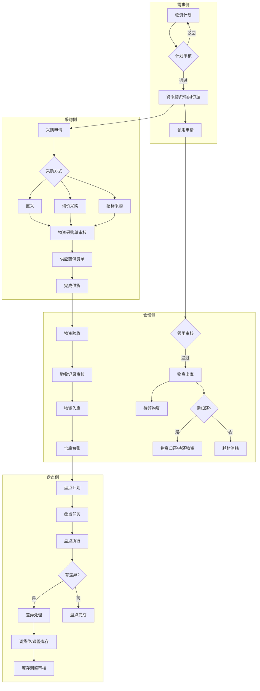

### 2.2 子业务流程 — 采购到入库


### 2.3 子业务流程 — 领用到归还

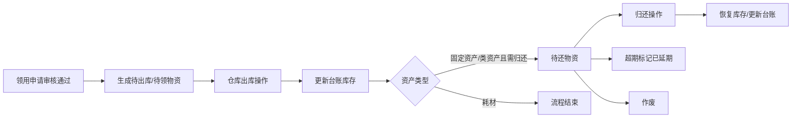

### 2.4 子业务流程 — 库场盘点

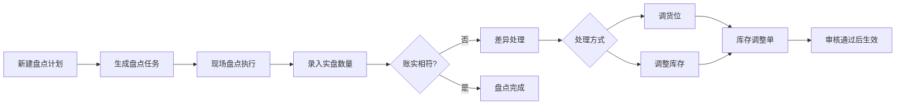

### 2.5 用户交互流程 — 采购人员发起计划采购

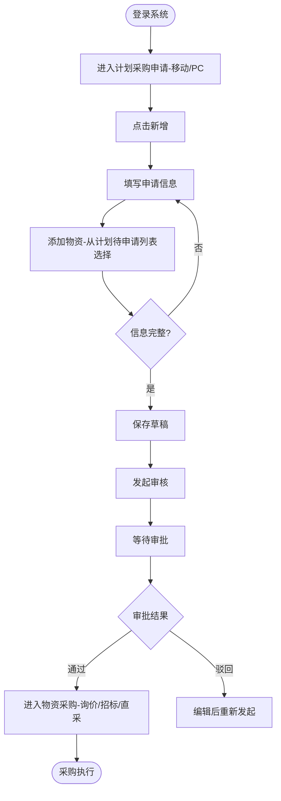

### 2.6 用户交互流程 — 仓库管理员验收入库

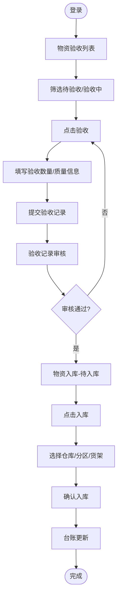

### 2.7 流程状态机 — 通用审批单（计划/领用/采购申请等）

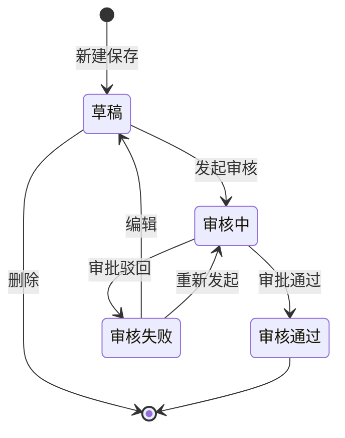

### 2.8 流程状态机 — 物资验收

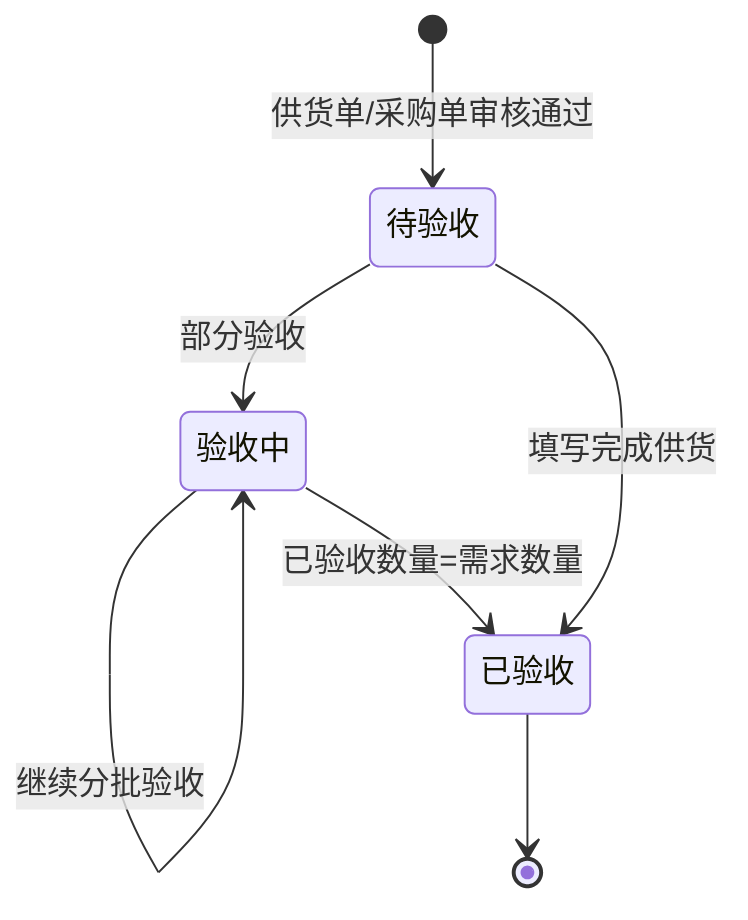

### 2.9 流程状态机 — 物资入库/出库

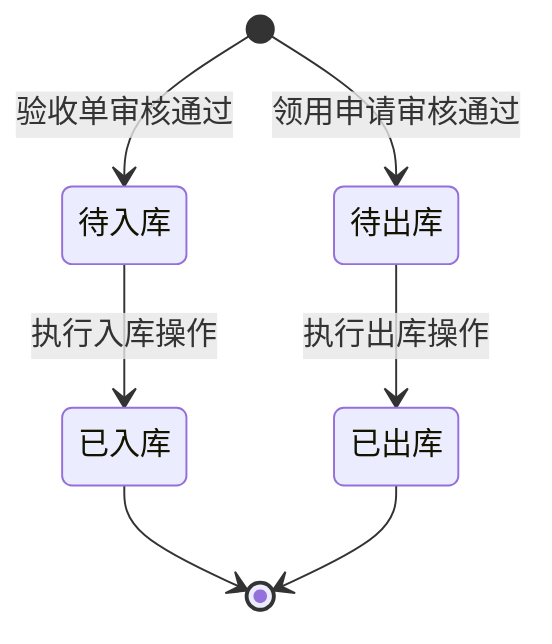

### 2.10 流程状态机 — 物资归还

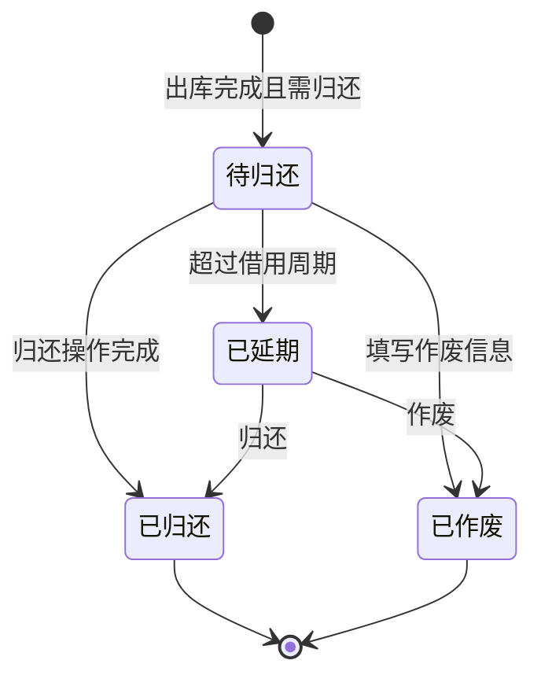

### 2.11 流程状态机 — 盘点与差异

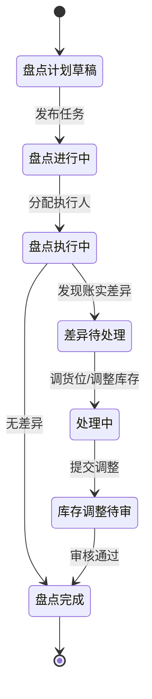

### 2.12 系统数据流转时序图 — 采购入库

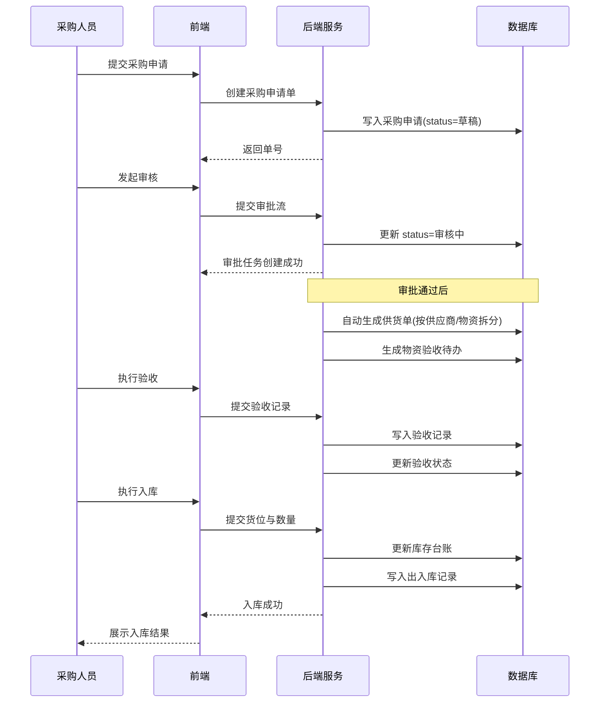

### 2.13 系统数据流转时序图 — 领用出库

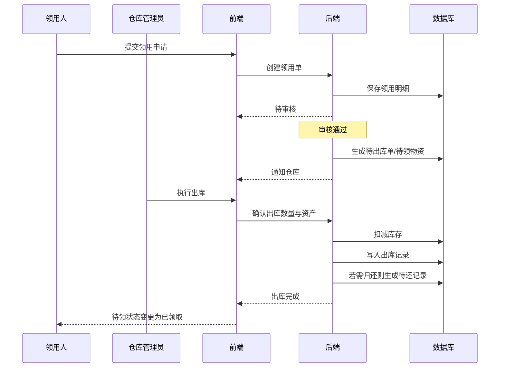

---

## 3. 功能模块总览

### 3.1 物资台账

**一级概述**：提供仓库物资库存的全局视图与历史流水查询，是仓储管理的数据中枢。

#### 3.1.1 仓库台账

| 维度 | 说明 |
|------|------|
| 功能介绍 | 按仓库树形结构展示物资存放位置与库存数量，支持查看详情与下载二维码。 |
| 前置条件 | 用户已登录；系统中已有仓库配置；物资至少完成过一次入库。 |
| 数据权限 | 仓库管理员可见分管仓库；系统管理员可见全部；普通领用人仅可查看（无编辑）。 |
| 页面跳转 | 左侧树点击仓库节点刷新右侧列表；点击「查看」跳转对应物资详情页；下载二维码触发文件下载，停留当前页。 |

**业务规则**：
- 左侧目录树层级：仓库 → 分区 → 货架
- 右侧列表为出入库生成的物资台账，按物资编码增序（或变动时间降序）排列
- 搜索：物资大类、物资子类、物资编码、物资名称
- 筛选：入库时间、变动时间
- 字段：入库时间为该类物资首次入库时间；变动时间为最后一次变动时间

#### 3.1.2 出入库记录

| 维度 | 说明 |
|------|------|
| 功能介绍 | 汇总展示所有物资出入库操作流水，便于审计与追溯。 |
| 前置条件 | 系统中已有出入库操作记录。 |
| 数据权限 | 仓库管理员、系统管理员可查看全部；领用人可查看与本人相关的出库记录。 |
| 页面跳转 | 点击「查看」：入库记录跳转物资入库详情，出库记录跳转物资出库详情。 |

**业务规则**：按出入库操作时间降序；搜索物资编码、物资名称；筛选操作时间。

---

### 3.2 我的物资

**一级概述**：面向领用人的个人物资视图，聚焦待领取与待归还状态。

#### 3.2.1 待领物资

| 维度 | 说明 |
|------|------|
| 功能介绍 | 展示当前用户已通过审核、尚未完成出库领取的物资明细。 |
| 前置条件 | 领用申请已审核通过；尚未完成出库。 |
| 数据权限 | 普通用户仅查看本人申请衍生的记录；管理员可查看全部。 |
| 页面跳转 | 仅支持「查看」，跳转领用/出库关联详情页。 |

**状态**：待领取（审核通过）→ 已领取（出库完成）

#### 3.2.2 待还物资

| 维度 | 说明 |
|------|------|
| 功能介绍 | 展示需归还且尚未完成归还的资产明细，含超期提醒。 |
| 前置条件 | 出库完成且物资属性为需归还的资产。 |
| 数据权限 | 普通用户查看本人借出资产；管理员查看全部。 |
| 页面跳转 | 「查看」跳转归还关联详情；可引导至物资归还模块执行归还。 |

**状态**：待归还 → 已延期（超借用周期）→ 已归还 / 已作废

---

### 3.3 物资申请

**一级概述**：管理物资需求计划与领用申请，是采购与出库的前置环节。

#### 3.3.1 物资计划

| 维度 | 说明 |
|------|------|
| 功能介绍 | 编制物资需求计划，审核通过后驱动待采物资与领用依据。 |
| 前置条件 | 用户已登录；物资清单主数据已配置。 |
| 数据权限 | 编制人可增删改本人草稿；审批人可审核；管理员全量。 |
| 页面跳转 | 「新增」→ 新增物资计划；「选择物资清单」→ 选择页；审核通过后返回列表。 |

**功能（按状态）**：
- 未发起审核/审核失败：查看、编辑、发起审核、删除
- 审核中：查看、审核
- 审核通过：查看

**计划类型**：
- **一般计划**：审核通过后作为领用依据；**不**生成待采物资
- **急件计划**：审核通过后按物资行拆分生成待采物资（见第 12 章）

**特殊字段**：最早需求日期 = min(物资.需求日期)

#### 3.3.2 领用申请

| 维度 | 说明 |
|------|------|
| 功能介绍 | 发起物资领用请求，审核通过后自动生成出库待办。 |
| 前置条件 | 可选关联已审核通过的物资计划；库存充足（出库时校验）。 |
| 数据权限 | 申请人操作本人单据；仓库管理员可查看全部待出库关联单。 |
| 页面跳转 | 「新增」→ 新增页 → 添加物资；提交后回列表；审核通过后待领物资/物资出库可见。 |

**搜索**：领用申请单号、计划单号  
**筛选**：申请事由、申请时间、审批状态

---

### 3.4 采购管理

**一级概述**：覆盖从待采识别到采购申请执行的全流程，支持直采、询价、招标。**采购三条路径决策见第 12 章。**

#### 3.4.1 消息中心

| 维度 | 说明 |
|------|------|
| 功能介绍 | 集中展示审批待办、供货提醒、盘点通知等系统消息。 |
| 前置条件 | 用户已登录。 |
| 数据权限 | 仅查看与当前用户相关的消息。 |
| 页面跳转 | 点击消息条目跳转对应业务单据详情页。 |

#### 3.4.2 待采物资

| 维度 | 说明 |
|------|------|
| 功能介绍 | 急件计划审核通过后形成的待采购物资清单，驱动急件采购申请。 |
| 前置条件 | 关联急件物资计划已审核通过。 |
| 数据权限 | 采购人员、管理员可见。 |
| 页面跳转 | 「申请」→ 采购申请-急件申请-申请页（预填物资）。 |

**状态**：待申请 → 已申请（急件采购申请审核通过）

#### 3.4.3 采购申请

| 维度 | 说明 |
|------|------|
| 功能介绍 | 管理急件采购申请，审核通过后进入供货与验收环节。 |
| 前置条件 | 来自待采物资或手工新建。 |
| 数据权限 | 采购人员维护；审批人审核。 |
| 页面跳转 | 新增/编辑/申请子页；审核通过后跳转供应商供货单或物资验收。 |

**说明**：列表为急件采购申请，按添加时间降序；编辑时申请单号、采购总额不可改。

#### 3.4.4 计划采购申请（移动端为主）

| 维度 | 说明 |
|------|------|
| 功能介绍 | 计划性采购申请，支持直采、询价/招标物资选择与提交。 |
| 前置条件 | 用户已登录移动端或 PC；物资清单可用。 |
| 数据权限 | 采购人员操作。 |
| 页面跳转 | 添加物资 → 直采/询价招标页；提交审核后回列表。 |

#### 3.4.5 物资采购

| 维度 | 说明 |
|------|------|
| 功能介绍 | 计划采购审核通过后的询价/招标/直采执行模块。 |
| 前置条件 | 计划采购申请已审核通过。 |
| 数据权限 | 采购人员、审批人按流程权限操作。 |
| 页面跳转 | 「采购」→ 询价-采购/招标-采购/直采-采购子页。 |

**子模块**：
- **直采-采购**：指定供应商直接采购
- **询价-采购**：发起询价，状态：待询价 → 已询价
- **招标-采购**：招标流程采购

#### 3.4.6 供应商供货单

| 维度 | 说明 |
|------|------|
| 功能介绍 | 采购单审核通过后按供应商/物资自动拆分，跟踪供货进度。 |
| 前置条件 | 采购申请单或采购单（询价/招标）已审核通过。 |
| 数据权限 | 采购、仓库、管理员可见。 |
| 页面跳转 | 「完成供货」→ 完成供货页；完成后驱动物资验收。 |

**状态**：待供货 → 供货中（部分供货）→ 已供货

---

### 3.5 物资管理

**一级概述**：仓储作业核心模块，连接验收、入库、出库、归还、退货。

#### 3.5.1 物资验收

| 维度 | 说明 |
|------|------|
| 功能介绍 | 对供应商供货进行分批次验收，支持部分验收与完成供货。 |
| 前置条件 | 供货单已生成；采购/供货单审核通过。 |
| 数据权限 | 验收人员、仓库管理员操作。 |
| 页面跳转 | 「验收」→ 验收操作页；「完成供货」→ 完成供货页（同供货单模块）。 |

**状态**：待验收 → 验收中 → 已验收

#### 3.5.2 验收记录

| 维度 | 说明 |
|------|------|
| 功能介绍 | 每次验收操作的记录明细，1 个供货单可对应多个验收单。 |
| 前置条件 | 已执行至少一次验收操作。 |
| 数据权限 | 验收、仓库、管理员可查看；审批人可审核。 |
| 页面跳转 | 查看详情；审核通过后触发待入库。 |

#### 3.5.3 物资入库

| 维度 | 说明 |
|------|------|
| 功能介绍 | 验收审核通过后执行入库，指定货位并更新台账。 |
| 前置条件 | 验收单审核通过。 |
| 数据权限 | 仓库管理员操作。 |
| 页面跳转 | 「入库」→ 入库页（选仓库/分区/货架）；完成后回列表。 |

**状态**：待入库 → 已入库

#### 3.5.4 物资出库

| 维度 | 说明 |
|------|------|
| 功能介绍 | 领用申请审核通过后按物资拆分出库，扣减库存。 |
| 前置条件 | 领用申请审核通过；库存充足。 |
| 数据权限 | 仓库管理员操作。 |
| 页面跳转 | 「出库」→ 按类型分固定资产/类资产/耗材出库页。 |

**状态**：待出库 → 已出库

**库存规则**：审核通过后预留库存；出库分配策略见 **第 11 章**。

#### 3.5.5 物资归还

| 维度 | 说明 |
|------|------|
| 功能介绍 | 管理需归还资产的归还、延期与作废。 |
| 前置条件 | 出库完成且物资需归还。 |
| 数据权限 | 仓库管理员操作；领用人可查看本人待还。 |
| 页面跳转 | 「归还」→ 归还页；「作废」→ 作废页。 |

**作废规则**：作废后资产 status=已作废，不恢复库存，写入 scrap 审计（见 11.5）。

#### 3.5.6 物资退货

| 维度 | 说明 |
|------|------|
| 功能介绍 | 记录向供应商退货或验收不合格退库场景。 |
| 前置条件 | 存在可退的供货/验收/库存记录；退货数量 ≤ 可退数量。 |
| 数据权限 | 仓库管理员、采购人员创建；仓库负责人审核（V1.0 简化为管理员审核）。 |
| 页面跳转 | 新增退货 → 新增退货页；审核通过后更新库存/验收状态。 |

**状态机**：

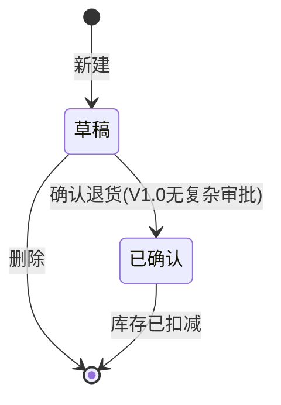

**库存影响**：
- **退供应商**：扣减库存台账，写入出入库记录（类型=退货出库），关联供货单
- **验收不合格**：未入库则减少待入库数量；已入库则扣减库存

**功能（V1.0）**：查看、编辑、删除（仅草稿）

### 3.6 供应商管理

**一级概述**：维护供应商主数据与绩效评价。

#### 3.6.1 供应商列表

| 维度 | 说明 |
|------|------|
| 功能介绍 | 管理供应商档案，含供货状态。 |
| 前置条件 | 用户具有供应商管理权限。 |
| 数据权限 | 采购、管理员可维护。 |
| 页面跳转 | 「新增」→ 新增供应商；「添加供应商」用于采购场景快速关联。 |

#### 3.6.2 供应商评价

| 维度 | 说明 |
|------|------|
| 功能介绍 | 记录供应商绩效评价，支持审批流。 |
| 前置条件 | 供应商已存在；评价指标与权重已配置。 |
| 数据权限 | 评价人创建；审批人审核。 |
| 页面跳转 | 「新增评价」→ 新增评价页；可「添加供应商」关联。 |

---

### 3.7 基础配置

**一级概述**：系统主数据与规则配置，支撑全业务运行。

#### 3.7.1 计量单位

维护物资计量单位；支持添加计量单位子页。

#### 3.7.2 分类管理

维护物资大类（固定资产/类资产/耗材）与物资子类层级。

**子类继承与特有属性（来自原型）**：

| 属性 | 说明 | 固定资产/类资产 | 耗材 |
|------|------|-----------------|------|
| 计量单位 | 默认继承父级，可改 | ✓ | ✓ |
| 盘点类型 | 多选，默认继承父级 | ✓ | ✓ |
| 是否归还 | 默认继承父级；类资产/固定资产可配置 | ✓ | 默认否 |
| 借用周期（天） | 子级不得大于父级；出库后计算归还 deadline | ✓ | — |
| 库存上限 | 子级不得大于父级 | 类资产/耗材 | ✓ |
| 库存下限 | 预警用（V1.0 仅展示，不自动补货） | 可选 | ✓ |

**删除约束**：已被物资清单引用的分类不可删除，仅可停用。

#### 3.7.3 验收标准

配置各类物资验收标准规则。

#### 3.7.4 物资清单

维护可采购/可领用的物资目录，分资产类与耗材类。

#### 3.7.5 仓库配置

维护仓库、分区、货架三级结构（新增仓库/分区/货架子页）。

#### 3.7.6 使用地点

维护物资使用地点，支撑场外资产定位。

#### 3.7.7 评价设置

- **权重设置**：评价指标及权重
- **评价等级设置**：等级与评分区间对应

| 通用维度 | 说明 |
|----------|------|
| 前置条件 | 系统管理员角色 |
| 数据权限 | 仅管理员可编辑 |
| 页面跳转 | 列表页 ↔ 新增/编辑弹窗或子页 |

---

### 3.8 规划内容（物资列表）

**一级概述**：按场内/场外维度汇总物资分布，用于规划与统计。

#### 3.8.1 场内

展示仓库内物资存放位置与数量，按物资编码增序。

#### 3.8.2 场外

展示仓库外资产使用地点与数量；**仅含资产，不含耗材**。

---

### 3.9 库场盘点（PC + 移动）— V1.0 暂不实施

> **本期不做**：库场盘点及差异处理相关能力列入后续版本，详见 **Out of Scope**。以下章节保留供后续迭代参考。

**一级概述**：支持定期/专项盘点，处理账实差异并调整库存。**盘点范围、冻结、差异分类详见第 13 章。**

#### 3.9.1 盘点计划

| 维度 | 说明 |
|------|------|
| 功能介绍 | 创建盘点计划（如日常盘点、年中盘点），作为任务源头。 |
| 前置条件 | 仓库台账有数据；用户有盘点权限。 |
| 数据权限 | 仓库管理员、管理员。 |
| 页面跳转 | 「新增」→ 新增盘点计划页。 |

#### 3.9.2 盘点任务

| 维度 | 说明 |
|------|------|
| 功能介绍 | 由计划分解的具体执行任务，分配执行范围与人员。 |
| 前置条件 | 盘点计划已发布。 |
| 数据权限 | 执行人可见分配任务；管理员全部。 |
| 页面跳转 | 「查看」→ 查看页（展示计划+任务信息）。 |

#### 3.9.3 盘点执行

| 维度 | 说明 |
|------|------|
| 功能介绍 | 现场录入实盘数量，对比系统库存。 |
| 前置条件 | 盘点任务已下发。 |
| 数据权限 | 执行人操作分配任务。 |
| 页面跳转 | 发现差异 → 差异处理。 |

#### 3.9.4 差异处理

| 维度 | 说明 |
|------|------|
| 功能介绍 | 对盘点差异物资进行处置决策。 |
| 前置条件 | 盘点执行存在账实不符记录。 |
| 数据权限 | 仓库管理员。 |
| 页面跳转 | 「调货位」→ 调货位页；「调整库存」→ 调整库存页。 |

#### 3.9.5 库存调整

| 维度 | 说明 |
|------|------|
| 功能介绍 | 差异处理后的库存/货位调整单，需审核后生效。 |
| 前置条件 | 已完成差异处理并提交调整。 |
| 数据权限 | 仓库管理员提交；审批人审核。 |
| 页面跳转 | 审核通过后更新仓库台账。 |

---

### 3.10 移动端专项

#### 3.10.1 资产确认

| 维度 | 说明 |
|------|------|
| 功能介绍 | 现场扫码/列表确认资产，支持新增账外资产。 |
| 前置条件 | 移动端登录；可选关联盘点或专项确认任务。 |
| 数据权限 | 现场执行人员。 |
| 页面跳转 | 确认条目 → 详情；提交后同步台账。 |

**账外资产规则（V1.0）**：
- 新增账外资产须填写资产名称、分类、使用地点、数量/编码等必填项
- 提交后生成「资产确认单」，状态为**待审核**
- 审核通过后写入仓库台账（场外或指定仓库），未审核前不计入正式库存
- 账外资产须关联确认人与确认时间，进入操作审计

---

### 3.11 工作台

**一级概述**：登录后默认首页，聚合待办、预警与关键指标，缩短跨模块跳转路径。

| 维度 | 说明 |
|------|------|
| 功能介绍 | 展示当前用户待办事项、库存/归还预警及快捷入口。 |
| 前置条件 | 用户已登录。 |
| 数据权限 | 待办按角色+数据范围过滤；统计卡片按可见仓库汇总。 |
| 页面跳转 | 待办卡片点击跳转对应业务列表并带筛选条件。 |

**待办卡片（按角色可见）**：

| 卡片 | 数据来源 | 跳转 |
|------|----------|------|
| 待审批 | 各模块 status=审核中 且当前用户为审批人 | 对应单据详情 |
| 待采物资 | 待采物资 status=待申请 | 待采物资 |
| 待供货 | 供货单 status=待供货/供货中 | 供应商供货单 |
| 待验物资 | 验收 status=待验收/验收中 | 待验物资 / 物资验收 |
| 待入库 | 入库 status=待入库 | 物资入库 |
| 待出库 | 出库 status=待出库 | 物资出库 |
| 待还超期 | 归还 status=已延期 | 待还物资 |
| 盘点任务 | 分配给当前用户的进行中任务 | 盘点执行 |

**统计卡片（V1.0）**：库存物资种类数、本月出入库笔数、待还超期数量、进行中盘点计划数。

---

### 3.12 待验物资

**一级概述**：以验收人员视角聚合验收待办，与「物资验收」列表数据同源，侧重快捷入口。

| 维度 | 说明 |
|------|------|
| 功能介绍 | 汇总待验收、验收中的供货/验收单据，支持快速进入验收操作。 |
| 前置条件 | 供货单已生成且采购/供货审核通过。 |
| 数据权限 | 验收人员、仓库管理员可见；按仓库/供应商数据范围过滤（若配置）。 |
| 页面跳转 | 点击条目 → 物资验收详情 → 「验收」操作页。 |

**与物资验收关系**：
- 数据表与状态与 3.5.1 物资验收完全一致，**不单独维护业务状态**
- 待验物资 = 物资验收列表的「待验收 + 验收中」Tab 的聚合视图
- 工作台「待验物资」卡片数字与本文列表未读/待办数一致

---

### 3.13 流程配置

**一级概述**：配置各类单据的审批流程模板，与通用状态机（2.7）配合使用。

| 维度 | 说明 |
|------|------|
| 功能介绍 | 管理员配置计划/领用/采购/验收记录/库存调整等单据的审批链。 |
| 前置条件 | 系统管理员登录；组织架构与审批人已维护。 |
| 数据权限 | 仅系统管理员可编辑；普通用户只读不可见配置页。 |
| 页面跳转 | 列表 → 新增/编辑流程模板 → 保存后对新单据生效（已进行中单据不走新模板）。 |

**V1.0 支持的流程类型**：

| 流程编码 | 单据类型 | 默认审批链（V1.0 预置） |
|----------|----------|------------------------|
| WF-PLAN | 物资计划 | 编制人 → 部门负责人 → 物资管理部门 |
| WF-REQUISITION | 领用申请 | 申请人 → 部门负责人 → 仓库管理员 |
| WF-PURCHASE-URGENT | 急件采购申请 | 采购员 → 采购负责人 → 分管领导 |
| WF-PURCHASE-PLAN | 计划采购申请 | 采购员 → 采购负责人 → 分管领导 |
| WF-PROCURE | 物资采购（询价/招标/直采） | 采购员 → 采购负责人 |
| WF-ACCEPT-REC | 验收记录 | 验收员 → 仓库管理员 |
| WF-STOCK-ADJ | 库存调整 | 仓库管理员 → 物资管理部门 |

**配置项**：审批节点（串行）、节点审批人（指定角色/指定人员）、是否允许撤回（发起人，审核中且下一节点未处理时）、超时提醒（72h 未处理发消息）。

**V1.0 不支持**：并行会签、条件分支（按金额路由）、加签/转办（列入 V1.1）。

---

## 4. 用户交互路径（User Flows）

### 4.1 UF-01 急件采购全链路

```
物资计划(编制) → 审核通过 → 待采物资(待申请) → 采购申请(急件) → 审核通过
→ 供应商供货单 → 完成供货 → 物资验收 → 验收记录审核 → 物资入库 → 仓库台账
```

### 4.2 UF-02 计划采购（询价）全链路

```
计划采购申请(移动/PC) → 审核通过 → 物资采购-询价 → 询价审核通过
→ 供货单 → 验收 → 入库 → 台账
```

### 4.3 UF-03 领用出库全链路

```
领用申请 → 审核通过 → 待领物资 + 物资出库(待出库) → 出库操作
→ 待领变已领取 → [若需归还] 待还物资 → 物资归还
```

### 4.4 UF-04 盘点差异闭环

```
盘点计划 → 盘点任务 → 盘点执行 → 差异处理 → 调货位/调整库存 → 库存调整审核 → 台账更新
```

### 4.6 UF-06 直采最短路径

```
计划采购申请(直采) → 审核通过 → 物资采购-直采 → 审核通过 → 供货单 → 验收 → 入库
```

### 4.7 UF-07 招标采购全链路

```
计划采购申请 → 审核通过 → 物资采购-招标 → 审核通过 → 供货单 → 分批验收 → 入库
```

### 4.8 UF-08 归还作废与库存

```
出库(需归还资产) → 待归还 → [超期] 已延期 → 作废(填写作废原因)
→ 资产状态=已作废，不恢复库存，记录损耗审计
或：待归还 → 归还 → 库存恢复至原仓库/默认仓库
```

---

## 5. 页面清单与跳转关系

### 5.1 PC 端页面清单

| 模块 | 页面名称 | 类型 | 跳转关系 |
|------|----------|------|----------|
| 物资台账 | 仓库台账 | 列表 | → 查看详情 |
| 工作台 | 工作台 | 首页 | → 各待办模块 |
| 物资台账 | 出入库记录 | 列表 | → 入库/出库查看 |
| 我的物资 | 待领物资 | 列表 | → 查看 |
| 我的物资 | 待还物资 | 列表 | → 查看 |
| 物资申请 | 物资计划 | 列表 | → 新增物资计划 → 选择物资清单 |
| 物资申请 | 领用申请 | 列表 | → 新增 → 添加物资 |
| 采购管理 | 消息中心 | 列表 | → 各业务详情 |
| 采购管理 | 待采物资 | 列表 | → 申请 |
| 采购管理 | 采购申请 | 列表 | → 申请/选择 |
| 采购管理 | 物资采购 | 列表 | → 直采/询价/招标采购 |
| 采购管理 | 供应商供货单 | 列表 | → 完成供货 |
| 物资管理 | 物资验收 | 列表 | → 验收/完成供货 |
| 物资管理 | 待验物资 | 列表 | → 物资验收 |
| 物资管理 | 验收记录 | 列表 | → 查看 |
| 物资管理 | 物资入库 | 列表 | → 入库/查看 |
| 物资管理 | 物资出库 | 列表 | → 固定资产/类资产/耗材出库 |
| 物资管理 | 物资归还 | 列表 | → 归还/作废/查看 |
| 物资管理 | 物资退货 | 列表 | → 新增退货 |
| 供应商 | 供应商列表 | 列表 | → 新增供应商 |
| 供应商 | 供应商评价 | 列表 | → 新增评价/添加供应商 |
| 基础配置 | 计量单位/分类/验收标准/物资清单/仓库配置/使用地点/评价设置 | 列表+表单 | 各新增子页 |
| 规划 | 场内/场外 | 列表 | 查看 |
| 盘点 | 盘点计划/任务/执行/差异处理/库存调整 | 列表+表单 | 调货位/调整库存 |
| 系统 | 流程配置 | 配置 | 审批流模板 |

### 5.2 移动端页面清单

| 页面 | 说明 |
|------|------|
| 资产确认 | 现场资产核对 |
| 计划采购申请 | 计划性采购入口 |
| 直采 / 询价招标 / 添加物资 | 采购子流程 |
| 盘点计划/任务/执行/差异/调整 | 移动盘点作业 |

### 5.3 全局导航结构（PC）

```
工作台
├── 物资台账（仓库台账、出入库记录）
├── 我的物资（待领、待还）
├── 物资申请（物资计划、领用申请）
├── 采购管理（消息、待采、采购申请、物资采购、供货单）
├── 物资管理（待验物资、验收、验收记录、入库、出库、归还、退货）
├── 供应商管理
├── 基础配置
├── 流程配置
└── 库场盘点
```

---

## 6. 非功能性需求

### 6.1 性能

| 指标 | 要求 |
|------|------|
| 列表页首屏加载 | ≤ 2s（1000 条以内数据） |
| 搜索/筛选响应 | ≤ 1s |
| 并发用户 | 支持 200 在线用户（项目级部署） |
| 移动端弱网 | 盘点/确认支持本地暂存，网络恢复后同步 |
| 扫码响应 | 资产确认/盘点扫码入库 ≤ 500ms（局域网） |
| 库存事务 | 出入库/调整强一致，台账列表查询可最终一致（≤ 3s） |

### 6.2 安全

- 全站 HTTPS 传输
- 登录态 Token 过期时间 8 小时，支持续期
- 操作审计：出入库、库存调整、审批、作废、账外资产确认等关键操作留痕
- 审计日志保留 ≥ 3 年
- 敏感字段（供应商联系方式等）按角色脱敏展示

### 6.3 可用性

- PC 端兼容 Chrome 90+、Edge 90+
- 移动端适配 iOS 14+、Android 10+ 浏览器
- 表单必填项明确标识（红色 *）
- 删除操作统一磁吸弹窗二次确认

### 6.4 可靠性

- 核心业务（入库、出库、库存调整）需事务保证，防止超卖
- 每日凌晨自动备份数据库
- 审批流异常支持管理员重试/撤回

### 6.5 扩展性

- 物资分类、审批流程、评价指标支持配置化扩展
- 预留与 ERP/财务系统对接 API（V1.0 可不实现）

### 6.6 数据导入导出

- 仓库台账、出入库记录支持 Excel 导出
- 物资清单、供应商列表支持 Excel 模板导入（V1.0 可选实现，优先级 P2）
- 二维码批量下载（仓库台账勾选后打包 ZIP）

---

## 7. 系统功能清单

| 一级模块 | 二级功能 | 功能概述 |
|----------|----------|----------|
| 物资台账 | 仓库台账 | 树形货位 + 库存列表，二维码下载 |
| 物资台账 | 出入库记录 | 出入库流水查询与详情 |
| 我的物资 | 待领物资 | 待领取/已领取状态跟踪 |
| 我的物资 | 待还物资 | 待还/延期/已还/作废跟踪 |
| 物资申请 | 物资计划 | 需求计划编制与审批 |
| 物资申请 | 领用申请 | 领用申请与审批 |
| 采购管理 | 消息中心 | 系统通知与待办 |
| 采购管理 | 待采物资 | 急件待采购清单 |
| 采购管理 | 采购申请 | 急件采购申请 |
| 采购管理 | 计划采购申请 | 计划性采购（移动） |
| 采购管理 | 物资采购 | 直采/询价/招标执行 |
| 采购管理 | 供应商供货单 | 供货进度管理 |
| 物资管理 | 物资验收 | 分批验收 |
| 物资管理 | 验收记录 | 验收明细与审核 |
| 物资管理 | 物资入库 | 货位入库 |
| 物资管理 | 物资出库 | 分类出库 |
| 物资管理 | 物资归还 | 归还/作废 |
| 物资管理 | 物资退货 | 退货登记 |
| 供应商管理 | 供应商列表 | 供应商档案 |
| 供应商管理 | 供应商评价 | 绩效评价 |
| 基础配置 | 计量单位 | 单位主数据 |
| 基础配置 | 分类管理 | 大类/子类 |
| 基础配置 | 验收标准 | 验收规则 |
| 基础配置 | 物资清单 | 物资目录 |
| 基础配置 | 仓库配置 | 仓库/分区/货架 |
| 基础配置 | 使用地点 | 场外地点 |
| 基础配置 | 评价设置 | 权重/等级 |
| 规划内容 | 场内/场外 | 物资分布视图 |
| 库场盘点 | 盘点计划 | 计划管理 |
| 库场盘点 | 盘点任务 | 任务分解 |
| 库场盘点 | 盘点执行 | 现场盘点 |
| 库场盘点 | 差异处理 | 差异处置 |
| 库场盘点 | 库存调整 | 调整审核 |
| 工作台 | 首页待办 | 待办聚合与统计 |
| 物资管理 | 待验物资 | 验收待办视图 |
| 系统 | 流程配置 | 审批流模板 |
| 移动端 | 资产确认 | 现场资产核对 |

---

## 8. 权限与数据范围矩阵

### 8.1 功能权限矩阵（菜单/操作）

| 功能模块 | 系统管理员 | 仓库管理员 | 采购人员 | 计划编制人 | 领用人 | 验收人员 | 审批人 |
|----------|:----------:|:----------:|:--------:|:----------:|:------:|:--------:|:------:|
| 工作台 | ✓ | ✓ | ✓ | ✓ | ✓ | ✓ | ✓ |
| 仓库台账-查看 | ✓ | ✓ | ✓ | ✓ | ✓ | ✓ | ✓ |
| 仓库台账-二维码 | ✓ | ✓ | — | — | — | — | — |
| 出入库记录 | ✓ | ✓ | — | — | 本人相关 | ✓ | — |
| 待领/待还物资 | ✓ | ✓ | — | — | ✓ | — | — |
| 物资计划-编制 | ✓ | — | — | ✓ | — | — | — |
| 物资计划-审核 | ✓ | — | — | — | — | — | ✓ |
| 领用申请-编制 | ✓ | — | — | — | ✓ | — | — |
| 领用申请-审核 | ✓ | ✓ | — | — | — | — | ✓ |
| 待采/采购申请 | ✓ | — | ✓ | — | — | — | ✓ |
| 物资采购/供货单 | ✓ | ✓ | ✓ | — | — | — | ✓ |
| 待验/验收/入库 | ✓ | ✓ | — | — | — | ✓ | ✓ |
| 出库/归还/退货 | ✓ | ✓ | — | — | — | — | — |
| 供应商管理 | ✓ | — | ✓ | — | — | — | — |
| 基础配置/流程配置 | ✓ | — | — | — | — | — | — |
| 盘点全模块 | ✓ | ✓ | — | — | — | — | ✓ |
| 资产确认(移动) | ✓ | ✓ | — | — | — | ✓ | — |

> ✓=可用，—=不可用，「本人相关」=仅关联本人的出库流水。

### 8.2 数据范围规则

| 角色 | 列表数据范围 | 说明 |
|------|--------------|------|
| 系统管理员 | 全部 | 含所有仓库、所有单据 |
| 仓库管理员 | 分管仓库 | 用户档案绑定 warehouse_ids；台账/入出库/盘点仅限这些仓库 |
| 采购人员 | 全部采购域单据 | 采购/供货/待采；不含他人领用单 |
| 计划编制人 | 本人计划 | plan.created_by = 当前用户 |
| 领用人 | 本人申请及衍生 | requisition.created_by = 当前用户 |
| 验收人员 | 全部验收单 | V1.0 不按仓库限制；V1.1 可收紧 |
| 审批人 | 待办+已办 | 审批任务分配到的单据 |

---

## 9. 数据模型与字段字典

### 9.1 实体关系（ER 概览）

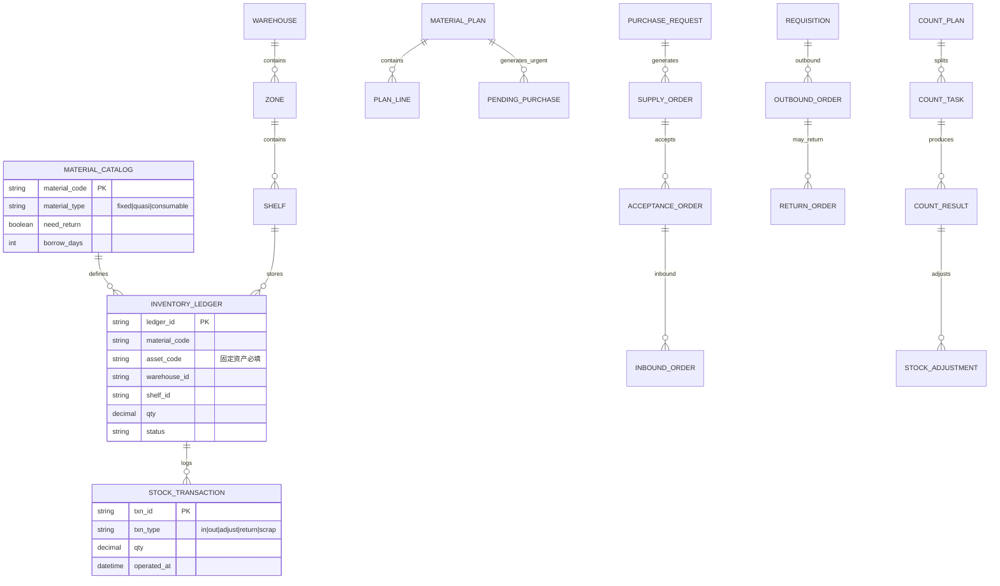

### 9.2 库存模型说明

| 物资类型 | 台账粒度 | 库存表记录方式 | 货位 |
|----------|----------|----------------|------|
| 固定资产 | 单个资产 | 1 资产 1 行，qty=1，asset_code 唯一 | 必填 |
| 类资产 | 物资编码+货位 | 同编码同货位可合并数量 | 必填 |
| 耗材 | 物资编码+货位 | 数量型，允许多批次合并为一条（V1.0） | 必填 |

**V1.0 说明**：耗材暂不启用独立批次表，按「物资编码 + 仓库 + 分区 + 货架」唯一键汇总数量；固定资产必须独立 asset_code。

### 9.3 核心单据链

```
物资计划 → [急件]待采物资 → 采购申请 → 供货单 → 验收单 → 入库单 → 台账
                ↘ 计划采购申请 → 物资采购单 ↗

领用申请 → 出库单 → 台账扣减 → [可选]归还单 → 台账恢复
```

### 9.4 核心字段字典（节选）

| 实体 | 字段 | 类型 | 必填 | 说明 |
|------|------|------|:----:|------|
| 物资计划 | plan_no | string | ✓ | 计划单号，系统生成，不可编辑 |
| 物资计划 | plan_type | enum | ✓ | 一般计划 / 急件计划 |
| 物资计划 | status | enum | ✓ | 草稿/审核中/审核通过/审核失败 |
| 采购申请 | request_no | string | ✓ | 申请单号 |
| 采购申请 | total_amount | decimal | ✓ | 采购总额，编辑时不可改 |
| 领用申请 | requisition_no | string | ✓ | 领用申请单号 |
| 库存台账 | asset_code | string | 条件 | 固定资产必填，全局唯一 |
| 库存台账 | qty | decimal | ✓ | 固定资产恒为 1 |
| 出库单 | outbound_no | string | ✓ | 出库单号 |
| 归还单 | due_date | date | 条件 | = 出库日 + 借用周期 |
| 归还单 | status | enum | ✓ | 待归还/已延期/已归还/已作废 |
| 盘点计划 | freeze_stock | boolean | ✓ | 是否冻结范围内出入库，默认 true |

---

## 10. 三类物资全链路业务规则

| 环节 | 固定资产 | 类资产 | 耗材 |
|------|----------|--------|------|
| 物资计划 | 可计划，按件数 | 可计划，按数量 | 可计划，按数量 |
| 急件→待采 | 急件计划审核后进入 | 同左 | 同左 |
| 验收入库 | 每件生成唯一 asset_code，打印二维码 | 按数量入库，物资编码标识 | 按数量入库 |
| 台账 | 1 资产 1 行，qty=1 | 1 编码 1 行（可合并货位） | 数量型 |
| 领用出库 | 必须指定 asset_code 出库 | 指定数量，可选具体货位 | 指定数量，FIFO 扣减 |
| 是否归还 | 分类配置「归还=是」则强制 | 同左 | 默认否，不生成归还 |
| 借用周期 | 分类/子类配置（天） | 同左 | — |
| 盘点 | 按 asset_code 逐件盘 | 按编码+货位盘数量 | 按编码+货位盘数量 |
| 退货 | 按 asset_code 退 | 按数量退 | 按数量退 |
| 场外视图 | 出现在场内/场外 | 同左 | 仅场内，不出现在场外列表 |

**「需归还」判定优先级**：物资子类「是否归还」配置 > 物资清单实例覆盖（若允许）> 领用时不可改。

---

## 11. 库存管理规则

### 11.1 库存预留（锁定）

| 时机 | 规则 |
|------|------|
| 领用申请审核通过 | 按申请明细**预留**库存（available → locked） |
| 出库完成 | 预留转为实际扣减（locked → 0，qty 减少） |
| 申请驳回/撤回 | 释放预留 |
| 采购验收入库 | 不预留，直接增加 available |

**校验**：可用库存 = 台账 qty − 已锁定 qty；出库/预留时 available ≥ 申请数量，否则阻断并提示。

### 11.2 出库分配策略

| 类型 | 策略 |
|------|------|
| 固定资产 | 人工选择 asset_code；仅 status=在库 的可选 |
| 类资产 | 默认指定货位；未指定则按**最早入库时间 FIFO**在同一仓库内分配 |
| 耗材 | FIFO 按货位维度扣减；允许单出库单拆多个货位行 |

### 11.3 入库货位规则

- 入库时必须选择 仓库/分区/货架
- 固定资产：每个 asset_code 独立一行，货位不可与另一在库资产冲突（同一 asset 仅一处）
- 类资产/耗材：同编码同货位可累加 qty

### 11.4 负库存与超发

- **固定资产/类资产**：禁止负库存
- **耗材**：V1.0 禁止负库存；出库数量不得大于可用+预留
- **部分出库**：允许，出库单 status=部分出库，剩余继续待出库
- **超发**：禁止；需修改领用申请并重新审批

### 11.5 作废对库存的影响

| 场景 | 库存影响 |
|------|----------|
| 归还作废 | 资产标记已作废，**不恢复**库存；写入 txn_type=scrap 审计 |
| 账实盘点盘亏 | 调整库存减少 qty，需审批 |
| 退货已确认 | 扣减 qty，写入退货出库流水 |

### 11.6 并发控制

- 出库/入库/调整对同一 ledger_id 或 asset_code 使用**乐观锁**（version 字段）
- 冲突时提示「库存已被其他人操作，请刷新后重试」

---

## 12. 采购路径决策

### 12.1 三条采购入口对照

| 路径 | 触发条件 | 入口页面 | 下游 |
|------|----------|----------|------|
| **A. 急件采购** | 物资计划 plan_type=**急件计划** 且审核通过 | 待采物资 → 采购申请 | 审核通过后 → 供货单 → 验收（**不经过**物资采购模块） |
| **B. 计划采购** | 用户主动新建计划采购申请 | 计划采购申请（计划申请 Tab） | 审核通过 → 物资采购（直采/询价/招标）→ 供货单 |
| **C. 计划采购-急件申请** | 用户在计划采购申请选「急件申请」Tab | 计划采购申请（急件申请 Tab） | 同 B，但采购方式通常为非招标急采 |

### 12.2 决策流程图

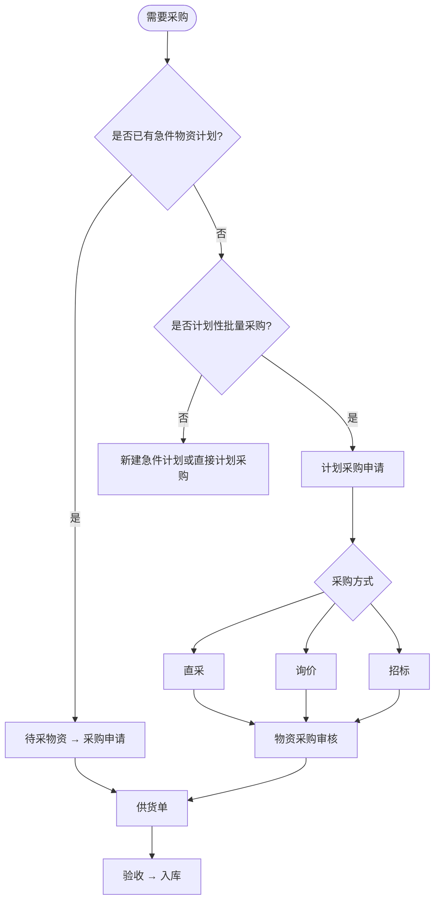

### 12.3 互斥与约束

- 同一物资计划行：**不可同时**存在于待采物资与计划采购申请明细（系统去重校验）
- 一般计划审核通过：**仅**作为领用依据，不生成待采物资
- 急件计划审核通过：自动生成待采物资，**不可**重复手工添加同一 plan_line
- 采购方式在计划采购申请时选定，后续物资采购模块只读展示

---

## 13. 盘点策略与差异处理

### 13.1 盘点范围

| 配置项 | 选项 |
|--------|------|
| 范围 | 全库 / 指定仓库 / 指定分区 / 指定货架 / 指定物资大类 |
| 方式 | 明盘（显示系统库存）/ 盲盘（V1.0 可选，默认明盘） |
| 冻结 | 默认**冻结**范围内出入库；冻结期间相关入库/出库按钮 disabled |

### 13.2 执行规则

- 固定资产：按 asset_code 逐项扫码或勾选确认
- 类资产/耗材：按货位录入实盘数量
- 移动端离线：本地缓存盘点结果，同步时以**服务端完成时间戳优先**；冲突项标记待人工复核

### 13.3 差异类型与处理方式

| 差异类型 | 定义 | 处理方式 |
|----------|------|----------|
| 盘盈 | 实盘 > 账存 | **调整库存** 增加 qty，需审批 |
| 盘亏 | 实盘 < 账存 | **调整库存** 减少 qty，需审批 |
| 货位不符 | 数量对但货位错 | **调货位**，总量不变，无需数量审批 |
| 资产状态异常 | 账上有但实物报废 | 调整库存 + 可选作废流程 |

### 13.4 调货位 vs 调整库存

```
差异处理
├── 仅货位错误 → 调货位（生成货位变更单，自动生效或轻量审核）
└── 数量不符 → 调整库存（生成库存调整单，必须审批后生效）
```

---

## 14. 异常场景与边界规则

### 14.1 验收异常

| 场景 | 处理 |
|------|------|
| 分批验收，累计 < 需求 | 保持验收中；可继续验收 |
| 累计 = 需求 | 自动变已验收，生成对应待入库 |
| 供应商提前结束供货（完成供货） | 未验收部分不再等待，按已供货数量关闭验收 |
| 验收不合格 | 合格数量入库；不合格走退货或减少待入库 |
| 验收标准校验 | 提交验收时读取 3.7.3 配置，不符合则警告或阻断（管理员可配置强度） |

### 14.2 入库/出库异常

| 场景 | 处理 |
|------|------|
| 验收 100，仅入库 60 | 允许部分入库；剩余保持待入库 |
| 领用 10，库存仅 8 | 审核通过后预留失败，提示仓库；出库时阻断 |
| 同一 asset 重复出库 | 第二次出库阻断，asset status=已出库 |

### 14.3 审批异常

- 发起人撤回：下一节点未处理时可撤回，状态回草稿
- 审批流配置变更：仅对新单生效
- 超时 72h：消息中心提醒，不自动通过

### 14.4 消息中心触发规则

| 消息类型 | 触发 |
|----------|------|
| 待审批 | 单据提交到当前用户 |
| 待入库/出库 | 上一环节完成 |
| 归还超期 | 每日批处理，due_date < today |
| 盘点任务分配 | 任务下发 |
| 库存下限预警 | 耗材 qty < 库存下限（V1.0 仅通知） |

---

## 15. 单据编号规则

| 单据 | 前缀 | 格式示例 | 重置 |
|------|------|----------|------|
| 物资计划 | JH | JH202606090001 | 按日 |
| 领用申请 | LY | LY202606090001 | 按日 |
| 采购申请 | CG | CG202606090001 | 按日 |
| 计划采购申请 | PC | PC202606090001 | 按日 |
| 物资采购单 | MC | MC202606090001 | 按日 |
| 供货单 | GH | GH202606090001 | 按日 |
| 验收单 | YS | YS202606090001 | 按日 |
| 入库单 | RK | RK202606090001 | 按日 |
| 出库单 | CK | CK202606090001 | 按日 |
| 归还单 | HK | HK202606090001 | 按日 |
| 盘点计划 | PD | PD202606090001 | 按日 |
| 库存调整 | TZ | TZ202606090001 | 按日 |
| 固定资产编码 | ZC | ZC{yyyyMMdd}{6位序} | 按日 |

**规则**：单号全局唯一；并发通过 DB 序列或 Redis INCR 生成；禁止手工修改。

---

## 16. 页面-状态-操作矩阵（核心）

| 页面 | 状态 | 可用操作 | 目标页面 |
|------|------|----------|----------|
| 物资计划 | 草稿/审核失败 | 查看、编辑、发起审核、删除 | 新增物资计划 |
| 物资计划 | 审核中 | 查看、审核 | 审核弹窗 |
| 物资计划 | 审核通过 | 查看 | — |
| 待采物资 | 待申请 | 查看、申请 | 采购申请-申请 |
| 待采物资 | 已申请 | 查看 | — |
| 采购申请 | 草稿/审核失败 | 查看、编辑、发起审核、删除 | 申请页 |
| 采购申请 | 审核中 | 查看、审核 | — |
| 采购申请 | 审核通过 | 查看 | 供货单 |
| 物资验收 | 待验收/验收中 | 查看、验收、完成供货 | 验收页 |
| 物资验收 | 已验收 | 查看 | — |
| 物资入库 | 待入库 | 查看、入库 | 入库页 |
| 物资入库 | 已入库 | 查看 | — |
| 物资出库 | 待出库 | 查看、出库 | 分类出库页 |
| 物资出库 | 已出库 | 查看 | — |
| 物资归还 | 待归还/已延期 | 查看、归还、作废 | 归还/作废页 |
| 物资归还 | 已归还/已作废 | 查看 | — |
| 库存调整 | 待审核 | 查看、审核 | — |
| 库存调整 | 已通过 | 查看 | — |

---

## 17. 附录

### 17.1 原型来源

本 PRD 基于 `axure/` 目录下 Axure RP 导出原型（V1.0.0）逆向整理，主要参考：
- `axure/data/document.js` 站点地图
- 各页面内嵌需求注释（列表/权限/功能/搜索/筛选规则）

### 17.2 后续迭代 backlog

1. 供应商外部门户与账号体系
2. 库间调拨、跨项目调拨
3. 审批流条件分支（按金额/类别路由）与会签
4. 财务系统 / 固定资产卡片对接
5. 安全库存自动补货、MRP
6. 耗材批次/效期管理

### 17.3 修订记录

| 版本 | 日期 | 说明 |
|------|------|------|
| V1.0.0 | 2026-06-09 | 基于 Axure 原型首次生成完整 PRD |
| V1.1.0 | 2026-06-09 | 补充权限矩阵、数据模型、库存规则、采购路径、盘点策略、异常场景、单据编号、核心操作矩阵；新增工作台/待验物资/流程配置模块 |
