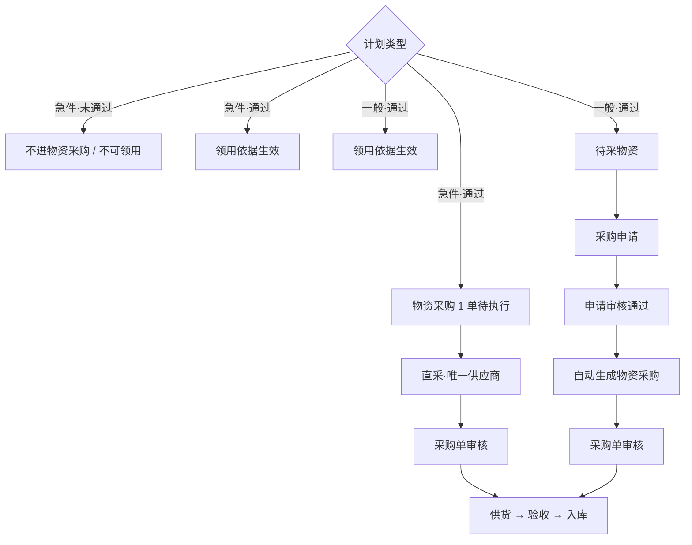
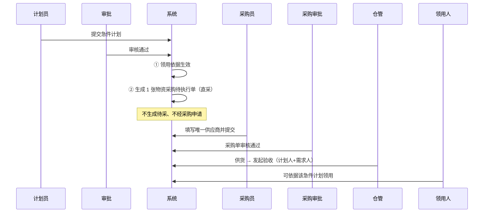
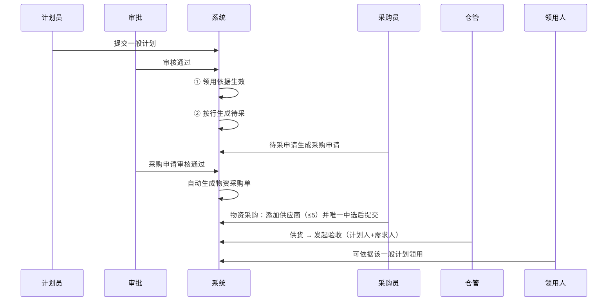
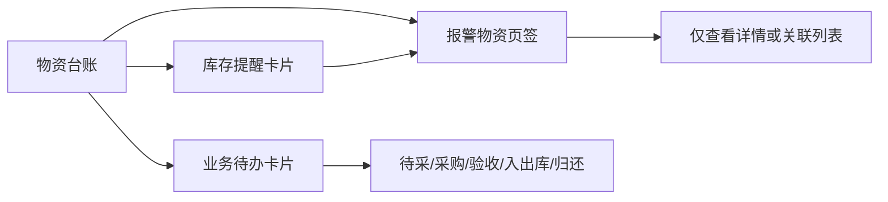
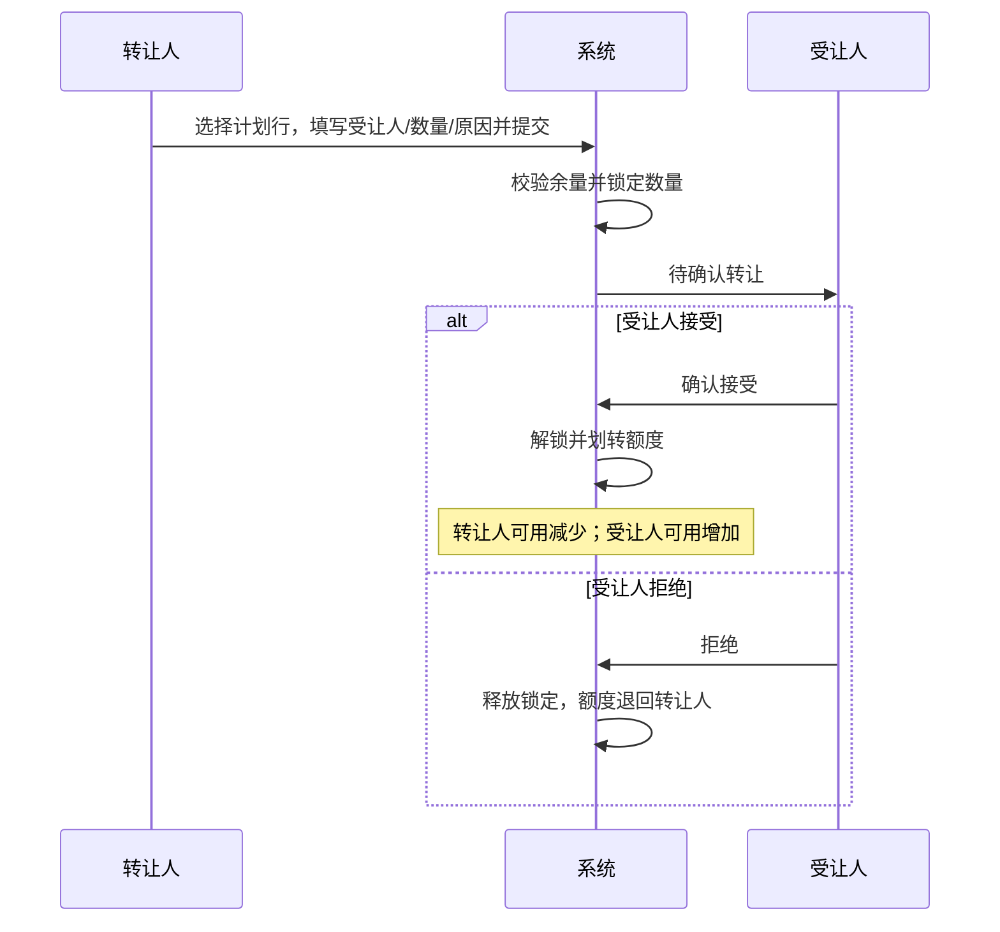
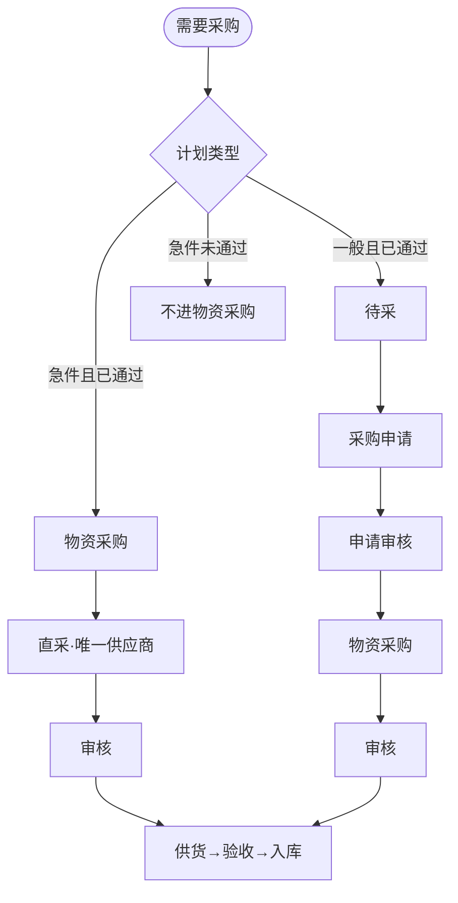

# 物资仓库管理系统（WMS）产品需求文档 · v1.0.1（增量）

| 属性 | 内容 |
|------|------|
| **版本号** | v1.0.1 |
| 产品版本 | V1.0.1 |
| **版本更新时间** | 2026-08-06 |
| **版本迭代说明** | 相对 **v1.0.0**：计划采购分流；计划物资额度转让；**工作台并入物资台账**；采购延期/使用周期/库存提醒与「报警物资」页签；分类与物资清单字段及列表精简；物资清单「规格型号」非必填 |
| 关联上一版本 | v1.0.0（基础业务）；与 v1.1.0（库外盘点）、v1.2.0（库内盘点）并行，互不替代 |
| 目标平台 | **仅 PC Web** |
| 文档形态 | **增量 PRD**（只写相对 v1.0.0 的变更；未声明处继承 v1.0.0） |
| 交互原型 | 采购分流、计划物资、物资台账（含业务待办/库存提醒/报警物资）相关页已绘 |
| 文档状态 | **增量需求与 PC 原型对齐修订** |

---

## 1. 结论前置

### 1.1 一句话

**急件/一般计划均可作领用依据且走各自采购路径；本期物资采购无手工新增。新增「计划物资」额度转让。工作台能力并入「物资台账」：顶部业务待办/库存提醒 +「报警物资」页签；分类与物资清单支持「使用周期」，用于使用延期判定。**

### 1.2 路径总览（收口）

| 分支 | 路径 | 优先级 |
|------|------|:------:|
| **一般计划** | 物资计划 → 待采物资 → 采购申请 → **物资采购** → 供货 → 物资验收 → 入库 | P0 |
| **急件计划** | 物资计划 → **物资采购** → 供货 → 物资验收 → 入库 | P0 |

### 1.3 相对 v1.0.0 对照

| 维度 | v1.0.0 | v1.0.1（本版） | 优先级 |
|------|--------|----------------|:------:|
| 急件计划 | 通过后进待采→采购申请 | **不进待采/不经采购申请**；审核通过后物资采购生成 **1** 张待执行单（一计划多明细）；默认**直采**；**1** 供应商；**需审核**；可领用 | P0 |
| 一般计划 | 仅领用依据 | 待采→采购申请→**物资采购**（可多供应商≤5、唯一中选）→供货→验收→入库；可领用 | P0 |
| 待采物资 | 仅急件 | **仅一般计划** | P0 |
| 物资采购 | 可手工新建；主要承接申请下游 | **急件 + 一般**均可进列表；急件=计划通过后自动；一般=**采购申请审核通过后自动**；**移除新增入口**；字段含计划类型、来源计划单号 | P0 |
| 供货/验收 | 采购通过后供货，仓管发起验收 | **仍保留**：仓管点供货后发起验收；**计划人与需求人一起验收** | P0 |
| 工作台 | 独立菜单看板 | **菜单删除**；能力并入**物资台账**顶部与「报警物资」页签 | P0 |
| 供货逾期/采购延期 | 工作台供货逾期 | 更名为**采购延期**；对象=物资计划；`当前日期 > 最早需求日`（当天不算）；跳转**待采物资** | P0 |
| 领用周期 | v1.0.0 部分表述为领用周期 | 本版统一为分类/清单字段**使用周期（天）**；报警名**使用延期** | P0 |
| 库存提醒 | 分散/弱化 | 物资台账顶部**库存提醒**：下限/安全库存/上限/使用延期 | P0 |

### 1.4 本版范围

| 分类 | 内容 | 优先级 |
|------|------|:------:|
| 本版本包含 | 计划分流；待采仅一般；采购申请下游进物资采购；急件直进物资采购；列表字段；供货验收协作；**计划物资（列表/转让/确认）**；**物资台账承接原工作台**；使用周期与使用延期；库存提醒；列表字段精简；**物资清单规格型号非必填** | P0 |
| 本版本不包含 | 物资采购手工新增；询价/招标新建；库外/库内盘点；移动端；转让联动缩减待采/采购；实物调拨；工作台独立菜单；台账汇总区「库场盘点/报废处置」卡片 | P0 |

### 1.5 已收口口径

| # | 结论 |
|---|------|
| 1 | 仍走 **供货→验收**：物资管理员发起验收前需点供货；验收由**计划人 + 需求人**共同参与 |
| 2 | 一般：采购申请**审核通过后自动**生成物资采购单 |
| 3 | 急件：需审核；**一计划一单多物资**；默认直采；**唯一**供应商 |
| 4 | 一般物资采购（直采页）：可添加供应商，**最多 5 个**；同一物资须且仅能有 **1** 个「已中选」 |
| 5 | 物资采购**移除新增入口**（禁止手工新建） |
| 6 | 急件/一般计划通过后**均可**作领用依据 |
| 7 | 急件未通过：不生成待采、不进物资采购、不可领用 |
| 8 | **计划物资**：转让标的=计划**领用额度（余量）**；提交即**锁定**；**受让人确认**后生效；受让人=**任何人**；允许**二次转让**；**不联动**待采/采购 |
| 9 | **工作台菜单删除**；业务待办+库存提醒置于**物资台账顶部**；异常明细并入页签**报警物资**（仅查看） |
| 10 | **采购延期**：统计物资计划；`当前日期 > 最早需求日`（当天不算）；卡片跳转**待采物资** |
| 11 | **急件待采购**卡片跳转**物资采购**（待执行）；一般待采/采购延期跳转**待采物资** |
| 12 | **使用周期（天）**：分类各级可配，继承上级可改；物资清单沿用分类默认值可改 |
| 13 | **使用延期**：`当前日期 − 入库完成日 > 物资使用周期`；进入报警物资 |
| 14 | **库存提醒**：下限、安全库存、上限、使用延期均报警；跳转「报警物资」并可带类型筛选 |
| 15 | 物资清单列表**不展示**当前库存、可用库存、预警列；仓库货架列表**不展示**每层承载量、总承载量、尺寸 |
| 16 | 物资清单新增/编辑：**规格型号非必填**；空值列表/详情展示「—」 |

---

## 2. 业务流程

### 2.1 V1.0.1 核心业务流程（职能泳道图）· P0

> **权威图**：[打开职能泳道图](flow_core_swimlane.html)  
> 路径：`prototype/versions/v1.0.1/pages/flow_core_swimlane.html`

**制图标准**：HTML+SVG；四列（需求/采购左急件·右一般/供应商/仓库）；菱形判断；正交连线不交叉；Slate 中性色。

<iframe class="wms-swimlane-frame" src="flow_core_swimlane.html" title="V1.0.1 物资计划采购与领用职能泳道图" scrolling="no" loading="lazy"></iframe>

**文字解读**：

| 分支 | 计划审核通过后 | 采购主路径 | 是否进物资采购 | 领用 |
|------|----------------|------------|----------------|------|
| **急件** | 不生成待采；生成 1 张物资采购待执行单；领用依据生效 | 唯一供应商·直采 → 采购单审核 → **供货→验收→入库** | **是**（计划通过后自动） | **是** |
| **一般** | 生成待采；领用依据生效 | 待采 → 采购申请审核 → **自动生成物资采购** → 多供应商（≤5，唯一中选）→ 采购审核 → **供货→验收→入库** | **是**（申请通过后自动） | **是** |

**与 v1.0.0 差异**：

| # | v1.0.0 | v1.0.1 |
|---|--------|--------|
| 1 | 急件 → 待采 → 采购申请 | 急件 → **物资采购**（不经待采/申请） |
| 2 | 一般 → 仅领用 | 一般 → 待采 → 采购申请 → **物资采购** → 供货验收 |
| 3 | 物资采购可手工新建 | **移除新增**；列表含急件+一般自动单 |

### 2.2 路径总览（简图）



### 2.3 急件计划衔接 · P0



### 2.4 一般计划衔接 · P0



### 2.5 三类场景

#### 正常流程 · P0

| 场景 | 期望 |
|------|------|
| 急件未通过 | 物资采购无单；不可领用 |
| 急件已通过 | 物资采购 1 张待执行；无待采；可领用 |
| 急件直采 | 默认直采；仅 1 供应商；需审；通过后供货验收 |
| 急件需求说明 | 新建急件计划时需求说明必填 |
| 预估总金额 | 新建计划必填，保留两位小数 |
| 一般全流程 | 待采→采购申请→**物资采购**→供货→验收→入库可走通 |
| 一般进物资采购 | 申请审核通过后**自动**出现在物资采购列表（计划类型=一般） |
| 一般多供应商 | 直采页可新增供应商行；最多 5；须且仅 1 个已中选 |
| 领用 | 急件/一般通过后均可 |

#### 边界情况 · P0

| 场景 | 规则 |
|------|------|
| 一计划多物资 | 急件：一张采购主单多明细 |
| 同一急件计划 | 只生成 1 张采购主单，不重复 |
| 一般供应商数量 | 每条物资明细 **1～5** 个供应商 |
| 一般中选 | 同一物资下「已中选」必须且只能有 **1** 个 |
| 计划明细图片 | 每行 **0～9** 张，非必填 |
| 计划明细备注 | 每行最多 **200** 字，非必填 |
| 计划明细删除 | 至少保留 **1** 行 |
| 物资采购新增 | **本期移除入口** |

#### 异常兜底 · P0

| 场景 | 处理 |
|------|------|
| 计划驳回 | 不生成待采、不生成物资采购 |
| 采购单驳回 | 回可编辑；急件仍限 1 供应商；一般仍受 ≤5 / 唯一中选约束 |
| 超过 5 个供应商 | 禁止再增行并提示 |
| 0 个或 ≥2 个已中选 | 提交拦截 |
| 供应商停用 | 提交前拦截 |

---

## 3. 功能模块变更（仅关联）

### 3.1 物资计划 · P0

| 计划类型 | 审核通过后 |
|----------|------------|
| **急件** | 不生成待采；生成物资采购待执行单；领用依据生效 |
| **一般** | 生成待采；后续经申请进物资采购；领用依据生效 |

页面跳转：急件通过→引导物资采购（可领用）；一般通过→引导待采（可领用）。

#### 计划头字段（新增/编辑/查看）· P0

| 字段 | 规则 | 优先级 |
|------|------|:------:|
| 预估总金额（元） | **必填**；允许两位小数；查看只读 | P0 |
| 需求说明 | **一般**：非必填；**急件**：**必填**（切换计划类型动态控制） | P0 |

#### 计划明细行字段（新增/编辑/查看）· P0

| 字段 | 规则 | 优先级 |
|------|------|:------:|
| 图片 | 非必填；支持多张，**最多 9 张**/行；表单/详情左右横排，**点击可预览**；**列表不展示图片** | P0 |
| 备注 | 非必填；**最多 200 字**；列表可展示「计划备注」文本 | P0 |
| 操作·删除 | 新增/编辑可删行；**至少保留 1 行**；查看无删除 | P0 |

#### 计划图片 / 备注全链路透传 · P0

| 环节 | 展示约定 |
|------|----------|
| 物资计划 | 录入；横排缩略图 + 预览 |
| 待采物资 | **列表仅展示计划备注**（不展示图片）；计划详情可预览图片 |
| 采购申请 | 明细展示计划图片（可预览）+ 计划备注（只读）；与「说明」列**并存** |
| 物资采购 | 直采执行页物资行展示计划图片 + 计划备注（只读，可预览） |
| 物资验收 | 供货信息后增加「计划来源信息」：计划备注 + 计划图片（只读，可预览） |

规则：下游不可改写计划侧图片/备注；无图/无备注显示「—」。

### 3.2 待采物资 · P0

| 维度 | 说明 | 优先级 |
|------|------|:------:|
| 范围 | 仅**一般计划**；申请/批量申请 → 采购申请 | P0 |
| 列表字段 | 增加**计划审核通过时间**（计划类型后）；取值=物资计划审核通过时间 | P0 |
| 默认排序 | 按计划审核通过时间**降序**；同时间再按计划单号 | P0 |
| 分组展示 | 工具栏提供「按物资子类分组」开关；开启后按子类分段（组头=子类名+条数），组内仍按通过时间降序；关闭恢复平铺 | P0 |

### 3.3 采购申请 · P0

来源=一般计划待采；单据类型为采购申请；**审核通过 → 自动生成物资采购** → 再供货验收。

### 3.4 物资采购 · P0

| 维度 | 说明 |
|------|------|
| 功能介绍 | 承接**急件**（计划通过后）与**一般**（申请通过后）自动单；无手工新增 |
| 列表 | 含急件+一般；字段：**计划类型**、**来源计划单号**（急件=计划号；一般=计划号，可另显申请单号） |
| 急件规则 | 一计划一单多明细；默认直采；**1** 供应商；需审 |
| 一般规则 | 申请通过后自动入列；直采页可添加供应商 **最多 5**；须且仅 **1** 个已中选；审核后供货 |
| 手工新建 | **移除新增入口**；询价/招标新建隐藏 |

### 3.5 供货 / 验收 / 入库 · P0

| 项 | 约定 |
|----|------|
| 触发 | **物资采购审核通过后**进入供货（急件、一般相同） |
| 验收 | 仓管通过供货发起验收；**计划人与需求人一起验收** |
| 文案 | 来源可辨（急件直采 / 一般经申请） |

### 3.6 物资台账（承接原工作台）· P0

> **菜单**：删除独立「工作台」；PC 默认进入**物资台账**。原工作台看板能力迁移至本页。

#### 3.6.1 页面结构

| 区域 | 内容 | 优先级 |
|------|------|:------:|
| 顶部·业务待办 | 一般待采、急件待采购、采购延期、待验物资、待入库、待出库、待还超期 | P0 |
| 顶部·库存提醒 | 库存下限、安全库存、库存上限、使用延期 | P0 |
| 列表页签 | 全部 / 固定资产 / 类资产 / 耗材 / 库存预警 / **报警物资** | P0 |
| 不展示 | 库场盘点汇总卡、报废处置汇总卡（本版台账汇总区移除） | P0 |

#### 3.6.2 业务待办卡片跳转 · P0

| 卡片 | 跳转目标 |
|------|----------|
| 一般待采 | 待采物资 |
| 急件待采购 | 物资采购（待执行） |
| 采购延期 | 待采物资 |
| 待验物资 | 物资验收（待验收） |
| 待入库 | 物资入库（待入库） |
| 待出库 | 物资出库（待出库）；排序在待入库之后 |
| 待还超期 | 物资归还（已延期）；排序在待出库之后 |

分组名称建议：**业务待办**（不再使用「采购入库」作为含出库/归还的组名）。

#### 3.6.3 采购延期规则 · P0

| 类型 | 说明 |
|------|------|
| 对象 | **物资计划**本身（非供应商供货单交期） |
| 判定 | `当前日期 > 最早需求日`（**当天不算**） |
| 正常流程 | 审核通过计划取最早需求日；晚于该日计入采购延期 |
| 边界情况 | 需求日当天不算；草稿不计入 |
| 异常兜底 | 无最早需求日不计入；列表/计划侧可用「采购延期」标识（若有） |
| 入口位置 | 留在业务待办组（不挪到库存提醒） |

#### 3.6.4 库存提醒规则 · P0

| 提醒 | 判定（口径） | 跳转 |
|------|--------------|------|
| 库存下限 | 可用库存低于下限且大于 0 | 报警物资（可筛「库存下限」） |
| 安全库存 | 可用库存低于安全库存 | 报警物资（可筛「安全库存」） |
| 库存上限 | 可用库存高于上限 | 报警物资（可筛「库存上限」） |
| 使用延期 | `当前日期 − 入库完成日 > 物资使用周期` | 报警物资（可筛「使用延期」） |

#### 3.6.5 报警物资页签 · P0

| 项 | 约定 |
|----|------|
| 来源 | 原工作台「异常物资提醒」整表迁入 |
| 子筛选 | 全部 / 库存下限 / 安全库存 / 库存上限 / 使用延期 / 借还超期 / 使用年限 |
| **不含** | 待报废类型（本版台账报警列表不展示待报废） |
| 操作列 | **仅「查看」**，无待采/发起作废等操作入口 |
| 与「库存预警」页签 | 「库存预警」仍可过滤台账库存行；报警物资为跨类型提醒清单，二者并存 |



**文字解读**：台账首页同时承担队列积压与库存类提醒；明细集中在「报警物资」，只读查看，执行动作仍在各业务菜单完成。

#### 3.6.6 三类场景

| 类型 | 说明 |
|------|------|
| 正常流程 | 卡片数字与列表一致；点击跳到约定页面；报警物资可按类型筛选 |
| 边界情况 | 采购延期当天不算；使用周期未配置则不报使用延期（实现期统一提示口径） |
| 异常兜底 | 跳转目标无数据时空态提示；无权限菜单项不展示对应卡（按角色裁剪，继承 v1.0.0 权限模型） |

---

### 3.7 计划物资 · P0

> 菜单：**我的物资 / 计划物资**（名称固定为「计划物资」）。  
> 目的：查看本人相关计划明细的领用额度与状态；计划多了用不完时，将**闲置领用额度**转让给他人。

#### 3.7.1 功能边界

| 项 | 约定 | 优先级 |
|----|------|:------:|
| 转让标的 | 仅**计划领用额度（可转让余量）**，非实物库存、非盘点任务、非资产归属 | P0 |
| 与采购 | **不联动**待采/采购申请/物资采购数量；采购仍按原计划推进 | P0 |
| 急件/一般 | 审核通过后的计划明细均进入本模块（有额度视角） | P0 |
| 二次转让 | **允许**；受让人可将持有余量再转出 | P0 |
| 受让人范围 | **任何人**（系统内可选用户） | P0 |

#### 3.7.2 数据权限与列表范围

| 视角 | 可见数据 | 优先级 |
|------|----------|:------:|
| 我持有 | 当前用户为**额度持有人**的计划明细行（含原计划人自有 + 他人转入） | P0 |
| 我发起 | 我发起的转让单（含锁定中/已完成/已拒绝） | P1 |
| 待我确认 | 他人转让给我、待确认的转让单 | P0 |

列表默认 Tab建议：`全部持有` / `可转让` / `转让中` / `待我确认`。

#### 3.7.3 数量口径

| 指标 | 计算（行级） | 优先级 |
|------|--------------|:------:|
| 计划数量 | 原计划明细需求数量（只读，不因转让改写计划头） | P0 |
| 已占用 | 已关联本额度的领用占用（审批中+已通过未释放） | P0 |
| 锁定中 | 已提交、待受让人确认的转让数量（不可再领/再转） | P0 |
| 已转出累计 | 历史已生效转出合计 | P1 |
| 已转入累计 | 历史已生效转入合计 | P1 |
| **可转让余量** | 持有可用额度 − 已占用 − 锁定中（持有可用含原持有+转入−已转出） | P0 |

领用关联计划时：仅可使用**当前持有人=领用人**且未锁定的可用额度；校验与本口径一致。

#### 3.7.4 列表字段 · P0

| 字段 | 说明 |
|------|------|
| 计划单号 / 计划名称 / 计划类型 | 急件/一般 |
| 物资编码 / 名称 / 规格 / 大类 / 子类 | 行级 |
| 计划数量 / 已占用 / 锁定中 / 可转让余量 | 见数量口径 |
| 行状态 | 可转让 / 占用中 / 转让中 / 已用尽 / 待确认（转入侧） |
| 额度来源 | 原计划 / 转入（可显示来源人） |
| 计划审核通过时间 | 默认按此**降序** |
| 操作 | 查看；转让（余量>0）；确认/拒绝（待我确认） |

#### 3.7.5 转让单 · P0

| 字段 | 规则 |
|------|------|
| 转让单号 | 系统生成 |
| 计划行 | 计划单号+物资 |
| 转让人 / 受让人 | 转让人=当前持有人；受让人=任选用户，不可选自己 |
| 转让数量 | 必填；1～可转让余量；整数或按物资计量规则 |
| 原因说明 | 必填；建议 ≤200 字 |
| 状态 | 待确认 / 已生效 / 已拒绝 / 已撤销（若开放撤销） |

**提交规则（锁量）**：

1. 提交瞬间校验可转让余量 ≥ 转让数量，否则失败并提示刷新。  
2. 提交成功：该数量进入**锁定中**；转让人不可再对该数量发起领用或再次转让。  
3. **不**立即增加受让人可用额度（须确认后）。  
4. 受让人在「待我确认」接受 → 锁定解除并划转额度至受让人；拒绝/转让人撤销（若允许）→ 锁定释放回转让人。

#### 3.7.6 流程



**文字解读**：提交即锁量防超卖；对方确认后额度才归属受让人；拒绝则退回。全程只动领用额度，不动采购。

#### 3.7.7 场景拆分

**正常流程 · P0**

| 场景 | 期望 |
|------|------|
| 查看 | 持有人可见计划物资行及余量/状态 |
| 部分转让 | 数量 < 可转让余量，允许多次转让 |
| 确认生效 | 双方列表刷新；受让人可据此领用 |
| 二次转让 | 受让人余量>0 时可再转给第三人 |

**边界情况 · P0**

| 场景 | 规则 |
|------|------|
| 余量=0 | 无「转让」入口 |
| 受让人=自己 | 禁止 |
| 计划未通过/已作废 | 不产生可转让额度 |
| 跨部门/任意人 | 允许 |
| 转让中领用同额度 | 锁定部分不可领；未锁部分可领 |

**异常兜底 · P0**

| 场景 | 处理 |
|------|------|
| 并发超卖 | 服务端余量强校验，后者提交失败 |
| 确认瞬间对方已无权限等 | 失败提示；锁定保持或按运维策略释放（实现期定，默认保持待人工处理） |
| 用户误以为调拨实物 | 页面固定文案：「仅转让计划领用额度，不涉及实物与采购变更」 |

---

### 3.8 分类管理 · 使用周期 · P0

| 项 | 约定 | 优先级 |
|----|------|:------:|
| 字段名 | **使用周期（天）** | P0 |
| 配置位置 | 物资分类各级（大类/子类/末级，按现有分类树） | P0 |
| 继承 | 同「是否归还」等：继承上级默认值，本级可改 | P0 |
| 单位 | 天；正整数 | P0 |
| 用途 | 供物资清单默认带出；支撑**使用延期**判定 | P0 |

### 3.9 物资清单 · P0

| 项 | 约定 | 优先级 |
|----|------|:------:|
| 使用周期 | 新建/编辑默认继承所属分类，**可修改**；详情展示 | P0 |
| **规格型号** | 新增/编辑表单**非必填**（相对 v1.0.0「必填」放宽）；未填时列表/详情展示「—」 | P0 |
| 列表移除列 | **当前库存、可用库存、预警**（实时库存与预警以物资台账/报警物资为准） | P0 |
| 列表保留 | 安全库存、库存下限、库存上限等配置阈值列（按类型显隐规则继承 v1.0.0） | P0 |
| 筛选 | 列表工具栏不再提供「库存预警」筛选（与已移除预警列一致） | P1 |

**边界**：空规格不阻断保存；下游单据（计划/采购等）带出为空时展示「—」，不强制补录。

### 3.10 仓库配置 · 货架列表 · P1

| 项 | 约定 | 优先级 |
|----|------|:------:|
| 列表移除列 | **每层承载量、总承载量、尺寸（长×宽×高）** | P1 |
| 说明 | 仅列表精简；表单是否保留字段本期不强制删除（【待确认】） | — |

---

## 4. 术语与路径

| 术语 | 定义 |
|------|------|
| 一般计划 | 计划→待采→采购申请→**物资采购**→供货→验收；可领用 |
| 急件计划 | 计划→**物资采购**→供货→验收；可领用；不经待采/采购申请 |
| 采购申请 | 一般计划待采下游单据；审核通过后自动生成物资采购 |
| 计划物资 | 「我的物资」菜单；管理本人持有的计划**领用额度**及转让 |
| 可转让余量 | 当前持有人可用且未锁定的计划领用额度 |
| 转让锁定 | 转让单提交后、确认前对转让数量的预占 |
| 采购延期 | 物资计划：`当前日期 > 最早需求日`（当天不算） |
| 使用周期 | 分类/物资清单字段，单位天；入库完成后起算使用时限 |
| 使用延期 | `当前日期 − 入库完成日 > 使用周期` |
| 报警物资 | 物资台账页签；汇总库存阈值/使用延期/借还超期/使用年限等到期提醒 |
| 业务待办 | 物资台账顶部队列卡：待采/采购/验收/入出库/归还等 |



---

## 5. 原型范围（PC）

| 优先级 | 页面 | 改动摘要 |
|:------:|------|----------|
| P0 | 物资计划 | 分流说明；预估总金额必填；急件需求说明必填；明细图片/备注/删除；图+备注透传 |
| P0 | 待采 / 采购申请 | 仅一般；下游进物资采购 |
| P0 | 物资采购列表 | **急件+一般**；计划类型/来源计划；**无新增** |
| P0 | 直采页 | 急件：锁定直采、1 供应商；一般：可增至最多 5 供应商、唯一中选 |
| P0 | 供货/验收 | 供货后验收；计划人+需求人提示 |
| P0 | **计划物资** | 列表（持有/待确认）；转让提交（锁量）；确认/拒绝；文案标明仅额度 |
| P0 | **物资台账** | 顶部业务待办+库存提醒；页签「报警物资」；删除独立工作台 |
| P0 | 分类管理 | 使用周期（天） |
| P0 | 物资清单 | 使用周期可改；列表去当前/可用库存与预警；**规格型号非必填** |
| P1 | 仓库·货架列表 | 去每层/总承载量、尺寸 |

---

## 6. 风险项

| 风险 | 缓解 |
|------|------|
| 用户在待采找急件 | 文案 + 台账「急件待采购」进物资采购 |
| 一般与急件同在物资采购易混 | 列表强制展示计划类型 |
| 无手工新增后补采 | 本期接受，后续版本再开 |
| 转让被误解为调拨/改采购 | 固定文案 + 不联动采购 |
| 锁量过久占额度 | 待确认列表醒目；后续可加超时释放（本期可不做） |
| 找不到原工作台 | 门户/默认页改为物资台账；旧工作台 URL 重定向 |
| 采购延期 vs 使用延期混淆 | 术语表与卡片 title 区分；分属业务待办 / 库存提醒 |
| 使用周期未配导致漏报 | 边界：未配置不报延期；配置引导在分类维护 |

---

## 7. 验收要点

| # | 验收项 | 优先级 |
|---|--------|:------:|
| 1 | 急件未通过：物资采购无对应单 | P0 |
| 2 | 急件已通过：1 张待执行；待采无该计划；可领用 | P0 |
| 3 | 急件：直采、1 供应商、需审、可到供货验收 | P0 |
| 4 | 一般：待采→采购申请→物资采购→供货→验收可走通；可领用 | P0 |
| 5 | 一般直采页：可添加供应商至最多 5；须且仅 1 个已中选 | P0 |
| 6 | 物资计划明细：可上传图片≤9、备注≤200；可删除且至少留 1 行；查看只读；缩略图横排可预览 | P0 |
| 7 | 计划头：预估总金额必填（两位小数）；急件时需求说明必填，一般选填 | P0 |
| 8 | 计划图/备注透传：待采列表仅备注；申请/采购/验收表单或详情可看图+备注；申请「说明」与计划备注并存 | P0 |
| 9 | 物资采购列表同时有急件与一般；无新增入口 | P0 |
| 10 | 验收协作：经供货发起；计划人与需求人一起验收（文案/流程可辨） | P0 |
| 11 | 待采列表含计划审核通过时间，默认按该时间降序；支持按物资子类分组开关 | P0 |
| 12 | 计划物资：可查看持有额度与状态；余量>0 可转让 | P0 |
| 13 | 转让提交后数量进入锁定；确认前转让人不可再领/再转该数量 | P0 |
| 14 | 受让人确认后额度划转；拒绝后锁定释放；允许二次转让 | P0 |
| 15 | 转让不改变待采/采购数量；页面明示仅领用额度 | P0 |
| 16 | 无独立工作台菜单；物资台账顶部含业务待办与库存提醒 | P0 |
| 17 | 采购延期：当天不算；跳转待采物资；急件待采购跳转物资采购 | P0 |
| 18 | 报警物资页签含库存/使用延期/借还超期/使用年限；无待报废；处理仅查看 | P0 |
| 19 | 分类与物资清单有使用周期；清单可改；使用延期按入库完成日+周期 | P0 |
| 20 | 物资清单列表无当前库存/可用库存/预警列 | P0 |
| 21 | 物资清单新增/编辑：规格型号无必填标识，可不填保存 | P0 |
| 22 | 货架列表无每层承载量/总承载量/尺寸列 | P1 |

---

## 【待确认】

| # | 项 | 状态 |
|---|----|------|
| 1 | 转让超时自动释放 | 本期不做（P2 候选） |
| 2 | 转让人是否可撤销待确认单 | 建议允许（P1）；未拍板前原型提供「撤销」入口并标注待产品终审 |
| 3 | 使用周期未配置时的系统提示/强制必填 | 待产品终审（现口径：不报使用延期） |
| 4 | 仓库货架**表单**是否同步去掉承载量/尺寸 | 列表已去；表单【待确认】 |
| 5 | 「使用年限」是否继续留在报警物资（已留） | 已收口保留；若再删需新开需求 |

不推送 GitHub，除非另行授权。

---

## 8. GenUI Project Confirmation

```markdown
✅ **PRD与交互流程已更新**：`docs/versions/v1.0.1/prd.md`
（含计划分流、计划物资、物资台账承接工作台、使用周期/库存提醒/报警物资、列表精简）
✅ **PC 端原型已生成**：对应页面见 `prototype/versions/v1.0.1/`
当前生成版本：【v1.0.1】· 平台：PC
```