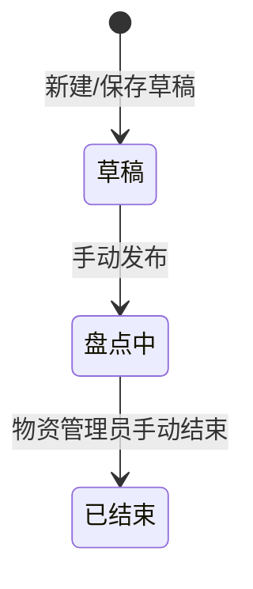

# 物资仓库管理系统（WMS）产品需求文档

| 属性 | 内容 |
|------|------|
| **版本号** | v1.1.0 |
| 产品版本 | V1.1.0 |
| **版本更新时间** | 2026-07-24 |
| **版本迭代说明** | 交付**库外盘点**：PC 管理 + 企微 H5 现场确认；计划状态三态（草稿→盘点中→已结束）；发布即盘点中；仅已结束可出报告 |
| 关联上一版本 | v1.0.0（基础业务） |
| 目标平台 | PC Web + 企微 H5 |
| 交互原型 | [全局总入口](../../prototype/index.html) · [v1.1.0 门户](../../prototype/versions/v1.1.0/index.html) |
| 文档状态 | 库外盘点专项交付版 |

---

## 1. 结论前置

本版本在 v1.0.0 基础上新增**库外盘点**能力：出库领用人确认名下物资；管理员管计划与进度；固资可单件转派；类资产按地点录数量。

| 优先级 | 范围 |
|--------|------|
| P0 | 盘点计划（草稿/盘点中/已结束） |
| P0 | 物资盘点（领用人 PC）+ 企微 H5 确认 |
| P0 | 盘点进度、结果、报告、差异 |
| P0 | 固资：在场/转派/丢失；类资产：多地点数量 |
| P1 | 扫码确认入口 |

**不含**：库内（库场）盘点 → 见 **v1.2.0**。

---

## 2. 业务流程

**文字解读**：点击「发布」即进入盘点中，领用人可确认；管理员结束后方可查看/生成报告。

---

## 3. 功能模块

### 3.1 盘点计划 · P0

| 维度 | 说明 |
|------|------|
| 功能介绍 | 创建盘点范围、口径日；保存草稿或发布 |
| 前置条件 | 库外台账有数据；有计划权限 |
| 数据权限 | 物资管理员可发布/结束；领用人看本人待确认 |
| 页面跳转 | 列表 → 表单；行内 → 盘点进度 / 结果 / 报告 |

**物资数据来源（P0）**

| 项 | 规则 |
|----|------|
| 主数据源 | **库外资产台账**（已出库、出库领用人持有的固资/类资产） |
| 非来源 | 仓库货位库存、物资清单主数据、未出库领用单 |
| 口径时点 | 计划「口径日期」的**日终**快照 |
| 发布 | 将应盘明细写入计划并**冻结**；此后台账变动不改已发布行 |

**选择应盘物资（P0）**

| 范围方式 | 交互 |
|----------|------|
| 全部库外资产 | 按资产类型纳入口径日终全部在用 |
| 指定物资大类 | 选大类后自动带出 |
| 指定使用地点 | 按台账地点筛选 |
| **指定物资清单** | **必须**打开弹窗，从库外台账**多选**后回填预览 |

弹窗能力：搜索（编码/名称/领用人/地点）、类型筛选、全选/清空、确认选择；预览区可勾选移除。

**状态与操作**

| 状态 | 领用人 | 管理员 |
|------|--------|--------|
| 草稿 | 不可确认 | 编辑、删除、发布 |
| 盘点中 | 可确认 | 盘点进度、结束 |
| 已结束 | 只读 | 结果、报告、差异 |

### 3.2 物资确认（领用人）· P0

| 维度 | 说明 |
|------|------|
| 功能介绍 | PC「物资盘点」+ 企微 H5 确认名下物资 |
| 固资 | 在场（可改地点、可选补码）/ 转派（选人入口）/ 丢失 |
| 类资产 | 分地点：在场+丢失=账存；可增删改地点并回写台账；不可转派 |
| 页面跳转 | 企微任务列表 → 执行/确认/扫码 |

### 3.3 盘点进度 / 结果 / 报告 · P0

| 页面 | 说明 |
|------|------|
| 盘点进度 | 按领用人看确认完成度 |
| 结果 | 已结束后汇总应盘/已盘/盘亏/账外 |
| 报告 | **仅已结束**可生成/查看 |
| 差异 | 盘亏/账外/归属变更后续处置 |

---

## 4. 页面清单

| 端 | 页面 | 文件 |
|----|------|------|
| PC | 盘点计划 | `outside_count_plan_list` / `form` |
| PC | 物资盘点 | `outside_count_mine` |
| PC | 盘点进度 | `outside_count_task_list` / `detail` |
| PC | 固资/类资产确认 | `outside_count_fixed_confirm` / `class_confirm` |
| PC | 结果/差异处理/盘点报告 | `outside_count_result` / `diff_list` / `report_*` |
| 企微 | 我的盘点/执行/确认/扫码 | `wecom/wecom_outside_count_*` |

---

## 5. 边界与异常

| 类型 | 场景 | 处理 | 优先级 |
|------|------|------|--------|
| 正常 | 发布→确认→结束→报告 | 按状态机 | P0 |
| 边界 | 类资产缺地点 | 可发布，确认时补填 | P0 |
| 边界 | 指定清单未选物资 | 禁止发布 | P0 |
| 异常 | 转派未选人 | 禁止提交 | P0 |

---

## 6. 风险

| 风险 | 说明 | 缓解 |
|------|------|------|
| 与 v1.0 菜单混淆 | 基础版无盘点侧栏 | 总入口分版本跳转 |
| 企微兼容 | X5 内核 | 按 `prototype_mobile` 清单 |

---

## 修订记录

| 版本 | 日期 | 说明 |
|------|------|------|
| V1.1 | 2026-07-24 | 新增计划：明确库外台账来源 + 口径日终；指定清单必须弹窗多选 |
| V1.0 | 2026-07-24 | 自 v1.0.0 物理迁出库外盘点，立为 v1.1.0 专项 |
