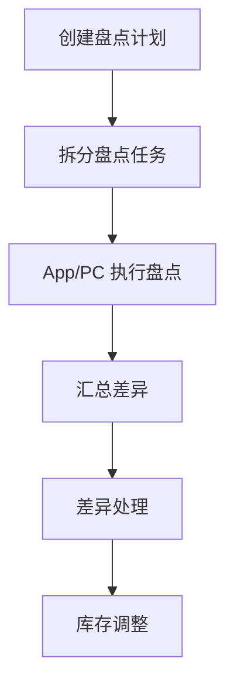

# 物资仓库管理系统（WMS）产品需求文档

| 属性 | 内容 |
|------|------|
| **版本号** | v1.2.0 |
| 产品版本 | V1.2.0 |
| **版本更新时间** | 2026-07-24 |
| **版本迭代说明** | 交付**库内盘点（库场盘点）**：PC 计划/任务/差异/调整 + 独立 App 扫码现场作业 |
| 关联上一版本 | v1.0.0（基础业务）；库外盘点见 v1.1.0 |
| 目标平台 | PC Web + 独立 App |
| 交互原型 | [全局总入口](../../prototype/index.html) · [v1.2.0 门户](../../prototype/versions/v1.2.0/index.html) |
| 文档状态 | 库内（库场）盘点专项交付版 |

---

## 1. 结论前置

本版本在 v1.0.0 基础上新增**库内盘点（库场盘点）**：按仓库/货架组织盘点计划与任务，App 现场扫码录入，差异处理后可做库存调整。

| 优先级 | 范围 |
|--------|------|
| P0 | 盘点计划、盘点任务（PC） |
| P0 | 差异处理、库存调整（PC） |
| P0 | 库场盘点独立 App（首页/扫码/任务/执行/账外/我的） |
| P1 | 账外资产登记与审核衔接 |

**不含**：库外盘点 → 见 **v1.1.0**。

---

## 2. 业务流程

**文字解读**：管理员定范围并下发任务；执行人现场扫码/录入；差异闭环到调整单。

---

## 3. 功能模块

### 3.1 盘点计划 · P0

| 维度 | 说明 |
|------|------|
| 功能介绍 | 按仓库/分区/货架创建库场盘点计划 |
| 前置条件 | 仓库货位台账可用 |
| 数据权限 | 盘点管理员、仓管按仓库范围 |
| 页面跳转 | 列表 → 表单/详情 → 任务 |

### 3.2 盘点任务 · P0

| 维度 | 说明 |
|------|------|
| 功能介绍 | 按货架/执行人查看任务进度与明细 |
| 前置条件 | 计划已发布并生成任务 |
| 页面跳转 | 任务列表 → 详情 → App 执行 |

### 3.3 差异处理与库存调整 · P0

| 维度 | 说明 |
|------|------|
| 功能介绍 | 盘盈盘亏差异处置；确认后生成库存调整 |
| 页面跳转 | 差异列表 → 调整单 |

### 3.4 库场盘点 App · P0

| 维度 | 说明 |
|------|------|
| 功能介绍 | 独立 App：扫码盘点、任务执行、账外登记 |
| 前置条件 | 已分配盘点任务；移动端登录（原型静态） |
| 页面跳转 | 首页 → 任务/扫码/执行/账外/我的 |

---

## 4. 页面清单

| 端 | 页面 | 文件 |
|----|------|------|
| PC | 盘点计划 | `count_plan_list` / `form` / `detail` |
| PC | 盘点任务 | `count_task_list` / `detail` / `execute_form` |
| PC | 差异处理 | `count_diff_list` |
| PC | 库存调整 | `count_adjust_list` / `form` / `detail` |
| PC | 调货位 | `count_relocate_form` |
| App | 首页/扫码/任务/执行/账外/我的 | `app/app_count_*` |

---

## 5. 边界与异常

| 类型 | 场景 | 处理 | 优先级 |
|------|------|------|--------|
| 正常 | 计划→任务→执行→差异→调整 | 按流程 | P0 |
| 边界 | 账外登记 | App 录入，审核后入账 | P1 |
| 异常 | 可用库存不足调整 | 阻断并提示 | P0 |

---

## 6. 风险

| 风险 | 说明 | 缓解 |
|------|------|------|
| 与库外盘点术语混淆 | 「库内」=「库场」 | 门户与 PRD 统一标注 |
| App 弱网 | 暂存同步 | 原型标注、实现期补齐 |

---

## 修订记录

| 版本 | 日期 | 说明 |
|------|------|------|
| V1.0 | 2026-07-24 | 自 v1.0.0 物理迁出库场盘点，立为 v1.2.0 专项 |
