# 物资仓库管理系统（WMS）产品需求文档

| 属性 | 内容 |
|------|------|
| 文档版本 | V1.3.2 |
| 产品版本 | V1.0.0 |
| 部署区域 | 湖北黄冈武穴 |
| 目标平台 | PC Web + 移动端 H5 |
| 交互原型 | [GitHub Pages](https://liaoliao66.github.io/wms/) · 133 页 · PC/APP 双入口 |
| 文档状态 | 研发评审收口版：V1.0 交付边界、数据模型、原型映射已对齐 |
| 最后更新 | 2026-06-16 |

---

## 1. 产品概述

### 1.1 产品定位

物资仓库管理系统（WMS）是一套面向企事业单位及工程项目场景的 **一体化物资与仓库管理平台**。系统以物资全生命周期管理为核心，集成 **计划编制、采购执行、验收入库、领用出库、归还退货、库存台账、供应商管理** 等能力，支持 **固定资产、类资产、耗材** 三类物资的差异化管理，并提供 PC 端后台与移动端现场作业双端协同。

### 1.2 产品目标

1. **流程闭环**：实现从物资需求计划到采购、验收、入库、领用、归还/退货的端到端可追溯管理。
2. **库存精准**：按「仓库 → 分区 → 货架」三级结构管理货位，台账实时反映存放位置与库存数量。
3. **采购合规**：支持直采、询价、招标多种采购方式，采购与供货、验收环节自动衔接。
4. **现场高效**：移动端支持资产确认、计划采购申请等现场作业（库场盘点列入 V1.1）。
5. **供应商治理**：建立供应商档案与评价体系，支撑采购决策。

### 1.3 用户角色定义

| 角色 | 职责描述 | 主要使用端 |
|------|----------|------------|
| 系统管理员 | 基础配置、流程配置、权限分配、评价规则设置 | PC |
| 仓库管理员 | 验收入库、出库操作、货位管理 | PC / 移动 |
| 采购人员 | 采购申请、物资采购（直采/询价/招标）、待采物资处理 | PC / 移动 |
| 计划编制人 | 物资计划编制与提交审核 | PC |
| 领用人 | 领用申请、查看领取记录与借还记录 | PC |
| 验收人员 | 物资验收、验收记录管理 | PC |
| 审批人 | 各类申请单（计划/领用/采购等）审核 | PC / 移动 |
| 供应商用户 | 查看供货单、完成供货（V1.0 内部代录，不开放外部门户） | PC |

#### V1.0 权限策略（已决策）

Axure 原型页面注释多为「数据权限：无」，**V1.0 以本 PRD 第 8 章《权限与数据范围矩阵》为准实施 RBAC**，不再采用「登录即全量可见」方案。原则如下：

1. **功能权限**：按角色控制菜单与按钮（见第 16 章操作矩阵）。
2. **数据权限**：按「本人单据 + 分管仓库 + 全部」三档控制列表可见范围。
3. **仓库管理员**必须绑定分管仓库，仅可操作分管范围内库存。
4. **领用人**默认仅可见本人发起的申请及衍生的领取/借还记录。
5. **系统管理员**拥有全量数据与配置权限。

详细矩阵见 **第 8 章**。

### 1.4 核心概念

| 概念 | 定义 |
|------|------|
| 固定资产 | 一物一码，入库时生成单个资产编码，1 个资产 1 条台账记录，数量恒为 1 |
| 类资产 | 按物资编码管理；**货位账本**按「编码+货位」多行，**物资汇总视图**按编码一行聚合数量 |
| 耗材 | 消耗型物资，按数量出入库，一般不强制归还 |
| 仓库结构 | 仓库 → 分区 → 货架，左侧树形展示，右侧列表展示物资台账 |
| 一般计划 | 物资计划类型之一，审核通过后作为领用依据；不自动生成待采物资 |
| 急件计划 | 物资计划类型之一，审核通过后按物资拆分为待采物资，驱动急件采购 |
| 计划采购申请 | 独立于物资计划的采购申请，含「计划申请」「急件申请」两类，审核后进入物资采购执行 |
| 待验物资 | 工作台视角的验收待办汇总，数据来源于物资验收「待验收/验收中」 |
| 货位码 | 标识货架物理位置（`wms://loc/`），用于入库选位与货位识别；在仓库配置生成 |
| 资产码 | 标识单个固定资产（`wms://asset/`），在入库/仓库台账管理；与货位码不可混用 |
| 领取记录 | 领用申请审核通过后的领取明细视图（原「待领物资」菜单名） |
| 借还记录 | 需归还资产的借出与归还全生命周期视图（原「待还物资」菜单名） |

#### 1.4.1 术语对照表（菜单 / 页面 / 数据 / 状态）

| 菜单名（侧栏） | 页面标题 | 原型文件 | 数据实体/视图 | 主要状态枚举 |
|----------------|----------|----------|---------------|--------------|
| 领取记录 | 领取记录 | `mine_pending_pickup.html` | `requisition_pickup_line` | 待领取、已领取 |
| 借还记录 | 借还记录 | `mine_pending_return.html` | `return_tracking` | 待归还、已延期、部分归还、待确认、已归还、已作废 |
| 待采物资 | 待采物资 | `purchase_pending_list.html` | `pending_purchase` | 待申请、已申请 |
| 采购申请 | 采购申请 | `purchase_request_list.html` | `purchase_request`（急件） | 草稿、审核中、审核通过、审核失败 |
| 物资归还 | 物资归还 | `warehouse_return_list.html` | `return_order` | 同借还记录（仓管视角） |
| 物资作废 | 物资作废 | `warehouse_scrap_list.html` | `scrap_order` | 待执行、已执行 |
| 物资库存总览 | 物资台账 | `ledger_material.html` | `inventory_summary` | 在库、借出、预警等 |
| 仓库台账 | 仓库台账 | `ledger_warehouse.html` | `inventory_location` | 在库、借出、待报废等 |

**命名约定**：工作台指标、统计口径可使用业务短语（如「待还超期」）；用户可见菜单以本表为准。历史文档中的「待领物资」「待还物资」仅作迁移说明，不再作为菜单文案。

---

### 1.5 产品成功指标（V1.0 验收 KPI）

| 指标 | 目标值 | 统计口径 | 验收方法 |
|------|--------|----------|----------|
| 采购申请 → 入库完成平均周期 | ≤ 15 个工作日 | `purchase_request.approved_at` → 对应入库单最后一笔 `inbound.completed_at`，按单加权平均；不含招标公示等待 | 抽样 ≥30 单，系统报表与手工复核误差 ≤1 天 |
| 领用申请 → 出库完成平均时长 | ≤ 2 个工作日 | `requisition.approved_at` → `outbound.completed_at`，工作日历排除节假日 | 抽样 ≥30 单 |
| 借还超期率 | ≤ 5% | `return_tracking` 中 status=已延期 / (待归还+已延期+部分归还) 且应还日期已过 | 月末报表 |
| 库存事务一致性 | 100% | 任意出库/入库/归还确认后，`inventory_location.qty ≥ 0` 且 `available + locked + borrowed ≤ qty` | 自动化对账脚本每日跑批，异常为 0 |
| 关键操作审计覆盖率 | 100% | 入出库、库存调整、审批通过/驳回、作废执行、归还确认均写入 `audit_log` | 用例清单逐条断言有审计记录 |

---

### 1.6 V1.0 范围边界

**In Scope（V1.0 必做）**

- 单项目部署（黄冈武穴），单组织多仓库
- 三类物资全链路（计划/采购/验收/入出库/归还）
- RBAC + 仓库数据范围
- 内部代录供应商供货（无供应商外部门户）
- 移动端：资产确认、计划采购申请
- PC/APP 双入口原型门户与工作台统计看板
- **详情弹窗交互规范**：流水详情、货位库存详情、物资计划详情等采用弹窗展示，减少页面跳转
- **物资作废与待报废池**：归还损坏/待报废物资进入池，经作废申请执行

**Out of Scope（V1.0 不做，列入后续版本）**
- **采购消息中心**（独立菜单与消息流水页）— 待办统一由 **工作台** 承载；V1.1 可增消息中心
- **规划内容（场内/场外）**— 原型有页、侧栏未挂载，V1.1 与报表一并交付
- **库场盘点全模块**（盘点计划/任务/执行/差异/调整、移动盘点 APP）— 交互原型保留演示页，V1.1 交付
- 盘点相关主数据配置项（分类/物资「是否需要盘点」字段保留配置能力，但不驱动盘点业务）
- 跨组织/跨项目调拨
- 库间调拨单
- 供应商自助门户与外部账号体系
- 财务固定资产卡片对接、自动记账
- 安全库存自动补货、MRP
- 条码/RFID 硬件 SDK 深度集成（V1.0 仅支持二维码下载与移动扫码确认）

### 1.7 V1.0 研发交付清单

> 范围标签：**[V1.0]** 本期必交付 · **[V1.1]** 下期 · **[演示]** 仅原型/不投产

| 模块 | 优先级 | 范围 | 关键页面/能力 | 依赖 |
|------|:------:|:----:|---------------|------|
| 认证与组织 | P0 | [V1.0] | 登录、用户/部门、仓库绑定 | — |
| 工作台 | P0 | [V1.0] | 统计卡片、作业待办（不含盘点卡片投产） | 各业务待办 API |
| 物资台账 | P0 | [V1.0] | 物资库存总览、仓库台账、出入库记录、详情弹窗 | 仓库配置、入库 |
| 我的物资 | P0 | [V1.0] | 领取记录、借还记录、归还确认 | 领用/出库/归还 |
| 物资申请 | P0 | [V1.0] | 物资计划、领用申请 | 物资清单、流程配置 |
| 采购管理 | P0 | [V1.0] | 待采物资、采购申请、计划采购申请、物资采购、供货单 | 供应商、物资清单 |
| 物资管理 | P0 | [V1.0] | 待验、验收、入库、出库、归还、退货、作废/待报废池 | 仓库配置、台账 |
| 供应商管理 | P1 | [V1.0] | 供应商列表、评价 | 评价设置 |
| 基础配置 | P0 | [V1.0] | 单位、分类、验收标准、物资清单、仓库配置、使用地点、评价设置 | — |
| 流程配置 | P1 | [V1.0] | 审批模板（串行节点） | 组织与角色 |
| 移动端 | P1 | [V1.0] | 资产确认、计划采购申请（见 §3.10.3） | 同 PC 接口 |
| 库场盘点 | — | [V1.1] | PC 11 页 + APP 6 页 | 库存模型 |
| 消息中心 | — | [V1.1] | `purchase_message.html` | 通知服务 |
| 规划内容 | — | [V1.1] | 场内/场外 | 台账 |

---

## 2. 业务流程

### 2.0 流程图图例

| 图类型 | 适用场景 | 图形标准 | 本章示例 |
|--------|----------|----------|----------|
| **泳道图** | 跨角色/跨部门协作流程 | 每条泳道 = 一个责任角色；节点自上而下或自左而右；跨泳道箭头表示交接 | §2.1–§2.6、§4、§12.2 |
| **状态机图** | 单据/实体生命周期 | 圆角节点 = 状态；箭头 = 迁移事件；`[*]` = 起止 | §2.7–§2.11、§3.5.6 |
| **时序图** | 前后端/多系统交互 | 生命线 + 消息箭头；`alt/opt` 表示分支 | §2.12–§2.13 |
| **ER 图** | 数据实体关系 | 实体框 + 基数连线 | §9.1 |
| **决策树** | 路径选择/规则分支 | 菱形决策 + 分支汇聚 | §12.2、§13.4 |

> 所有图使用 [Mermaid](https://mermaid.js.org/) 语法，可在 PRD 浏览器阅读页（`pages/prd.html`）与 GitHub 中直接渲染。

### 2.1 V1.0 核心业务流程（泳道图）

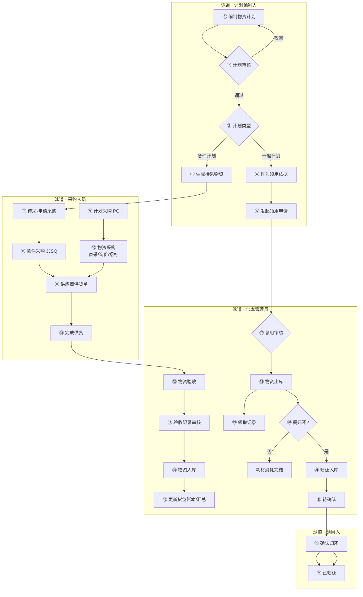

> **[V1.1]** 库场盘点（计划→任务→执行→差异→调整）见 §2.4、§3.9，不纳入 V1.0 投产范围。

### 2.2 子业务流程 — 采购到入库（泳道图）

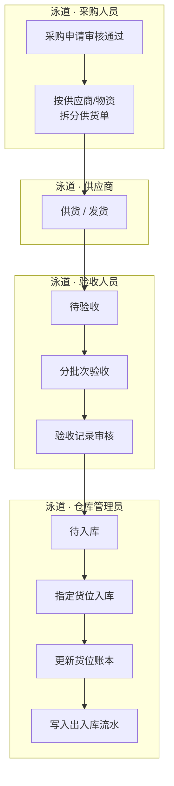

### 2.3 子业务流程 — 领用到归还（泳道图）

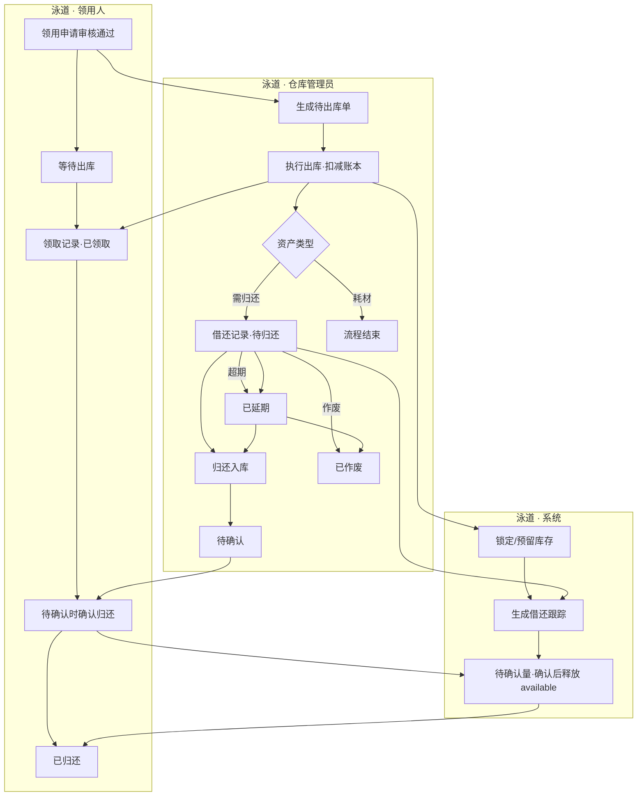

### 2.4 子业务流程 — 库场盘点 [V1.1]（泳道图）

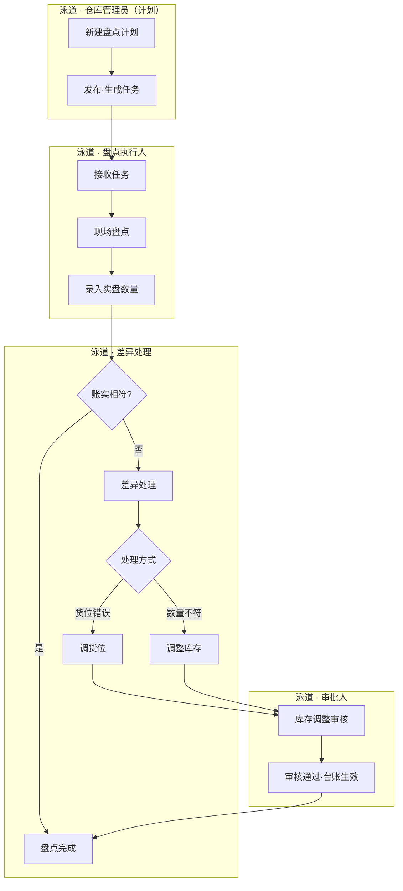

### 2.5 用户交互流程 — 采购人员发起计划采购（泳道图）

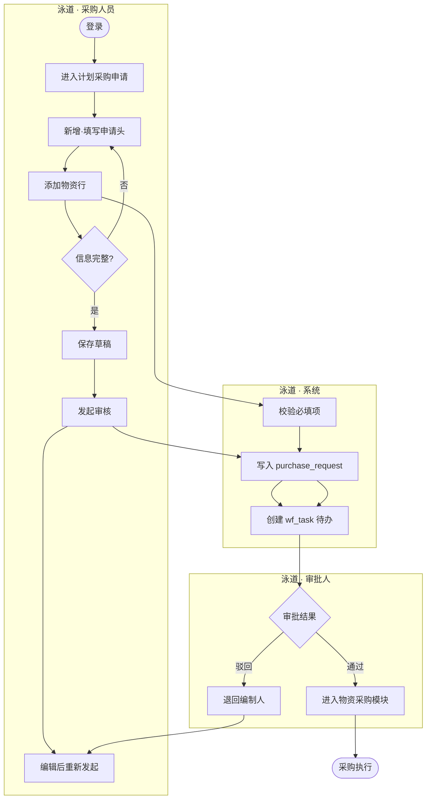

### 2.6 用户交互流程 — 仓库管理员验收入库（泳道图）

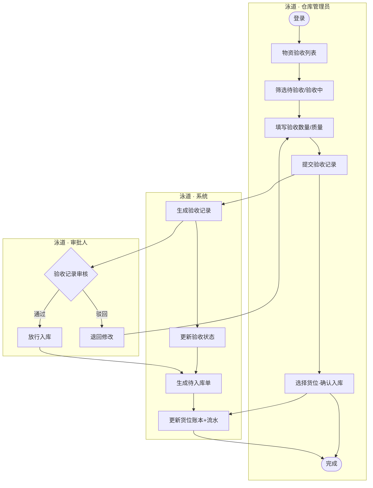

### 2.7 流程状态机 — 通用审批单（计划/领用/采购申请等）

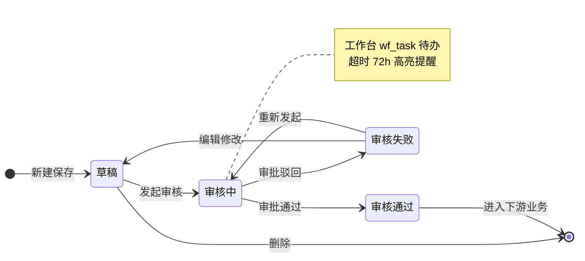

### 2.8 流程状态机 — 物资验收

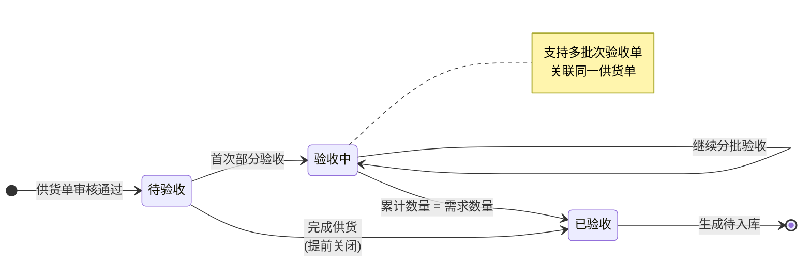

### 2.9 流程状态机 — 物资入库 / 出库

**入库状态机**

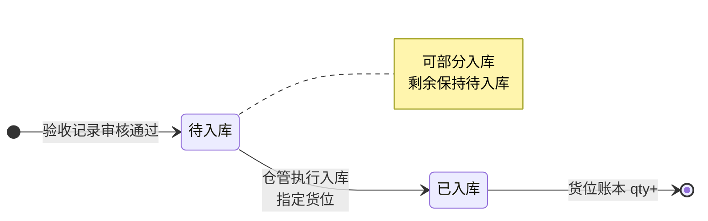

**出库状态机**

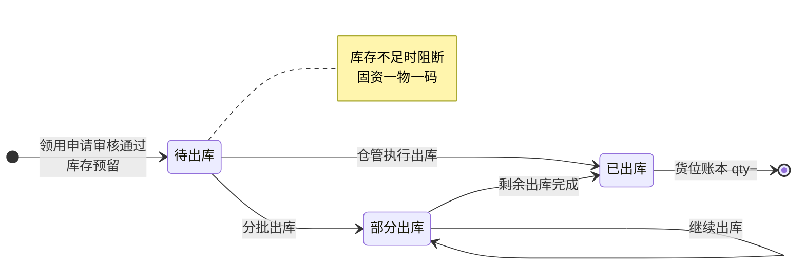

### 2.10 流程状态机 — 物资归还

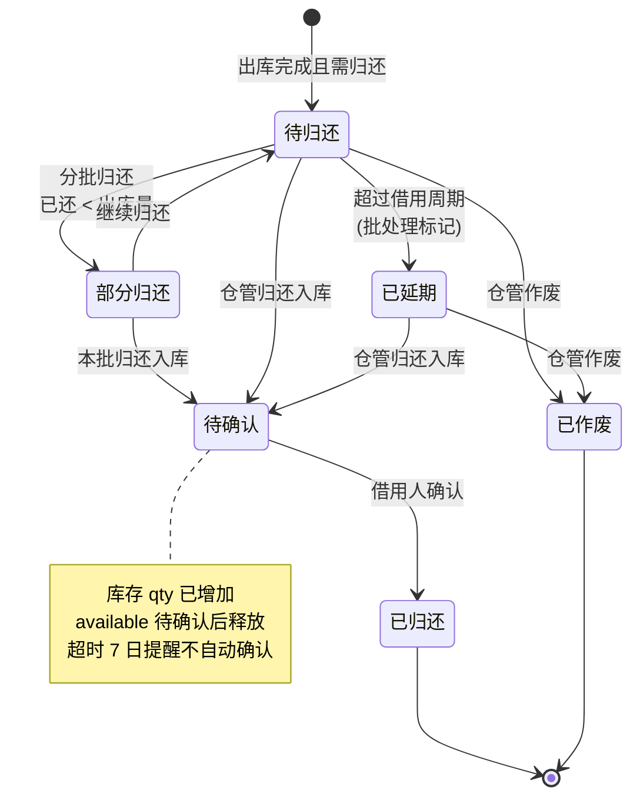

### 2.11 流程状态机 — 盘点与差异 [V1.1]

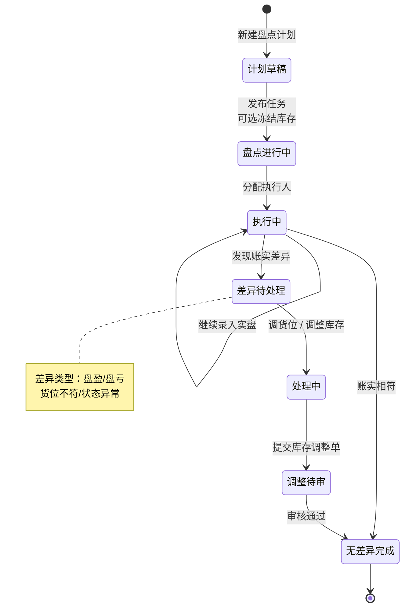

### 2.12 系统数据流转时序图 — 采购入库

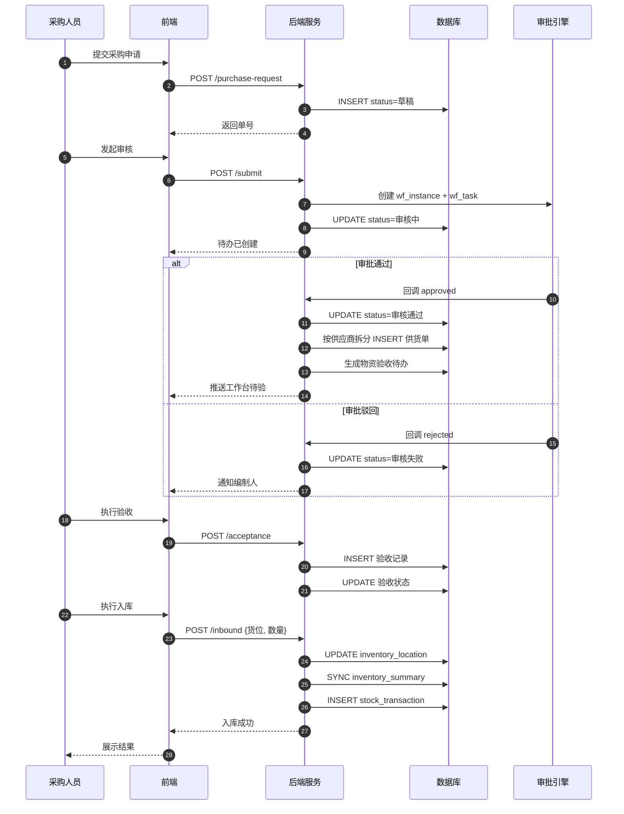

### 2.13 系统数据流转时序图 — 领用出库

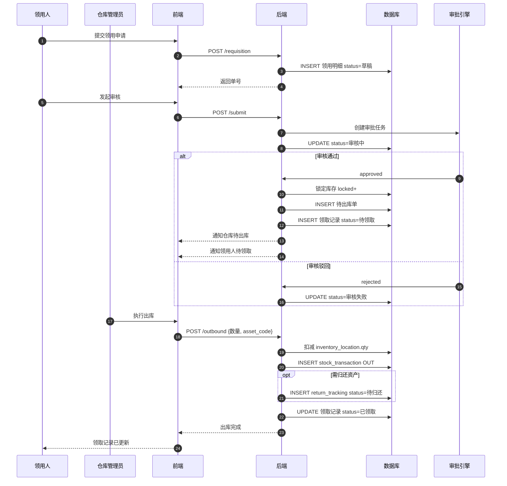

---

## 3. 功能模块总览

### 3.0 原型入口门户（交互原型 V1.0）

**一级概述**：GitHub Pages 部署的双端入口页，用于演示评审时快速切换 PC 后台与移动盘点环境。

| 维度 | 说明 |
|------|------|
| 功能介绍 | 展示产品名称、版本与 PC/APP 双卡片入口；提供页面目录、工作台、APP 任务列表等快捷链接。 |
| 访问地址 | `https://liaoliao66.github.io/wms/`（建议带尾部斜杠，避免子路径下 CSS 解析错误） |
| 前置条件 | 无登录；静态 HTML 原型。 |
| 页面跳转 | PC 卡片 → `pc_home.html`；APP 卡片 → `app_count_home.html`；目录 → `prototype_map.html`（133 页索引）。 |

**PC 端入口说明**：仓库管理后台，含采购、入库出库、台账、基础配置等；侧栏导航 125+ 业务页。

**APP 端入口说明**：iOS 18 风格移动原型（iPhone 16 外框 + 灵动岛 + 状态栏）；V1.0 以资产确认、计划采购申请为主；库场盘点 APP 为 V1.1 演示页。

**快捷链接**：

| 链接 | 目标 | 说明 |
|------|------|------|
| 原型页面目录 | prototype_map.html | 133 页索引 |
| PC 工作台 | pc_home.html | 直达看板 |
| APP 任务列表 | app_count_task_list.html | 跳过 APP 首页 |

---

### 3.1 物资台账

**一级概述**：提供仓库物资库存的全局视图与历史流水查询，是仓储管理的数据中枢。

#### 3.1.0 物资库存总览（物资台账）

| 维度 | 说明 |
|------|------|
| 功能介绍 | 全公司**物资维度**库存总览，按编码汇总在库、可用、借出与预警；左侧分类树 + 右侧列表。 |
| 前置条件 | 用户已登录；存在入库记录。 |
| 数据权限 | 仓库管理员可见分管范围；系统管理员可见全部。 |
| 页面跳转 | 点击统计卡切换列表 Tab；「仓库台账」跳转货位维度视图。 |

**顶部统计卡（3 张）**：

| 卡片 | 说明 | 交互 |
|------|------|------|
| 库存预警 | 低于安全库存的物资种数 | 点击切换「库存预警」Tab |
| 借出中 | 类资产 + 固资借出件数 | 点击切换「固定资产」Tab |
| 待报废 | 待发起作废的物资 | 跳转待报废池 |

**业务规则**：
- 列表 Tab：全部 / 固定资产 / 类资产 / 耗材 / 库存预警
- 左侧分类树点击过滤列表；支持分类搜索
- 搜索：物资编码、资产编码、名称、规格
- 列表字段：在库总量、可用、锁定、借出、分布/位置、状态、最近变动
- 操作：查看（物资库存详情弹窗）、流水（出入库记录）；固定资产额外支持资产详情
- 页内提供「仓库台账」快捷入口切换到货位维度视图

#### 3.1.1 仓库台账

| 维度 | 说明 |
|------|------|
| 功能介绍 | 按**货位维度**展示物资存放位置与库存数量；左侧仓库树（仓库 → 分区 → 货架）驱动右侧列表筛选，支持查看货位详情、跳转物资库存、查看流水。 |
| 前置条件 | 用户已登录；系统中已有仓库配置；物资至少完成过一次入库。 |
| 数据权限 | 仓库管理员可见分管仓库；系统管理员可见全部；普通领用人仅可查看（无编辑）。 |
| 页面跳转 | 左侧树点击节点刷新右侧列表与面包屑；操作列按物资类型差异化展示（见下表）。 |

**左侧目录树**：
- 层级：仓库 → 分区 → 货架（支持展开/折叠；当前上下文节点高亮）
- 点击任意层级节点，右侧列表按该路径过滤
- 底部展示「当前：主仓库 › A区 › A-02 货架」类面包屑

**操作列规则**：

| 物资类型 | 操作 |
|----------|------|
| 固定资产 | 查看（资产详情弹窗）、二维码、下载（资产码 ZIP） |
| 类资产 / 耗材 | 查看（货位库存详情弹窗）、库存（物资库存详情弹窗）、流水（出入库记录列表） |

**货位库存详情弹窗**（`ledger_warehouse_detail`）：
- 顶部横幅：物资编码、货位、在库状态
- 信息区：物资名称、规格、分类、在库/可用/锁定数量、入库与变动时间
- 附加区：公司总量、最近流水摘要
- 快捷链接：物资库存详情、出入库记录
- 仅「关闭」按钮，关闭后回到仓库台账列表

**业务规则**：
- 右侧列表为出入库生成的物资台账，默认按变动时间降序
- 搜索：物资大类、物资子类、物资编码、物资名称
- 筛选：入库时间、变动时间
- 类资产行展示安全库存/上下限（若已配置）

#### 3.1.2 出入库记录

| 维度 | 说明 |
|------|------|
| 功能介绍 | 汇总展示所有物资出入库操作流水，便于审计与追溯。 |
| 前置条件 | 系统中已有出入库操作记录。 |
| 数据权限 | 仓库管理员、系统管理员可查看全部；领用人可查看与本人相关的出库记录。 |
| 页面跳转 | 点击「查看」→ **流水详情弹窗**（`ledger_transaction_detail`），不跳转新页面。 |

**流水详情弹窗**：
- 尺寸：XL；顶部横幅展示流水单号、类型（入库/出库/归还/退货）、货位
- 四列信息网格：物资编码/名称、分类、数量、操作人、关联单号等
- 「附加信息」表格：按需展示领用人、归还状态、供应商、退货原因等扩展字段（无值时整组隐藏）
- 快捷链接：查看来源单据（入库单/出库单等）、物资库存详情或资产详情
- 底部仅「关闭」，关闭后回到出入库记录列表

**业务规则**：按出入库操作时间降序；搜索物资编码、物资名称；筛选操作时间、流水类型。

---

### 3.2 我的物资

**一级概述**：面向领用人的个人物资视图。菜单命名为 **领取记录**、**借还记录**（强调全量历史可查，而非仅「待办」状态）；工作台「待还超期」等指标仍沿用业务口径。

#### 3.2.1 领取记录

| 维度 | 说明 |
|------|------|
| 功能介绍 | 展示当前用户领用申请审核通过后的物资领取明细，含待领取与已领取全状态。 |
| 前置条件 | 领用申请已审核通过。 |
| 数据权限 | 普通用户仅查看本人申请衍生的记录；管理员可查看全部。 |
| 页面跳转 | 「查看」→ 领用记录详情弹窗（`mine_requisition_record`），展示申请头信息与物资明细。 |

**Tab**：全部 / 待领取 / 已领取

**状态**：待领取（审核通过、未出库）→ 已领取（出库完成）

**列表字段**：领用申请单号、物资编码/名称、规格、申请数量、出库单号、出库数量、出库日期等。

#### 3.2.2 借还记录

| 维度 | 说明 |
|------|------|
| 功能介绍 | 展示需归还资产的借出与归还全生命周期，含超期提醒与借用人确认环节。 |
| 前置条件 | 出库完成且物资属性为需归还的资产。 |
| 数据权限 | 普通用户查看本人借出资产；管理员查看全部。 |
| 页面跳转 | 「查看」→ 归还单详情；「归还」→ 归还操作页；「确认」→ 确认归还页（`mine_return_confirm`）。 |

**Tab**：全部 / 待归还 / 已延期 / 待确认 / 已归还

**状态机**（详见 §2.10）：

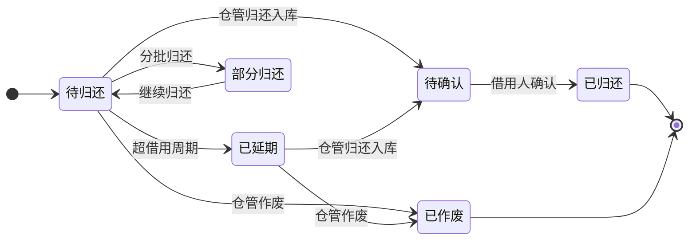

**与物资归还模块关系**：借还记录为领用人视角；仓库管理员在「物资归还」执行入库与作废，领用人在「待确认」状态完成确认后变为已归还。

#### 3.2.3 归还确认规则 [V1.0]

| 规则项 | 说明 |
|--------|------|
| 进入待确认 | 仅**仓库管理员**在「物资归还」完成归还入库操作后，系统生成归还单并将会话状态置为 **待确认** |
| 确认人 | **借用人本人**（`return_tracking.borrower_id`）在「借还记录」点击「确认」 |
| 代确认 | V1.0 **不允许**仓管代确认；V1.1 可配置部门负责人代确认 |
| 超时 | 待确认超过 **7 个自然日**未操作：系统消息提醒借用人（经工作台待办，非独立消息中心）；**不自动**变更为已归还 |
| 库存恢复时点 | 仓管归还入库时：实物回库，货位账本 `qty` 增加，但类资产/耗材的 `available` 在借用人**确认前**保持锁定或单独记「待确认量」；**确认后** `available` 完全释放。固定资产以 `asset_status` 流转：借出 → 待确认 → 在库 |
| 部分归还 | 类资产支持分批归还；每次归还入库产生一条待确认记录，确认后累计 `returned_qty` |
| 作废 | 仓管在「物资归还」作废：不经过待确认，直接 **已作废**，库存不恢复（见 §11.5） |

---

### 3.3 物资申请

**一级概述**：管理物资需求计划与领用申请，是采购与出库的前置环节。

#### 3.3.1 物资计划

| 维度 | 说明 |
|------|------|
| 功能介绍 | 编制物资需求计划，审核通过后驱动待采物资与领用依据。 |
| 前置条件 | 用户已登录；物资清单主数据已配置。 |
| 数据权限 | 编制人可增删改本人草稿；审批人可审核；管理员全量。 |
| 页面跳转 | 「新增」→ 新增物资计划；「选择物资清单」→ 选择页；审核通过后返回列表。 |

**功能（按状态）**：
- 未发起审核/审核失败：查看、编辑、发起审核、删除
- 审核中：查看、审核
- 审核通过：查看

**计划类型**：
- **一般计划**：审核通过后作为领用依据；**不**生成待采物资
- **急件计划**：审核通过后按物资行拆分生成待采物资（见第 12 章）

**特殊字段**：最早需求日期 = min(物资.需求日期)

#### 3.3.2 领用申请

| 维度 | 说明 |
|------|------|
| 功能介绍 | 发起物资领用请求，审核通过后自动生成出库待办。 |
| 前置条件 | 可选关联已审核通过的物资计划；库存充足（出库时校验）。 |
| 数据权限 | 申请人操作本人单据；仓库管理员可查看全部待出库关联单。 |
| 页面跳转 | 「新增」→ 新增页 → 添加物资；提交后回列表；审核通过后可在领取记录、物资出库查看。 |

**搜索**：领用申请单号、计划单号  
**筛选**：申请事由、申请时间、审批状态

---

### 3.4 采购管理

**一级概述**：覆盖从待采识别到采购申请执行的全流程，支持直采、询价、招标。**采购三条路径决策见第 12 章。**

#### 3.4.1 消息中心 [V1.1 · 本期不做]

> **V1.0 决策**：不交付独立「消息中心」菜单（原型页 `purchase_message.html` 仅作演示）。审批待办、供货逾期、借还超期、归还待确认等统一通过 **§3.11 工作台** 统计卡片与作业待办列表呈现；超时提醒（72h 审批、7 日归还待确认）写入待办队列，不维护独立已读/未读消息表。

| 维度 | V1.1 规划 |
|------|-----------|
| 功能介绍 | 集中展示审批、供货、盘点等通知流水，支持已读标记 |
| 与工作台关系 | 工作台 = 可执行待办；消息中心 = 全量通知历史 |

#### 3.4.2 待采物资

| 维度 | 说明 |
|------|------|
| 功能介绍 | 急件计划审核通过后形成的待采购物资清单，驱动急件采购申请。 |
| 前置条件 | 关联急件物资计划已审核通过。 |
| 数据权限 | 采购人员、管理员可见。 |
| 页面跳转 | 「查看计划」→ **物资计划详情弹窗**（`purchase_pending_plan_detail`）；「申请」→ 采购申请-急件申请页（预填物资）。 |

**Tab**：全部 / 待申请 / 已申请

**操作规则**：

| 状态 | 操作 |
|------|------|
| 待申请 | 查看计划（弹窗）、申请 |
| 已申请 | 查看申请（跳转采购申请详情） |

**物资计划详情弹窗**：
- 展示计划单号、计划类型、审核状态、填报人/部门、申请日期、最早需求日、需求说明
- 计划明细表：物资编码、名称、规格、大类/子类、单位、需求数量
- 快捷链接：物资计划列表、待采物资
- 根据 URL 参数 `planNo` 动态加载对应计划数据

**状态**：待申请 → 已申请（急件采购申请审核通过）；**已申请不可重复申请**。

#### 3.4.3 采购申请

| 维度 | 说明 |
|------|------|
| 功能介绍 | 管理急件采购申请，审核通过后进入供货与验收环节。 |
| 前置条件 | 来自待采物资或手工新建。 |
| 数据权限 | 采购人员维护；审批人审核。 |
| 页面跳转 | 新增/编辑/申请子页；审核通过后跳转供应商供货单或物资验收。 |

**说明**：列表为急件采购申请，按添加时间降序；编辑时申请单号、采购总额不可改。

#### 3.4.4 计划采购申请

| 维度 | 说明 |
|------|------|
| 功能介绍 | 计划性采购申请，支持直采、询价/招标物资选择与提交；与「急件采购申请（JJSQ）」路径分离。 |
| 前置条件 | 用户已登录；物资清单可用。 |
| 数据权限 | 采购人员操作。 |
| 页面跳转 | PC：`purchase_plan_apply.html`（无侧栏独立菜单，从采购申请区或工作台进入）；移动：计划采购入口 → 添加物资 → 直采/询价招标页。 |

#### 3.4.5 物资采购

| 维度 | 说明 |
|------|------|
| 功能介绍 | 计划采购审核通过后的询价/招标/直采执行模块。 |
| 前置条件 | 计划采购申请已审核通过。 |
| 数据权限 | 采购人员、审批人按流程权限操作。 |
| 页面跳转 | 「采购」→ 询价-采购/招标-采购/直采-采购子页。 |

**子模块**：
- **直采-采购**：指定供应商直接采购
- **询价-采购**：发起询价，状态：待询价 → 已询价
- **招标-采购**：招标流程采购

#### 3.4.6 供应商供货单

| 维度 | 说明 |
|------|------|
| 功能介绍 | 采购单审核通过后按供应商/物资自动拆分，跟踪供货进度。 |
| 前置条件 | 采购申请单或采购单（询价/招标）已审核通过。 |
| 数据权限 | 采购、仓库、管理员可见。 |
| 页面跳转 | 「完成供货」→ 完成供货页；完成后驱动物资验收。 |

**状态**：待供货 → 供货中（部分供货）→ 已供货

---

### 3.5 物资管理

**一级概述**：仓储作业核心模块，连接验收、入库、出库、归还、退货。

#### 3.5.1 物资验收

| 维度 | 说明 |
|------|------|
| 功能介绍 | 对供应商供货进行分批次验收，支持部分验收与完成供货。 |
| 前置条件 | 供货单已生成；采购/供货单审核通过。 |
| 数据权限 | 验收人员、仓库管理员操作。 |
| 页面跳转 | 「验收」→ 验收操作页；「完成供货」→ 完成供货页（同供货单模块）。 |

**状态**：待验收 → 验收中 → 已验收

#### 3.5.2 验收记录

| 维度 | 说明 |
|------|------|
| 功能介绍 | 每次验收操作的记录明细，1 个供货单可对应多个验收单。 |
| 前置条件 | 已执行至少一次验收操作。 |
| 数据权限 | 验收、仓库、管理员可查看；审批人可审核。 |
| 页面跳转 | 查看详情；审核通过后触发待入库。 |

#### 3.5.3 物资入库

| 维度 | 说明 |
|------|------|
| 功能介绍 | 验收审核通过后执行入库，指定货位并更新台账。 |
| 前置条件 | 验收单审核通过。 |
| 数据权限 | 仓库管理员操作。 |
| 页面跳转 | 「入库」→ 入库页（选仓库/分区/货架）；完成后回列表。 |

**状态**：待入库 → 已入库

#### 3.5.4 物资出库

| 维度 | 说明 |
|------|------|
| 功能介绍 | 领用申请审核通过后按物资拆分出库，扣减库存。 |
| 前置条件 | 领用申请审核通过；库存充足。 |
| 数据权限 | 仓库管理员操作。 |
| 页面跳转 | 「出库」→ 按类型分固定资产/类资产/耗材出库页。 |

**状态**：待出库 → 已出库

**库存规则**：审核通过后预留库存；出库分配策略见 **第 11 章**。

#### 3.5.5 物资归还

| 维度 | 说明 |
|------|------|
| 功能介绍 | 管理需归还资产的归还、延期、作废；仓管入库后进入「待确认」，借用人确认后完结。 |
| 前置条件 | 出库完成且物资需归还。 |
| 数据权限 | 仓库管理员操作归还/作废；领用人可在借还记录查看并确认。 |
| 页面跳转 | 「归还」→ 归还页；「作废」→ 作废页；借用人「确认」→ 确认归还页。 |

**作废规则**：作废后资产 status=已作废，不恢复库存，写入 scrap 审计（见 11.5）。

#### 3.5.6 物资退货

| 维度 | 说明 |
|------|------|
| 功能介绍 | 记录向供应商退货或验收不合格退库场景。 |
| 前置条件 | 存在可退的供货/验收/库存记录；退货数量 ≤ 可退数量。 |
| 数据权限 | 仓库管理员、采购人员创建；仓库负责人审核（V1.0 简化为管理员审核）。 |
| 页面跳转 | 新增退货 → 新增退货页；审核通过后更新库存/验收状态。 |

**状态机**：

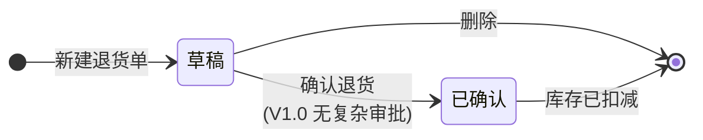

**库存影响**：
- **退供应商**：扣减库存台账，写入出入库记录（类型=退货出库），关联供货单
- **验收不合格**：未入库则减少待入库数量；已入库则扣减库存

**功能（V1.0）**：查看、编辑、删除（仅草稿）

#### 3.5.7 物资作废与待报废池 [V1.0]

| 维度 | 说明 |
|------|------|
| 功能介绍 | 管理不可继续使用物资的报废流程：待报废池汇聚待处置物资，经作废申请执行后更新台账与审计。 |
| 前置条件 | 物资已标记待报废（归还损坏、库存报废申请等）。 |
| 数据权限 | 仓库管理员发起作废与执行；系统管理员可查看全部。 |
| 页面跳转 | 工作台「待报废」→ 待报废池；「待执行作废」→ 物资作废列表 → 执行作废。 |

**流程**（泳道图）：

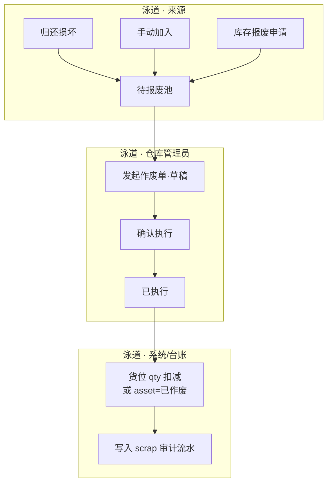

**与归还作废区别**：归还流程中的「作废」针对借出资产未还；本节「物资作废」针对在库或待报废区物资的处置执行。

**状态机**：

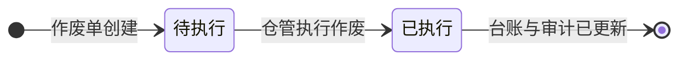

**操作矩阵**：待执行 — 查看、执行；已执行 — 查看

### 3.6 供应商管理

**一级概述**：维护供应商主数据与绩效评价。

#### 3.6.1 供应商列表

| 维度 | 说明 |
|------|------|
| 功能介绍 | 管理供应商档案，含供货状态。 |
| 前置条件 | 用户具有供应商管理权限。 |
| 数据权限 | 采购、管理员可维护。 |
| 页面跳转 | 「新增」→ 新增供应商；「添加供应商」用于采购场景快速关联。 |

#### 3.6.2 供应商评价

| 维度 | 说明 |
|------|------|
| 功能介绍 | 记录供应商绩效评价，支持审批流。 |
| 前置条件 | 供应商已存在；评价指标与权重已配置。 |
| 数据权限 | 评价人创建；审批人审核。 |
| 页面跳转 | 「新增评价」→ 新增评价页；可「添加供应商」关联。 |

---

### 3.7 基础配置

**一级概述**：系统主数据与规则配置，支撑全业务运行。

#### 3.7.1 计量单位

维护物资计量单位；支持添加计量单位子页。

#### 3.7.2 分类管理

维护物资大类（固定资产/类资产/耗材）与物资子类层级。

**子类继承与特有属性（来自原型）**：

| 属性 | 说明 | 固定资产/类资产 | 耗材 |
|------|------|-----------------|------|
| 计量单位 | 默认继承父级，可改 | ✓ | ✓ |
| 盘点类型 | 多选，默认继承父级 | ✓ | ✓ |
| 是否归还 | 默认继承父级；类资产/固定资产可配置 | ✓ | 默认否 |
| 借用周期（天） | 子级不得大于父级；出库后计算归还 deadline | ✓ | — |
| 安全库存 | 类资产/耗材分类默认值；物资清单可覆盖 | 类资产/耗材必填默认 | 耗材必填默认 |
| 库存下限 | 预警用（V1.0 仅展示，不自动补货）；子级 ≤ 父级 | 类资产/耗材 | 耗材 |
| 库存上限 | 子级 ≤ 父级 | 类资产/耗材 | 耗材 |

**删除约束**：已被物资清单引用的分类不可删除，仅可停用。

#### 3.7.3 验收标准

配置各类物资验收标准规则。

#### 3.7.4 物资清单

维护可采购/可领用的物资目录，分固定资产、类资产与耗材；左侧**分类树**与右侧列表联动筛选。

| 维度 | 说明 |
|------|------|
| 功能介绍 | 物资主数据维护；须绑定分类叶子节点；业务规则默认继承分类并可按物资覆盖。 |
| 前置条件 | 分类管理已配置；用户具有物资清单维护权限。 |
| 数据权限 | 系统管理员、采购人员可维护；其他角色只读（若开放）。 |
| 页面跳转 | 「新增」→ 新增物资表单；「查看」→ 物资详情弹窗；「编辑」→ 编辑表单。 |

**列表交互**：
- 左侧分类树：点击节点过滤右侧列表；支持分类名搜索
- 顶部筛选：启用状态、库存预警（低于下限/缺货）、是否需归还
- 搜索：物资编码、名称、规格型号
- 批量操作：批量停用（V1.0）；导入/导出（P2）

**动态列展示**（按物资类型 Tab 或筛选自动显隐）：

| 列组 | 固定资产 | 类资产 | 耗材 |
|------|:--------:|:------:|:----:|
| 基础信息（编码/名称/规格/分类/状态/单价） | ✓ | ✓ | ✓ |
| 归还 / 借用周期 | ✓ | ✓ | — |
| 是否需要盘点 / 使用年限 | ✓ | ✓ | — |
| 安全库存 / 上下限 / 当前库存 / 预警 | — | ✓ | ✓ |

**新增/编辑校验（类资产、耗材）**：
- **安全库存、库存下限、库存上限**为必填项
- 下限 ≤ 安全库存 ≤ 上限
- 子级物资的上下限不得大于所属分类配置值

**停用规则**：停用后不可被选入新计划/采购/领用；已引用单据不受影响。

#### 3.7.5 仓库配置

维护仓库、分区、货架三级结构；**左侧树导航 + 右侧内容区**，不设「仓库/货架」重复 Tab。

| 维度 | 说明 |
|------|------|
| 功能介绍 | 管理仓库主数据、分区属性与货架货位；生成货位二维码供入库扫码。 |
| 前置条件 | 系统管理员或具备仓库配置权限。 |
| 数据权限 | 仅管理员可编辑。 |
| 页面跳转 | 树节点「+」→ 新增仓库/分区；列表「新增」→ 新增货架；操作列 → 查看/编辑/二维码/下载。 |

**布局与交互**：
- **左侧树**：仓库 → 分区；支持新增/编辑/删除（有库存引用时阻断删除）
- **右侧内容**（选中分区后）：
  1. 工具栏：已选启用货架数、批量下载货位二维码（ZIP）
  2. 筛选：货架状态、负责人、层数区间
  3. 「+ 新增」货架
  4. **分区详情区**：库区类型、面积、存储容量、负责人
  5. **货架列表**：勾选、编码、名称、层数、承载量、状态、操作（查看/二维码/下载/编辑/删除）
- **不再提供**右侧「仓库 / 货架」标签切换（与左侧树功能重复，已移除）

**货位码与资产码**（页面顶部提示）：
- 货位码（`wms://loc/`）：标识货架物理位置，本模块生成与管理
- 资产码（`wms://asset/`）：标识固定资产个体，在仓库台账管理
- 二者不可混用；停用货架不可生成货位码

**货架操作**：
- 启用货架：可勾选参与批量下载；展示二维码与单张下载
- 停用货架：二维码/下载置灰，不可勾选

#### 3.7.6 使用地点

维护物资使用地点，支撑场外资产定位。

#### 3.7.7 评价设置

- **权重设置**：评价指标及权重
- **评价等级设置**：等级与评分区间对应

| 通用维度 | 说明 |
|----------|------|
| 前置条件 | 系统管理员角色 |
| 数据权限 | 仅管理员可编辑 |
| 页面跳转 | 列表页 ↔ 新增/编辑弹窗或子页 |

---

### 3.8 规划内容（物资列表）[V1.1]

> 原型页 `planning_inside.html` / `planning_outside.html` 存在，**侧栏未挂载，V1.0 不交付**。场内/场外分布视图在 V1.1 与报表模块一并实现。

---

### 3.9 库场盘点（V1.1 规划 · 原型演示）

> **范围说明**：库场盘点**不纳入 V1.0 交付**。交互原型已实现 PC 11 页 + APP 6 页供评审与 V1.1 开发参考；工作台「盘点任务」卡片在原型中保留，正式版 V1.0 可隐藏或置灰。

**一级概述**：支持定期/专项盘点，处理账实差异并调整库存。**盘点范围、冻结、差异分类详见第 13 章。**

**纳入范围规则**：仅 **是否需要盘点=是** 的资产类物资纳入计划；发布任务时快照账存，默认冻结范围内出入库（可配置）。

#### 3.9.1 盘点计划

| 维度 | 说明 |
|------|------|
| 功能介绍 | 创建盘点计划（如日常盘点、年中盘点），作为任务源头。 |
| 前置条件 | 仓库台账有数据；用户有盘点权限。 |
| 数据权限 | 仓库管理员、管理员。 |
| 页面跳转 | 「新增」→ 新增盘点计划页。 |

#### 3.9.2 盘点任务

| 维度 | 说明 |
|------|------|
| 功能介绍 | 由计划分解的具体执行任务，分配执行范围与人员。 |
| 前置条件 | 盘点计划已发布。 |
| 数据权限 | 执行人可见分配任务；管理员全部。 |
| 页面跳转 | 「查看」→ 查看页（展示计划+任务信息）。 |

#### 3.9.3 盘点执行

| 维度 | 说明 |
|------|------|
| 功能介绍 | 现场录入实盘数量，对比系统库存。 |
| 前置条件 | 盘点任务已下发。 |
| 数据权限 | 执行人操作分配任务。 |
| 页面跳转 | 发现差异 → 差异处理。 |

#### 3.9.4 差异处理

| 维度 | 说明 |
|------|------|
| 功能介绍 | 对盘点差异物资进行处置决策。 |
| 前置条件 | 盘点执行存在账实不符记录。 |
| 数据权限 | 仓库管理员。 |
| 页面跳转 | 「调货位」→ 调货位页；「调整库存」→ 调整库存页。 |

#### 3.9.5 库存调整

| 维度 | 说明 |
|------|------|
| 功能介绍 | 差异处理后的库存/货位调整单，需审核后生效。 |
| 前置条件 | 已完成差异处理并提交调整。 |
| 数据权限 | 仓库管理员提交；审批人审核。 |
| 页面跳转 | 审核通过后更新仓库台账。 |

**盘点计划状态**：草稿 → 待盘点 → 盘点中 → 待差异处理 → 已完成 / 已取消

**盘点任务状态**：待盘点 → 盘点中 → 已提交 → 待差异处理 → 已完成

**差异类型**：盘盈、盘亏、货位不符、状态异常（见 13.3）

**PC 端页面（11）**：

| 页面 | 文件 | 说明 |
|------|------|------|
| 盘点计划 | count_plan_list / form / detail | 列表、新增/编辑、详情与发布 |
| 盘点任务 | count_task_list / detail | 任务分解、分配执行人 |
| 盘点执行 | count_execute_form | 现场录入实盘，对比账存 |
| 差异处理 | count_diff_list | 待处理/已处理 Tab |
| 调货位 | count_relocate_form | 货位不符处置 |
| 库存调整 | count_adjust_list / form / detail | 盘盈盘亏调整单与审批 |

---

### 3.10 移动端专项（V1.0 + V1.1 演示）

#### 3.10.1 移动盘点（库场盘点 APP · V1.1 演示）

| 维度 | 说明 |
|------|------|
| 功能介绍 | 现场盘点作业：查看计划与任务、扫码录入、执行盘点、账外资产登记、个人中心。 |
| 设计规范 | iOS 18 风格；iPhone 16 外框（390×844）；灵动岛；状态栏（9:41 + 信号/WiFi/电量）；Home Indicator。 |
| 前置条件 | 用户已分配盘点任务；移动端登录（原型为静态演示）。 |
| 数据权限 | 执行人可见本人任务；仓库管理员可见分管仓库任务。 |

**底部 Tab 导航（3 Tab）**：

| Tab | 页面 | 功能 |
|-----|------|------|
| 首页 | app_count_home | 当前计划 Hero 卡、待办任务列表（可进执行页） |
| 扫码 | app_count_scan | 扫码盘点入口，跳转执行录入 |
| 我的 | app_count_profile | 个人信息、任务入口、账外登记、PC 管理跳转 |

**子页面**：

| 页面 | 文件 | 说明 |
|------|------|------|
| 任务列表 | app_count_task_list | 全部盘点任务，按状态筛选 |
| 盘点执行 | app_count_execute | 按物资/资产录入实盘数量 |
| 账外资产登记 | app_count_offbook | 现场登记账外资产，提交后待审核 |

**个人中心菜单**：我的盘点任务、账外资产登记、差异处理记录（跳转 PC）、PC 端管理。

**交互说明**：
- 首页不提供 2×2 快捷入口网格，任务通过 Hero 卡与待办列表进入
- 任务 Tab 已从底部导航移除，任务列表经首页「全部 >」或个人中心进入
- 弱网场景支持本地暂存后同步（见 6.1）

#### 3.10.2 资产确认

| 维度 | 说明 |
|------|------|
| 功能介绍 | 现场扫码/列表确认资产，支持新增账外资产。 |
| 前置条件 | 移动端登录；可选关联盘点或专项确认任务。 |
| 数据权限 | 现场执行人员。 |
| 页面跳转 | 确认条目 → 详情；提交后同步台账。 |

**账外资产规则（V1.0）**：
- 新增账外资产须填写资产名称、分类、使用地点、数量/编码等必填项
- 提交后生成「资产确认单」，状态为**待审核**
- 审核通过后写入仓库台账（场外或指定仓库），未审核前不计入正式库存
- 账外资产须关联确认人与确认时间，进入操作审计

#### 3.10.3 移动端 V1.0 功能清单 [V1.0]

| 能力 | 页面/入口 | 字段与行为 | 与 PC 差异 |
|------|-----------|------------|------------|
| 资产确认 | 移动 H5 资产确认流 | 扫码 `wms://asset/`、资产列表勾选、账外登记 | PC 无对等菜单；审核在 PC |
| 计划采购申请 | 计划采购移动入口 | 申请头、物资行、采购方式（直采/询价/招标） | 与 `purchase_plan_apply.html` 同源接口 |
| 登录 | 统一登录页 | 账号密码；Token 8h | 同 PC 认证 |

**V1.0 不做**：移动出库/入库、移动盘点（属 V1.1 APP）。

---

### 3.11 工作台

**一级概述**：登录后默认首页，聚合待办、预警与关键指标，缩短跨模块跳转路径。

| 维度 | 说明 |
|------|------|
| 功能介绍 | 展示当前用户待办事项、库存/归还预警及快捷入口。 |
| 前置条件 | 用户已登录。 |
| 数据权限 | 待办按角色+数据范围过滤；统计卡片按可见仓库汇总。 |
| 页面跳转 | 待办卡片点击跳转对应业务列表并带筛选条件。 |

**统计卡片（V1.0，1–2 行网格布局）**：

| 卡片 | 数据来源 | 跳转 |
|------|----------|------|
| 待采物资 | 待采 status=待申请 | 待采物资 |
| 待验物资 | 验收 status=待验收/验收中 | 待验物资 |
| 待入库 | 入库 status=待入库 | 物资入库 |
| 待出库 | 出库 status=待出库 | 物资出库 |
| ~~盘点任务~~ | — | **V1.0 不展示**（原型保留，正式环境隐藏该卡片） |
| 供货逾期 | 供货单超过约定交期 | 供应商供货单 |
| 待还超期 | 归还 status=已延期 | 借还记录 |
| 待报废 | 待报废池 | 待报废池 |
| 待执行作废 | 作废单 status=待执行 | 物资作废执行 |

**作业待办列表**：聚合待采、验收、入库、出库、供货逾期、作废、待报废、归还待确认等执行队列（**不含盘点**），每项直达对应操作页。

**库存概览侧栏**：在库物资种类、本月出入库笔数、库存下限预警；快捷入口至物资台账与出入库记录。

**导航**：侧栏「工作台」指向 `pc_home.html`；各业务页底部提供「返回原型入口」链回门户首页。

---

### 3.12 待验物资

**一级概述**：以验收人员视角聚合验收待办，与「物资验收」列表数据同源，侧重快捷入口。

| 维度 | 说明 |
|------|------|
| 功能介绍 | 汇总待验收、验收中的供货/验收单据，支持快速进入验收操作。 |
| 前置条件 | 供货单已生成且采购/供货审核通过。 |
| 数据权限 | 验收人员、仓库管理员可见；按仓库/供应商数据范围过滤（若配置）。 |
| 页面跳转 | 点击条目 → 物资验收详情 → 「验收」操作页。 |

**与物资验收关系**：
- 数据表与状态与 3.5.1 物资验收完全一致，**不单独维护业务状态**
- 待验物资 = 物资验收列表的「待验收 + 验收中」Tab 的聚合视图
- 工作台「待验物资」卡片数字与本文列表未读/待办数一致

---

### 3.13 流程配置

**一级概述**：配置各类单据的审批流程模板，与通用状态机（2.7）配合使用。

| 维度 | 说明 |
|------|------|
| 功能介绍 | 管理员配置计划/领用/采购/验收记录/库存调整等单据的审批链。 |
| 前置条件 | 系统管理员登录；组织架构与审批人已维护。 |
| 数据权限 | 仅系统管理员可编辑；普通用户只读不可见配置页。 |
| 页面跳转 | 列表 → 新增/编辑流程模板 → 保存后对新单据生效（已进行中单据不走新模板）。 |

**V1.0 支持的流程类型**：

| 流程编码 | 单据类型 | 默认审批链（V1.0 预置） |
|----------|----------|------------------------|
| WF-PLAN | 物资计划 | 编制人 → 部门负责人 → 物资管理部门 |
| WF-REQUISITION | 领用申请 | 申请人 → 部门负责人 → 仓库管理员 |
| WF-PURCHASE-URGENT | 急件采购申请 | 采购员 → 采购负责人 → 分管领导 |
| WF-PURCHASE-PLAN | 计划采购申请 | 采购员 → 采购负责人 → 分管领导 |
| WF-PROCURE | 物资采购（询价/招标/直采） | 采购员 → 采购负责人 |
| WF-ACCEPT-REC | 验收记录 | 验收员 → 仓库管理员 |
| WF-STOCK-ADJ | 库存调整 | 仓库管理员 → 物资管理部门 |

**配置项**：审批节点（串行）、节点审批人（指定角色/指定人员）、是否允许撤回（发起人，审核中且下一节点未处理时）、超时提醒（72h 未处理发消息）。

**V1.0 不支持**：并行会签、条件分支（按金额路由）、加签/转办（列入 V1.1）。

**V1.0 技术约束**：
- 审批引擎：自研轻量串行工作流（表：`wf_template`、`wf_instance`、`wf_task`）
- 模板变更仅对新单生效；运行中实例按创建时模板版本执行
- 审批人解析：节点配置为「角色」时，按发起人部门 + 角色匹配；「指定人员」时固定 user_id
- 驳回：状态回「审核失败」，可编辑字段与新建时一致（单号、总额等系统字段仍不可改）
- 待办数据源：与工作台作业待办 **同一 `wf_task` 表**，V1.0 不单独建设消息中心

---

### 3.14 通用交互规范（原型 V1.0 已落地）

#### 3.14.1 详情弹窗模式

以下场景统一采用 **模态弹窗（Modal）** 展示详情，避免整页跳转打断列表上下文：

| 场景 | 入口 | 弹窗页面 | 关闭后返回 |
|------|------|----------|------------|
| 出入库流水详情 | 出入库记录 · 查看 | `ledger_transaction_detail` | 出入库记录列表 |
| 货位库存详情 | 仓库台账 · 查看（类资产/耗材） | `ledger_warehouse_detail` | 仓库台账列表 |
| 物资库存详情 | 物资台账/仓库台账 · 查看 | `ledger_material_detail` | 来源列表 |
| 物资计划详情 | 待采物资 · 查看计划 | `purchase_pending_plan_detail` | 待采物资列表 |
| 领用记录详情 | 领取记录 · 查看 | `mine_requisition_record` | 领取记录列表 |

**弹窗通用规范**：
- 尺寸：业务详情默认 XL；简单确认类 MD/LG
- 顶栏：标题 + 关闭（×），Esc / 点击遮罩关闭并回到 `back` 参数指定列表
- 内容：顶部摘要横幅 → 信息网格 → 明细表格（如有）→ 文本快捷链接
- 底部：仅「关闭」或「取消 + 确定」，不在弹窗内嵌套二级整页导航

#### 3.14.2 树形导航 + 列表演进

物资台账、物资清单、仓库配置、仓库台账均采用 **左侧树 / 右侧列表** 布局：
- 树节点点击即过滤列表，无需额外 Tab 切换同级维度
- 当前选中路径以面包屑或高亮节点反馈
- 仓库配置已移除右侧「仓库/货架」重复 Tab，分区切换仅依赖左侧树

#### 3.14.3 列表操作列可见性

- 操作列使用 `sticky` 固定右侧，宽表可横向滚动
- 停用/无权限状态下，对应操作展示为置灰文案而非隐藏占位，避免列宽跳动
- 按行状态动态裁剪操作（如待采「已申请」仅保留查看申请）

#### 3.14.4 弹窗技术约定 [V1.0]

| 项 | 约定 |
|----|------|
| 路由 | 弹窗页使用独立 HTML（如 `ledger_transaction_detail.html?no=…&back=…`），`layout.js` 解析 query 后 `initModal` 渲染 |
| 必填参数 | `no` / `planNo` / `code`+`location` / `returnKey` 等业务主键 + `back` 返回列表 URL |
| 深链刷新 | 支持；刷新后弹窗根据 query 重新拉取详情 |
| 权限 | 弹窗内操作按钮与列表页共用同一权限码；无权限时按钮置灰 |
| 接口 | 建议 `GET /api/v1/{resource}/{id}` 返回详情 DTO，与列表字段复用枚举字典 |

---

## 4. 用户交互路径（User Flows）

> 以下各链路均以 **泳道图** 展示跨角色协作；与 §2 全局流程、§16 操作矩阵对应。

### 4.1 UF-01 急件采购全链路（泳道图）

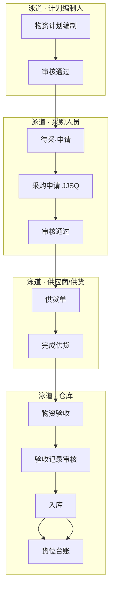

### 4.2 UF-02 计划采购（询价）全链路（泳道图）

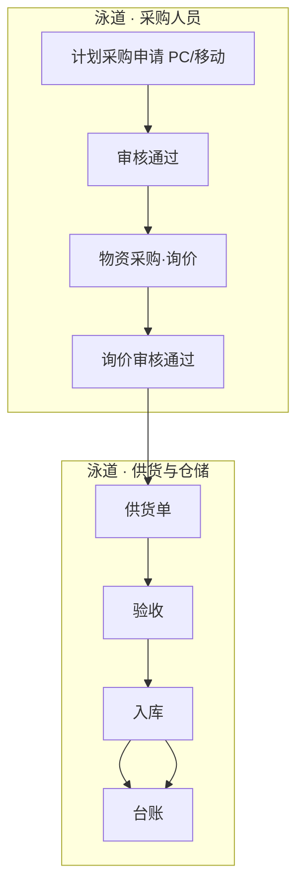

### 4.3 UF-03 领用出库全链路（泳道图）

```mermaid
flowchart TB
    subgraph uf3_user["泳道 · 领用人"]
        U1["领用申请"] --> U2["审核通过"] --> U3["领取记录·待领取"] --> U4["已领取"]
    end
    subgraph uf3_wh["泳道 · 仓库管理员"]
        W1["待出库"] --> W2["出库操作"] --> W3["物资归还"]
    end
    subgraph uf3_ret["泳道 · 借还（可选）"]
        R1["借还记录"] --> R2["待确认→已归还"]
    end
    U2 --> W1
    W2 --> U3
    W2 --> U4
    W3 --> R1
    R1 --> R2
```

### 4.4 UF-04 盘点差异闭环 [V1.1]（泳道图）

```mermaid
flowchart TB
    subgraph uf4_plan["泳道 · 计划"]
        CP1["盘点计划"] --> CP2["盘点任务"]
    end
    subgraph uf4_exec["泳道 · 执行"]
        CE1["盘点执行"] --> CE2["差异处理"]
    end
    subgraph uf4_adj["泳道 · 调整"]
        CA1["调货位/调整库存"] --> CA2["库存调整审核"] --> CA3["台账更新"]
    end
    CP2 --> CE1
    CE2 --> CA1
    CA2 --> CA3
```

### 4.5 UF-05 移动盘点现场作业 [V1.1]（泳道图）

```mermaid
flowchart TB
    subgraph uf5_app["泳道 · 移动 APP"]
        M1["首页·当前计划"] --> M2["任务列表/扫码"]
        M2 --> M3["录入实盘·提交"]
    end
    subgraph uf5_pc["泳道 · PC 后台"]
        P1["差异处理"] --> P2["调货位/调整库存"]
    end
    subgraph uf5_off["泳道 · 账外资产"]
        O1["账外登记"] --> O2["审核"] --> O3["入账"]
    end
    M3 -->|"有差异"| P1
    M2 --> O1
    P2 --> P3["台账更新"]
    O3 --> P3
```

### 4.6 UF-06 直采最短路径（泳道图）

```mermaid
flowchart LR
    subgraph uf6["泳道 · 采购 → 仓储"]
        F1["计划采购·直采"] --> F2["审核"] --> F3["物资采购·直采"] --> F4["审核"] --> F5["供货单"] --> F6["验收"] --> F7["入库"]
    end
```

### 4.7 UF-07 招标采购全链路（泳道图）

```mermaid
flowchart LR
    subgraph uf7["泳道 · 采购 → 仓储"]
        G1["计划采购申请"] --> G2["审核"] --> G3["物资采购·招标"] --> G4["审核"] --> G5["供货单"] --> G6["分批验收"] --> G7["入库"]
    end
```

### 4.8 UF-08 归还作废与库存（泳道图 + 状态分支）

```mermaid
flowchart TB
    subgraph uf8_out["泳道 · 出库后"]
        O1["出库·需归还"] --> O2["待归还"]
    end
    subgraph uf8_branch["泳道 · 分支处置"]
        direction TB
        B1{"处置方式"}
        B1 -->|"正常归还"| B2["归还入库→待确认→已归还"]
        B1 -->|"超期"| B3["已延期"]
        B1 -->|"作废"| B4["已作废·不恢复库存"]
        B3 --> B4
        B3 --> B2
    end
    subgraph uf8_ledger["泳道 · 库存影响"]
        L1["已归还：恢复 available"] 
        L2["已作废：scrap 审计"]
    end
    O2 --> B1
    B2 --> L1
    B4 --> L2
```

---

## 5. 页面清单与跳转关系

### 5.1 PC 端页面清单

| 模块 | 页面名称 | 类型 | 跳转关系 |
|------|----------|------|----------|
| 原型入口 | 双入口门户 | 首页 | → PC 工作台 / APP 首页 / 页面目录 |
| 工作台 | PC 工作台 | 首页 | → 统计卡片 / 作业待办 / 库存概览 |
| 物资台账 | 物资库存总览 | 列表 | → 详情弹窗 / 仓库台账 |
| 物资台账 | 仓库台账 | 列表 | → 货位详情弹窗 / 资产详情 / 流水 |
| 物资台账 | 出入库记录 | 列表 | → 流水详情弹窗 |
| 我的物资 | 领取记录 | 列表 | → 领用记录详情弹窗 |
| 我的物资 | 借还记录 | 列表 | → 归还详情 / 确认归还 |
| 物资申请 | 物资计划 | 列表 | → 新增物资计划 → 选择物资清单 |
| 物资申请 | 领用申请 | 列表 | → 新增 → 添加物资 |
| 采购管理 | 待采物资 | 列表 | → 查看计划（弹窗）/ 申请 |
| 采购管理 | 采购申请（急件 JJSQ） | 列表 | → 申请/选择 |
| 采购管理 | 计划采购申请（PC） | 表单 | `purchase_plan_apply.html` |
| 采购管理 | 物资采购 | 列表 | → 直采/询价/招标采购 |
| 采购管理 | 供应商供货单 | 列表 | → 完成供货 |
| 物资管理 | 物资验收 | 列表 | → 验收/完成供货 |
| 物资管理 | 待验物资 | 列表 | → 物资验收 |
| 物资管理 | 验收记录 | 子页 | → 查看（无独立侧栏） |
| 物资管理 | 物资入库/出库/归还/退货 | 列表 | → 对应表单 |
| 物资管理 | 物资作废 / 待报废池 | 列表 | → 执行作废 |
| 供应商 | 供应商列表/评价 | 列表 | → 表单 |
| 基础配置 | 计量单位/分类/验收标准/物资清单/仓库配置/使用地点/评价设置 | 列表+表单 | 各新增子页 |
| 库场盘点 | 盘点全模块 | 列表+表单 | [V1.1] 原型 11+6 页 |
| 系统 | 流程配置 | 配置 | 审批流模板 |
| 原型 | 页面目录 | 索引 | prototype_map（133 页） |

### 5.2 移动端页面清单

| 页面 | 文件 | V1.0 | 说明 |
|------|------|:----:|------|
| 资产确认 | 移动 H5（待实现） | ✓ | 扫码/列表确认、账外登记 |
| 计划采购申请 | 移动入口 + `purchase_plan_apply` 同源 | ✓ | 计划性采购 |
| 盘点首页 | app_count_home | ✗ | [V1.1] 演示 |
| 任务列表 | app_count_task_list | ✗ | [V1.1] |
| 盘点执行 | app_count_execute | ✗ | [V1.1] |
| 扫码盘点 | app_count_scan | ✗ | [V1.1] |
| 账外资产登记 | app_count_offbook | ✗ | [V1.1] 演示；V1.0 账外走资产确认流 |
| 个人中心 | app_count_profile | ✗ | [V1.1] |

### 5.3 全局导航结构（PC）

```
原型入口（index.html）
├── PC 工作台（pc_home.html）
├── 物资台账（物资库存总览、仓库台账、出入库记录）
├── 我的物资（领取记录、借还记录）
├── 物资申请（物资计划、领用申请）
├── 采购管理（待采物资、采购申请、物资采购、供货单）
├── 物资管理（待验物资、验收、验收记录、入库、出库、归还、退货、作废）
├── 供应商管理
├── 基础配置（含仓库配置、物资清单）
├── 流程配置
└── [V1.1] 库场盘点
```

### 5.4 PRD ↔ 原型 ↔ 侧栏映射表

| 模块 | PRD 章节 | 侧栏菜单 | 原型文件 | V1.0 |
|------|----------|----------|----------|:----:|
| 工作台 | §3.11 | 工作台 | `pc_home.html` | ✓ |
| 物资库存总览 | §3.1.0 | 物资台账 | `ledger_material.html` | ✓ |
| 仓库台账 | §3.1.1 | 仓库台账 | `ledger_warehouse.html` | ✓ |
| 出入库记录 | §3.1.2 | 出入库记录 | `ledger_transaction.html` | ✓ |
| 领取记录 | §3.2.1 | 领取记录 | `mine_pending_pickup.html` | ✓ |
| 借还记录 | §3.2.2 | 借还记录 | `mine_pending_return.html` | ✓ |
| 物资计划 | §3.3.1 | 物资计划 | `apply_plan_list.html` | ✓ |
| 领用申请 | §3.3.2 | 领用申请 | `apply_requisition_list.html` | ✓ |
| 消息中心 | §3.4.1 | **无** | `purchase_message.html` | ✗ V1.1 |
| 待采物资 | §3.4.2 | 待采物资 | `purchase_pending_list.html` | ✓ |
| 采购申请 | §3.4.3 | 采购申请 | `purchase_request_list.html` | ✓ |
| 计划采购申请 | §3.4.4 | **无** | `purchase_plan_apply.html` | ✓ |
| 物资采购 | §3.4.5 | 物资采购 | `purchase_execute_list.html` | ✓ |
| 供货单 | §3.4.6 | 供应商供货单 | `purchase_supply_list.html` | ✓ |
| 待验物资 | §3.12 | 待验物资 | `warehouse_pending_check.html` | ✓ |
| 物资验收 | §3.5.1 | 物资验收 | `warehouse_acceptance_list.html` | ✓ |
| 验收记录 | §3.5.2 | **无** | `warehouse_acceptance_record.html` | ✓ 子页 |
| 入库/出库/归还/退货 | §3.5.3–6 | 对应菜单 | `warehouse_*_list.html` | ✓ |
| 物资作废 | §3.5.7 | 物资作废 | `warehouse_scrap_list.html` | ✓ |
| 待报废池 | §3.5.7 | **无** | `warehouse_scrap_pending_pool.html` | ✓ |
| 供应商/评价 | §3.6 | 供应商列表/评价 | `supplier_*.html` | ✓ |
| 基础配置 | §3.7 | 配置类菜单 | `config_*.html` | ✓ |
| 规划内容 | §3.8 | **无** | `planning_*.html` | ✗ V1.1 |
| 库场盘点 | §3.9 | 盘点相关 | `count_*.html` / `app_count_*` | ✗ V1.1 |
| 流程配置 | §3.13 | 流程配置 | `system_workflow.html` | ✓ |

---

## 6. 非功能性需求

### 6.1 性能

| 指标 | 要求 |
|------|------|
| 列表页首屏加载 | ≤ 2s（1000 条以内数据） |
| 搜索/筛选响应 | ≤ 1s |
| 并发用户 | 支持 200 在线用户（项目级部署） |
| 移动端弱网 | 盘点/确认支持本地暂存，网络恢复后同步 |
| 扫码响应 | 资产确认/盘点扫码入库 ≤ 500ms（局域网） |
| 库存事务 | 出入库/调整强一致，台账列表查询可最终一致（≤ 3s） |

### 6.2 安全

- 全站 HTTPS 传输
- 登录态 Token 过期时间 8 小时，支持续期
- 操作审计：出入库、库存调整、审批、作废、账外资产确认等关键操作留痕
- 审计日志保留 ≥ 3 年
- 敏感字段（供应商联系方式等）按角色脱敏展示

### 6.3 可用性

- PC 端兼容 Chrome 90+、Edge 90+
- 移动端适配 iOS 14+、Android 10+ 浏览器
- 表单必填项明确标识（红色 *）
- 删除操作统一磁吸弹窗二次确认

### 6.4 可靠性

- 核心业务（入库、出库、库存调整）需事务保证，防止超卖
- 每日凌晨自动备份数据库
- 审批流异常支持管理员重试/撤回

### 6.5 扩展性

- 物资分类、审批流程、评价指标支持配置化扩展
- 预留与 ERP/财务系统对接 API（V1.0 可不实现）

### 6.6 数据导入导出

- 仓库台账、出入库记录支持 Excel 导出
- 物资清单、供应商列表支持 Excel 模板导入（V1.0 可选实现，优先级 P2）
- 二维码批量下载（仓库台账勾选后打包 ZIP）

### 6.7 身份认证与组织 [V1.0]

| 项 | 要求 |
|----|------|
| 登录 | 账号 + 密码；HTTPS；失败 5 次锁定 15 分钟 |
| 会话 | JWT/Session Token，有效期 8h，活动续期 |
| 组织 | 部门树（至少 2 级：公司 → 部门）；用户归属单部门 |
| 仓库绑定 | 仓库管理员、验收人员（可选）绑定 `warehouse_ids[]` |
| 初始化 | 系统预置 admin、默认主仓库、预置审批流模板（§3.13） |
| 与审批 | 部门负责人 = 用户表中 `dept.leader_id`；未配置时审批节点跳过或转管理员（可配置） |

### 6.8 操作审计 [V1.0]

| 字段 | 说明 |
|------|------|
| audit_id | 主键 |
| action | 枚举：INBOUND, OUTBOUND, RETURN_CONFIRM, SCRAP, APPROVE, REJECT, … |
| biz_type / biz_id | 关联单据 |
| operator_id | 操作人 |
| operated_at | 时间戳 |
| before_json / after_json | 关键字段快照（可选） |
| ip | 客户端 IP |

保留 ≥3 年；支持按单据号、操作人、时间范围查询导出。

---

## 7. 系统功能清单

| 一级模块 | 二级功能 | 功能概述 |
|----------|----------|----------|
| 物资台账 | 物资库存总览 | 分类树 + 库存列表，统计卡（预警/借出/待报废） |
| 物资台账 | 仓库台账 | 树形货位 + 库存列表，二维码下载 |
| 物资台账 | 出入库记录 | 出入库流水查询与详情 |
| 我的物资 | 领取记录 | 领用领取全状态跟踪（待领取/已领取） |
| 我的物资 | 借还记录 | 借出归还全生命周期（含待确认） |
| 物资申请 | 物资计划 | 需求计划编制与审批 |
| 物资申请 | 领用申请 | 领用申请与审批 |
| 采购管理 | 待采物资 | 急件待采购清单 |
| 采购管理 | 采购申请 | 急件采购申请（JJSQ） |
| 采购管理 | 计划采购申请 | 计划性采购（PC/移动） |
| 采购管理 | 物资采购 | 直采/询价/招标执行 |
| 采购管理 | 供应商供货单 | 供货进度管理 |
| 物资管理 | 物资作废 | 待报废池与作废执行 |
| 物资管理 | 物资验收 | 分批验收 |
| 物资管理 | 验收记录 | 验收明细与审核 |
| 物资管理 | 物资入库 | 货位入库 |
| 物资管理 | 物资出库 | 分类出库 |
| 物资管理 | 物资归还 | 归还/作废 |
| 物资管理 | 物资退货 | 退货登记 |
| 供应商管理 | 供应商列表 | 供应商档案 |
| 供应商管理 | 供应商评价 | 绩效评价 |
| 基础配置 | 计量单位 | 单位主数据 |
| 基础配置 | 分类管理 | 大类/子类 |
| 基础配置 | 验收标准 | 验收规则 |
| 基础配置 | 物资清单 | 物资目录 |
| 基础配置 | 仓库配置 | 仓库/分区/货架 |
| 基础配置 | 使用地点 | 场外地点 |
| 基础配置 | 评价设置 | 权重/等级 |
| 规划内容 | 场内/场外 | 物资分布视图（**V1.1**） |
| 库场盘点 | 盘点计划 | 计划管理（**V1.1**） |
| 库场盘点 | 盘点任务 | 任务分解（**V1.1**） |
| 库场盘点 | 盘点执行 | 现场盘点（**V1.1**） |
| 库场盘点 | 差异处理 | 差异处置（**V1.1**） |
| 库场盘点 | 调货位 | 货位变更（**V1.1**） |
| 库场盘点 | 库存调整 | 调整审核（**V1.1**） |
| 原型入口 | 双端门户 | PC/APP 切换 |
| 工作台 | PC 工作台 | 统计卡片 + 作业待办 |
| 物资管理 | 待验物资 | 验收待办视图 |
| 系统 | 流程配置 | 审批流模板 |
| 移动端 | 移动盘点 | 扫码/执行/账外/个人中心（**V1.1**） |
| 移动端 | 资产确认 | 现场资产核对 |
| 移动端 | 计划采购申请 | 移动计划性采购（**V1.0**） |

---

## 8. 权限与数据范围矩阵

### 8.1 功能权限矩阵（菜单/操作）

| 功能模块 | 系统管理员 | 仓库管理员 | 采购人员 | 计划编制人 | 领用人 | 验收人员 | 审批人 |
|----------|:----------:|:----------:|:--------:|:----------:|:------:|:--------:|:------:|
| 工作台 | ✓ | ✓ | ✓ | ✓ | ✓ | ✓ | ✓ |
| 仓库台账-查看 | ✓ | ✓ | ✓ | ✓ | ✓ | ✓ | ✓ |
| 仓库台账-二维码 | ✓ | ✓ | — | — | — | — | — |
| 出入库记录 | ✓ | ✓ | — | — | 本人相关 | ✓ | — |
| 领取记录/借还记录 | ✓ | ✓ | — | — | ✓ | — | — |
| 物资计划-编制 | ✓ | — | — | ✓ | — | — | — |
| 物资计划-审核 | ✓ | — | — | — | — | — | ✓ |
| 领用申请-编制 | ✓ | — | — | — | ✓ | — | — |
| 领用申请-审核 | ✓ | ✓ | — | — | — | — | ✓ |
| 待采/采购申请 | ✓ | — | ✓ | — | — | — | ✓ |
| 物资采购/供货单 | ✓ | ✓ | ✓ | — | — | — | ✓ |
| 待验/验收/入库 | ✓ | ✓ | — | — | — | ✓ | ✓ |
| 出库/归还/退货 | ✓ | ✓ | — | — | — | — | — |
| 供应商管理 | ✓ | — | ✓ | — | — | — | — |
| 基础配置/流程配置 | ✓ | — | — | — | — | — | — |
| 盘点全模块（V1.1） | ✓ | ✓ | — | — | — | — | ✓ |
| 物资作废/待报废 | ✓ | ✓ | — | — | — | — | — |
| 资产确认(移动) | ✓ | ✓ | — | — | — | ✓ | — |

> ✓=可用，—=不可用，「本人相关」=仅关联本人的出库流水。

### 8.2 数据范围规则

| 角色 | 列表数据范围 | 说明 |
|------|--------------|------|
| 系统管理员 | 全部 | 含所有仓库、所有单据 |
| 仓库管理员 | 分管仓库 | 用户档案绑定 warehouse_ids；台账/入出库/盘点仅限这些仓库 |
| 采购人员 | 全部采购域单据 | 采购/供货/待采；不含他人领用单 |
| 计划编制人 | 本人计划 | plan.created_by = 当前用户 |
| 领用人 | 本人申请及衍生 | requisition.created_by = 当前用户 |
| 验收人员 | 全部验收单 | V1.0 不按仓库限制；V1.1 可收紧 |
| 审批人 | 待办+已办 | 审批任务分配到的单据 |

---

## 9. 数据模型与字段字典

### 9.1 实体关系（ER 概览）

> 库存采用 **汇总层 + 货位层** 双表（见 §9.2）；下图按业务域分组。

```mermaid
erDiagram
    MATERIAL_CATALOG ||--o{ INVENTORY_SUMMARY : "汇总视图"
    MATERIAL_CATALOG ||--o{ INVENTORY_LOCATION : "货位账本"
    WAREHOUSE ||--o{ ZONE : contains
    ZONE ||--o{ SHELF : contains
    SHELF ||--o{ INVENTORY_LOCATION : stores

    MATERIAL_PLAN ||--o{ PLAN_LINE : contains
    MATERIAL_PLAN ||--o{ PENDING_PURCHASE : "急件计划生成"

    PURCHASE_REQUEST ||--o{ SUPPLY_ORDER : generates
    PLAN_PROCURE_REQUEST ||--o{ PROCURE_ORDER : generates
    SUPPLY_ORDER ||--o{ ACCEPTANCE_ORDER : accepts
    ACCEPTANCE_ORDER ||--o{ INBOUND_ORDER : inbound

    REQUISITION ||--o{ OUTBOUND_ORDER : outbound
    OUTBOUND_ORDER ||--o{ RETURN_TRACKING : may_return
    RETURN_TRACKING ||--o{ RETURN_ORDER : confirms

    INVENTORY_LOCATION ||--o{ STOCK_TRANSACTION : logs
    INVENTORY_SUMMARY }o--o{ INVENTORY_LOCATION : "聚合同步"

    SCRAP_POOL ||--o{ SCRAP_ORDER : disposes
    SCRAP_ORDER ||--o{ STOCK_TRANSACTION : scrap_log

    COUNT_PLAN ||--o{ COUNT_TASK : splits
    COUNT_TASK ||--o{ COUNT_RESULT : produces
    COUNT_RESULT ||--o{ STOCK_ADJUSTMENT : adjusts

    MATERIAL_CATALOG {
        string material_code PK
        string material_type "fixed|quasi|consumable"
        boolean need_return
        int borrow_days
    }
    INVENTORY_SUMMARY {
        string summary_id PK
        string material_code
        string asset_code "固资"
        decimal qty_total
        decimal available
        decimal borrowed
    }
    INVENTORY_LOCATION {
        string location_id PK
        string material_code
        string asset_code "固资必填"
        string shelf_id FK
        decimal qty
        decimal available
        decimal locked
        string status
    }
    STOCK_TRANSACTION {
        string txn_id PK
        string txn_type "in|out|return|scrap|adjust"
        decimal qty
        datetime operated_at
    }
```

### 9.2 库存两层模型 [V1.0]

系统采用 **汇总层 + 货位层** 双账本，禁止混为一张表硬凑。

#### 9.2.1 物资汇总（`inventory_summary`）

| 用途 | 页面 |
|------|------|
| 全公司按物资编码聚合：在库总量、可用、锁定、借出 | 物资库存总览 `ledger_material` |

| 物资类型 | 粒度 | 唯一键 |
|----------|------|--------|
| 固定资产 | 按 `asset_code` 一行（qty 恒为 1） | `asset_code` |
| 类资产 / 耗材 | 按 `material_code` 一行 | `material_code` |

汇总行由货位层 **异步或事务内同步** 聚合（V1.0 建议同事务更新以保证 KPI 一致性）。

**两层模型关系图**：

```mermaid
flowchart LR
    subgraph layer_loc["货位层 inventory_location"]
        L1["编码+货位 多行"]
        L2["固定资产 1 资产 1 行"]
    end

    subgraph layer_sum["汇总层 inventory_summary"]
        S1["按 material_code 聚合"]
        S2["固资按 asset_code 一行"]
    end

    subgraph pages["页面对应"]
        P1["仓库台账"]
        P2["物资库存总览"]
    end

    L1 -->|"SUM qty/available"| S1
    L2 --> S2
    L1 --> P1
    S1 --> P2
    S2 --> P2
```

#### 9.2.2 货位账本（`inventory_location`）

| 用途 | 页面 |
|------|------|
| 仓库 → 分区 → 货架上的数量与状态 | 仓库台账 `ledger_warehouse` |

| 物资类型 | 粒度 | 唯一键 |
|----------|------|--------|
| 固定资产 | 1 资产 1 行，qty=1 | `asset_code` |
| 类资产 / 耗材 | 同编码同货位合并数量 | `material_code + warehouse_id + zone_id + shelf_id` |

**字段要点**：`qty`、`available`、`locked`、`borrowed`、`status`（在库/借出/待报废等）、`asset_code`（固定资产必填）。

#### 9.2.3 流水（`stock_transaction`）

所有入出库、归还、退货、作废、调整均写入流水；列表页「出入库记录」与此表对应，类型含入库/出库/归还/退货/调整/作废。

**V1.0 说明**：耗材暂不启用独立批次表；FIFO 在出库时按 `inventory_location.inbound_time` 排序扣减。

### 9.3 核心单据链（泳道图）

```mermaid
flowchart TB
    subgraph doc_purchase["泳道 · 采购入库链"]
        direction LR
        D1["物资计划 JH/JJJH"] --> D2["待采物资"]
        D2 --> D3["采购申请 JJSQ"]
        D4["计划采购 PC"] --> D5["物资采购 MC"]
        D3 --> D6["供货单 GH"]
        D5 --> D6
        D6 --> D7["验收单 YS"] --> D8["入库单 RK"] --> D9["货位账本 + 物资汇总"]
    end

    subgraph doc_requisition["泳道 · 领用归还链"]
        direction LR
        R1["领用申请 LY"] --> R2["出库单 CK"] --> R3["台账扣减"]
        R3 --> R4["归还单 HK"]
        R4 --> R5["台账恢复/待确认"]
    end
```

### 9.4 核心字段字典（节选）

| 实体 | 字段 | 类型 | 必填 | 说明 |
|------|------|------|:----:|------|
| 物资计划 | plan_no | string | ✓ | 见 §15；一般 `JH`、急件 `JJJH` |
| 物资计划 | plan_type | enum | ✓ | 一般计划 / 急件计划 |
| 物资计划 | status | enum | ✓ | 草稿/审核中/审核通过/审核失败 |
| 采购申请 | request_no | string | ✓ | 急件 `JJSQ`；计划采购 `PC` |
| 采购申请 | total_amount | decimal | ✓ | 采购总额，编辑时不可改 |
| 领用申请 | requisition_no | string | ✓ | 领用申请单号 |
| 货位账本 | asset_code | string | 条件 | 固定资产必填，全局唯一 |
| 货位账本 | qty | decimal | ✓ | 固定资产恒为 1 |
| 出库单 | outbound_no | string | ✓ | 出库单号 |
| 归还跟踪 | due_date | date | 条件 | = 出库日 + 借用周期 |
| 归还跟踪 | status | enum | ✓ | 待归还/已延期/部分归还/待确认/已归还/已作废 |
| 盘点计划 | freeze_stock | boolean | ✓ | [V1.1] 是否冻结范围内出入库 |

---

## 10. 三类物资全链路业务规则

| 环节 | 固定资产 | 类资产 | 耗材 |
|------|----------|--------|------|
| 物资计划 | 可计划，按件数 | 可计划，按数量 | 可计划，按数量 |
| 急件→待采 | 急件计划审核后进入 | 同左 | 同左 |
| 验收入库 | 每件生成唯一 asset_code，打印二维码 | 按数量入库，物资编码标识 | 按数量入库 |
| 台账 | 1 资产 1 行（货位层） | 货位层多行按编码+货位；汇总层 1 编码 1 行 | 数量型 |
| 领用出库 | 必须指定 asset_code 出库 | 指定数量，可选具体货位 | 指定数量，FIFO 扣减 |
| 是否归还 | 分类配置「归还=是」则强制 | 同左 | 默认否，不生成归还 |
| 借用周期 | 分类/子类配置（天） | 同左 | — |
| 盘点 [V1.1] | 按 asset_code 逐件盘 | 按编码+货位盘数量 | 按编码+货位盘数量 |
| 退货 | 按 asset_code 退 | 按数量退 | 按数量退 |
| 场外视图 | 出现在场内/场外 | 同左 | 仅场内，不出现在场外列表 |

**「需归还」判定优先级**：物资子类「是否归还」配置 > 物资清单实例覆盖（若允许）> 领用时不可改。

---

## 11. 库存管理规则

### 11.1 库存预留（锁定）

| 时机 | 规则 |
|------|------|
| 领用申请审核通过 | 按申请明细**预留**库存（available → locked） |
| 出库完成 | 预留转为实际扣减（locked → 0，qty 减少） |
| 申请驳回/撤回 | 释放预留 |
| 采购验收入库 | 不预留，直接增加 available |

**校验**：可用库存 = 台账 qty − 已锁定 qty；出库/预留时 available ≥ 申请数量，否则阻断并提示。

### 11.2 出库分配策略

| 类型 | 策略 |
|------|------|
| 固定资产 | 人工选择 asset_code；仅 status=在库 的可选 |
| 类资产 | 默认指定货位；未指定则按**最早入库时间 FIFO**在同一仓库内分配 |
| 耗材 | FIFO 按货位维度扣减；允许单出库单拆多个货位行 |

### 11.3 入库货位规则

- 入库时必须选择 仓库/分区/货架
- 固定资产：每个 asset_code 独立一行，货位不可与另一在库资产冲突（同一 asset 仅一处）
- 类资产/耗材：同编码同货位可累加 qty

### 11.4 负库存与超发

- **固定资产/类资产**：禁止负库存
- **耗材**：V1.0 禁止负库存；出库数量不得大于可用+预留
- **部分出库**：允许，出库单 status=部分出库，剩余继续待出库
- **超发**：禁止；需修改领用申请并重新审批

### 11.5 作废对库存的影响

| 场景 | 库存影响 |
|------|----------|
| 归还作废 | 资产标记已作废，**不恢复**库存；写入 txn_type=scrap 审计 |
| 盘亏调整 [V1.1] | 调整库存减少 qty，需审批 |
| 退货已确认 | 扣减 qty，写入退货出库流水 |

### 11.6 并发控制

- 出库/入库/调整对同一 ledger_id 或 asset_code 使用**乐观锁**（version 字段）
- 冲突时提示「库存已被其他人操作，请刷新后重试」

### 11.7 归还确认与库存时点 [V1.0]

与 §3.2.3 一致：仓管归还入库 → 货位 `qty` 增加；借用人确认前，类资产/耗材的 `available` 不完全释放（可用 `pending_confirm_qty` 字段或等价锁定）；确认后 `available` 恢复正常。固定资产 `asset_status`：借出 → 待确认 → 在库。

---

## 12. 采购路径决策

### 12.1 三条采购入口对照

| 路径 | 触发条件 | 入口页面 | 下游 |
|------|----------|----------|------|
| **A. 急件采购** | 物资计划 plan_type=**急件计划** 且审核通过 | 待采物资 → 采购申请 | 审核通过后 → 供货单 → 验收（**不经过**物资采购模块） |
| **B. 计划采购** | 用户主动新建计划采购申请 | 计划采购申请（计划申请 Tab） | 审核通过 → 物资采购（直采/询价/招标）→ 供货单 |
| **C. 计划采购-急件申请** | 用户在计划采购申请选「急件申请」Tab | 计划采购申请（急件申请 Tab） | 同 B，但采购方式通常为非招标急采 |

### 12.2 采购路径决策（决策树 + 泳道）

```mermaid
flowchart TB
    Start(["需要采购"]) --> Q1{"是否已有<br/>急件物资计划?"}

    Q1 -->|"是 · 路径 A"| LaneA["泳道 · 急件采购"]
    LaneA --> A1["待采物资"] --> A2["采购申请 JJSQ"] --> A3["供货单 → 验收 → 入库"]

    Q1 -->|"否"| Q2{"是否计划性<br/>批量采购?"}

    Q2 -->|"是 · 路径 B/C"| LaneB["泳道 · 计划采购"]
    LaneB --> B1["计划采购申请 PC"] --> B2{"采购方式"}
    B2 --> B3["直采"]
    B2 --> B4["询价"]
    B2 --> B5["招标"]
    B3 & B4 & B5 --> B6["物资采购审核 MC"] --> B7["供货单 → 验收 → 入库"]

    Q2 -->|"否"| LaneC["泳道 · 补充路径"]
    LaneC --> C1["新建急件计划<br/>或直接计划采购"]
    C1 --> Q1
```

### 12.3 互斥与约束

- 同一物资计划行：**不可同时**存在于待采物资与计划采购申请明细（系统去重校验）
- 一般计划审核通过：**仅**作为领用依据，不生成待采物资
- 急件计划审核通过：自动生成待采物资，**不可**重复手工添加同一 plan_line
- 采购方式在计划采购申请时选定，后续物资采购模块只读展示

---

## 13. 盘点策略与差异处理（V1.1）

> 本章规则适用于 V1.1 库场盘点模块；V1.0 仅保留物资清单/分类中「是否需要盘点」配置字段，不触发盘点业务。

### 13.1 盘点范围

| 配置项 | 选项 |
|--------|------|
| 范围 | 全库 / 指定仓库 / 指定分区 / 指定货架 / 指定物资大类 |
| 方式 | 明盘（显示系统库存）/ 盲盘（V1.0 可选，默认明盘） |
| 冻结 | 默认**冻结**范围内出入库；冻结期间相关入库/出库按钮 disabled |

### 13.2 执行规则

- 固定资产：按 asset_code 逐项扫码或勾选确认
- 类资产/耗材：按货位录入实盘数量
- 移动端离线：本地缓存盘点结果，同步时以**服务端完成时间戳优先**；冲突项标记待人工复核

### 13.3 差异类型与处理方式

| 差异类型 | 定义 | 处理方式 |
|----------|------|----------|
| 盘盈 | 实盘 > 账存 | **调整库存** 增加 qty，需审批 |
| 盘亏 | 实盘 < 账存 | **调整库存** 减少 qty，需审批 |
| 货位不符 | 数量对但货位错 | **调货位**，总量不变，无需数量审批 |
| 资产状态异常 | 账上有但实物报废 | 调整库存 + 可选作废流程 |

### 13.4 调货位 vs 调整库存（决策树）

```mermaid
flowchart TD
    Start(["盘点差异处理"]) --> Q1{"差异类型?"}

    Q1 -->|"货位不符<br/>数量一致"| A["调货位"]
    A --> A1["生成货位变更单"]
    A1 --> A2["自动生效或轻量审核"]
    A2 --> End1(["货位更新·总量不变"])

    Q1 -->|"盘盈 / 盘亏<br/>数量不符"| B["调整库存"]
    B --> B1["生成库存调整单 TZ"]
    B1 --> B2["必须审批后生效"]
    B2 --> End2(["qty 增减·写入流水"])

    Q1 -->|"资产状态异常"| C["调整库存 + 可选作废"]
    C --> B1
```

---

## 14. 异常场景与边界规则

### 14.1 验收异常

| 场景 | 处理 |
|------|------|
| 分批验收，累计 < 需求 | 保持验收中；可继续验收 |
| 累计 = 需求 | 自动变已验收，生成对应待入库 |
| 供应商提前结束供货（完成供货） | 未验收部分不再等待，按已供货数量关闭验收 |
| 验收不合格 | 合格数量入库；不合格走退货或减少待入库 |
| 验收标准校验 | 提交验收时读取 3.7.3 配置，不符合则警告或阻断（管理员可配置强度） |

### 14.2 入库/出库异常

| 场景 | 处理 |
|------|------|
| 验收 100，仅入库 60 | 允许部分入库；剩余保持待入库 |
| 领用 10，库存仅 8 | 审核通过后预留失败，提示仓库；出库时阻断 |
| 同一 asset 重复出库 | 第二次出库阻断，asset status=已出库 |

### 14.3 审批异常

- 发起人撤回：下一节点未处理时可撤回，状态回草稿
- 审批流配置变更：仅对新单生效
- 超时 72h：工作台待办高亮提醒，不自动通过

### 14.4 待办与提醒规则 [V1.0]

> V1.0 无独立消息中心；以下事件写入 **工作台待办**（及可选邮件/企微，V1.1）。

| 事件类型 | 触发 | 呈现 |
|----------|------|------|
| 待审批 | 单据提交到当前用户 | 工作台作业待办 |
| 待入库/出库 | 上一环节完成 | 工作台统计卡片 + 待办 |
| 借还超期 | 每日批处理，`due_date < today` 且未归还 | 工作台卡片 → 借还记录 |
| 归还待确认 | 仓管归还入库 | 借还记录 Tab + 工作台待办（借用人） |
| 归还待确认超时 | 7 日未确认 | 工作台提醒（不自动确认） |
| 库存下限预警 | 耗材/类资产 `available < min_stock` | 物资清单预警列、工作台可选 |
| 审批超时 | 72h 未处理 | 工作台待办高亮 |
| 盘点任务 [V1.1] | 任务下发 | V1.1 启用 |

---

## 15. 单据编号规则

| 单据 | 前缀 | 格式示例 | 重置 | 范围 |
|------|------|----------|------|------|
| 物资计划（一般） | JH | JH202606090001 | 按日 | [V1.0] |
| 物资计划（急件） | JJJH | JJJH202606080001 | 按日 | [V1.0] |
| 领用申请 | LY | LY202606090001 | 按日 | [V1.0] |
| 急件采购申请 | JJSQ | JJSQ202606050001 | 按日 | [V1.0] |
| 计划采购申请 | PC | PC202606090001 | 按日 | [V1.0] |
| 通用采购申请 | CG | CG202606090001 | 按日 | 保留，手工新建场景 |
| 物资采购单 | MC | MC202606090001 | 按日 | [V1.0] |
| 供货单 | GH | GH202606090001 | 按日 | [V1.0] |
| 验收单 | YS | YS202606090001 | 按日 | [V1.0] |
| 入库单 | RK | RK202606090001 | 按日 | [V1.0] |
| 出库单 | CK | CK202606090001 | 按日 | [V1.0] |
| 归还单 | HK | HK202606090001 | 按日 | [V1.0] |
| 盘点计划 | PD | PD202606090001 | 按日 | [V1.1] |
| 库存调整 | TZ | TZ202606090001 | 按日 | [V1.1] |
| 固定资产编码 | ZC | ZC202606090012 | 按日 | [V1.0] |

**规则**：单号全局唯一；并发通过 DB 序列或 Redis INCR 生成；禁止手工修改。

---

## 16. 页面-状态-操作矩阵（核心）

> 研发按本矩阵实现按钮可见性与路由；弹窗类操作标注 **[弹窗]**。权限不足时按钮置灰（见 §8.1）。

### 16.1 物资台账

| 页面 | 状态/条件 | 可用操作 | 目标 |
|------|-----------|----------|------|
| 物资库存总览 | 任意行 | 查看 **[弹窗]**、流水 | `ledger_material_detail` / 出入库记录 |
| 物资库存总览 | 固定资产行 | 资产详情 | `ledger_asset_detail` |
| 物资库存总览 | 统计卡-待报废 | 跳转 | 待报废池 |
| 仓库台账 | 固定资产行 | 查看、二维码、下载 | 资产详情弹窗 / 二维码页 |
| 仓库台账 | 类资产/耗材行 | 查看、库存、流水 | 货位详情弹窗 / 物资库存弹窗 / 出入库记录 |
| 出入库记录 | 任意行 | 查看 **[弹窗]** | `ledger_transaction_detail` |

### 16.2 我的物资

| 页面 | 状态 | 可用操作 | 目标 |
|------|------|----------|------|
| 领取记录 | 待领取 | 查看 **[弹窗]** | `mine_requisition_record` |
| 领取记录 | 已领取 | 查看 **[弹窗]** | `mine_requisition_record` |
| 借还记录 | 待归还/已延期 | 查看 | 归还单详情 |
| 借还记录 | 待确认 | 查看、确认 | `mine_return_confirm` |
| 借还记录 | 部分归还 | 查看 | 归还单详情 |
| 借还记录 | 已归还/已作废 | 查看 | 归还单详情 |

### 16.3 物资申请与采购

| 页面 | 状态 | 可用操作 | 目标 |
|------|------|----------|------|
| 物资计划 | 草稿/审核失败 | 查看、编辑、发起审核、删除 | 新增物资计划 |
| 物资计划 | 审核中 | 查看、审核 | 审核弹窗 |
| 物资计划 | 审核通过 | 查看 | — |
| 领用申请 | 草稿/审核失败 | 查看、编辑、发起审核、删除 | 新增领用申请 |
| 领用申请 | 审核中 | 查看、审核 | 审核弹窗 |
| 领用申请 | 审核通过 | 查看 | — |
| 待采物资 | 待申请 | 查看计划 **[弹窗]**、申请 | `purchase_pending_plan_detail` / 采购申请 |
| 待采物资 | 已申请 | 查看申请 | 采购申请详情 |
| 采购申请（急件） | 草稿/审核失败 | 查看、编辑、发起审核、删除 | 申请页 |
| 采购申请（急件） | 审核中 | 查看、审核 | 审核弹窗 |
| 采购申请（急件） | 审核通过 | 查看 | 供货单 |
| 计划采购申请 | 草稿/审核失败 | 保存、发起审核、删除 | `purchase_plan_apply.html` |
| 计划采购申请 | 审核中 | 查看、审核 | — |
| 计划采购申请 | 审核通过 | 查看 | 物资采购 |
| 物资采购 | 待执行 | 查看、直采/询价/招标 | 对应采购页 |
| 物资采购 | 审核中/已完成 | 查看 | — |
| 供应商供货单 | 待供货 | 查看、完成供货 | 完成供货页 |
| 供应商供货单 | 已供货 | 查看 | — |

### 16.4 物资管理

| 页面 | 状态 | 可用操作 | 目标 |
|------|------|----------|------|
| 待验物资 | 待验收 | 查看、验收 | 物资验收 |
| 物资验收 | 待验收/验收中 | 查看、验收、完成供货 | 验收页 |
| 物资验收 | 已验收 | 查看 | — |
| 验收记录 | 待审核 | 查看、审核 | 审核弹窗 |
| 验收记录 | 已通过 | 查看 | — |
| 物资入库 | 待入库 | 查看、入库 | 入库页 |
| 物资入库 | 已入库 | 查看 | — |
| 物资出库 | 待出库 | 查看、出库 | 分类出库页 |
| 物资出库 | 已出库/部分出库 | 查看 | — |
| 物资归还（仓管） | 待归还/已延期 | 查看、归还、作废 | 归还/作废页 |
| 物资归还（仓管） | 待确认 | 查看 | —（确认仅借用人） |
| 物资归还（仓管） | 已归还/已作废 | 查看 | — |
| 物资退货 | 草稿 | 查看、编辑、确认、删除 | 新增退货页 |
| 物资退货 | 已确认 | 查看 | — |
| 待报废池 | 待处置 | 查看、发起作废 | 物资作废新增 |
| 物资作废 | 待执行 | 查看、执行 | 执行作废页 |
| 物资作废 | 已执行 | 查看 | — |
| 库存调整 [V1.1] | 待审核 | 查看、审核 | — |
| 库存调整 [V1.1] | 已通过 | 查看 | — |

### 16.5 基础配置与供应商

| 页面 | 状态/条件 | 可用操作 | 目标 |
|------|-----------|----------|------|
| 物资清单 | 启用 | 查看 **[弹窗]**、编辑、停用 | 编辑表单 |
| 物资清单 | 停用 | 查看、启用 | — |
| 物资清单 | 批量选中 | 批量停用 | — |
| 仓库配置-树 | 仓库/分区节点 | 新增、编辑、删除 | 表单（有库存引用时阻断删除） |
| 仓库配置-货架 | 启用 | 查看、编辑、二维码、下载、删除、停用 | 货架表单 / 货位码 |
| 仓库配置-货架 | 停用 | 查看、编辑、启用 | 二维码/下载置灰 |
| 仓库配置-工具栏 | 已选启用货架 | 批量下载货位码 ZIP | — |
| 分类管理 | 未引用 | 新增、编辑、删除、停用 | 表单 |
| 分类管理 | 已引用 | 编辑、停用 | 不可删除 |
| 供应商列表 | 任意 | 查看、编辑、新增 | 供应商表单 |
| 供应商评价 | 草稿/审核失败 | 查看、编辑、发起审核、删除 | 评价表单 |
| 供应商评价 | 审核中 | 查看、审核 | — |
| 供应商评价 | 审核通过 | 查看 | — |
| 流程配置 | 模板 | 查看、编辑、启用/停用 | 流程模板页 |

---

## 17. 附录

### 17.1 原型来源

本 PRD 基于以下来源整理：

1. **Axure 原型**（`axure/`）：站点地图与页面内嵌需求注释
2. **交互原型 V1.0**（`prototype/`）：133 页静态 HTML，GitHub Pages 部署
   - 入口：`prototype/index.html`
   - 生成脚本：`prototype/scripts/generate-pages.mjs`
   - 在线地址：https://liaoliao66.github.io/wms/
   - 部署：`.github/workflows/deploy-pages.yml`（构建 Tailwind + Font Awesome 后上传）

### 17.2 后续迭代 backlog

1. **库场盘点**（PC 全模块 + 移动 APP）
2. 供应商外部门户与账号体系
3. 库间调拨、跨项目调拨
4. 审批流条件分支（按金额/类别路由）与会签
5. 财务系统 / 固定资产卡片对接
6. 安全库存自动补货、MRP
7. 耗材批次/效期管理

### 17.3 修订记录

| 版本 | 日期 | 说明 |
|------|------|------|
| V1.0.0 | 2026-06-09 | 基于 Axure 原型首次生成完整 PRD |
| V1.1.0 | 2026-06-09 | 补充权限矩阵、数据模型、库存规则、采购路径、盘点策略、异常场景、单据编号、核心操作矩阵；新增工作台/待验物资/流程配置模块 |
| V1.2.0 | 2026-06-11 | 对齐交互原型：双入口门户、PC 工作台统计/待办、库场盘点 PC 11 页 + APP 6 页（iOS 18 / 3 Tab）；盘点模块纳入 V1.0 In Scope |
| V1.3.0 | 2026-06-16 | 对齐原型迭代：① V1.0 范围调整，库场盘点移至 V1.1；② 菜单更名领取记录/借还记录，补充待确认状态；③ 详情弹窗规范（流水/货位/计划/领用）；④ 仓库台账树形筛选与差异化操作列；⑤ 物资清单分类树+动态列+类资产库存必填；⑥ 仓库配置移除重复 Tab，明确货位码/资产码；⑦ 待采物资「查看计划」改弹窗 |
| V1.3.1 | 2026-06-16 | 研发评审收口：① 术语对照表、V1.0 研发交付清单、范围标签；② 单号规则区分 JH/JJJH、JJSQ/PC；③ 库存两层模型（汇总+货位）；④ 归还确认规则与库存时点；⑤ 消息中心标 V1.1，待办归工作台；⑥ 认证/组织/审批技术约束；⑦ KPI 统计口径；⑧ §16 操作矩阵扩展至全 V1.0 页面；⑨ §17.4 验收用例清单 |
| V1.3.2 | 2026-06-16 | 流程图标准化：新增 §2.0 图例；§2.1–§2.6、§4、§9.3、§12.2 改为泳道图；§2.7–§2.11、§3 模块状态机增强；§2.12–§2.13 时序图补 alt/opt；§9.1 ER 对齐双账本；§13.4 决策树；§9.2 两层模型关系图 |

### 17.4 V1.0 验收用例清单

> 测试按用例 ID 执行；与 §1.5 KPI 及核心规则一一对应。`[P0]` 为上线阻断项。

| ID | 优先级 | 场景 | 前置条件 | 关键步骤 | 预期结果 | 关联 |
|----|:------:|------|----------|----------|----------|------|
| AC-01 | P0 | 急件计划 → 待采 → 采购入库 | 物资清单、供应商、仓库已配置 | 新建急件计划 → 审核通过 → 待采申请 JJSQ → 供货验收入库 | 生成待采行；单号前缀 JJJH/JJSQ；台账 qty 增加；有 audit_log | §12.1、§15 |
| AC-02 | P0 | 一般计划不走待采 | 同上 | 新建一般计划 → 审核通过 | 不生成待采物资；可新建领用申请 | §12.3 |
| AC-03 | P0 | 领用 → 出库 → 领取记录 | 库存充足 | 领用审核 → 出库 → 查看领取记录 | 待领取→已领取；货位 qty 扣减；出库流水可查 | §3.2.1 |
| AC-04 | P0 | 借还归还待确认 | 需归还类资产已出库 | 仓管归还入库 → 借用人确认 | 状态：待归还→待确认→已归还；确认前 available 未完全释放；确认后恢复 | §3.2.3、§11.7 |
| AC-05 | P0 | 归还待确认超时 | 处于待确认 | 等待 7 日（或模拟） | 工作台待办提醒；状态仍为待确认 | §14.4 |
| AC-06 | P0 | 归还作废 | 借出未还 | 仓管作废 | 状态=已作废；库存不恢复；scrap 审计 | §11.5 |
| AC-07 | P0 | 待报废池 → 作废执行 | 有待报废物资 | 入池 → 发起作废 → 执行 | 货位 qty 扣减或 asset 已作废；审计完整 | §3.5.7 |
| AC-08 | P0 | 库存两层一致性 | 类资产多货位 | 分别入库 A/B 货位 → 查物资总览与仓库台账 | 总览按编码汇总；台账按编码+货位分行；数量一致 | §9.2 |
| AC-09 | P0 | 负库存阻断 | 可用库存不足 | 审核通过领用 → 尝试超量出库 | 出库阻断并提示 | §11.4 |
| AC-10 | P0 | 详情弹窗深链 | 任意列表 | 点击「查看」→ 刷新弹窗 URL | 弹窗内容按 query 恢复；关闭回到 back 列表 | §3.14.4 |
| AC-11 | P1 | 计划采购路径 B | 无急件计划 | 计划采购申请 PC → 物资采购 → 供货入库 | 单号 PC 前缀；不经待采物资 | §12.1 |
| AC-12 | P1 | 仓库配置货位码 | 管理员登录 | 新增货架 → 下载二维码 | 货位码 `wms://loc/`；停用货架不可下载 | §3.7.5 |
| AC-13 | P1 | 物资清单类资产校验 | 类资产分类已配置 | 新增类资产缺安全库存 | 表单校验失败 | §3.7.4 |
| AC-14 | P1 | 审批驳回可编辑 | 审核中单据 | 审批驳回 → 编辑重提 | 状态回审核失败；业务字段可改；单号不变 | §3.13 |
| AC-15 | P1 | 工作台无盘点卡片 | V1.0 正式环境 | 登录工作台 | 不展示「盘点任务」卡片（原型可保留演示） | §3.11 |
| AC-16 | P1 | 权限-领用人数据范围 | 两领用人账号 | A 登录查借还记录 | 仅见本人记录 | §8.1 |
| AC-17 | P1 | 权限-仓管仓库范围 | 仓管绑定 WH-A | 查仓库台账 | 仅见 WH-A 数据 | §6.7 |
| AC-18 | P2 | 待采查看计划弹窗 | 有待申请行 | 点击查看计划 | 弹窗展示计划头+明细；不跳转计划列表 | §3.14.1 |
| AC-19 | P2 | 出入库流水弹窗 | 有流水 | 出入库记录·查看 | XL 弹窗；可跳转源单据 | §3.1.2 |
| AC-20 | P2 | 库存对账脚本 | 有业务数据 | 跑批对账任务 | `qty≥0` 且 `available+locked+borrowed≤qty`；异常 0 | §1.5 |
